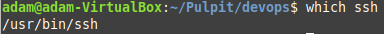
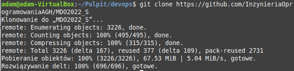
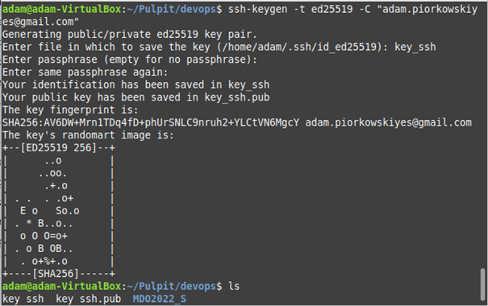
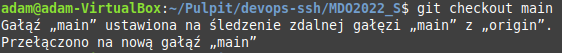
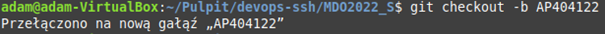

* Zainstaluj klienta Git i obsługę kluczy SSH\
\

* Sklonuj repozytorium za pomocą HTT{S\

* Stwórz klucze SSH\

* Sklonuj repozytorium za pomocą SSH

* Przełącz się na gałąź main, a potem do swojej grupy

* Utwórz własną galąż o ustalonej nazwie\

* Utwórz foldery oraz plik ze sprawozdaniem\

* Spróbuj zrobić merge (nie działa i tak powinno być)

