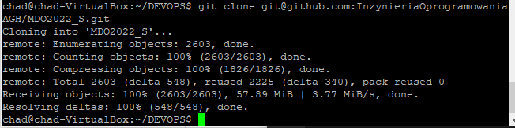
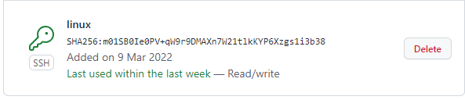
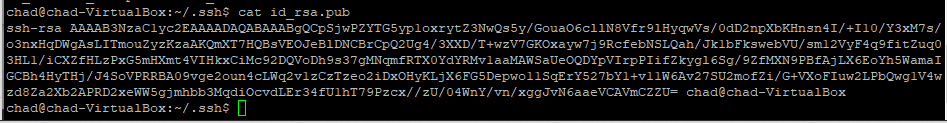
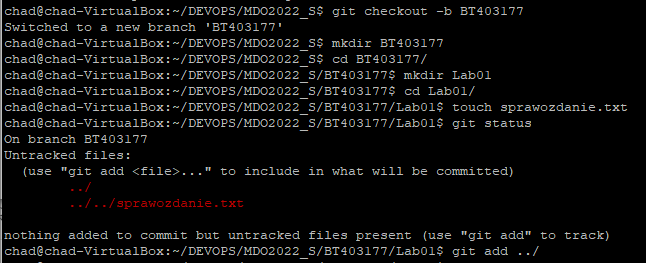
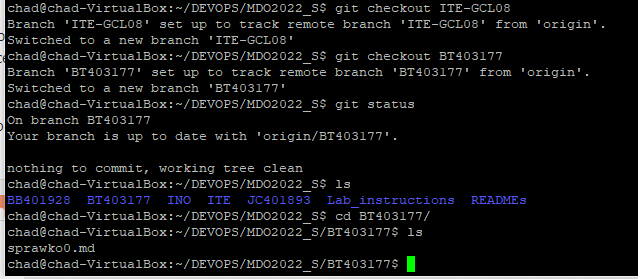
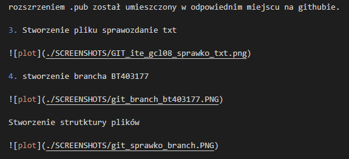

Bartosz Tonderski sprawozdanie DevOps lab 1

1. Sklonowanie repozytorium poprzez ssh:

2. Klucz ssh był dodany do github'a został dodany przed zajęciami w ramach przygotowania do zajęć.

    klucz github:

    klucz linux:

    Klucz został wygenerowany komendą ssh-keygen -t rsa, a wygenerowany plik klucza z rozszrzeniem .pub został umieszczony w odpowiednim miejscu na githubie.

3. Stworzenie pliku sprawozdanie txt

4. stworzenie brancha BT403177

    Stworzenie strutktury plików

5. Napisanie sprawozdania w formacie .md oraz dolaczenie plikow ze screenshotami

