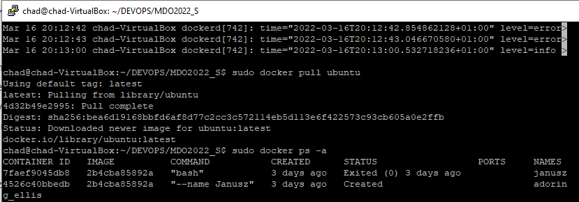
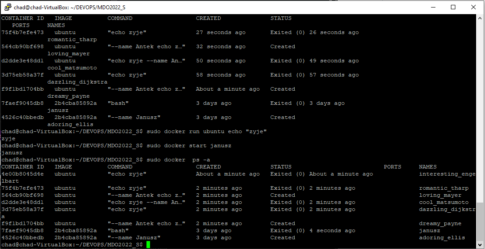
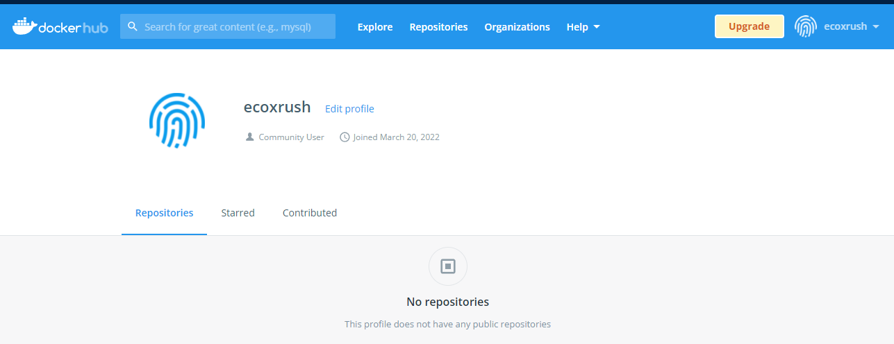

# Zajecia 2
## Przygotowanie git hook'a commit-msg

```

#!/bin/bash

title=`head -n1 $1`
title_pattern="BT403177"

message=`tail -n1 $1`
message_pattern="(02)"

if ! [[ "$title" = $title_pattern ]]; then
        echo "Use your special number in commit title"
        exit 1
fi

if ! [[ "$message" =~ $message_pattern ]]; then
        echo "Incorrect commit msg - Please include lab number"
        exit 1
fi


```

Aby plik zadziałał poprawne należy mu dodać uprawnienia u+x

## Sprawdzenie poprawnosci działania git hook'a


## Zdalny dostep do maszyny wirtualnej


## Instalacja dockera na maszynie wirtualnej - pokazanie działania


## Pobranie obrazu ubuntu



## Uruchamianie kontenerow



## Utworzenie konta dockerHUB

