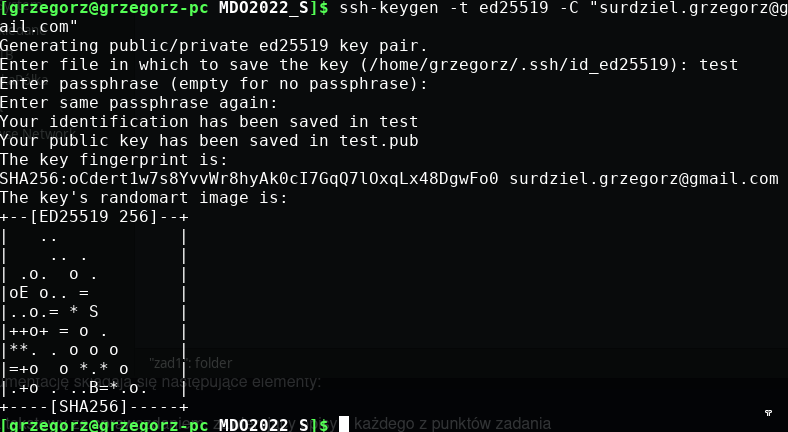
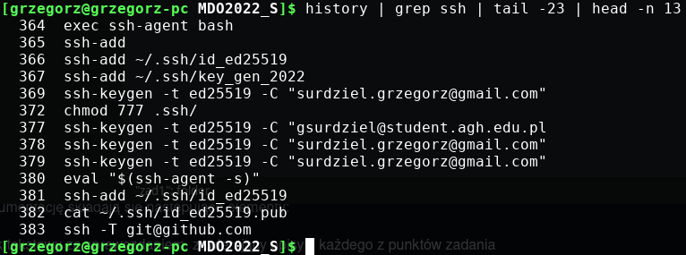
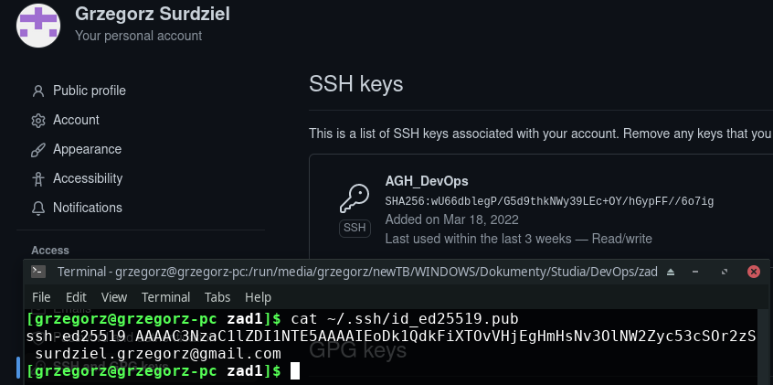
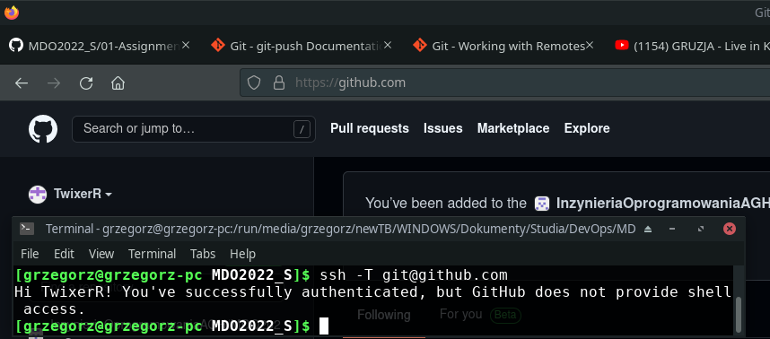
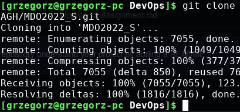
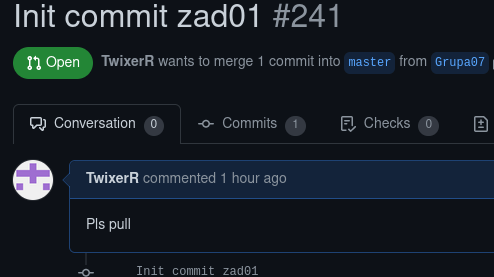
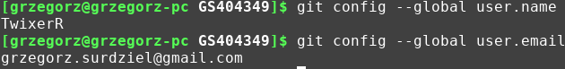

# Sprawko
## Wygenerowałem klucz SHA256

## Dodałem do lokalnego managera kluczy

## Podpiąłem pod konto

## Sprawdziłem połączenie przez ssh

## Sklonowałem repo przez ssh mając pewność poprawnego połączenia

## Wystawiłem pull request

## Wyjaśniam nazwy

