### Anna Godek
# Sprawozdanie 
# Laboratorium 1
[1] Klient Git oraz obsługa kluczy SSH zostały zainstalowane już wcześniej za pomocą komendy: 
```bash
		$ sudo apt install git
```

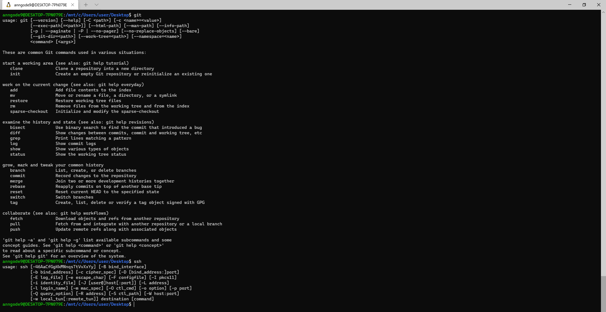

[2] Sklonowano repozytorium za pomocą HTTPS.
```bash
		$ git clone https://github.com/InzynieriaOprogramowaniaAGH/MDO2022_S.git
```

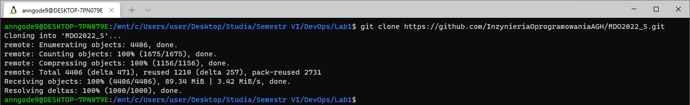

[3] Wygenerowano nowy klucz SSH.
```bash
		$ ssh-keygen -t ed25519 -f kluczyk.id
```

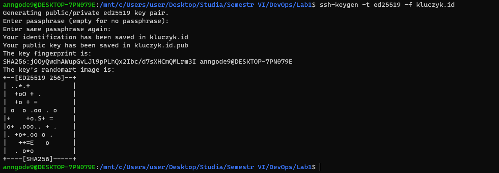

Wygenerowano również klucz SSH zabezpieczony hasłem
```bash
		$ ssh-keygen -t ed25519 -C annagodek@student.agh.edu.pl
```

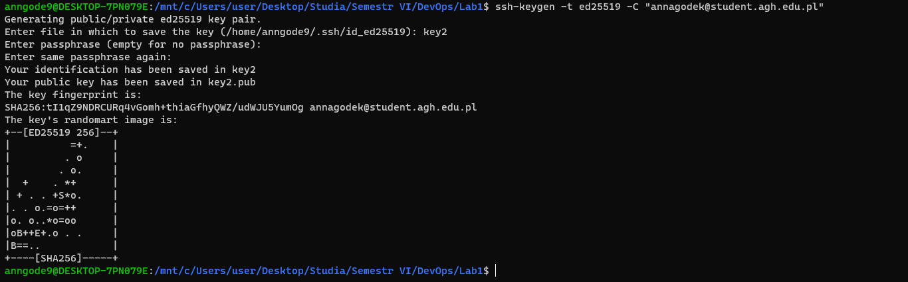

Następnie skopiowano i dodano klucz publiczny do konta na githubie. 


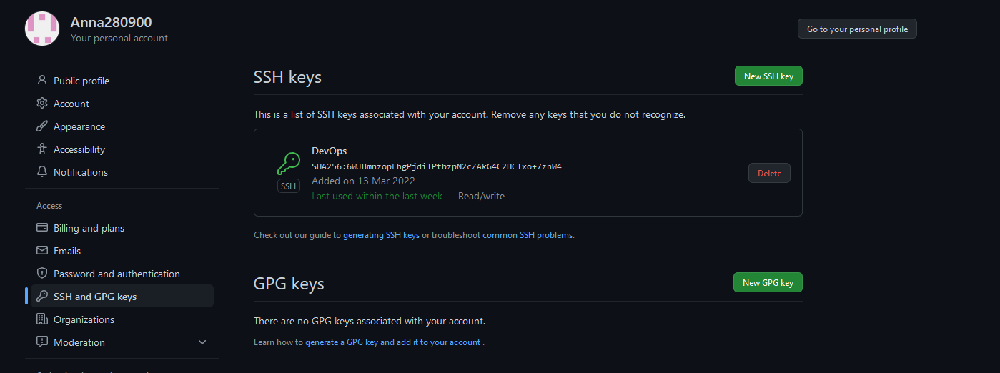

Sprawdzono połączenie i sklonowano repozytorium z wykorzystaniem protokołu SSH.
```bash
		$ ssh -T git@github.com
		$ git clone git@github.com:InzynieriaOprogramowaniaAGH/MDO2022_S.git
```

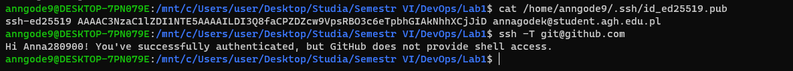
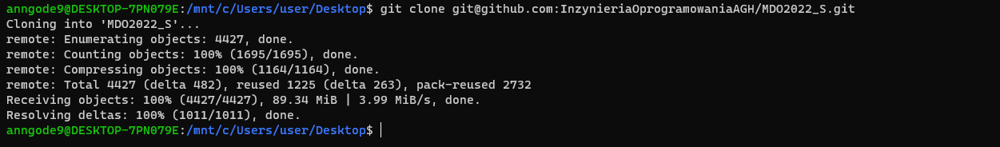

[4] Przełączono sie na gałąź main a następnie na gałąź swojej grupy.
```bash
		$ git checkout main
		$ git checkout INO-GCL01
```

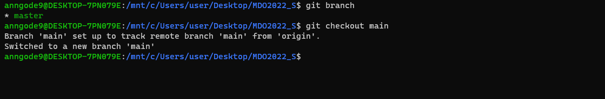   
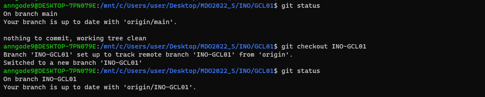

[5] Utworzono gałąź o nazwie AG401570.
```bash
		$ git checkout -b AG401570
```

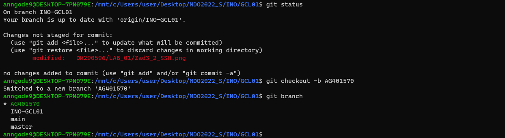

[6] W katalogu wlaściwym dla grupy utworzono nowy katalog o nazwie AG401570 a w nim katalog Lab01.
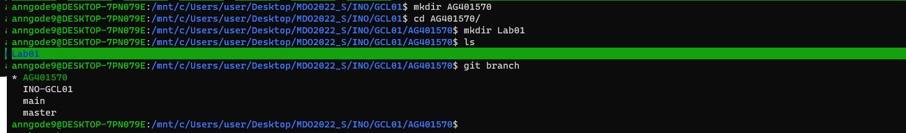

Dodano do folderu sprawozdanie i stworzono commit.
```bash
		$ git commit -m "lab1"
```

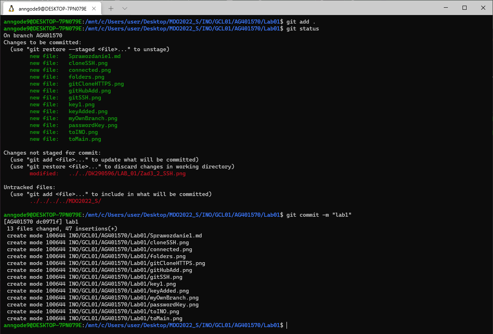

Wysłano zmiany do zdalnego źródła.
```bash
		$ git push --set-upstream  origin AG401570
```

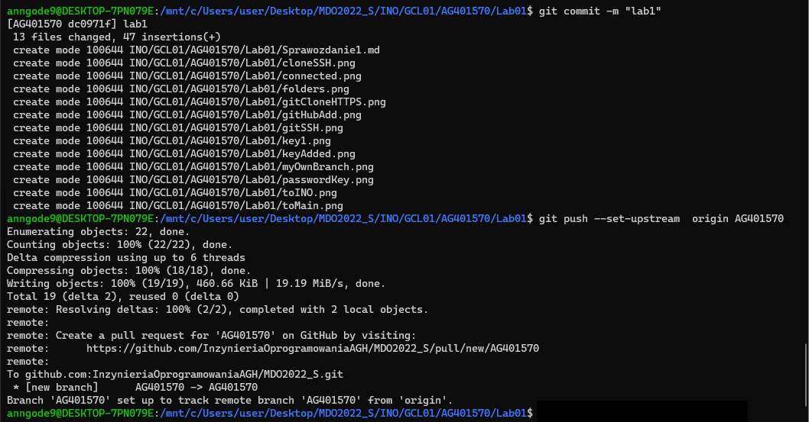