### Anna Godek
# Sprawozdanie 2 

[1] Przygotowaniee git hooków, które rozwiążą najczęstsze problemy z commitami

W tym celu weszłam do katalogu `.git` a następnie do podkatalogu `hook`. Odnaleziono plik `commit-msg.sample`, zedytowano jego zawartość i zmieniono nazwę pliku na `comit-msg`.
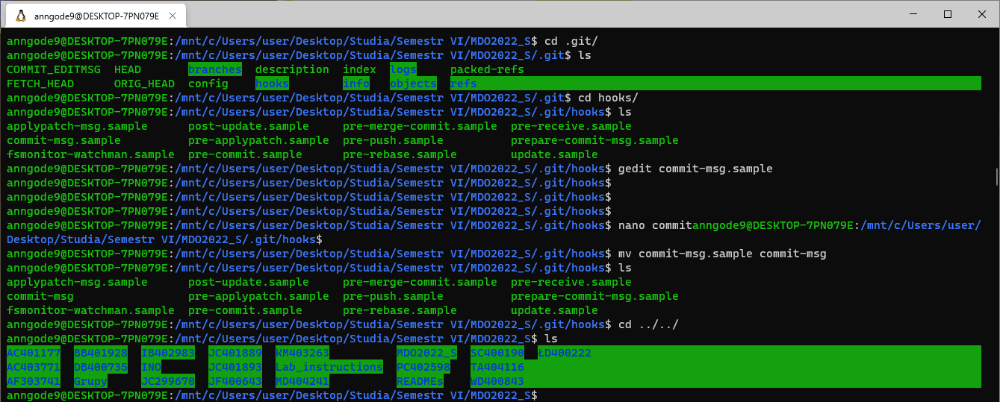

W pierwszym hooku sprawdzane jest, czy tytułu commita nazywa się `AG401570`, jeśli tak nie jest - proces jest przerywany.
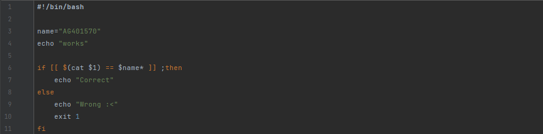

Sprawdzono poprawność napisanego kodu.
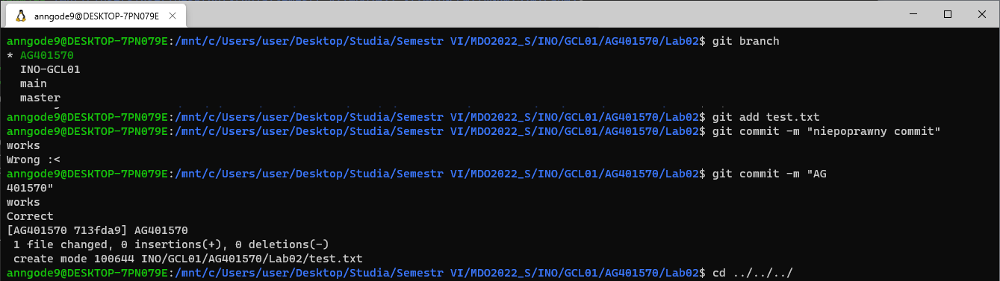

Utworzono drugi hook, sprawdzający, czy w treści commita pada numer labu właściwy dla zadania. Zedytowany został plik `pre-commit.sample` 
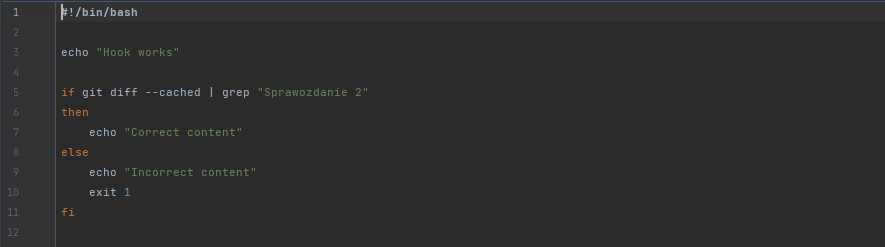
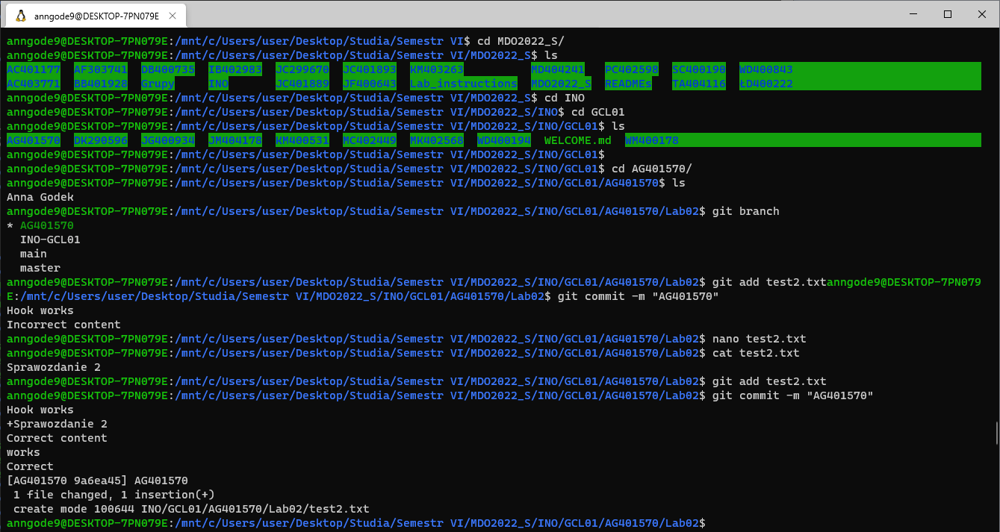

[3] Do instalacji dockera wykorzystano WSL w wersji 2 z Ubuntu-18.04 


Na początku zaktualizowano listę paczek z repozytorium, doinstalowano pakiety i dodano oficjalne klucze GPG Dockera, ustawiono repozytorium na stable 
```bash
$ sudo apt-get update

$ sudo apt-get install 

$ curl -fsSL https://download.docker.com/linux/ubuntu/gpg | sudo gpg --dearmor -o /usr/share/keyrings/docker-archive-keyring.gpg

$ echo \
  "deb [arch=$(dpkg --print-architecture) signed-by=/usr/share/keyrings/docker-archive-keyring.gpg] https://download.docker.com/linux/ubuntu \
  $(lsb_release -cs) stable" | sudo tee /etc/apt/sources.list.d/docker.list > /dev/null
```
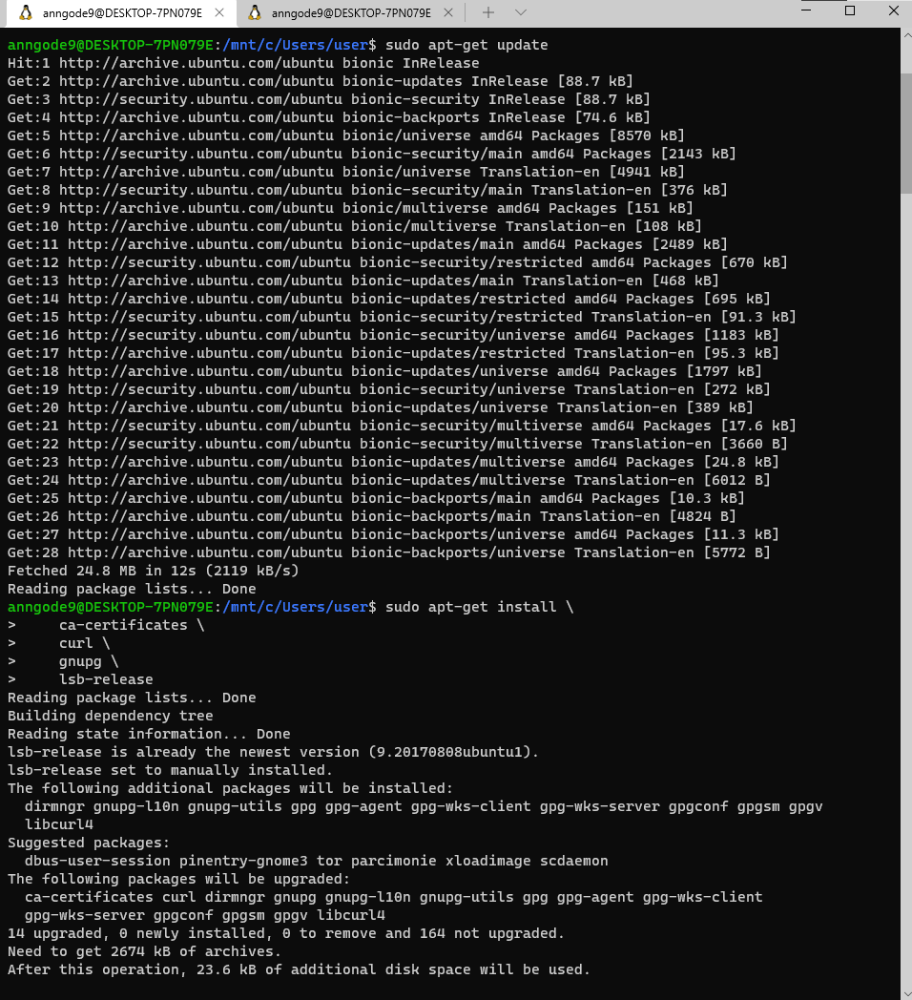
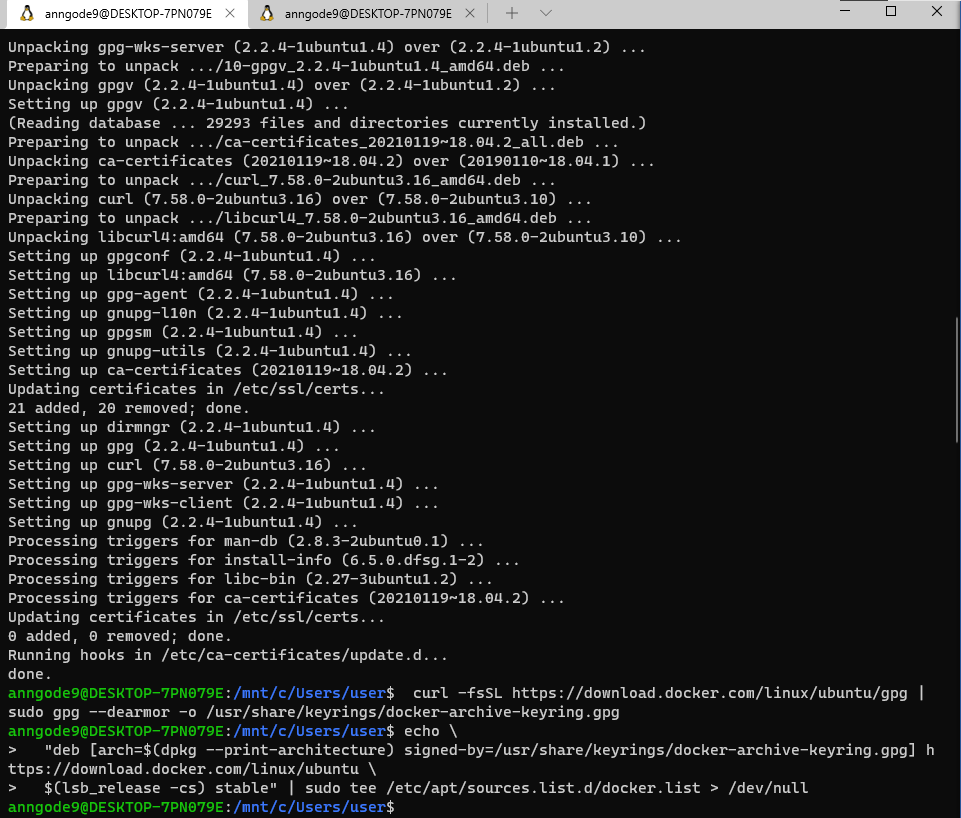

W kolejnym kroku zainstalowano Docker Engine.
```bash
$ sudo apt-get install docker-ce docker-ce-cli containerd.io
```
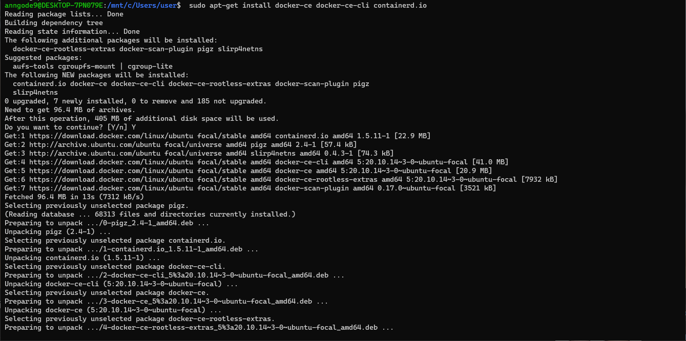

[4] Uruchomiono środowisko dockerowe i sprawdzono działanie, uruchomiono również obraz hello-world
```bash
$ sudo service docker start

$ sudo service docker status

$ sudo docker run hello-world
```
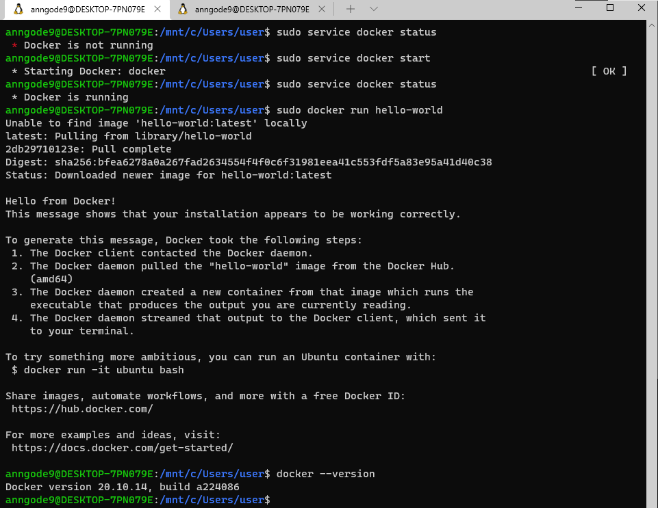

Pobrano obraz fedory, uruchomiono i sprawdzono pobraną wersję 
```bash
$ docker pull fedora

$  sudo docker run -it fedora

$ sudo docker images
```
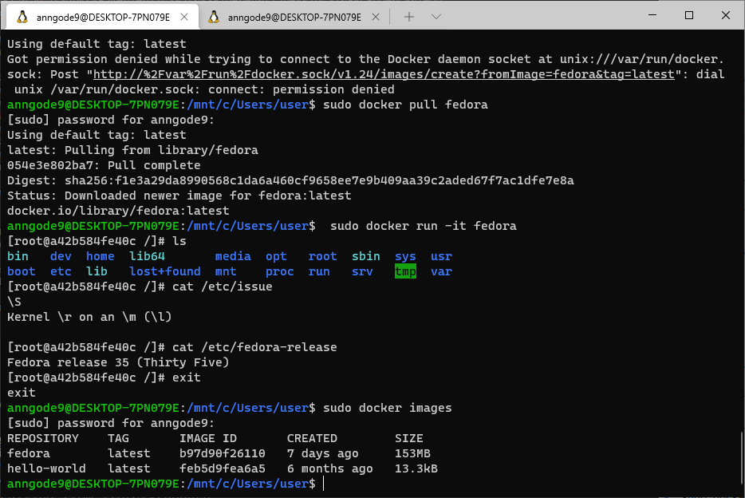

Założono również konto na hub.docker.com
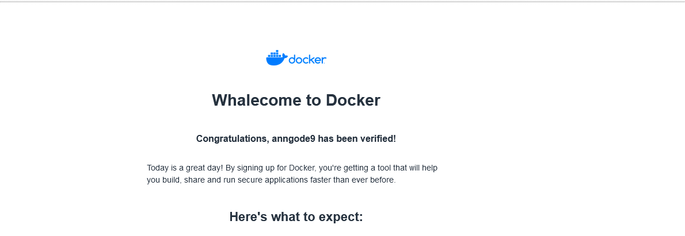
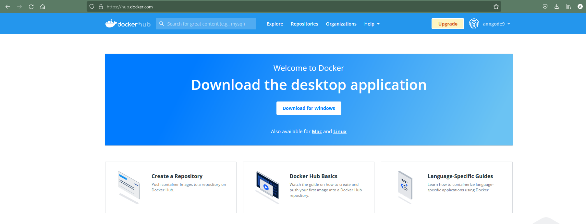
