### Anna Godek
# Sprawozdanie 
# Laboratorium 3
Pierwszym krokiem było znalezienie repozytorium z kodem dowolnego oprogramowania, które dysponuje otwartą licencją oraz zawiera Makefile i testy. Wybrano kalkulator.
Sklonowano wybrane repozytorium, doinstalowano wymagane zależności, zbudowano program a następnie uruchomiono testy.
Kopiowanie:
```bash
$ git clone https://github.com/alt-romes/programmer-calculator
```
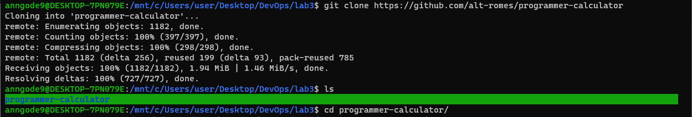
 
Doinstalowanie ncurses:
```bash
$ sudo apt-get install libncurses5-dev libncursesw5-dev
```
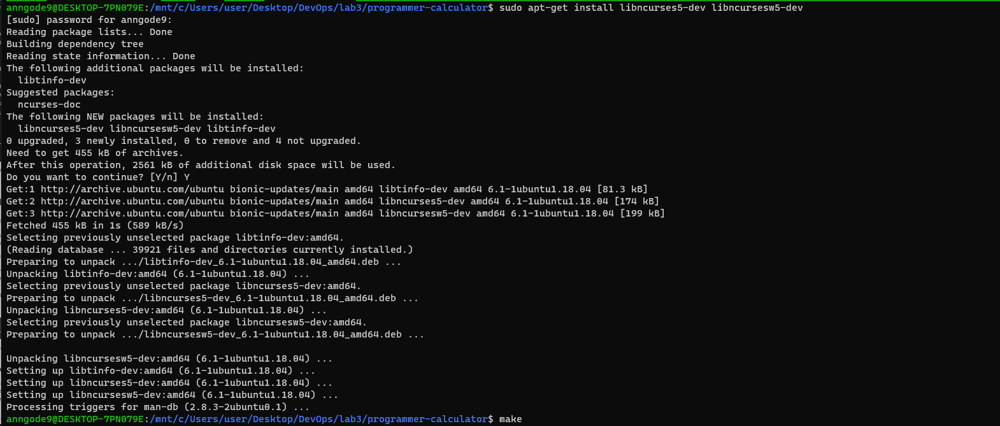 
Kompilacja kod i przeniesienie pliku wykonywalnego do katalogu osiągalnego przez $PATH:
```bash
$ make
$ sudo mv -i pcalc /usr/local/bin
```
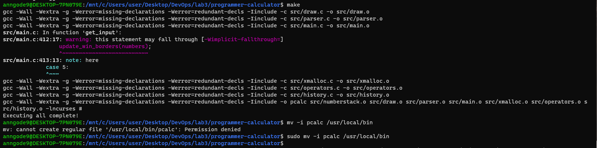
 
Uruchomiono testy, a następnie program:
```bash
$ ./run-tests.sh
```
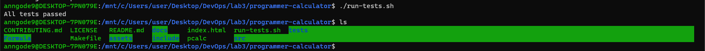
 
```bash
$ pcalc
```
 
Uruchomiono dokera i sprawdzono dostępne obrazy:
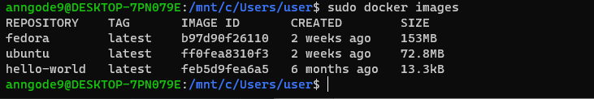 

Uruchomiono kontener i podłączono się do niego TTY celem rozpoczęcia interaktywnej pracy. Zainstalowano również gita.
```bash
$ sudo docker run --interactive --tty ubuntu sh
```
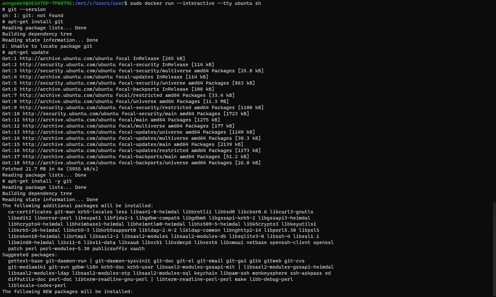
 
Następnie sklonowano repozytorium:
```bash
# git clone https://github.com/alt-romes/programmer-calculator.git
```
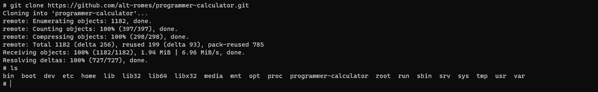  
Konieczne okazało się również doinstalowanie make i gcc oraz biblioteki ncurses:
```bash
# apt-get install make
# apt-get install gcc 
# apt-get install libncurses5-dev libncursesw5-dev
```
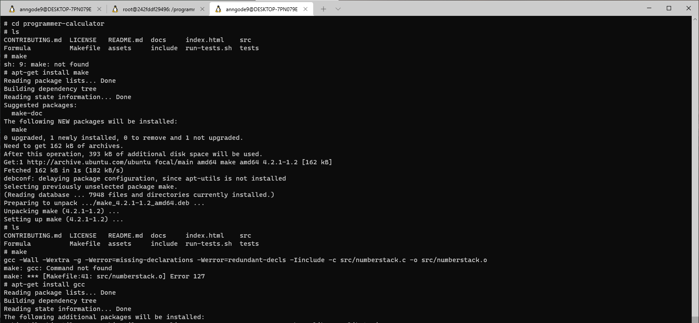
 
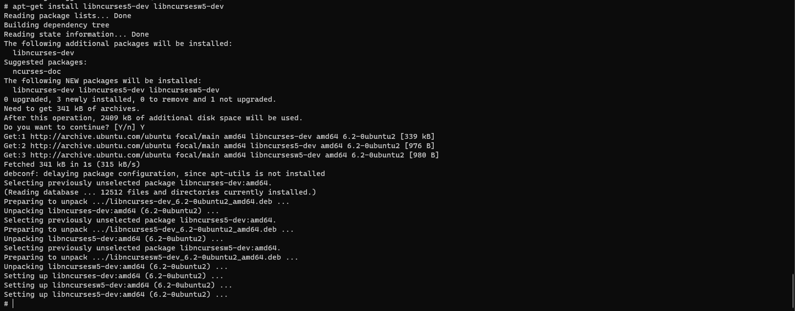
 
Następnie uruchomiono build programu poleceniem `make` oraz uruchomiono testy za pomocą `bash ./run-tests.sh`
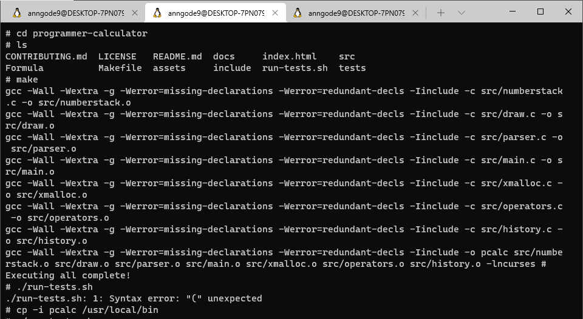
 
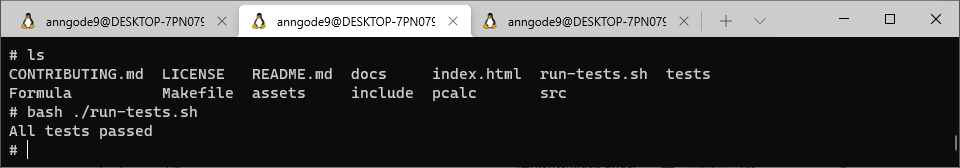
 
W drugim zadaniu należało stworzyć dwa pliki Dockerfile automatyzujące wcześniej wykonywane kroki.
Pierwszy kontener przeprowadza wszystkie kroki aż do builda:
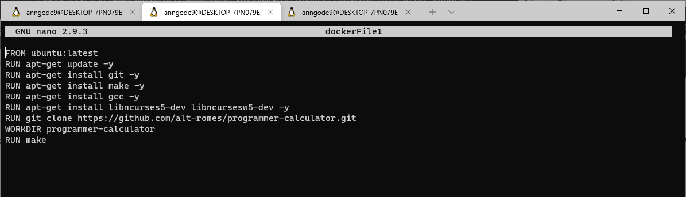
 
FROM – wybranie konkretnego obrazu
RUN – uruchomienie instalacji, klonowania repozytorium i builda
WORKDIR – definiowanie katalogu roboczego kontenera
Utworzono obraz z pliku dockerFile1:
```bash
$ sudo docker build -t img1:latest . -f ./dockerFile1
```
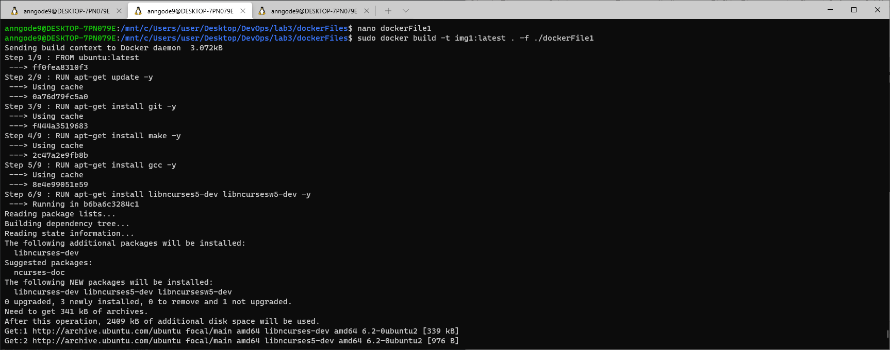
 
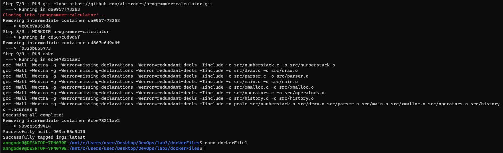
 
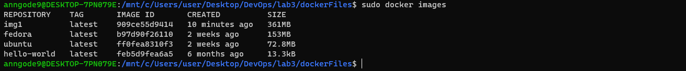 
Utworzono drugi plik Dockerfile, w którym wybierany jest aktualny obraz utworzony wcześniej, następnie uruchamiane są testy.
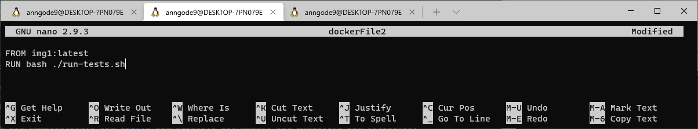
 
Utworzenie obrazu z pliku dockerFile2:
```bash
$ sudo docker build -t img2:latest . -f ./dockerFile2a
```

 
Na końcu sprawdzono historię
```bash
$ sudo docker ps -a
```
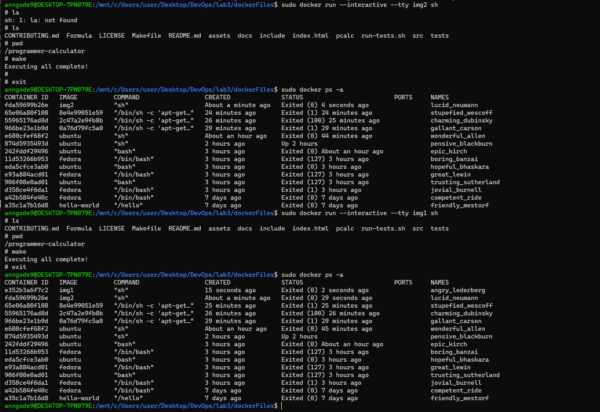
 
