#Sprawozdanie 4
Anna Godek
**ZACHOWANIE STANU**
1. Przygotowano woluminy wejściowy i wyjściowy o nazwach `volin` oraz `volout`. Wykorzystano komendę `sudo docker volume create`.
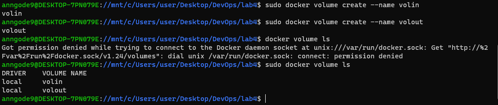
 
2. Następnie uruchomiono kontener z woluminami za pomocą `sudo docker run` i wyświetlono odpowiednie katalogi `vin` i `vout`.
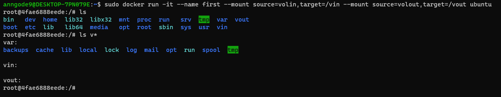
 
3. Wyświetlono szczegóły o obu woluminach oraz ścieżkę, która będzie potrzebna w następnym kroku. Wykorzystano komendę `sudo docker volume inspect`.
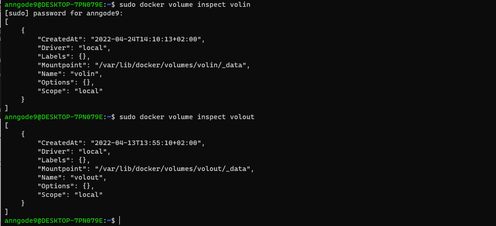
 
4. Z poziomu roota skopiowano repozytorium na wolumin wejściowy `volin` z wykorzystaniem ścieżki z poprzedniego kroku oraz polecenia `git clone`.
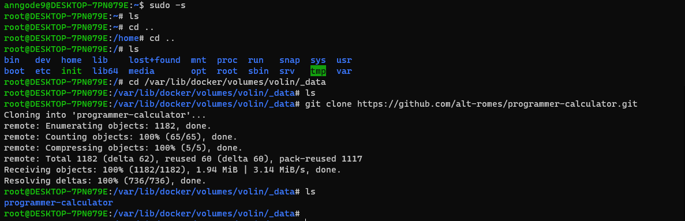
 
W kontenerze widoczne jest sklonowane repozytorium:
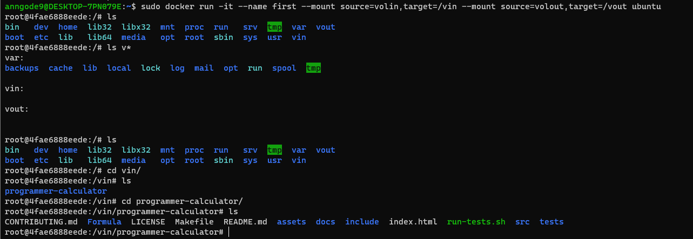
 
5. Do wykonania builda w kontenerze konieczne było doinstalowanie `make`, `gcc` oraz biblioteki `ncurses`.
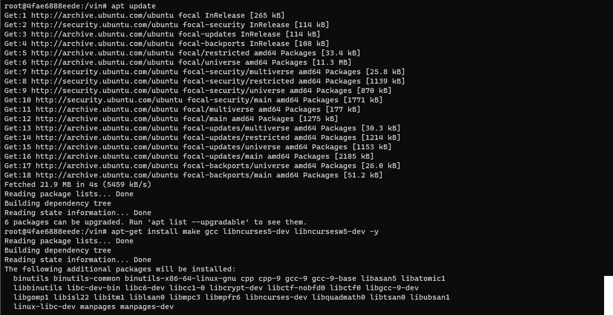
 
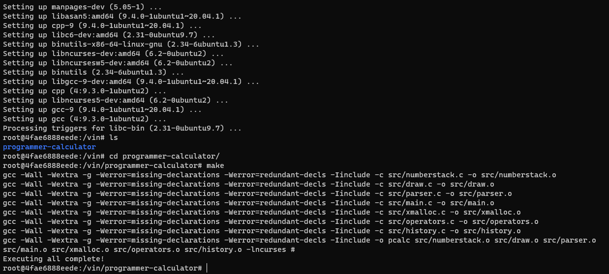
 
6. Zapisano pliki w woluminie wyjściowym.
```bash
# cp -r pcalc /../../vout
```
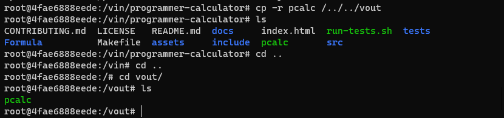
 
**EKSPORTOWANIE PORTU**
1. W następnym zadaniu pierwszym krokiem było pobranie i uruchomienie odpowiedniego obrazu dockerowego.
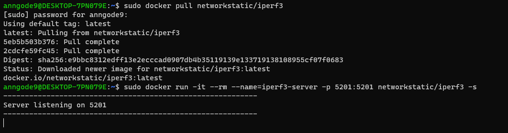
 
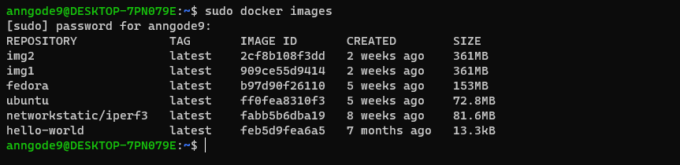
 
2. Sprawdzono za pomocą `sudo netstat` nasłuchiwanie serwera.

 
3. Sprawdzono IP serwera za pomocą polecenia:
```bash
$ sudo docker inspect --format "{{ .NetworkSettings.IPAddress }}" iperf3-server
```
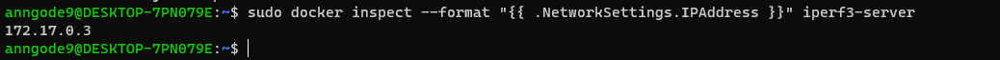
 
4. Połączono się z serwerem z drugiego kontenera, którego działanie określono jako client.
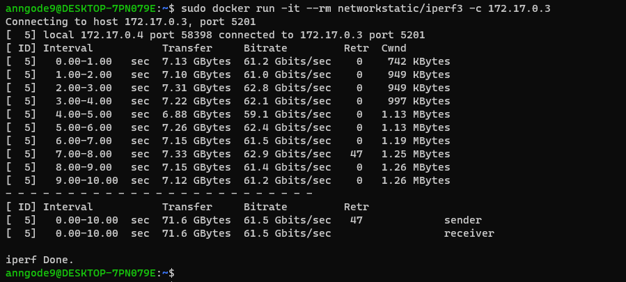
 
W celu połączenia się spoza kontenera (z i spoza hosta) najpierw zainstalowano iperf3.
```bash
$ sudo docker inspect --format "{{ .NetworkSettings.IPAddress }}" iperf3-server
```
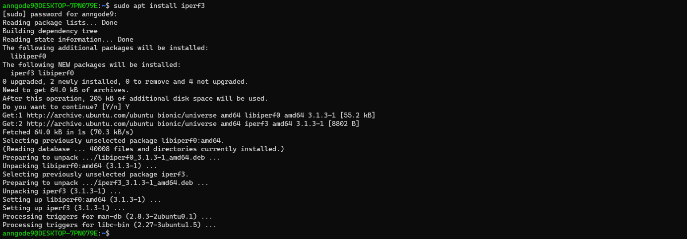
 
Połączenie z hosta:
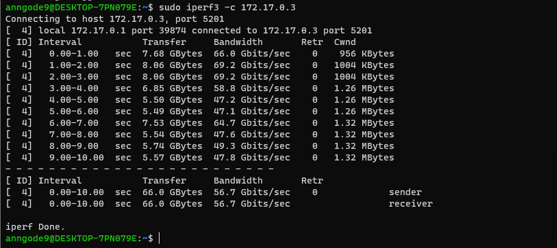
 
Połączenie spoza hosta (komputer z systemem Windows 10):
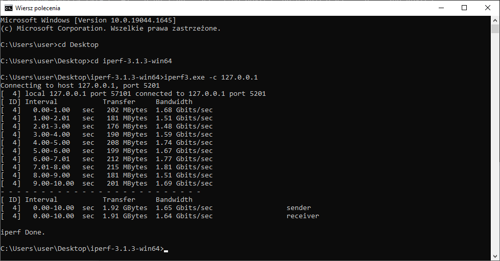
 
5. Na koniec wyciągnięto logi z kontenera aby przedstawić przepustowość komunikacji.
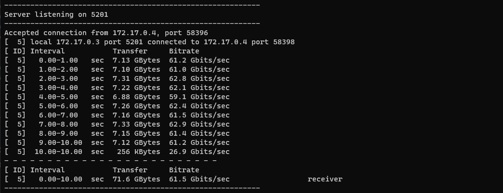
 
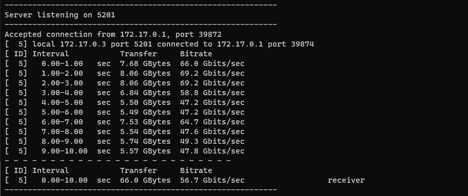
 

 
Uzyskane wyniki wskazują na to, że największą przepustowość uzyskano między kontenerami. Niewiele mniejszy rezultat otrzymano dla transferu między hostem a kontenerem. Wyraźnie najniższą przepustowość uzyskano dla transferu spoza hosta. 

**INSTALACJA JENKINS**
1. Utworzono nową sieć dockerową. 
```bash
$ sudo docker network create jenkins
```
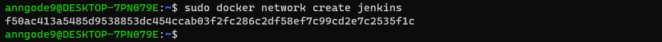
 
2. Pobrano i uruchomiono obraz DIND kontenera.
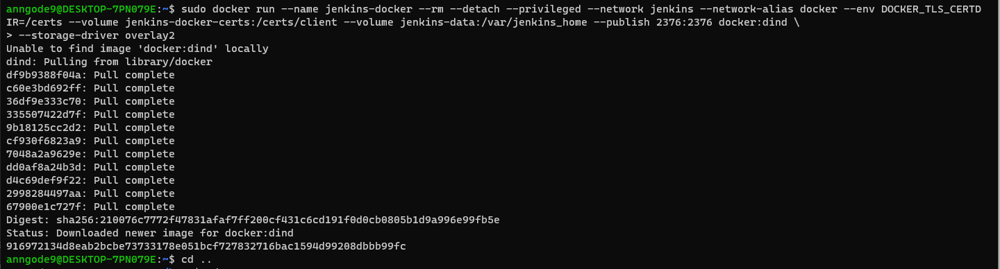
 
3. Utworzono Dockerfile. 
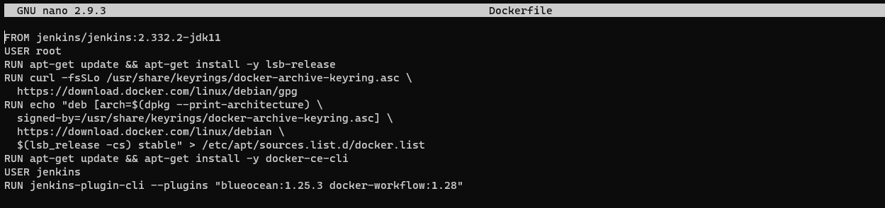
 
4. Zbudowano nowy obraz dockera z pliku Dockerfile określając za pomocą `-t` nazwę.

 
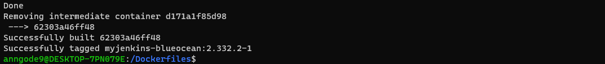
 
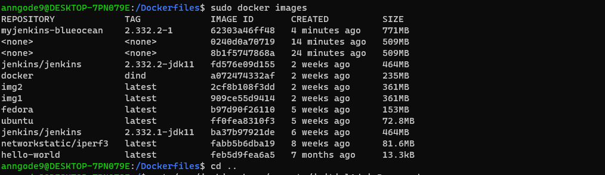
 
5. Uruchomiono stworzony obraz.
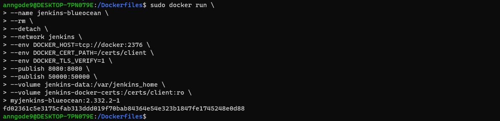
 
6. Sprawdzono adres localhost:8080 i odblokowano za pomocą hasła.

 
Aby odczytać hasło uruchomiono najpierw interaktywny terminal za pomocą `sudo docker exec`, polecenie `cat` pozwoliło na odczytanie już samego hasła.
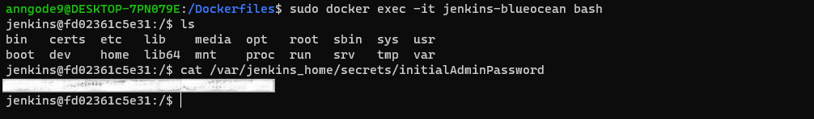
 
7. Zainstalowano zalecane wtyczki.
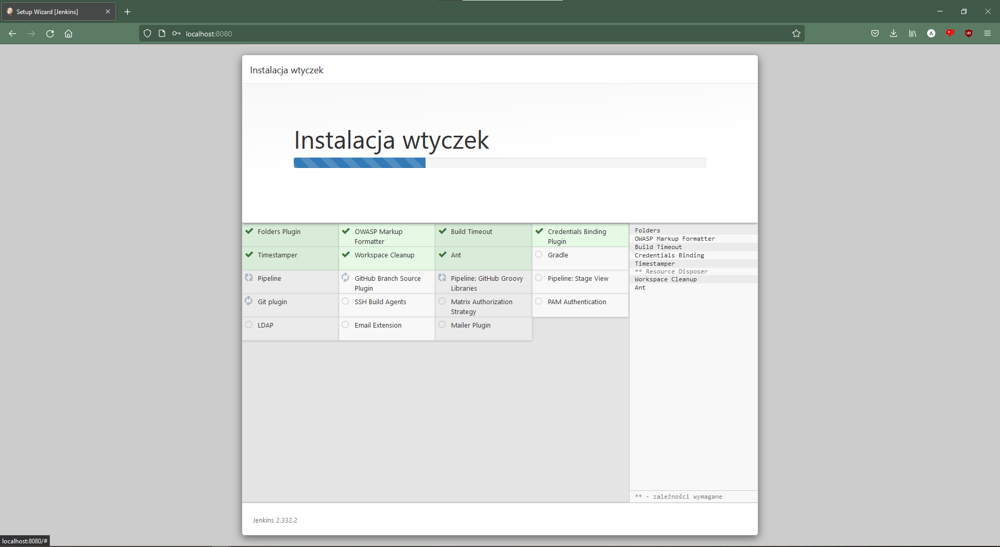
 
8. Za pomocą polecenia `sudo docker ps` wykazano działanie kontenerów.
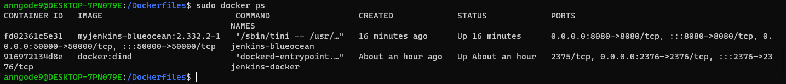
 
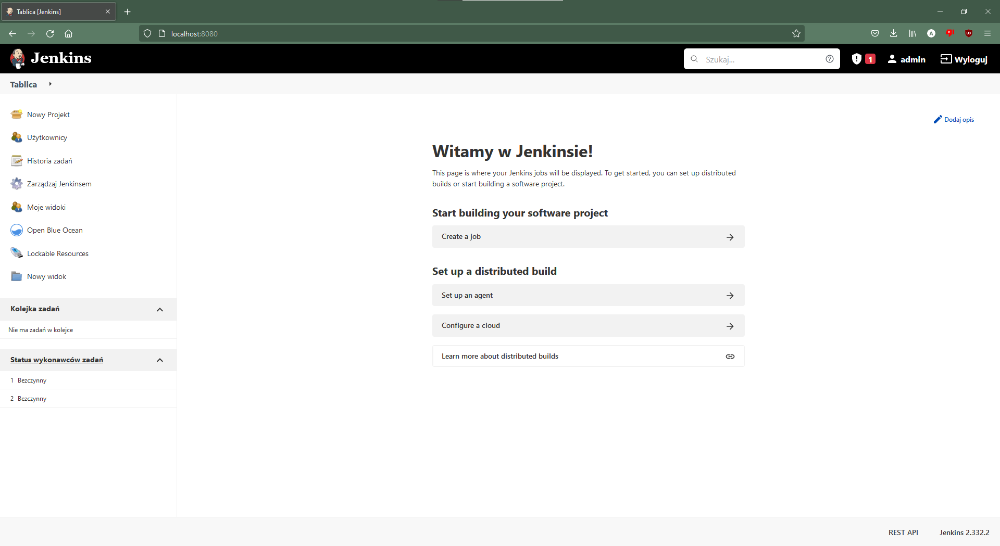
 

