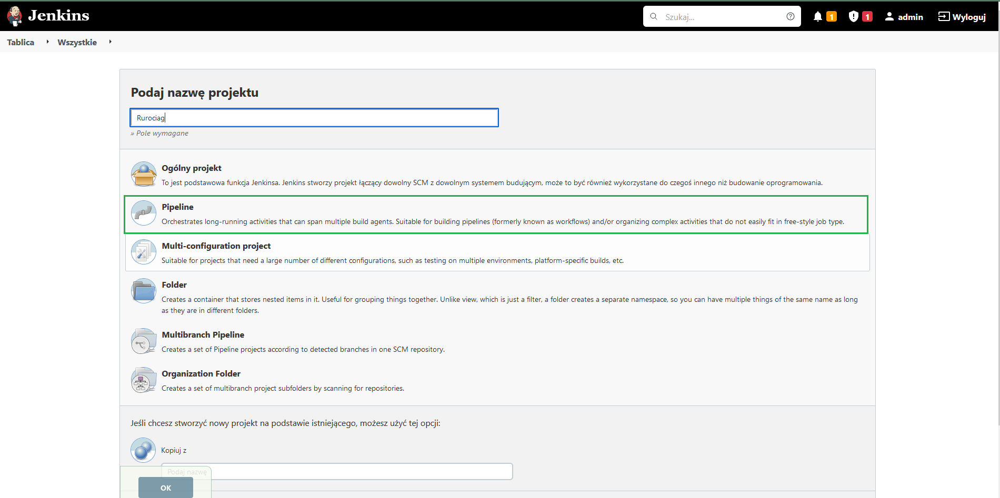
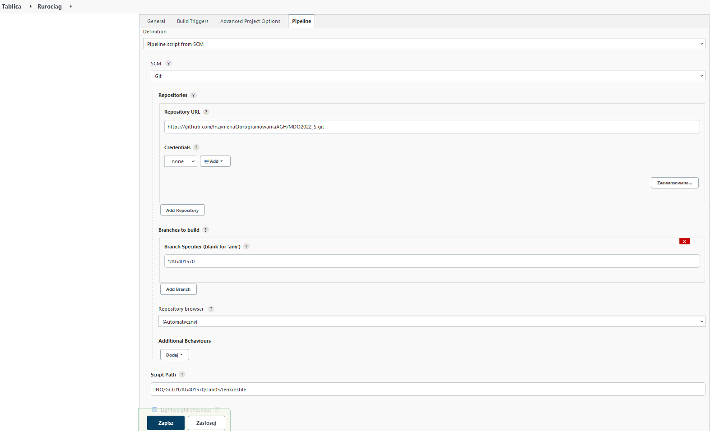
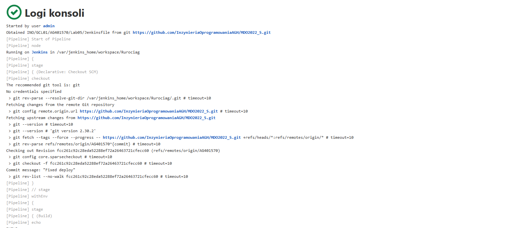
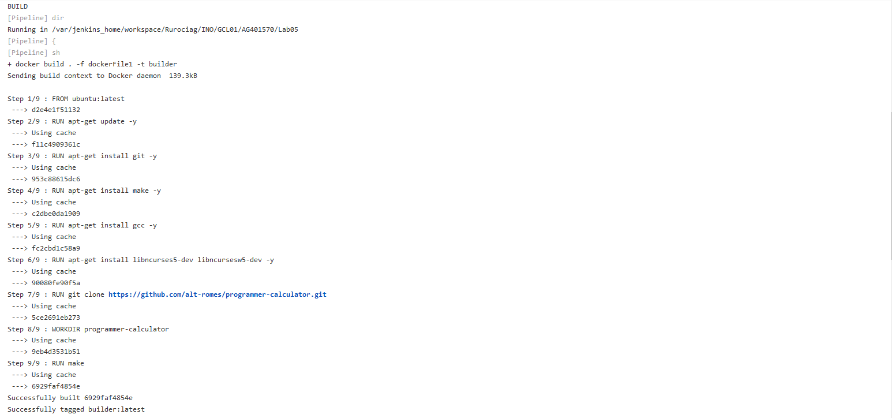
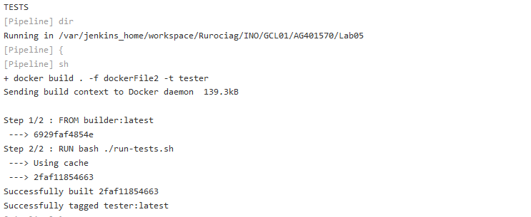
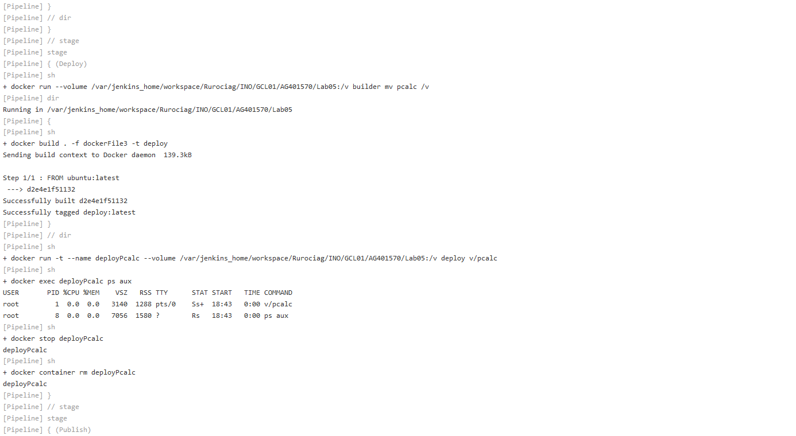
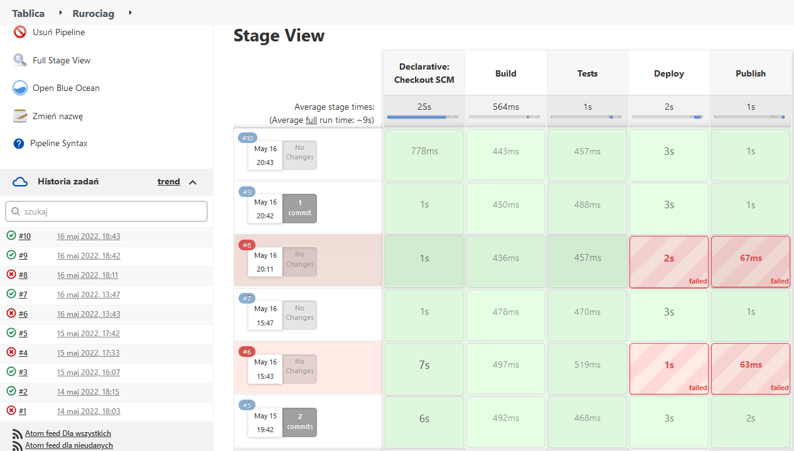

Anna Godek

Inżynieria Obliczeniowa

GCL01

# Metodyki DevOps

## Pipeline

Celem laboratorium było wykonanie czterech etapów: build, przetestowanie, deploy i opublikowanie. Pipeline utworzono do projektu https://github.com/alt-romes/programmer-calculator.

Zakładamy, że Jenkins jest prawidłowo zainstalowany i gotowy do działania. Zostało to zrealizowane i udokumentowane w ramach poprzedniego laboratorium.

**Uruchomienie z prawami administratora kontenerów DIND i Jenkins.**

Uruchomienie kontenera DIND. Przypisane mu zostają sieć (Jenkins), zmienne środowiskowe (za pomocą flagi env), umożliwia utworzenie kontenera w kontenerze

```bash
sudo docker run --name jenkins-docker --rm --detach \
--privileged --network jenkins --network-alias docker \
--env DOCKER_TLS_CERTDIR=/certs \
--volume jenkins-docker-certs:/certs/client \
--volume jenkins-data:/var/jenkins_home \
--publish 2376:2376 \
docker:dind --storage-driver overlay2
```

Uruchomienie kontenera Jenkins – pozwala to na zobaczenie interfejsu Jenkinsa po wpisaniu w przeglądarce `localhost:8080`, umożliwia automatyczne przeprowadzenie procesu tworzenia oprogramowania.

```bash
sudo docker run \
--name jenkins-blueocean \
--rm \
--detach \
--network jenkins \
--env DOCKER_HOST=tcp://docker:2376 \
--env DOCKER_CERT_PATH=/certs/client \
--env DOCKER_TLS_VERIFY=1 \
--publish 8080:8080 \
--publish 50000:50000 \
--volume jenkins-data:/var/jenkins_home \
--volume jenkins-docker-certs:/certs/client:ro \
myjenkins-blueocean:2.332.2-1
```

Za pomocą polecenia `sudo docker ps` upewniono się, że kontenery zostały uruchomione:


**Przygotowanie pipeline.**

Stworzono nowy obiekt projektowy pipeline, nadano mu nazwę `Rurociag`.



Dodane zostały dwa parametry: `Name` i `Version`.


Określono również ścieżkę repozytorium git - używa tej samej składni, co polecenie git clone. Dodano również odpowiednią gałąź oraz ścieżkę do pliku `Jenkinsfile`.



**Build**

Stworzono plik `dockerFile1`, w którym doinstalowywane są dependencje, a następnie kopiowane jest repozytorium wybranego projektu i odpalenie builda. Obraz jest oparty na ubuntu.

```bash
FROM ubuntu:latest
RUN apt-get update -y
RUN apt-get install git -y
RUN apt-get install make -y
RUN apt-get install gcc -y
RUN apt-get install libncurses5-dev libncursesw5-dev -y
RUN git clone https://github.com/alt-romes/programmer-calculator.git
WORKDIR programmer-calculator
RUN make
```

Fragment `Jenkinsfile`:

```bash
stage('Build') {
	steps {
		echo 'BUILD'
		dir('INO/GCL01/AG401570/Lab05') {
			sh 'docker build . -f dockerFile1 -t builder'
		}
	}
}
```

Wydruki z konsoli:





**Test**

W pliku `dockerFile2` uruchamiane są testy.

```bash
FROM builder:latest
RUN bash ./run-tests.sh
```

Fragment `Jenkinsfile`. Na podstawie obrazu `builder` (z poprzedniego kroku) zostaje utworzony obraz `tester`.

```bash
stage('Tests') {
	steps {
		echo 'TESTS'
		dir('INO/GCL01/AG401570/Lab05') {
			sh 'docker build . -f dockerFile2 -t tester'
		}
	}
}
```

Wydruk z konsoli:



**Deploy**

Uruchomiono obraz `builder` z woluminem, gdzie przeniesiono utworzony plik wykonywalny `pcalc`. Następnie w celu sprawdzenia poprawnego działania, uruchomiony z woluminem został kontener `deploy`.

`DockerFile3` - obraz `deploy` bazuje na obrazie ubuntu.

```bash
FROM ubuntu:latest
```

Fragment `Jenkinsfile`. W celu udowodnienia poprawności deploya, wyświetlono działające procesy za pomocą `ps aux`.

```bash
stage('Deploy') {
	steps {
		sh 'docker run --volume /var/jenkins_home/workspace/Rurociag/INO/GCL01/AG401570/Lab05:/v builder mv pcalc /v'
		dir('INO/GCL01/AG401570/Lab05') {
			sh 'docker build . -f dockerFile3 -t deploy'
		}
		sh '''
		docker run -t --name deployPcalc --volume /var/jenkins_home/workspace/Rurociag/INO/GCL01/AG401570/Lab05:/v deploy v/pcalc&
		'''
		sh 'docker exec deployPcalc ps aux'
		sh 'docker stop deployPcalc'
		sh 'docker container rm deployPcalc'
	}
}
```

Wydruk z konsoli:


**Publish**

Jeżeli build, testy i deploy powiodą się, to publikowana jest nowa wersja programu. Do kontenera kopiowany jest jedynie plik wykonywalny.

Zawartość `dockerFile4` - wykonywalny plik `pcalc` jest pakowany do pliku tar.

```bash
FROM builder:latest
RUN tar rvf pcalc.tar pcalc
```

Fragment `Jenkinsfile`.

```bash
stage('Publish') {
	steps {
		echo 'PUBLISH'
		dir('INO/GCL01/AG401570/Lab05') {
			sh 'docker build . -f dockerFile4 -t publisher'
		}
		sh "docker run --volume /var/jenkins_home/workspace/Rurociag/INO/GCL01/AG401570/Lab05:/v publisher mv pcalc.tar /v"
	}
}
```

Wydruk z terminala:




Napotkane problemy:

Problem napotkano przy etapie deploy. Początkowo program nie chciał się uruchomić – jest to program konsolowy i wymaga terminala.


Pierwotny fragment Jenkinsfile:
```bash
stage('Deploy') {
	steps {
		sh 'docker run --volume /var/jenkins_home/workspace/Pipeline/INO/GCL01/AG401570/Lab05:/v builder mv pcalc /v'
		dir('INO/GCL01/AG401570/Lab05') {
			sh 'docker build . -f dockerFile3 -t deploy'
		}
		sh '''
		docker run --name deployCalc --volume /var/jenkins_home/workspace/Rurociag/INO/GCL01/AG401570/Lab05:/v deploy v/pcalc
		'''
		sh 'docker exec deployCalc ps aux' 
		sh 'docker stop deployCalc'
		sh 'docker container rm deployCalc'
	}
}
```
Poprawiony fragment Jenkinsfile (dopisano parametr `-t`  oraz `&` na końcu tej samej linii – aby program działał w tle):
```bash
stage('Deploy') {
	steps {
		sh 'docker run --volume /var/jenkins_home/workspace/Rurociag/INO/GCL01/AG401570/Lab05:/v builder mv pcalc /v'
		dir('INO/GCL01/AG401570/Lab05') {
			sh 'docker build . -f dockerFile3 -t deploy'
		}
		sh '''
		docker run -t --name deployPcalc --volume /var/jenkins_home/workspace/Rurociag/INO/GCL01/AG401570/Lab05:/v deploy v/pcalc&
		'''
		sh 'docker exec deployPcalc ps aux' 
		sh 'docker stop deployPcalc'
		sh 'docker container rm deployPcalc'      
	}
}
```