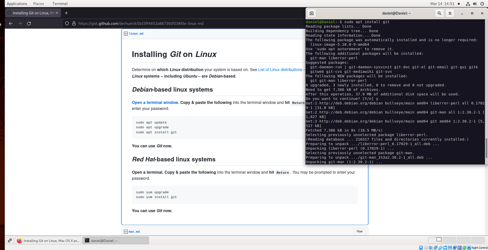
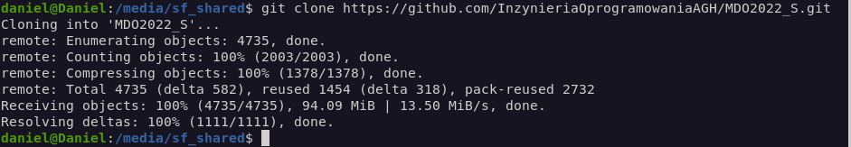
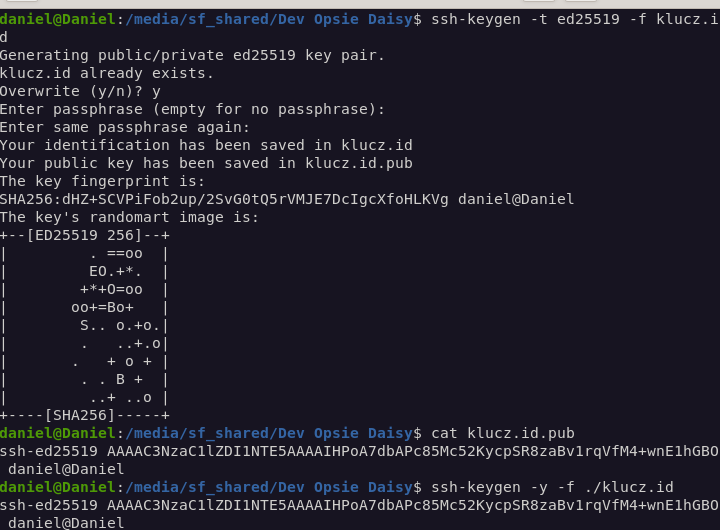
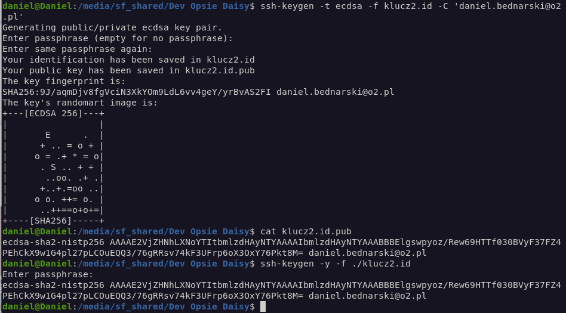
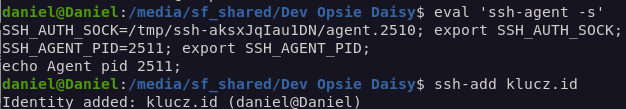
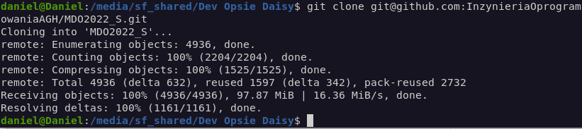
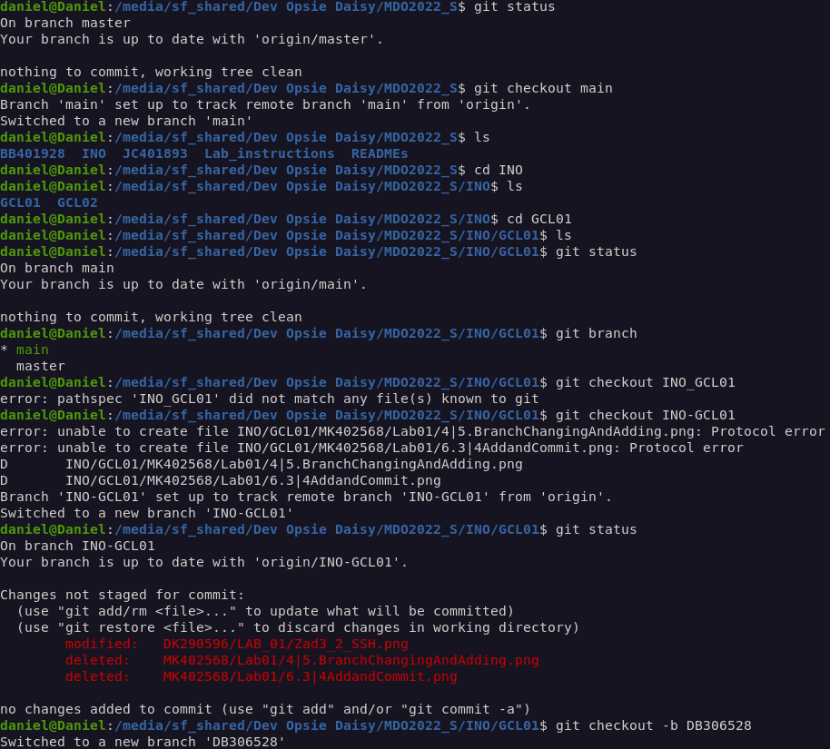
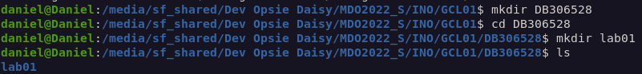

Instalacja git przebiegła poprzez komendę: 
*_sudo apt install git_*

Sklonowałem repozytorium poprzez komendę: 
*_git clone https://github.com/InzynieriaOprogramowaniaAGH/MDO2022_S.git_*

generowałem klucz poleceniem: 
*ssh-keygen -t ed25519 -f klucz.id*
a następnie sprawdziłem jego poprawność używając komend:
**cat klucz.id.pub
ssh-keygen -y -f ./klucz.id**

generowałem drugi klucz poleceniem:
*ssh-keygen -t ecdsa -f klucz2.id -C 'daniel.bednarski@o2.pl'*
i analogicznie do poprzedniego sprawdziłem jego poprawność.

Klucz publiczny dodałem do swojego konta na Github.
Klucz prywatny dodałem do ssh-agent:

Sklonowałem repozytorium przy pomocy ssh poprzz komendę:
*git clone git@github.com:InzynieriaOprogramowaniaAGH/MDO2022_S.git*

Następnie przejście do gałęzi INO_GCL01 i stworzenie gałęzi o nazwie "inicjały & numer indeksu":
**git checkout main
git checkout INO_GCL01
git checkout -b DB306528**

Na branchu utworzylem folder DB306528, w nim folder lab01, a następnie stworzyłem w nim plik "sprawozdanie.md"
