##DevOps Sprawozdanie 02

Wykonywanie zadań rozpocząłem od przejścia do podkatalogu **MDO2022_S/.git/hooks** i edycji pliku **commit-msg.sample**, w taki sposób by stworzyć hook'a który sprawdzi poprawność nazwy commita (a nazwa owa ma być *DB306528*):
![cd i gedit]](01 cd i gedit.png)

Natrafiłem na błąd który po dłuższym researchu ominąłem (*pracując na wirtualnej maszynie, na folderach udostępnionych z windowsa nie mogłem zapisać zmian w plikach tekstowych. Po dłuższym sprawdzaniu czym może być spowodowany ten błąd, okazało się, że problem ten dotyczy tylko gedit'a, więc edytowałem poprzez nano*. Zmieniłem nazwe pliku na **commit-msg** i zapisałem go:
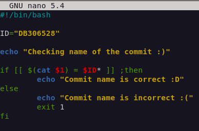

Następnie sprawdziłem jego poprawność:
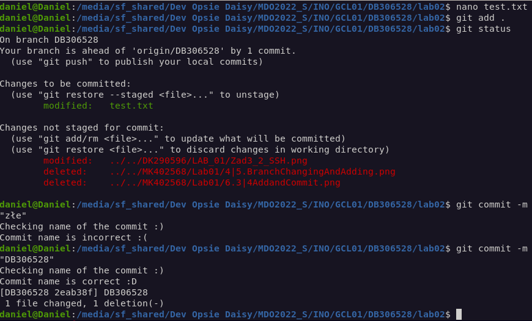

Stworzyłem hooka sprawdzającego, czy w treści commita pada numer labu właściwy dla zadania. Zrobiłem to poprzez edycję pliku **pre-commit.sample** i zmieniłem jego nazwę na **pre-commit**:
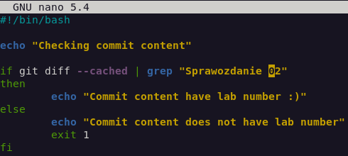

Następnie sprawdziłem jego poprawność:
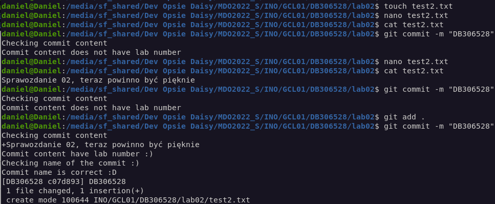

Następnie rozpocząłem przygotowanie środowiska Dockerowego.
Najpierw zainstalowałem program PuTTy oraz skonfigurowałem VirtualBoxa. Tutaj screen ustawionych opcji virtualboxa:
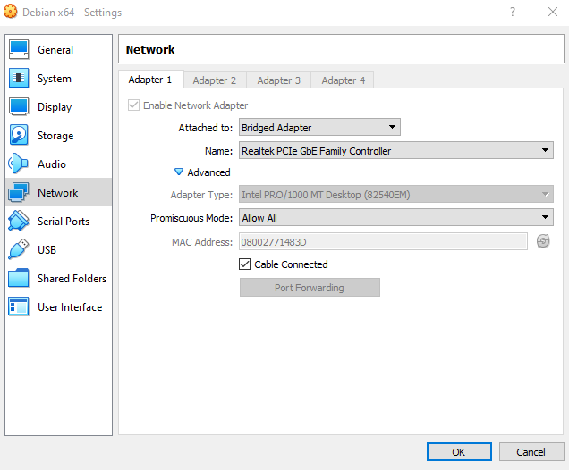

Sprawdziłem adres ip mojego virtualnego systemu:
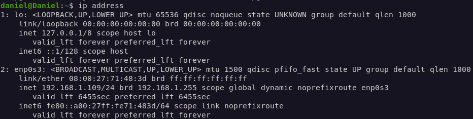

Połączenie z użyciem PuTTy:
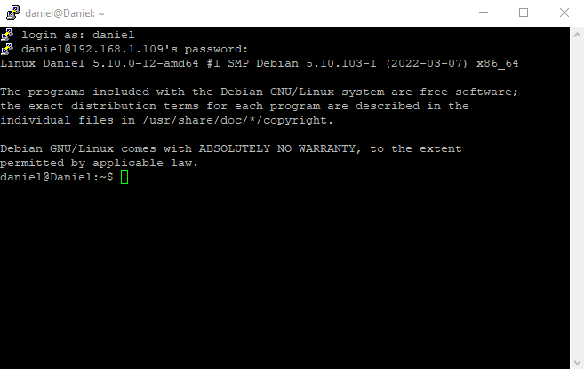

Sprawdziłem czy system jest zaktualizowany poprzez **sudo apt-get update**
Następnie zainstalowałem szereg wymaganych dependencji poprzez komendę: 
**sudo apt install apt-transport-https ca-certificates curl gnupg2 software-properties-common**
Screen z jej użycia:
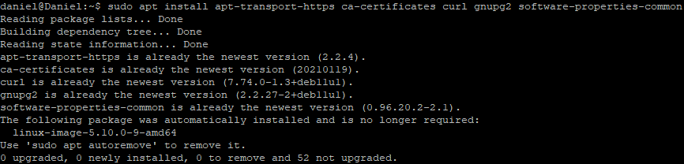

Następnie dodałem oficjalne glucze GPG Dockera za pomocą **curl -fsSL https://download.docker.com/linux/debian/gpg | gpg --dearmor -o /usr/share/keyrings/docker-archive-keyring.gpg**:
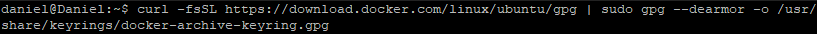

TUTAJ JESZCZE NIE DOSZEDŁEM
Ustawiłem repozytorium na stable poprzez:
**echo \
  "deb [arch=$(dpkg --print-architecture) signed-by=/usr/share/keyrings/docker-archive-keyring.gpg] https://download.docker.com/linux/ubuntu \
  $(lsb_release -cs) stable" | sudo tee /etc/apt/sources.list.d/docker.list > /dev/null**
Tutaj screen udowadniający przeprowadzenie działań:
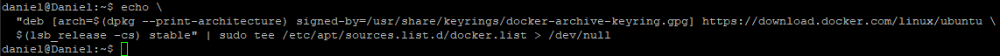

potem użyłem komendy **sudo apt-get update** w celu aktualizacji pamięci podręcznej pakietów:
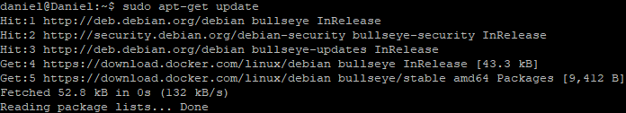

Następnie instalacja Dockera poprzez wpisanie ** DO WPISANIA**:
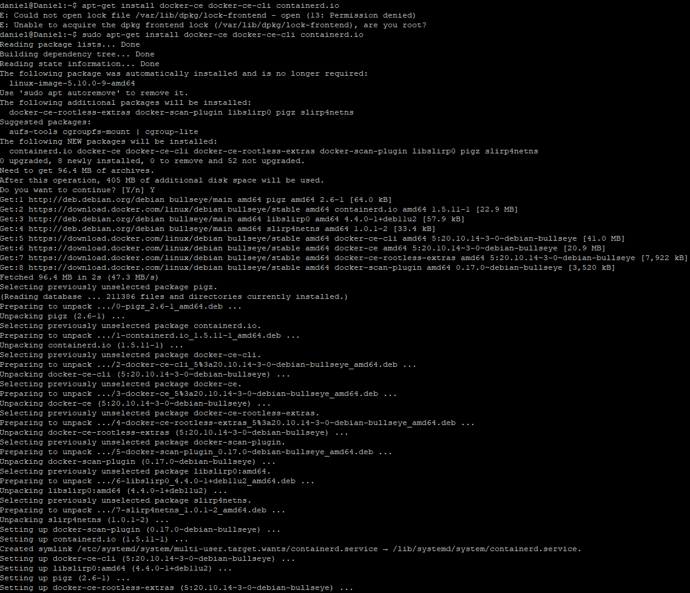

Sprawdzenie statusu dockera oraz jego wersji (**docker -v**, oraz **sudo systemctl status docker**):
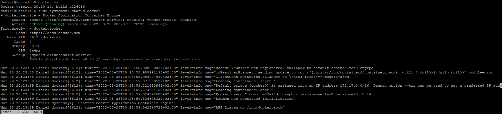

Uruchomienie obrazu hello world- **sudo docker run hello-world**:
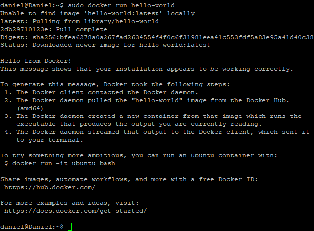

Pobranie i stworzenie kontenera ubuntu poprzez komendę **sudo docker run -it ubuntu bash**. Tutaj niechcący nie zapisałem pobierania ale ponowne wykonani tego polecenia prezentuje się tak:
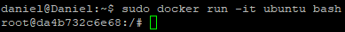

Sprawdziłem obrazy ubuntu i hello-world :)
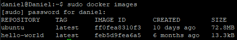

Sprawdziłem wersje Ubuntu:
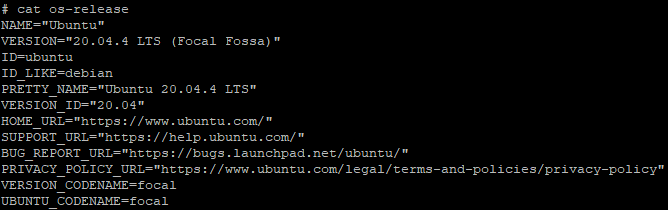

Na samym końcu założyłem konto na *docker hub*
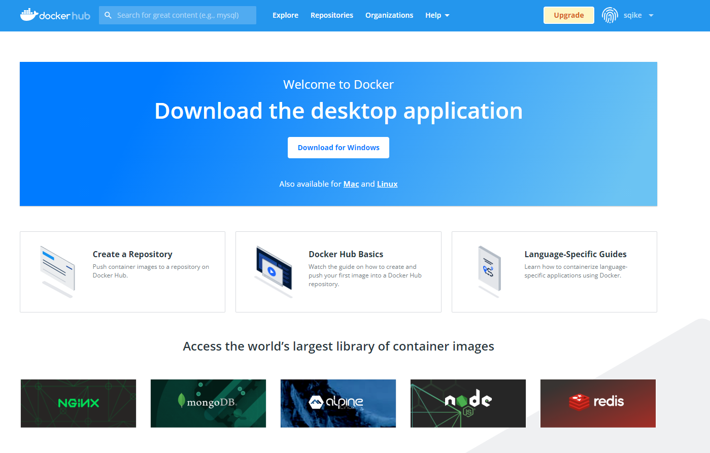