##DevOps Sprawozdanie 03

Wybrałem projekt nodejs.org- projekt ten spełnia wymagania zawarte w instrukcji do sprawozdania (otwarta licencja oraz zawiera testy). Link do repozytorium https://github.com/nodejs/nodejs.org.git .

Wykonywanie zadań rozpocząłem od użycia **git clone** w celu sklonowania repozytorium do nowo utworzonego folderu **lab3**:
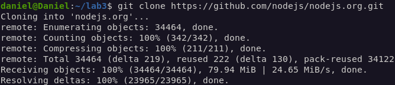

Następnie zainstalowałem menedżera pakietów poprzez komendę **npm install**. Następnie zbudowałem program i uruchomiłem testy komendami **npm run build** oraz **npm run test**:
![install]](02 npm install.png)
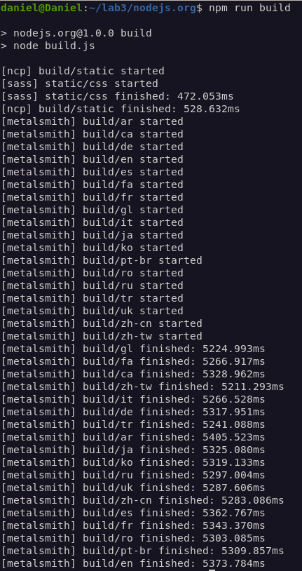
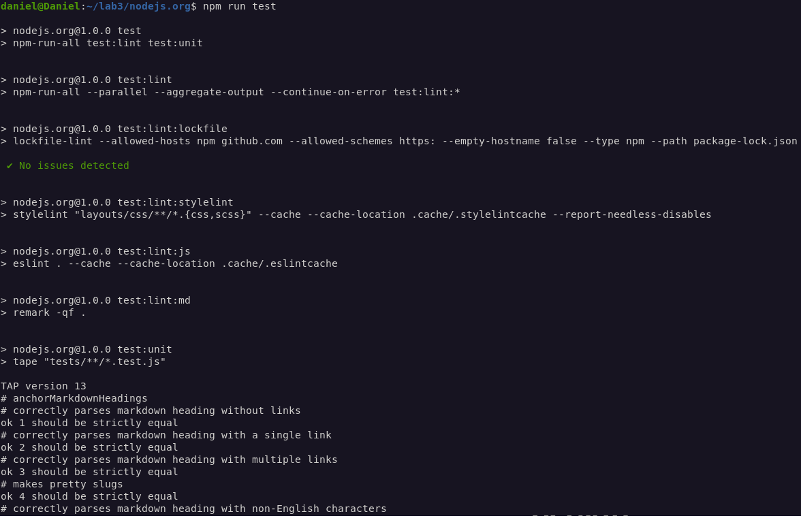
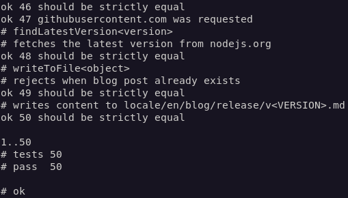

Połączyłem się programem PuTTY przy użyciu protokołu SSH ze swoją wirtualną maszyną, w celu pobrania obrazu node komendą **sudo docker pull node**:

Uruchomiłem kontener i podłączyłem się do niego poprzez komendę **sudo docker run --interactive --tty node sh**. Następnie w kontenerze powtarzam wcześniejsze działania- klonuje repozytorium, buduje program i uruchamiam testy:
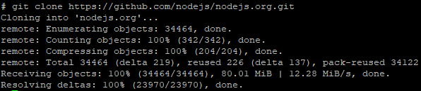
![install]](08 npm install.png)
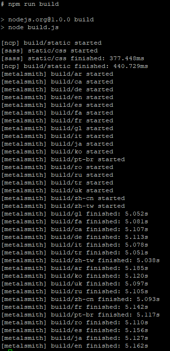
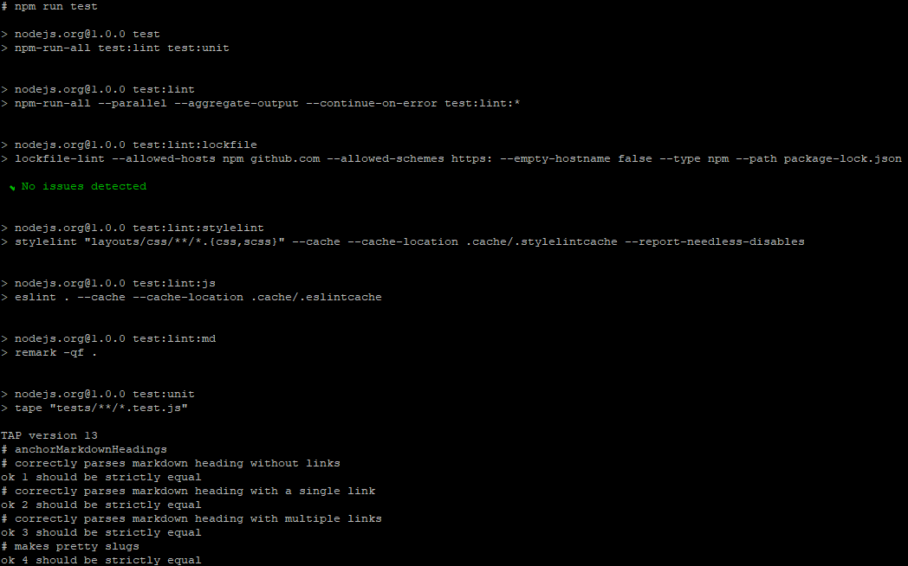
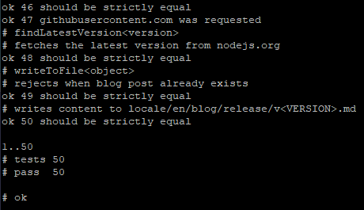

Następnie należało stworzyć dwa pliki Dockerfile do zautomatyzowania poprzednich kroków. Pierwszy plik dockerfile ma za zadanie zbudować program:

Gdzie:
**FROM**- wybór obrazu
**RUN**- uruchomienie komendy
**WORKDIR**- ustawienie ścieżki roboczej

Następnie użyłem komendy **sudo docker build . -f dockerfile1.dockerfile -t build1** aby zbudować docker o nazwie build1 przy pomocy stworzonego pliku dockerfile:
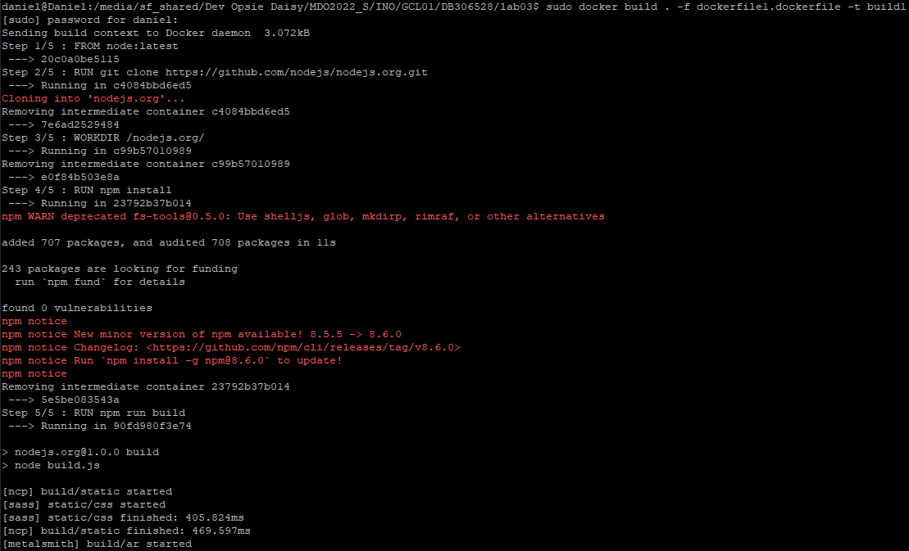
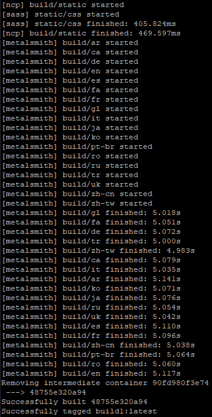

Drugi plik Dockerfile wykonujący test:
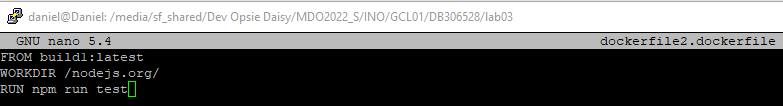

Użycie komendy **sudo docker build . -f dockerfile2.dockerfile -t build2** aby zbudować docker o nazwie build2 przy pomocy stworzonego pliku:
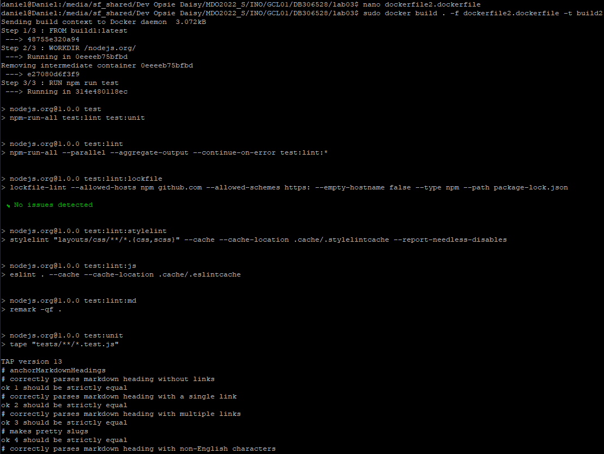
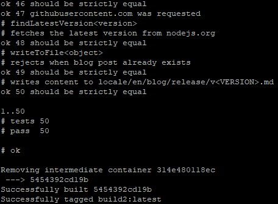
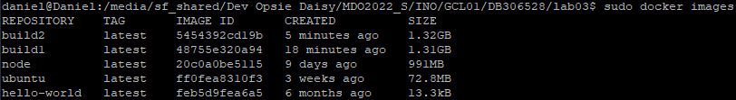

Następnie wykazałem, że dany kontener hostuje stronę na porcie 8080:
