##DevOps Sprawozdanie 04

Całość rozpocząłem od stworzenia dwóch woluminów- wejściowego oraz wyjściowego. W tym celu użyłem komendy **sudo docker volume create** ***nazwa*** .
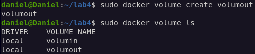

Wyświetliłem ścieżkę do woluminów poprzez **sudo docker volume inspect**
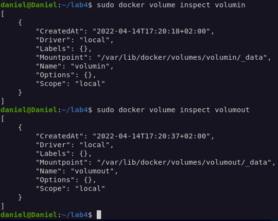

Uruchomiłem kontener z woluminami **sudo docker run --mount**. (zdjęcie zrobione później)
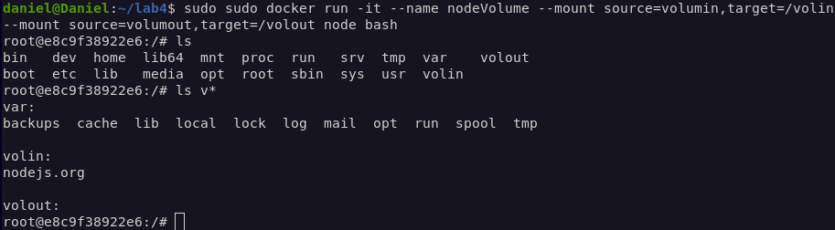

Następnie sklonowałem repozytorium na wolumin wejściowy **volumin**. Zrobiłem to z poziomu roota, używając git clone i wcześniej sprawdzonej ścieżki.
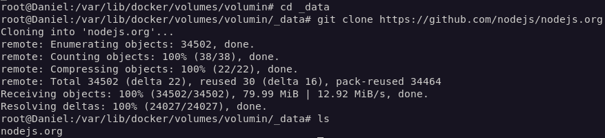

Sklonowane repozytorium:
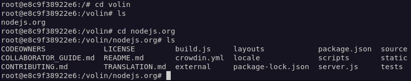

Pobrałem zależności za pomocą **npm install**:
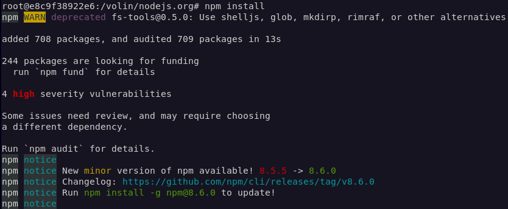

Użyłem komendy **npm run build**, w celu uruchomienia builda w kontenerze:
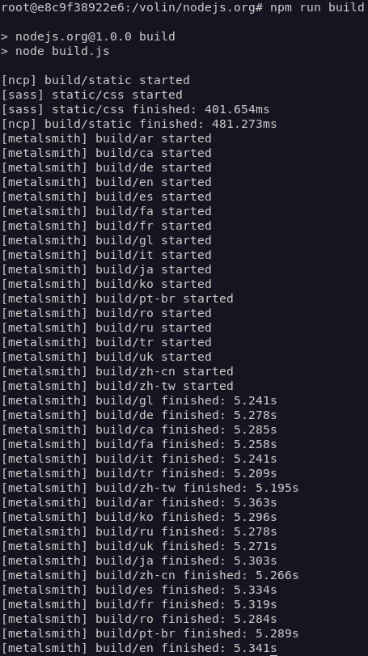

Skopiowałem folder build do katalogu volout:
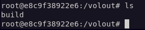

Pliki z woluminu wyjściowego są i mają się dobrze:
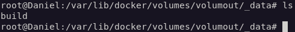

#Eksponowanie portu

W następnym kroku uruchomiłem serwer iperf (iperf3) wewnątrz kontenera. Na początek poszukałem odpowiedniego obrazu dockerowego. Użyłem polecenia **sudo docker pull networkstatic/iperf3**, pobrałem go i następnie uruchomiłem
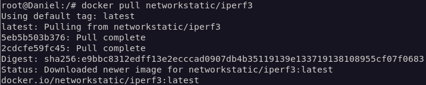
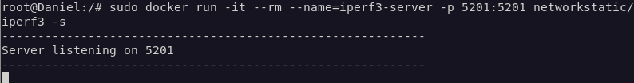

Sprawdzenie nasłuchu:
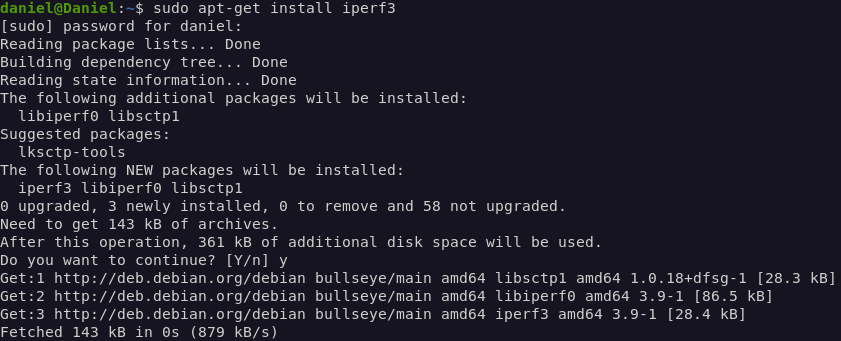

Sprawdzenie IP serwera **sudo docker inspect**:

W kolejnym kroku połączenie się z serwerem z drugiego kontenera. Nawiązane połączenie:
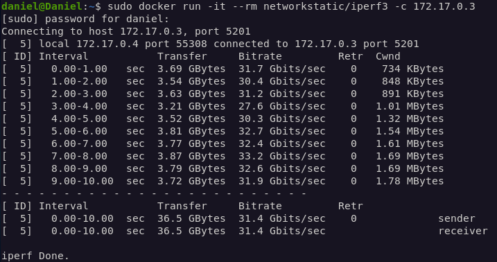

Następnie połączenie spoza kontenera (z hosta i spoza hosta). Najpierw zainstalowałem iperf3 na hoście. Sprawdzenie połączenia z hosta:
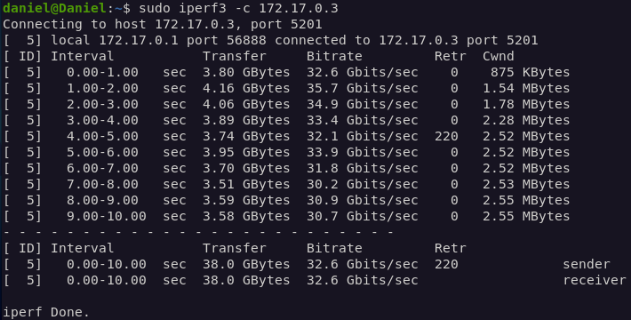

logi z kontenera:
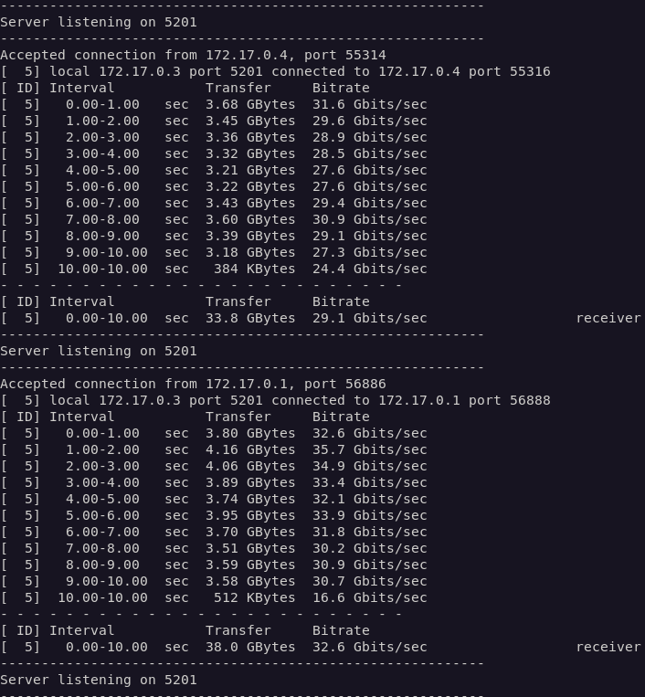

Połączenie się z zewnątrz z systemu windows 10 (zdjęcie z logami):
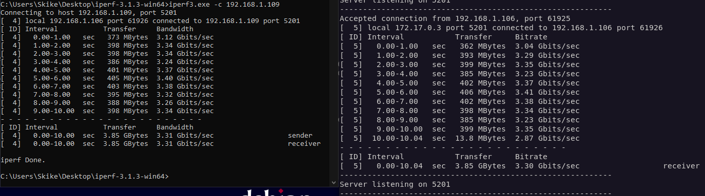

Podsumowując, największa przepustowość występowała w przypadku połączenia pomiędzy kontenerami, oraz w przypadku połączenia pomiędzy hostem a kontenerem (nieduże różnice). Jednoznacznie najniższy wynik został uzyskany dla transferu pomiędzy komputerem zewnętrznym z Windowsem a kontenerem (około 10 razy niższy).

JENKINS
Według polecenia zapoznałem się z dokumentacją https://www.jenkins.io/doc/book/installing/docker/.
Zainstalowałem skonteneryzowaną instancję jenkinsa z pomocnikiem DIND. Zacząłem od utworzenia nowej sieci dockerowej poprzez **sudo docker network create jenkins**:
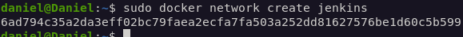

Następnie postępowałem zgodnie z poleceniami podanymi w dokumentacji. Pobranie i uruchomienie obrazu DIND kontenera:
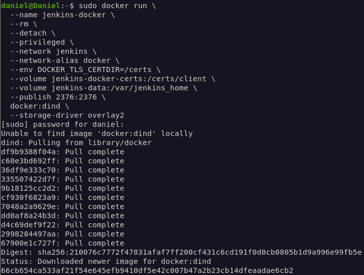

Stworzenie Dockerfile poprzez **touch** i edytowanie go według instrukcji z linku. 

Uruchomienie builda poprzez **sudo docker build -t** (-t do określenia nazwy nowego obrazu)
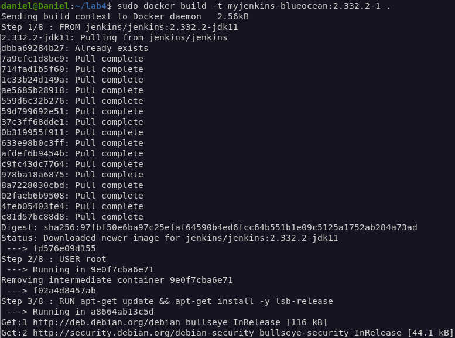
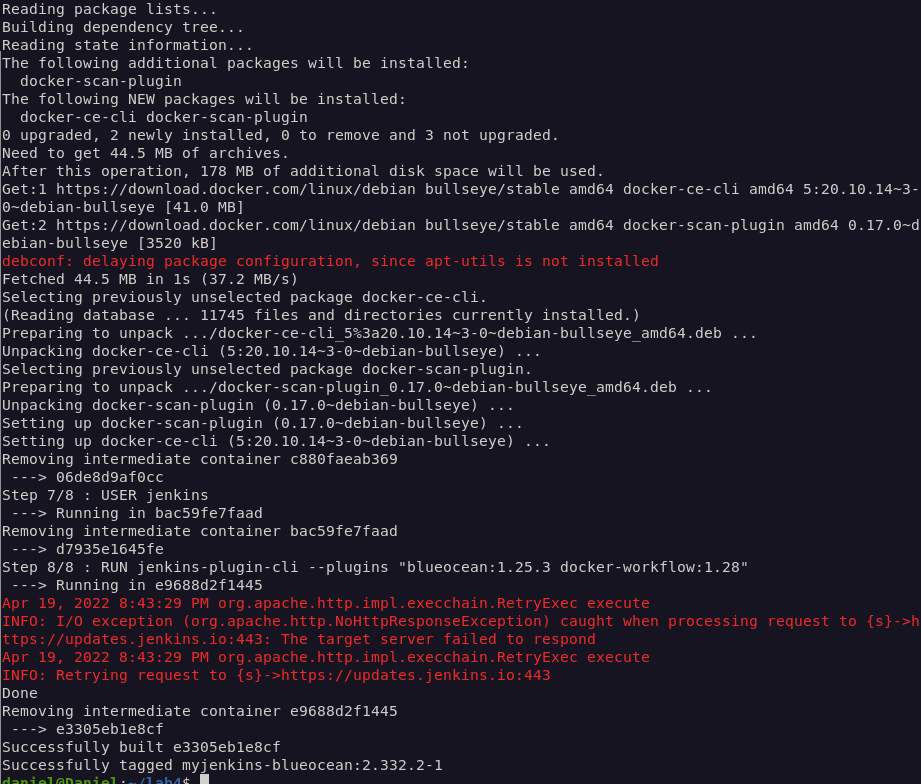

Uruchomienie stworzonego obrazu:
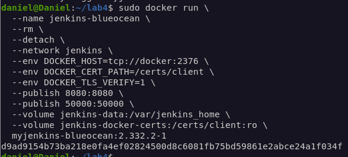

Instancja Jenkinsa została uruchomiona:
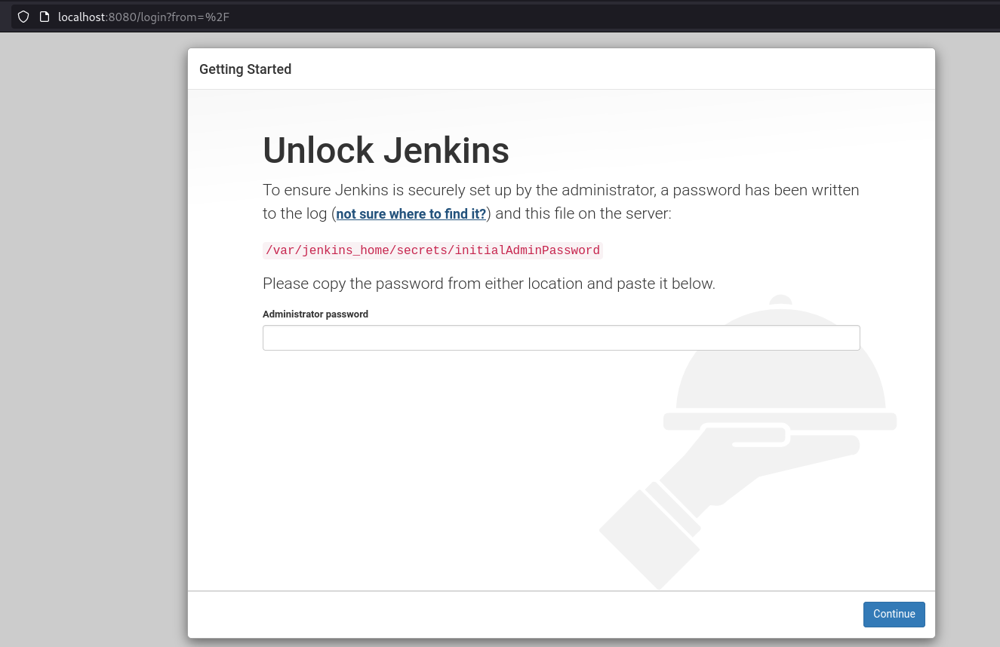

Następnie odczytałem hasło. Użyłem **sudo docker exec** aby uruchomić interaktywny terminal na kontenerze, który jest aktywny. Dzięki cat odczytałem hasło:
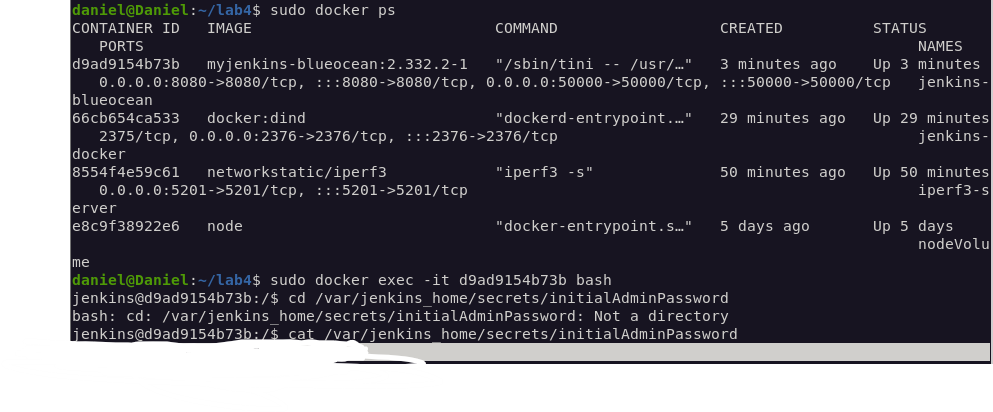

Zainstalowałem zalecane wtyczki:
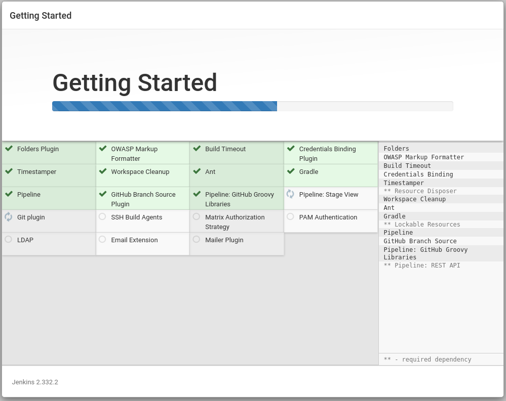

No i na sam koniec ekran zalogowanego jenkinsa oraz ekran logowania do jenkinsa:
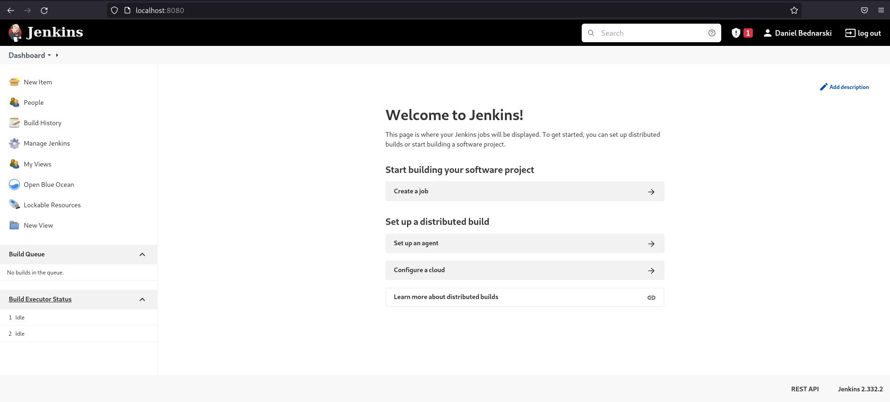
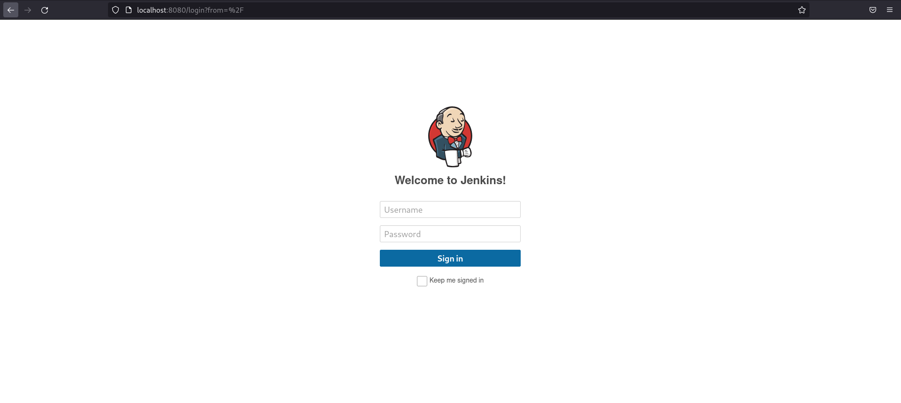