##DevOps Sprawozdanie 09

Głównym przygotowaniem w celu wykonaniu zadania było zorganizowanie miejsca na moim zasyfionym dysku SSD, tak by bez najmniejszych obaw działać swobodnie na wielu wirtualnych systemach. Dysk po zwolnieniu miejsca:
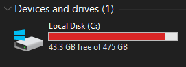
Instalacja Fedory w VirtualBoxie:
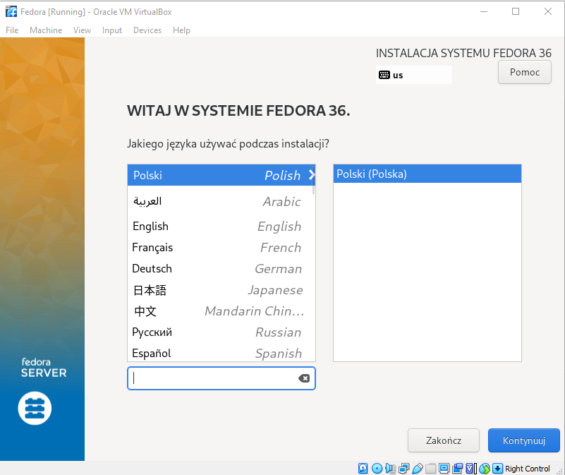
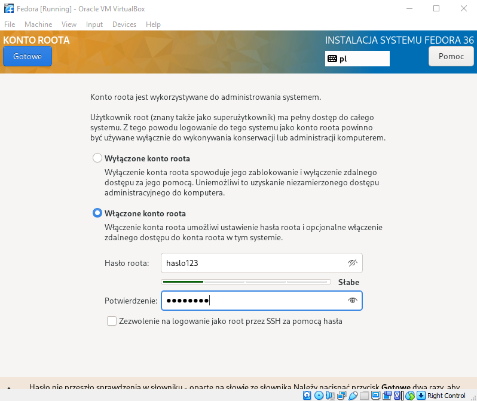
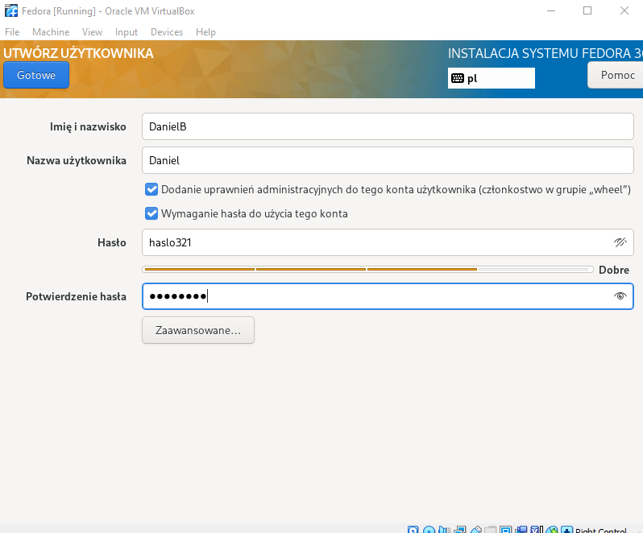

Konfiguracja:
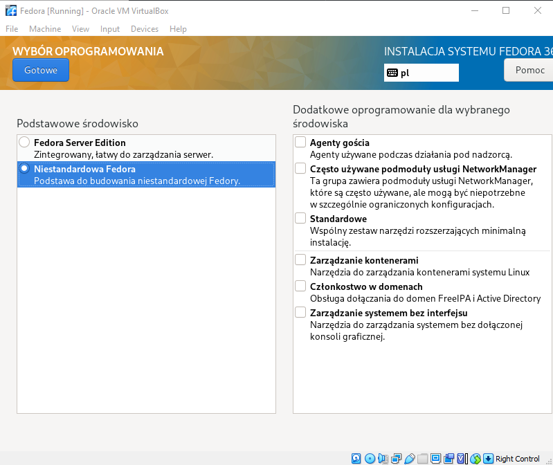

Poprawnie zainstalowane:
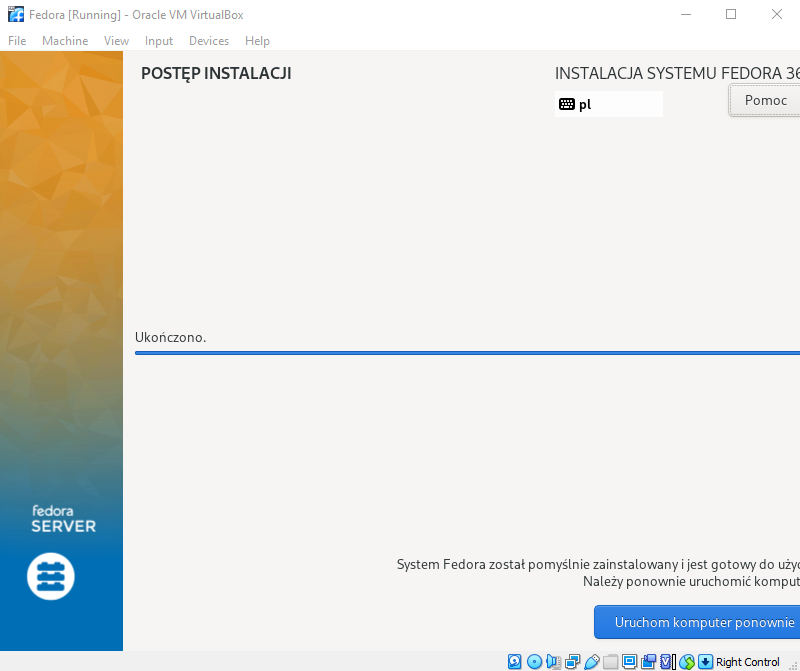

Logowanie jako root:
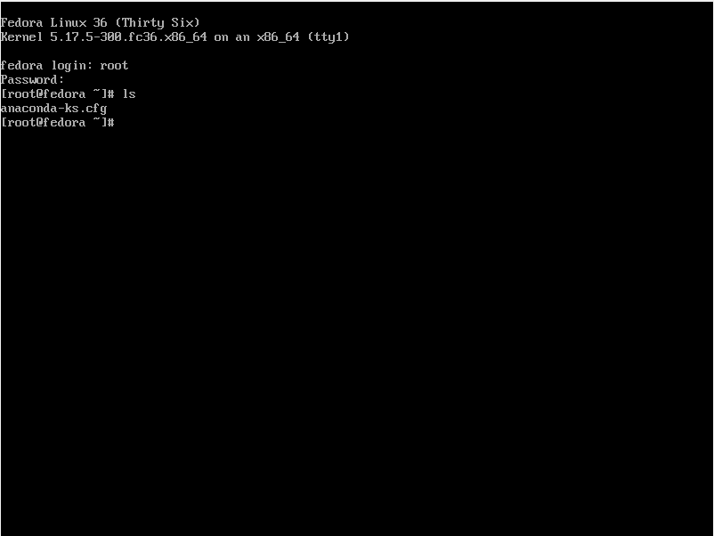

Plik anaconda-ks.cfg:
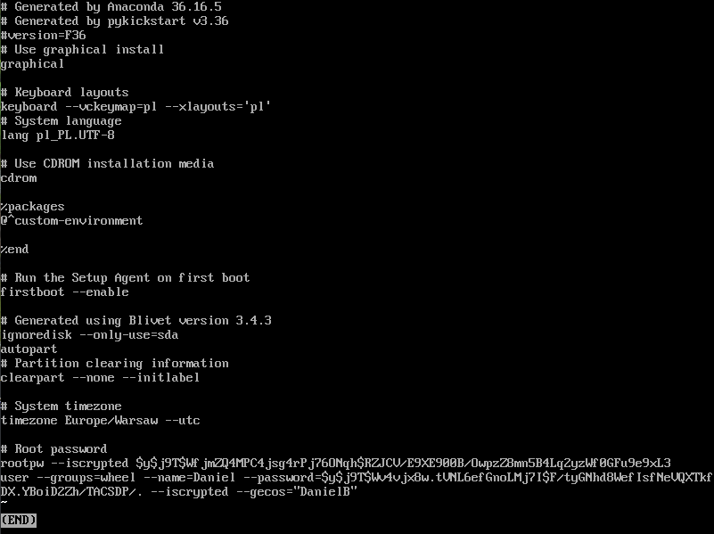

Przekierowanie portu w VirtualBoxie:
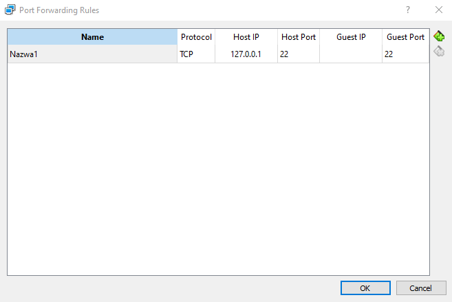

Następnie instaluje drugi system Fedora, który będzie hostem. Wykonałem kolejno komendy w celu skonfigurowania:
**dnf install httpd**:
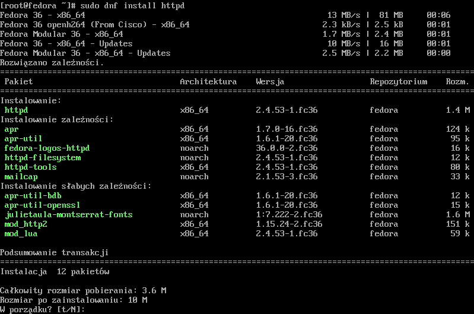
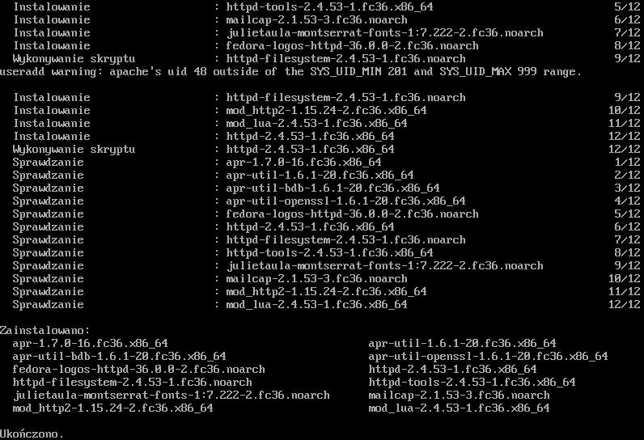

**dnf group install "Web Server"**:
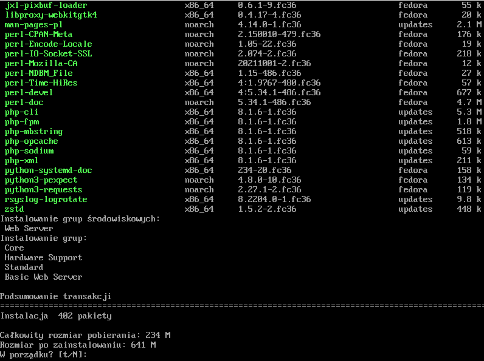
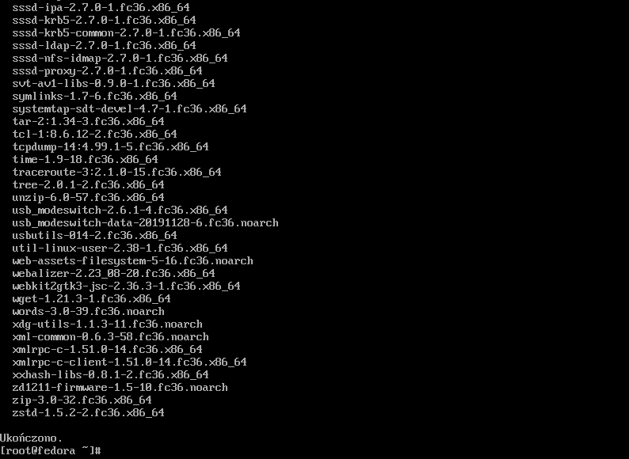

**systemctl start httpd**
**systemctl enable httpd**
**firewall-cmd --add-service=http --add-service=https --permanent**
**firewall-cmd --reload**
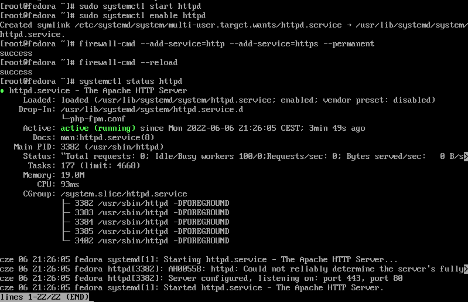
Na powyższym zdjęciu sprawdziłem również status httpd

Wrzucam artefakt z Pipeline
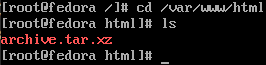

Mniej więcej w tej okolicy spotkałem się z problemami z poprawnym działaniem całej "konstrukcji", ale po długim szukaniu przyczyny doszedłem do tego, że nie wykonałem komendy **dnf install openssh-server**
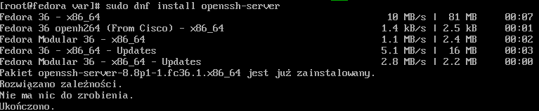

Z problemami ale coś wyszło:
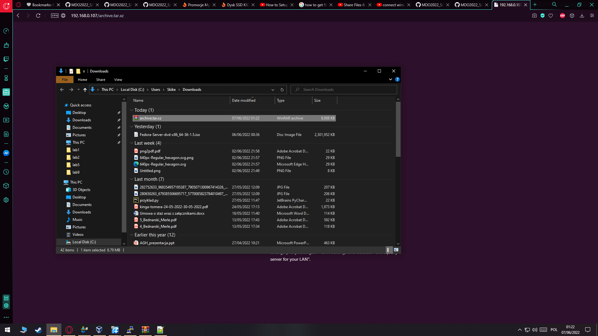
###Instalacja nienadzorowana

Edycja pliku anaconda-ks.cfg. Następnie wrzucam na githuba. Lokalizacja to: "https://github.com/InzynieriaOprogramowaniaAGH/MDO2022_S/blob/DB306528/INO/GCL01/DB306528/lab09/anaconda-ks.cfg"
Plik po drobnej edycji wygląda następująco:
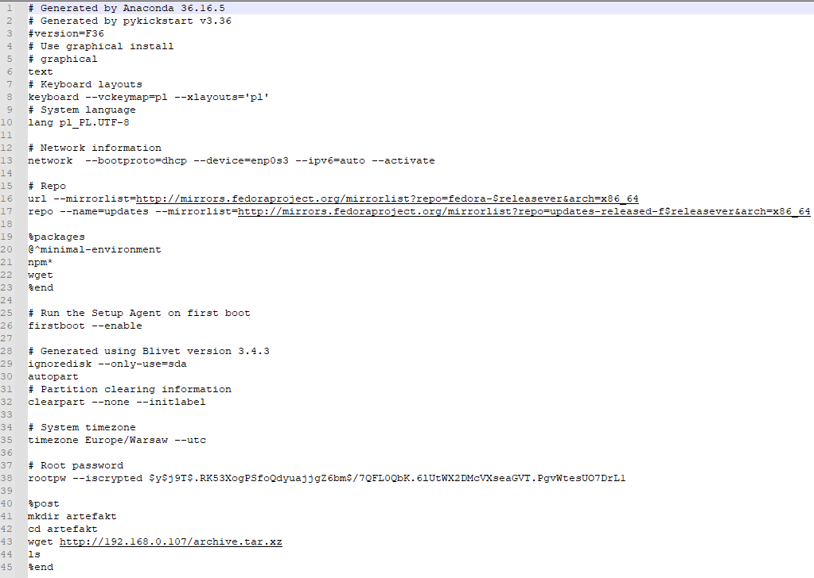

Uruchomienie instalacji:
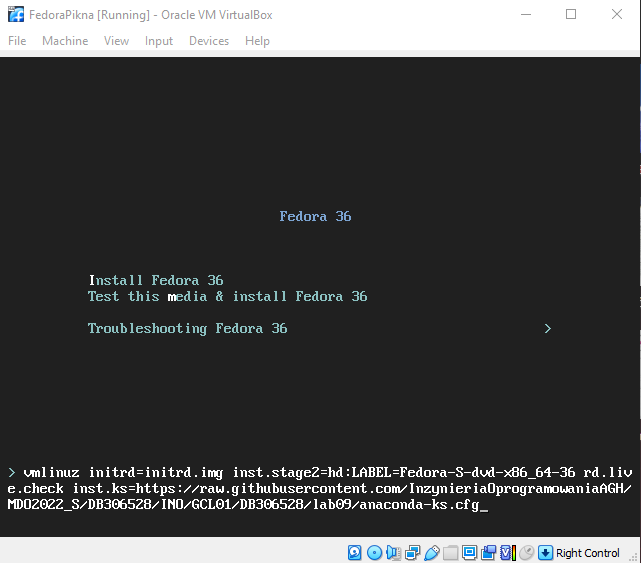

Działająca instalacja:
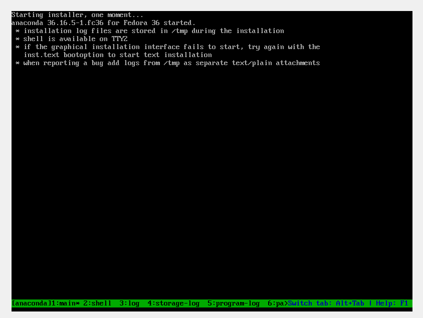

Plik w folderze po instalacji:
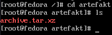

W trakcie realizacji sprawozdania natrafiłem na sporo utrudnień spowodowanych problemem z połączeniem się do wirtualnej maszyny jako root przez inne programy. Omijałem te problemy logując się jako użytkownik w programie WinSCP a zmieniając uprawnienia do plików jako root zalogowany czy to w wirtualnej maszynie czy połączony poprzez PuTTy (PuTTy wymagało zalogowania się na konto użytkownika a potem zmianę użytkownika na root). Generalnie spotkałem się z różnymi utrudnieniami które próbowałem pokonać, ale kończyło się na tym że "obchodziłem je dookoła" ze względu na jakkolwiek racjonalne ograniczenie czasu.