##DevOps Sprawozdanie 05

Instalacja Jenkins na podstawie https://www.jenkins.io/doc/book/installing/docker (ostatnie sprawozdanie. DIND (Docker-in-Docker) to kontener uruchomiony w innym kontenerze. Dzięki temu wewnętrzny kontener jest w stanie budować kontenery oraz je uruchamiać.

Najpierw uruchamiam oba kontenery:

DIND:
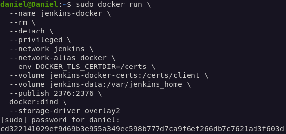

Kontener z Jenkinsem:
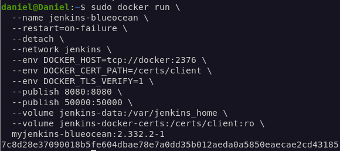

Sprawdzenie czy kontenery działają poprawnie **sudo docker ps**:
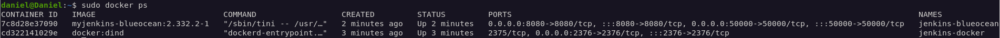

Pliki *Dockerfile* oraz plik *Jenkinsfile* zostaną zawarte w katalogu "lab05files" w repozytorium na mojej gałęzi.
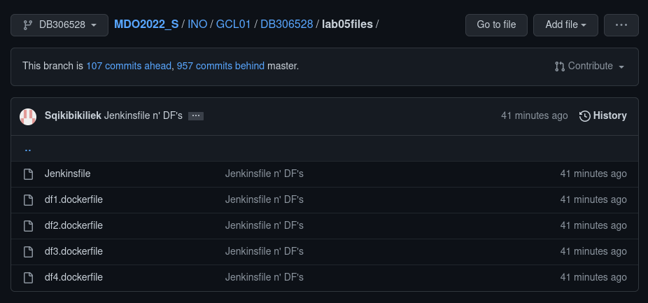

Oczywiście z powodu mojej beznadziejnej pamięci, zapomniałem hasła do Jenkinsa, więc dodatkowo wykonałem procedurę wyłączenia zabezpieczeń, resetowania hasła i ponownego ustawienia potrzeby logowania.

Następnie stworzyłem obiekt projektowy pipeline i odpowiednio go skonfigurowałem. Najpierw zaznaczyłem opcję parametryzacji i ustawiłem 2 parametry- *Name*, oraz *Version*
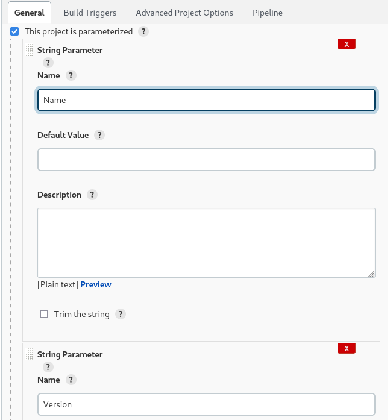

Następnie konfiguruję SCM ustawiając URL repozytorium, odpowiedni branch w tym repozytorium oraz ścieżkę do Jenkinsfile'a
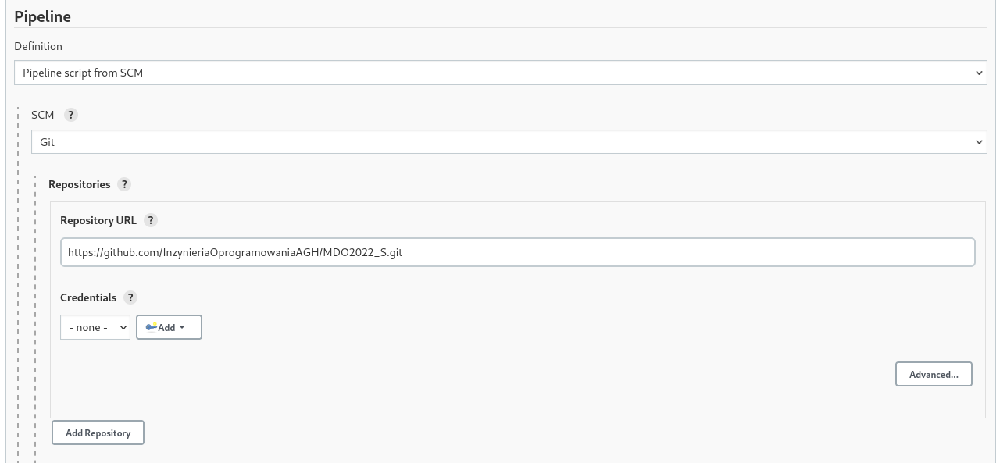
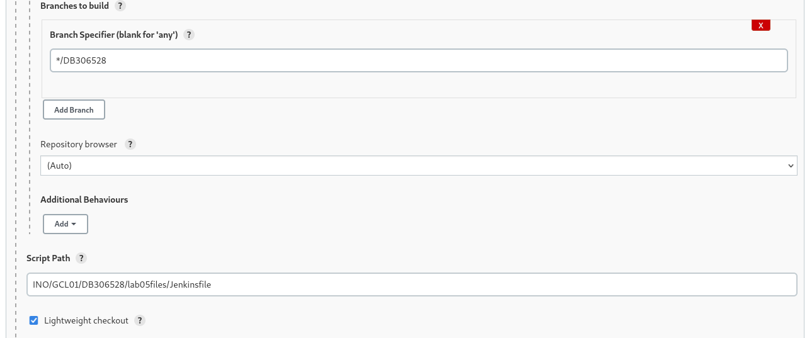

####BUILD
Tutaj stworzony zostaje obraz builder bazujący na obrazie node. Najpierw następuje sklonowanie repozytorium z projektem nodejs.org, po czym następuje przełączenie na odpowiednią gałąź. Na końcu pobierane są dependencje i tworzą się zbuildowane pliki potrzebne do *npm run build*.
Dockerfile:
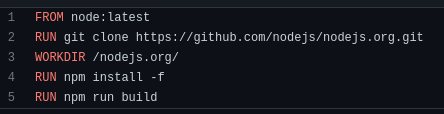
Fragment Jenkinsfile:
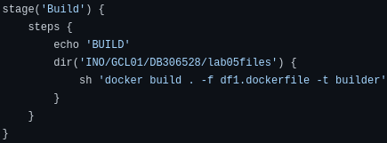

####TEST
Tutaj stworzony zostaje obraz tester, którego zadaniem jest przeprowadzenie testów co do poprawności działania programu.
Dockerfile:
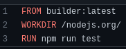
Fragment Jenkinsfile:
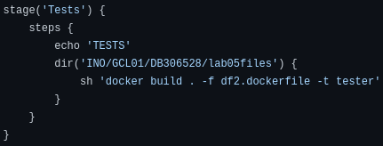

####DEPLOY
Tutaj uruchamiany jest obraz builder, oraz następuje podłączenie woluminu, na który skopiowane zostają foldery *en* oraz *static* zawierające potrzebne pliki. W kroku tym pliki z buildera zostają wyciągnięte z użyciem woluminu. Następnie tworzony jest obraz deploy, którego celem jest hostowanie aplikacji. Obraz opiera się o *nginx*. Aby wszystko działało poprawnie kopiuje folder build do woluminu, a zawartość folderów *en* i *static* do */usr/share/nginx/html*. Przekierowuje porty na 3000 by móc otworzyć stronę przez localhost.
Dockerfile:
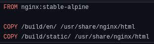
Fragment Jenkinsfile:
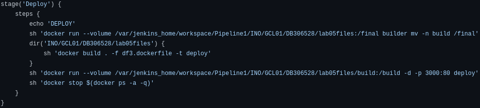

####PUBLISH
Tutaj ma miejsce publikacja programu. Zeby to nastąpiło poprzednie kroki (build, test i deploy) muszą przebiec pomyślnie. Projekt nodejs nie wymaga instalatora, ponieważ zbuildowane pliki od razu są gotowe do wrzucenia i hostowania w kontenerze. Z racji problemów z publikacją, build został spakowany do pliku archive.tar.xz w celu uproszczenia przenośności.
Dockerfile:
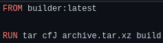
Fragment Jenkinsfile:
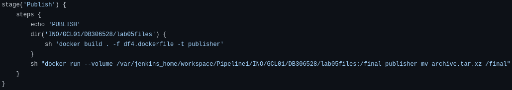

Sprawdziłem czy w kontenerze Jenkinsa znajduje się powstałe archiwum:
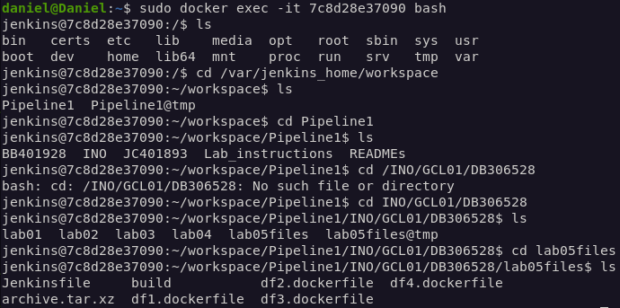

Logi:
-Start:
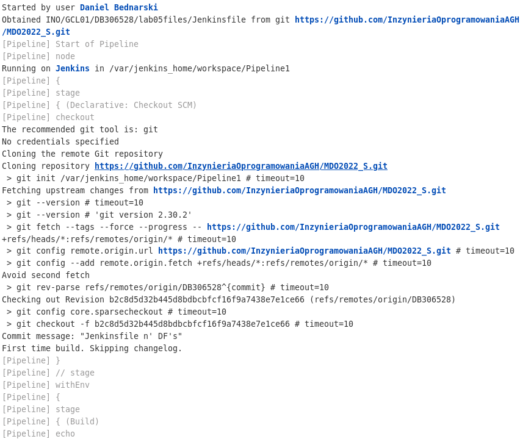

-Build
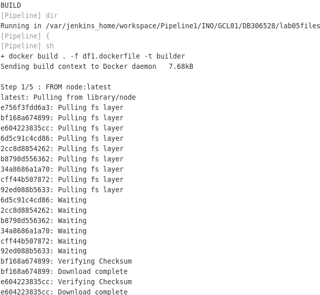
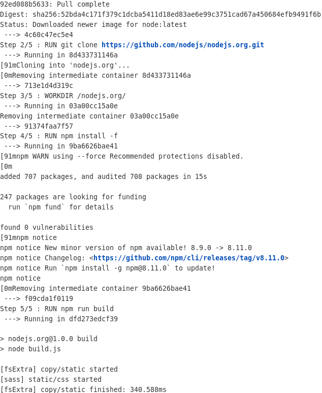

-Test
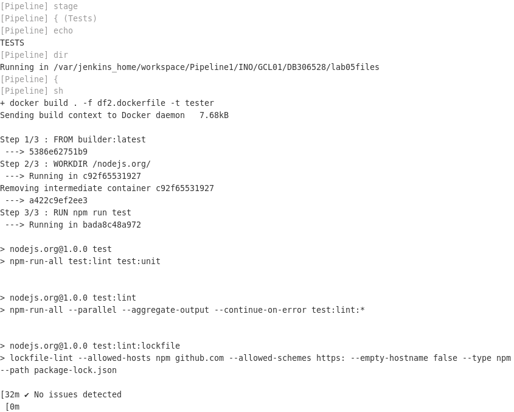

-Deploy
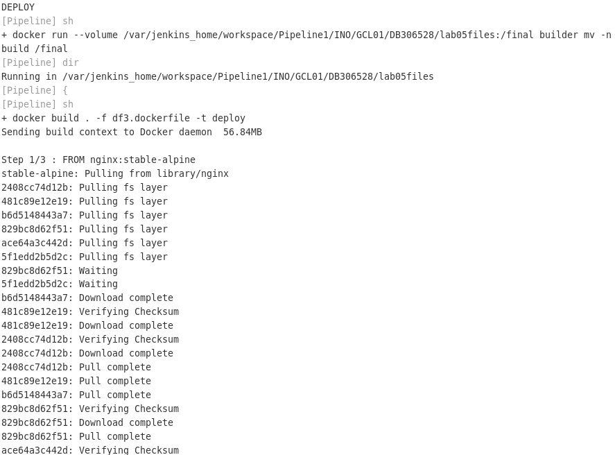

-Publish
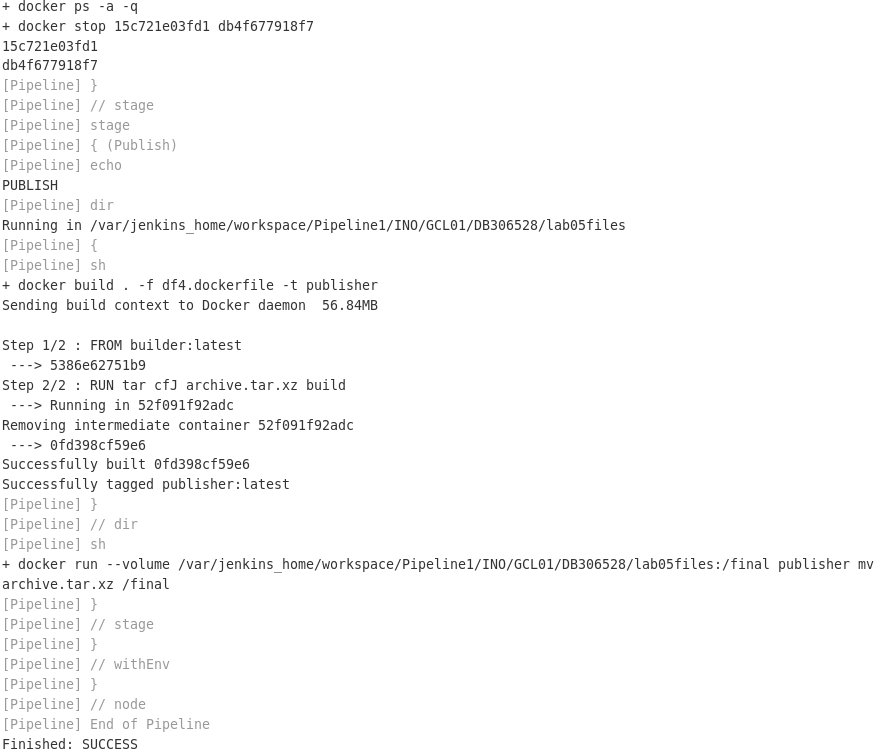

Stage view:
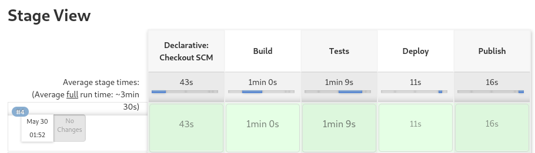