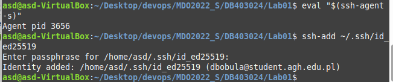
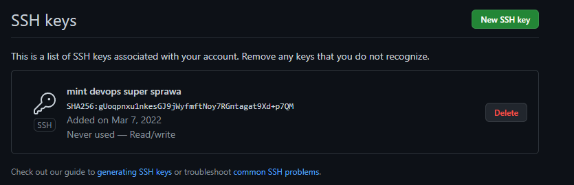
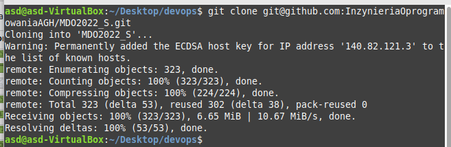
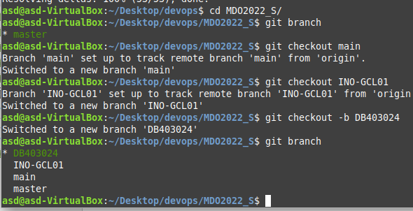
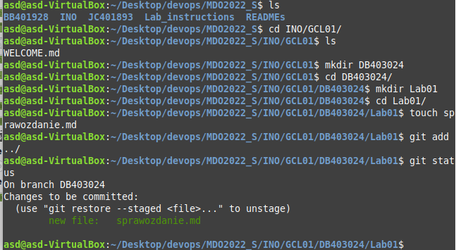
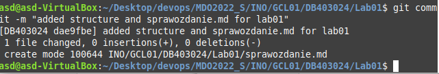

# Lab 1

- Zainstalowalem gita na wirtualnej maszynie oraz wygenerowalem klucz shh, podpinając go potem do githuba

- Sklonowalem repozytorium przy uzyciu `git clone git@github.com:InzynieriaOprogramowaniaAGH/MDO2022_S.git`

- przy uzyciu `git checkout` przełączyłem się najpierw na branch main pozniej na INO-GCL01 a nastepnie przy uzyciu `git checkout -b DB403024` stworzyłem własnego brancha

- uzywajac polecenia `mkdir` oraz `touch` stworzyłem odpowiednia strukture katologów oraz plik tekstowy ze sprawozdaniem, dodając plik do commita poprzez `git add` oraz stworzenie commita poprzez `git commit -m "commit message"`

- W podobny sposób dodałem screenshoty z wykonywania zadania

- Wykonałem próbę merga poprzez przełączenie się na branch grupowy i wykonanie `git merge` po wykonaniu następnie `git push` zmiany zostają odrzucone - "protected branch hook declined". W związku z tym wykonałem pull requesta do brancha grupowego

