# Lab 2

- Po stworzeniu folderu Lab02 w odpowiednim folderze stworzylem plik `commit-msg` w którym sprawdzana jest wiadomosc commita, zarówno tytuł dla inicjalow i numeru jak i pozniejsze linijki dla numeru laba:

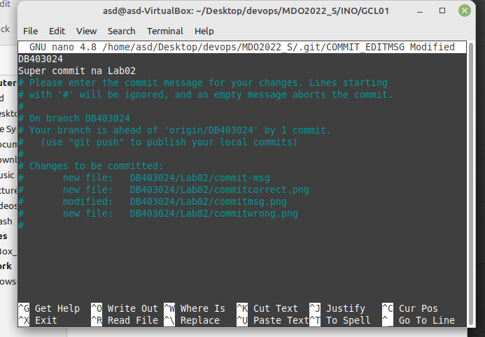

Potwierdzenie działania:
Niepoprawna nazwa:

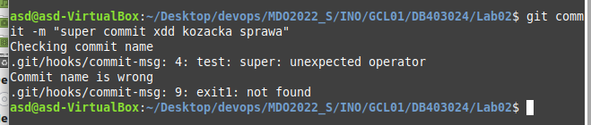

Poprawna nazwa:

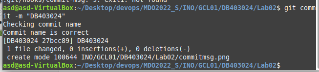

Plik `commit-msg` znajduje sie takze w repo
oczywiście wszystko odbywa sie przy uzyciu gitowskich polecen z poprzedniego laba
- Przygotowanie środowiska dockerowego zacząłem od forwardowania portu ssh aby móc połączyć się z serwerem zdalnie.

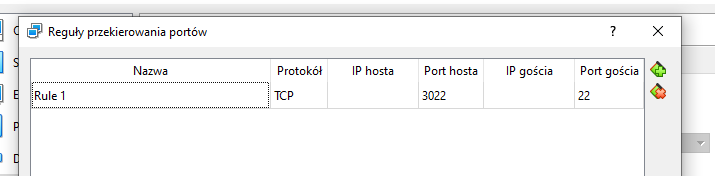

następnie połaczyłem sie puttym poprzez ssh

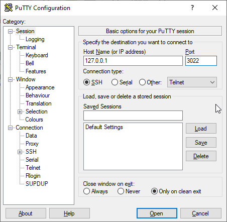

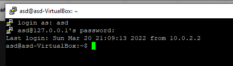

- Jako srodowisko do dockera uzyje fedory
wykonałem profilaktyczne usuniecie starych wersji dockera `
sudo apt-get remove docker docker-engine docker.io containerd runc`, `curl -fsSL https://download.docker.com/linux/ubuntu/gpg | sudo gpg --dearmor -o /usr/share/keyrings/docker-archive-keyring.gpg
`, `echo "deb [arch=$(dpkg --print-architecture) signed-by=/usr/share/keyrings/docker-archive-keyring.gpg] https://download.docker.com/linux/ubuntu bionic stable" | sudo tee /etc/apt/sources.list.d/docker.list > /dev/null
`  i finalnie po `sudo apt update` zainstalowalem komendą `sudo apt install docker-ce docker-ce-cli containerd.io `  wszystko wedlug [tego poradnika](https://computingforgeeks.com/install-docker-and-docker-compose-on-linux-mint-19/)

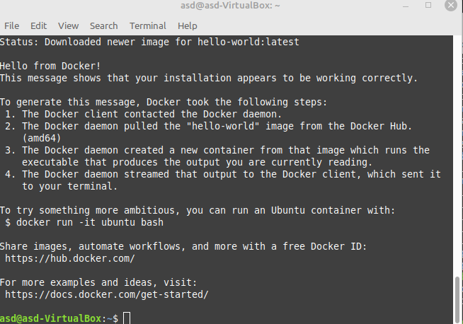

- pobralem fedore za pomocą polecenia `sudo docker pull fedora`

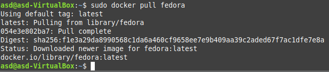

i uruchomilem poleceniem `sudo docker run -it fedora`

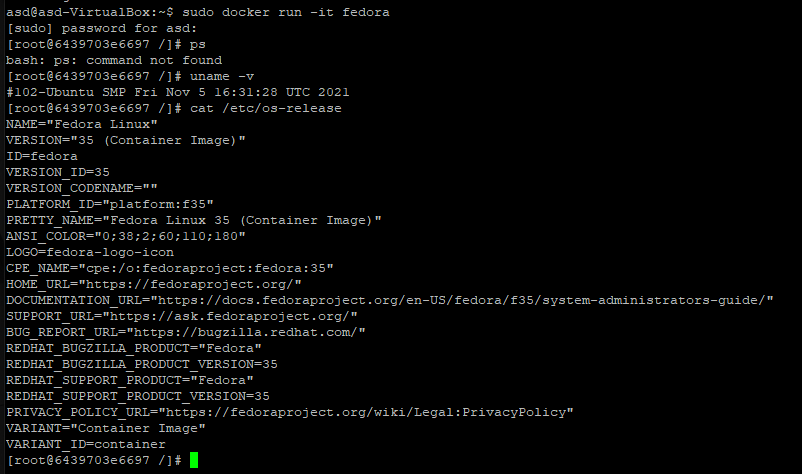

Nazwa kernela z `uname -v` to Ubuntu natomiast z `cat /etc/os-release` juz fedora, dodatkowo `sudo docker ps`:

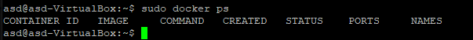

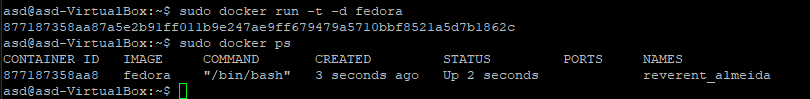

- Na koniec założyłem konto na dockerhubie
