# Lab 3

- Po stworzeniu folderu Lab03 w odpowiednim folderze odpaliłem z Putty'ego fedore uzywajac polecenia `docker run -it fedora`, a następnie pobrałem dependency oraz zassałem repo z gita. Wybrałem to samo repo które było używane podczas demonstracji na zajęciach, ponieważ jest to bardzo convenient. Poniżej screeny z builda, testu oraz historii komend:

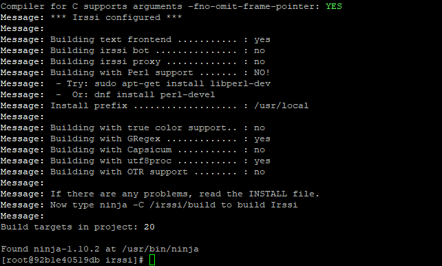

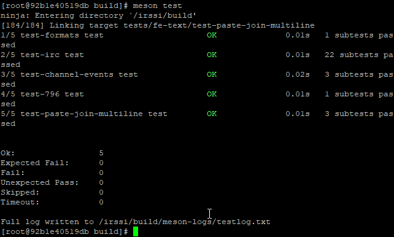

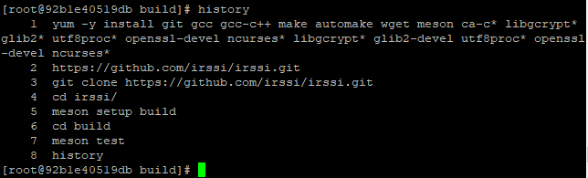

- Stworzyłem 2 pliki Dockerfile: `Docker1`:

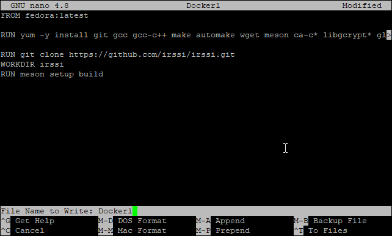

oraz `Docker2`:

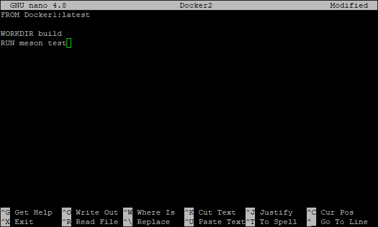

- Użyłem polecenia `docker build -f docker1:latest . -f Docker1` aby stworzyć kontener z załączeniem pierwszego pliku Dockerfile.

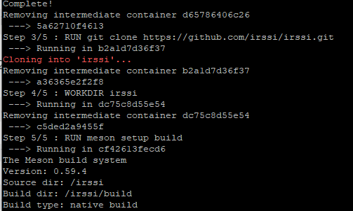

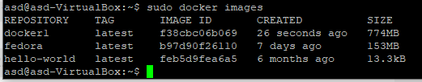

- Aby wykazać poprawne zbudowanie programu, w kontenerze zainstalowałem irssi używając wczesniej zbudowanego repo:

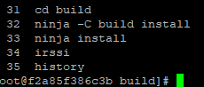

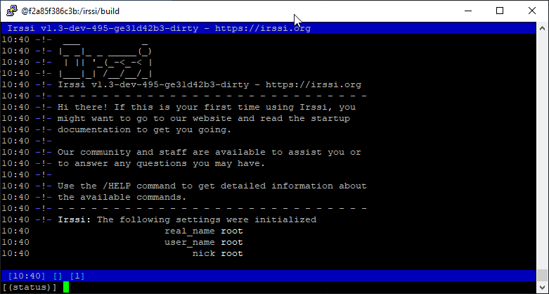

- następnie wykonałem `docker build -t docker2:latest . -f Docker2` aby z drugim Dockerfile stworzyć build z testami

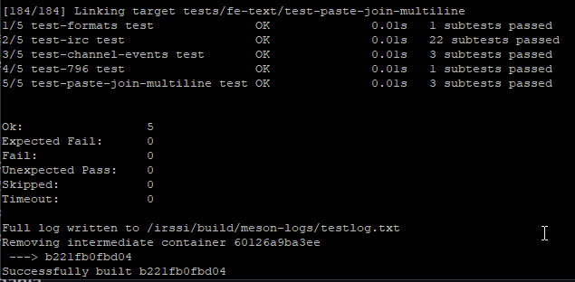

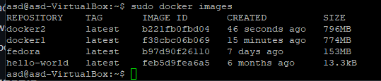

- Jak widać testy przeszły, jako że obraz ten zbudowany jest na podstawie poprzedniego, który działa wnioskuje że ten też musi śmigać aż miło.
