# Lab 4

- Po stworzeniu folderu Lab04 w odpowiednim folderze stworzylem woluminy uzywajac  polecen `docker volume create`

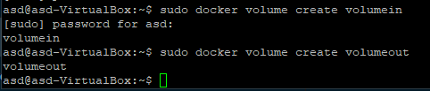

- uruchomilem kontener oraz zainstalowalem potrzebne dependency

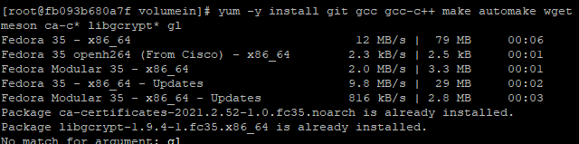

- na wolumin `volumein` sklonowalem repo, a następnie przy uzyciu `meson setup` zbudowałem je w voluminie `volumeout`

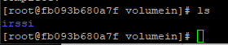

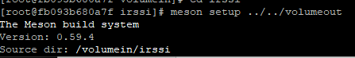

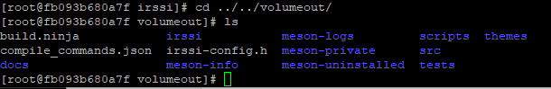

- przy uzyciu `yum install -y iperf3` zainstalowalem na dwoch kontenerach iperf3, na windowie uzylem windowsowego klienta i polaczylem sie z serwerem w kontenerze po uprzednim odpaleniu kontenera serwerowego z przekierowaniem portow oraz osobnym przekierowaniem na wirtualnej maszynie:

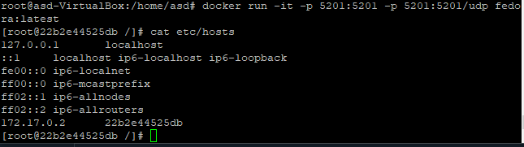

Nie pobieralem loga z serwera, przepustowosci, gdyż widać ją
na screenach:

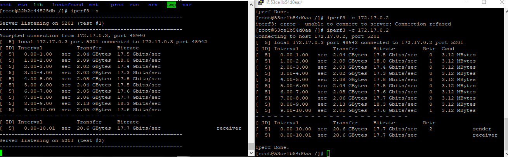

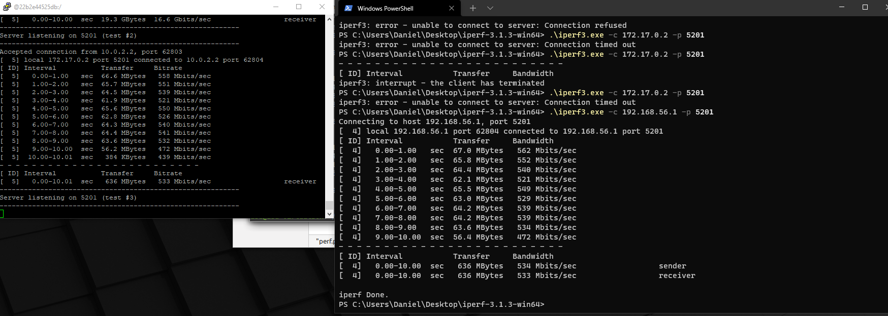

- Zapoznalem się z dokumentacją jenkinsa. Większość użytych przeze mnie poleceń na screenach jest przekopiowana z dokumentacji.

- stworzyłem siec dla jenkinsa

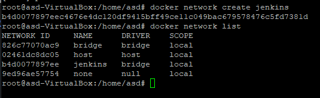

- pobrałem dind

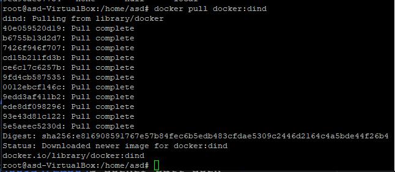

- wykonalem polecenie docker run z dokumentacji Jenkins

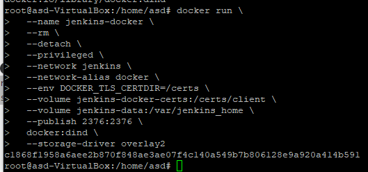

- stworzyłem dockerfile takze z dokumentacji

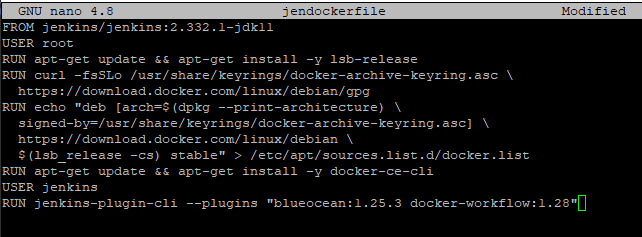

- następnie build oraz run

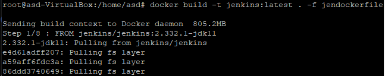

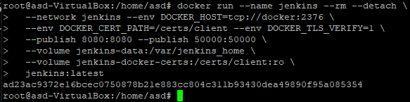

- Jenkins smiga w przeglądarce na porcie 8080:

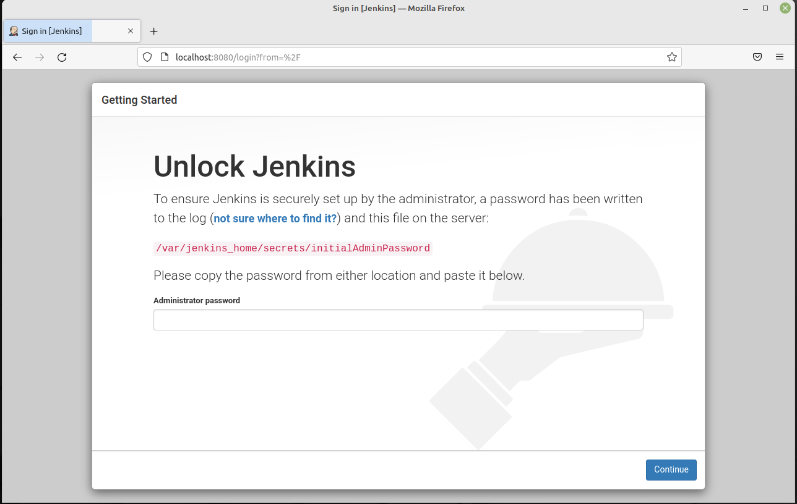

- Aby zalogowac sie na jenkinsa wyciagnalem haslo z kontenera:

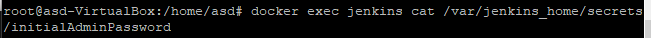

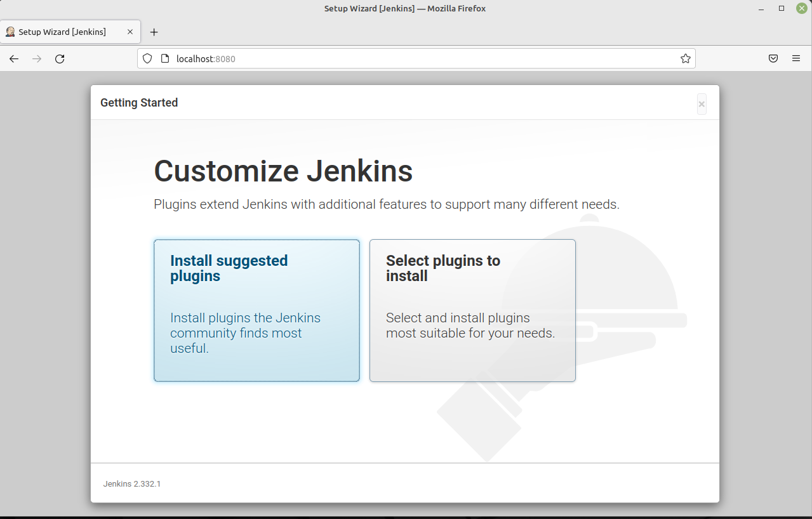
