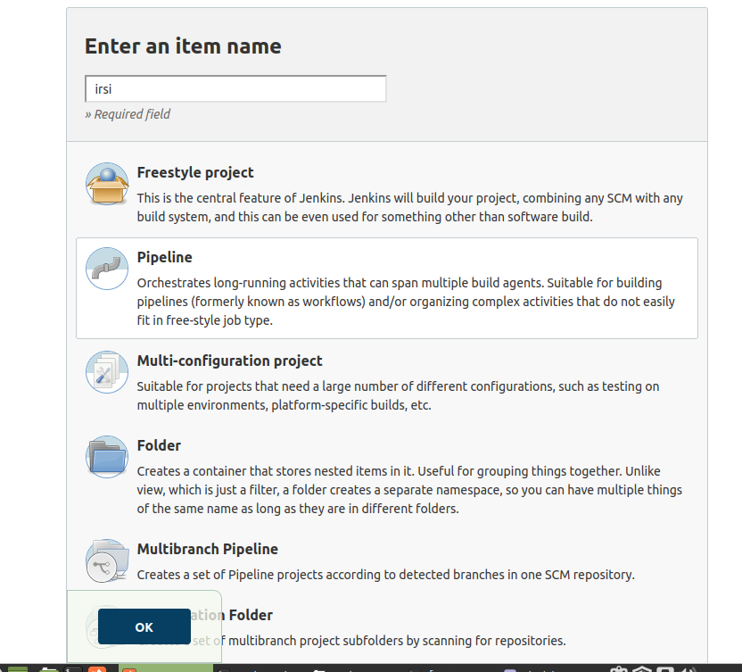
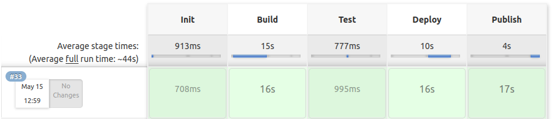

# Lab 5

- Jako pierwsze uruchamiam dwa kontenery: dind oraz jenkins

dind
```docker run --name jenkins-docker --rm --detach \ --privileged --network jenkins --network-alias docker \ --env DOCKER_TLS_CERTDIR=/certs \ --volume jenkins-docker-certs:/certs/client \ --volume jenkins-data:/var/jenkins_home \ --publish 2376:2376 \ docker:dind --storage-driver overlay2```

jenkins
```docker run --name jenkins --rm --detach \ --network jenkins --env DOCKER_HOST=tcp://docker:2376 \ --env DOCKER_CERT_PATH=/certs/client --env DOCKER_TLS_VERIFY=1 \ --publish 8080:8080 --publish 50000:50000 \ --volume jenkins-data:/var/jenkins_home \ --volume jenkins-docker-certs:/certs/client:ro \ jenkins:latest```

- Następnie przygotowuje pliki dockerfile

-- d1: Pobieranie dependency dla irssi. Używam fedory 34 zamiast latest, ponieważ przy użyciu wersji latest pojawily sie problemy z dependency gdyż pojawił sie konflikt wersji jednej z nich. Dlatego też na koncu dodałem atrybut --skip-broken i wtedy hula aż miło
```
FROM fedora:34
RUN yum -y install git gcc gcc-c++ make automake wget meson ca-c* libgcrypt* glib2* utf8proc* openssl-devel ncurses* libgcrypt* glib2-devel utf8proc* openssl-devel ncurses* --skip-broken
```
-- d2: Build: używam mesona do zrobienia builda na volume wyjsciowy `volumeout`
```
FROM d1:latest

RUN git clone https://github.com/irssi/irssi.git
WORKDIR irssi
RUN meson setup build
```
-- d3: Test: podobnie jak wyzej test odpalany przez mesona
```
FROM d2:latest

WORKDIR build

RUN meson test
```
-- d4: Publish ktory używamy do tworzenia archiwum tar.gz z builda znajdujacego sie na woluminie wyjsciowym
```
FROM fedora:34

WORKDIR volumeout
```
-- d5: deploy: odpalenie programu w kontenerze
```
FROM d2:latest

RUN ninja -C build install
```

Utworzone dockerfile kopiuje na wolumin wejsciowy konteneru z jenkinsem
```
docker cp d1 jenkins:/var/jenkins_home/d1
docker cp d2 jenkins:/var/jenkins_home/d2
docker cp d3 jenkins:/var/jenkins_home/d3
docker cp d4 jenkins:/var/jenkins_home/d4
docker cp d5 jenkins:/var/jenkins_home/d5
```

- Przygotowuje pipeline:




```
pipeline {
    agent any

    stages {
        stage('Init') {
            steps {
                echo 'Init'
                sh "docker build -t d1:latest . -f /var/jenkins_home/d1"
            }
        }
        stage('Build') {
            steps {
                echo 'Build'
                sh "docker rm irssi3"
                sh "docker build -t d2:latest . -f /var/jenkins_home/d2"
                sh "docker run -t -d --name irssi3 -v volumeout:/volumeout d2:latest"
                sh "docker cp irssi3:/irssi/build ./build-irssi3"
                sh "docker cp ./build-irssi3 irssi3:/volumeout/build"
                sh "docker stop irssi3"
            }
        }
        stage('Test') {
            steps {
                echo 'Test'
                sh "docker build -t d3:latest . -f /var/jenkins_home/d3"
            }
        }
        stage('Deploy') {
            steps {
                echo 'Deploy'
                sh "docker rm -f irssi3Deploy"
                sh "docker build -t d5:latest . -f /var/jenkins_home/d5"
                sh "docker run -t -d -e TERM=xterm --name irssi3Deploy -v volumeout:/volumeout d5:latest"
                sh "docker exec irssi3Deploy irssi"
                sh "docker stop irssi3Deploy"
                sh "docker container rm irssi3Deploy"
            }
        }
        stage("Publish"){
            steps{
                echo "Publish"
                sh "docker rm -f irssi3Publish"
                sh "docker build -t d4:latest . -f /var/jenkins_home/d4"
                sh "docker run -t -d --name irssi3Publish -v volumeout:/volumeout d4:latest"
                sh "docker exec irssi3Publish tar -czvf irssi.tgz ./build"
                sh "docker stop irssi3Publish"
                sh "docker container rm irssi3Publish"
            }
        }
    }
}
```
Na początku build deploy I publish dodałem `sh "docker rm -f  [nazwa]"` przez powatarząjący się błąd wynikający z istniejącego już działającego kontenera o danej nazwie, nie mam pojecia czemu skoro jest usuwany na koncu ale ok tak też działa.



Wszystkie dockerfile i pipline znajduja sie w plikach txt w folderze ze sprawkiem.
