# Lab 10
#### Witam was ja jestem Daniel Bobula a to kolejny odcinek z naszej serii Metodyki Devops. W dzisiejszym odcinku ustawiamy orchestrator w formie ansible.

- Zaczynam od stworzenia dwóch fedor

- Ustawilem karty sieciowe obu maszyn na bridged w VirtualBoxie a nastepnie przeprowadziłem test pingowania

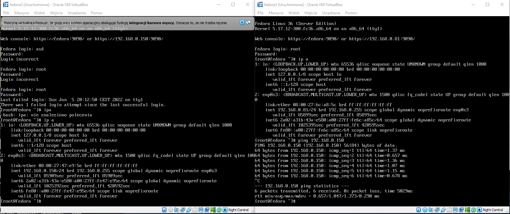

- Zainstalowałem na hoscie ansible komendą `dnf --assumeyes install ansible`

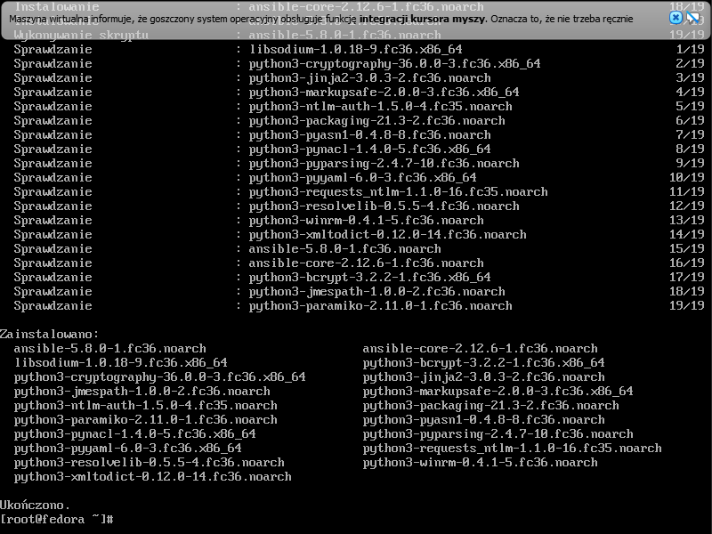

- Plik `/etc/ansible/ansible.cfg`

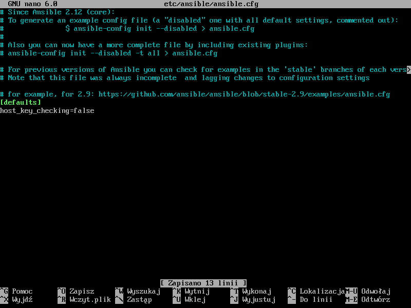

-Nastepnie edytowałem plik `/etc/ansible/hosts`

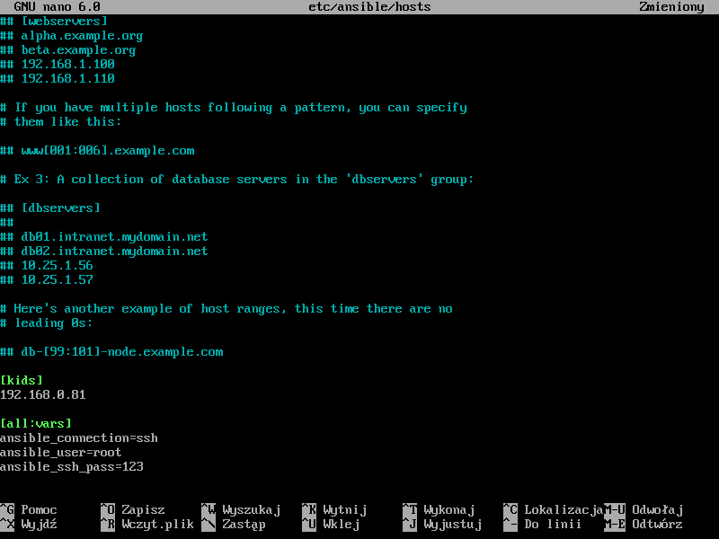

- Pierwsza próba odpalenia ansible w celach pingu zakończona niepowodzeniem, należało doinstalowac sshpass

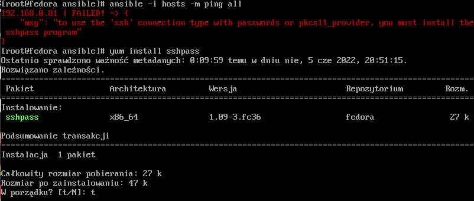

- Kolejna próba tym razem pokazuje nam sie cudowny zielony tekst

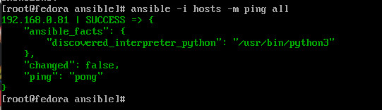

- Na komputer hosta zassałem wgetem plik first_playbook.yml ze ścieżki `https://docs.ansible.com/ansible/latest/_downloads/588d4b6e9316c8eb903fbe2485b14d64/first_playbook.yml`

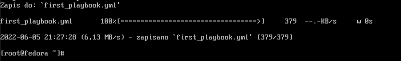

- Do ww pliku wprowadziłem zmiany aby zainstalowac package rpmfusion

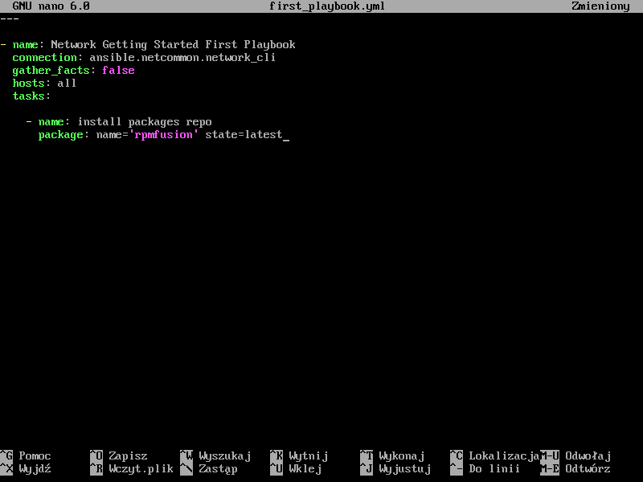

- Niestety instalacja na klientach nie powiodła się

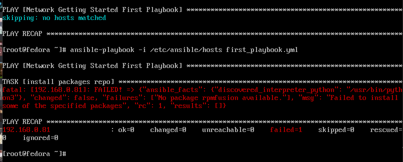

- Poprawiona wersja pliku:

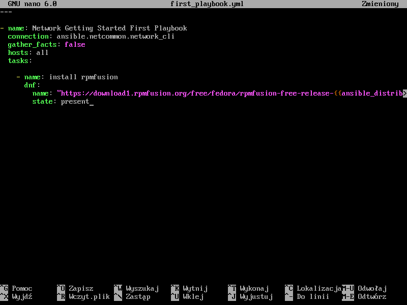

- Niestety napotkałem kolejny problem:

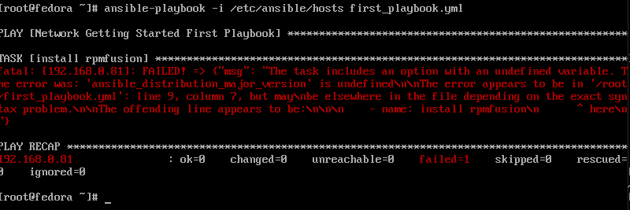

- Rozwiązaniem było dodanie klucza `disable_gpg_check=true` oraz wyżej zmiana `gather_facts` na `true`

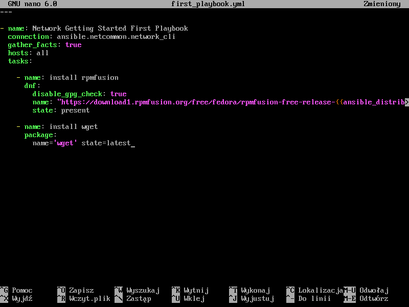

- Odpalenie playbooka powiodło się, na kliencie posiadamy najnowszy wget oraz rpm

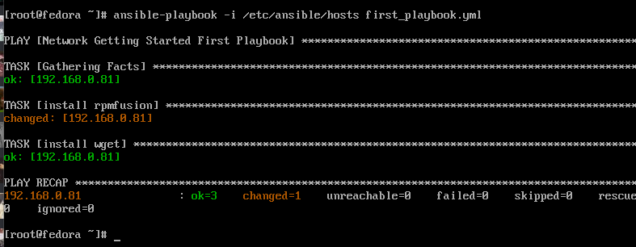

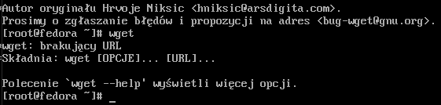

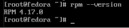
