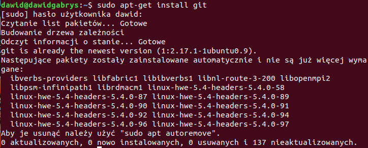
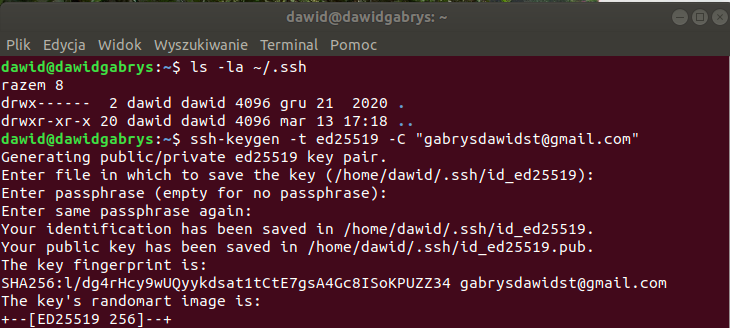
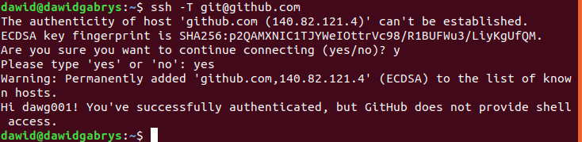
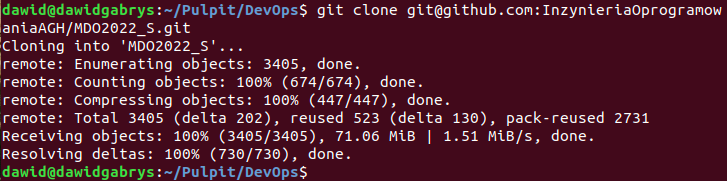
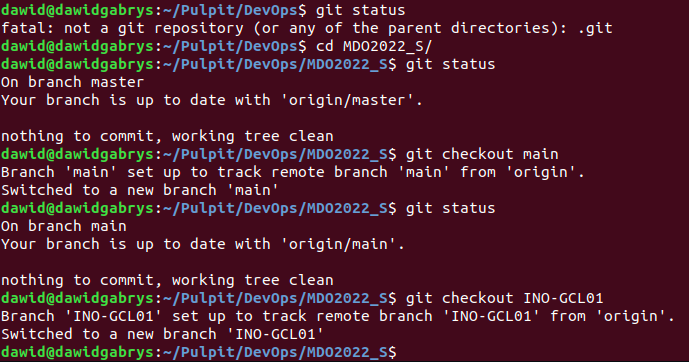
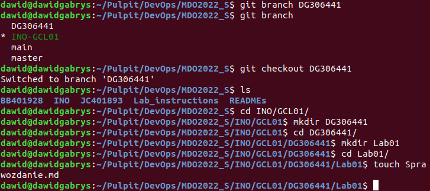
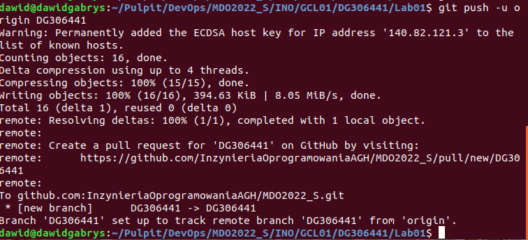

## Sprawozdanie
##### Autor: Dawid Gabryś

1. Na początku zainstalowałem klienta Git i obsługę kluczy SSH.

Git był już zainstalowany:

2. Następnie utworzyłem klucze prywatny i publiczny SSH, skonfigurowałem klucz SSH jako metodę dostępu do GitHuba oraz sklonowałem repozytorium z wykorzystaniem protokołu SSH.

Generowanie kluczy:

Pliki kluczy znajdujące się w katalogu .ssh:

Wydrukowanie w terminalu zawartość klucza publicznego SSH:

Testowanie połączenia SSH:

Pobranie repozytorium za pomocą protokołu SSH.

3. Przełączyłem się na gałąź main, następnie na gałąź grupy, i utworzyłem nową gałąź o odpowiedniej nazwie. Rozpocząłem pracę na nowej gałęzi DG306441, oraz utworzyłem nowe katalogi oraz umieściłem w katalogi Lab01 plik sprawozdania oraz zrzuty ekranu.
Przełączenie się na odpowiednią gałąź grupy:

Utworzenie nowej gałęzi, utworzenie nowych katalogów i plików:

4. Utworzyłem commit.

5. Dodałem pliki do zdalnego repozytorium.

