## Sprawozdanie
##### Autor: Dawid Gabryś

1. Na początku przygotowałem git hook.

- a) hook sprawdzający tytuł commita o nazwie ```<inicjały><numer indeksu>```:

Uruchomienie pliku commit-msg.sample:

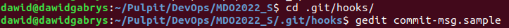

Plik commit-msg (należało zmienić nazwę usuwając .sample by zadziałał):

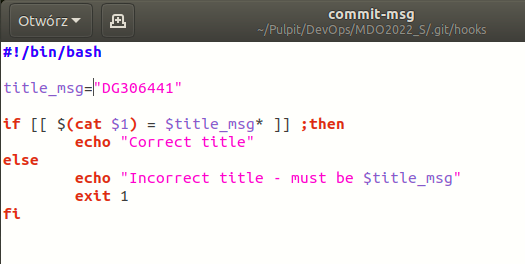

Test działania:

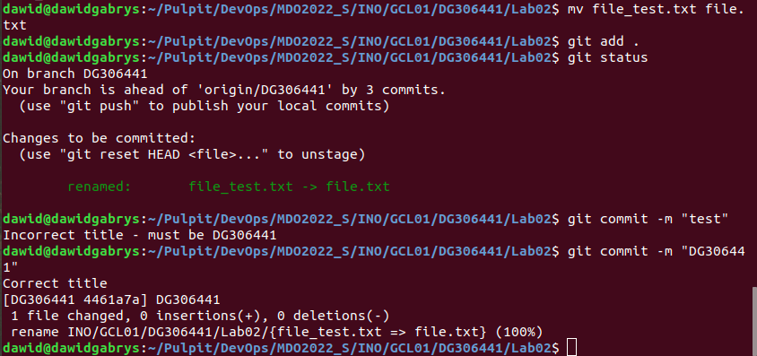

- b) hook sprawdzający treść commita:

Plik pre-commit (podobnie jak w poprzednim przypadku usuwamy .sample):

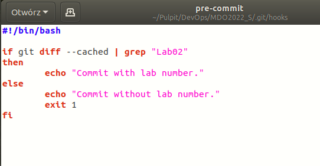

Test działania:

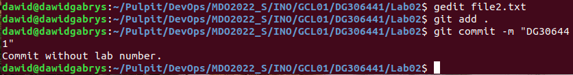

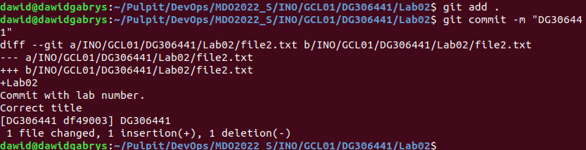

2. Następnie rozpocząłem przygotowanie środowiska Dockerowego.

Sprawdziłem adres IP:

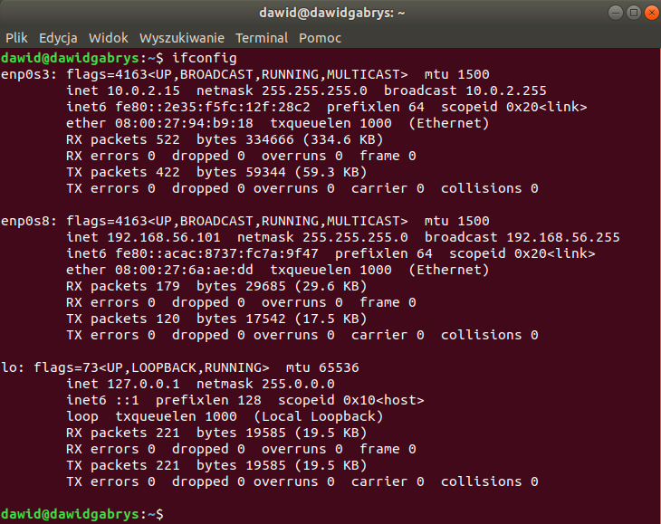

Następnie połączyłem się z VM za pomocą programu PuTTY:

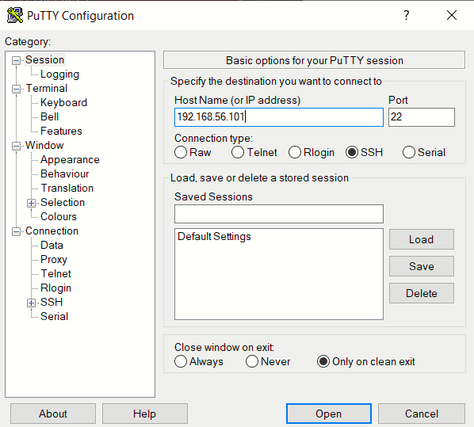

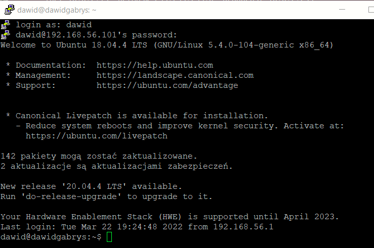

Następnie zaktualizowałem indeks pakietów i zainstalowałem odpowiednie pakiety:


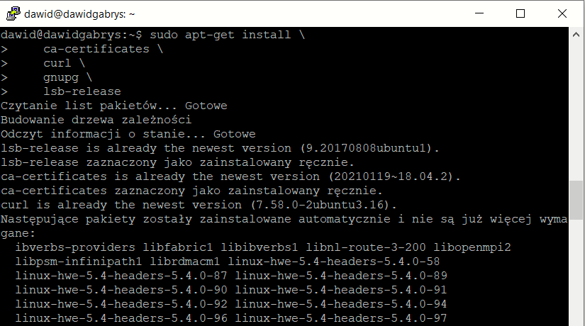

Dodałem klucz GPG Dockera:

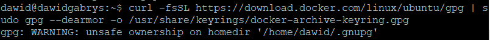

Oraz użyłem odpowiedniego polecenia żeby skonfigurować stabilne repozytorium:

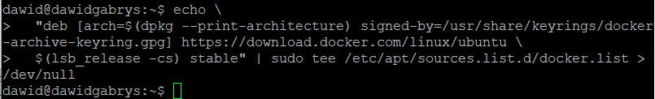

Potem ponownie zaktualizowałem pakiety i zainstalowałem ostatnią wersję Docker Engine:

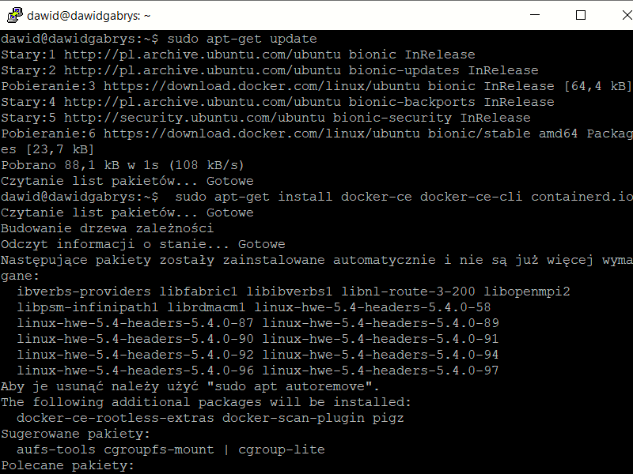

Sprawdziłem wersję Dockera:

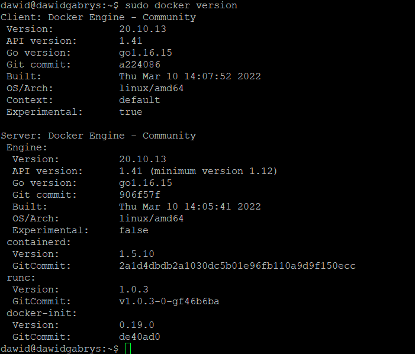

I sprawdziłem, czy środowisko jest uruchomione:

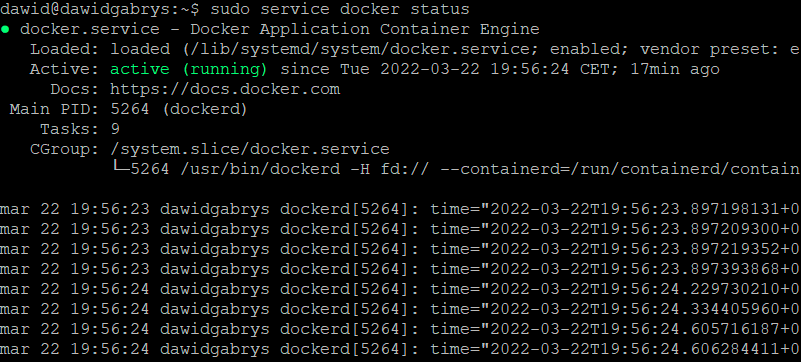

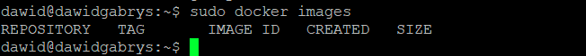

Pobrałem i zainstalowałem obraz hello-world w celu weryfikacji czy Docker Engine został pobrany prawidłowo:

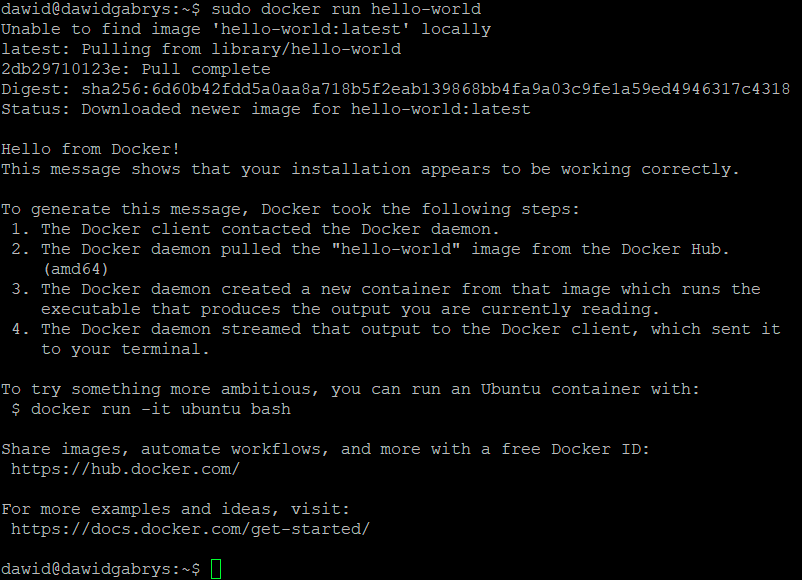

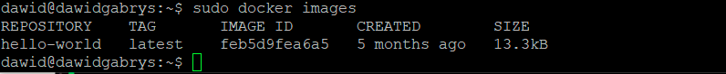

Pobrałem i zainstalowałem obraz dystrybucji linuksowej (tu: ubuntu):

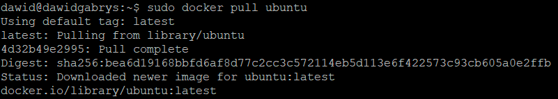

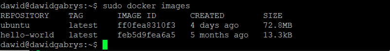

I uruchomiłem go oraz sprawdziłem wersję:

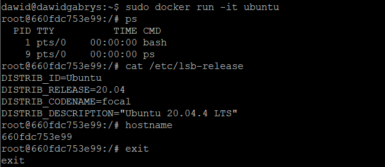

3. Założyłem konto na Docker Hub:

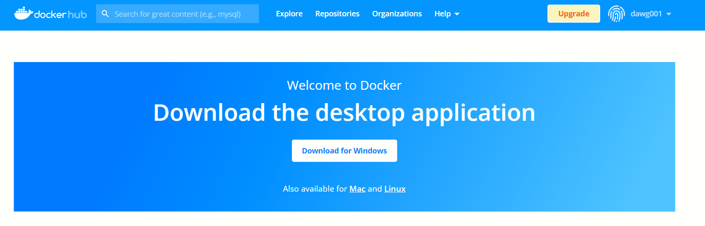