## Sprawozdanie Lab03
##### Autor: Dawid Gabryś

1. Na początku należało znaleźć repozytorium z kodem dowolnego oprogramowania, które:
- dysponuje otwartą licencją;
- zawiera Makefile;
- zawiera testy.

W tym przypadku wykorzystałem repozytorium [pod tym linkiem](https://github.com/alt-romes/programmer-calculator).

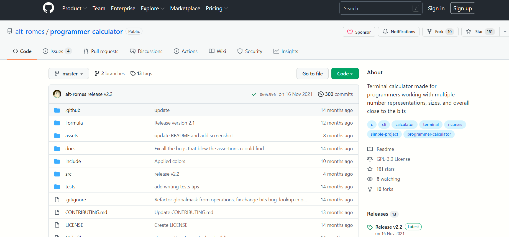

Następnie zainstalowałem odpowiednie brakujące biblioteki dla powyższego programu:

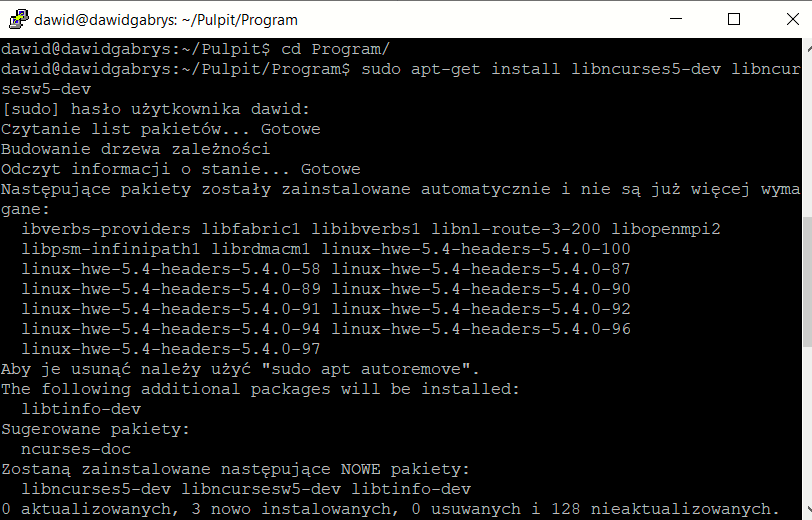

I sklonowałem repozytorium:

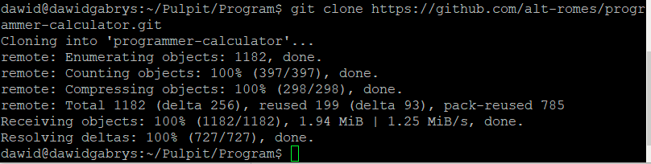

Potem przeprowadziłem build programu poleceniem ```make```:

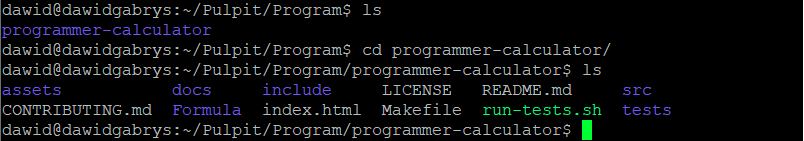

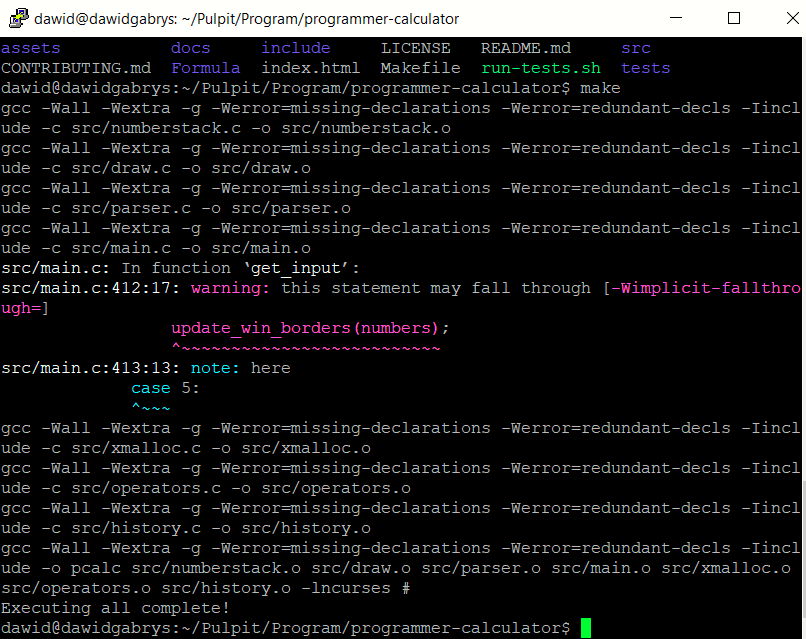

Oraz uruchomiłem testy za pomocą skryptu ```run-tests.sh``` (dodatkowo uruchomiłem sam program):

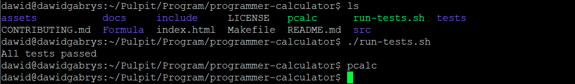

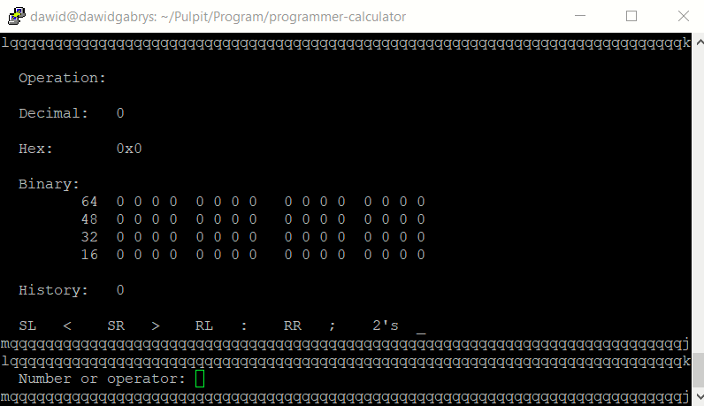

2. Moim następnym zadaniem było przeprowadzenie buildu w kontenerze. A zatem:

Sprawdziłem dostępne obrazy u mnie:

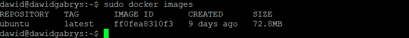

Uruchomiłem kontener:

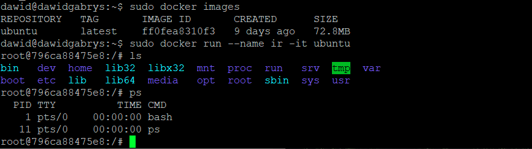

W celu użycia ```git clone``` musiałem zainstalować gita:

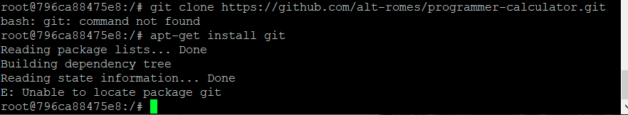

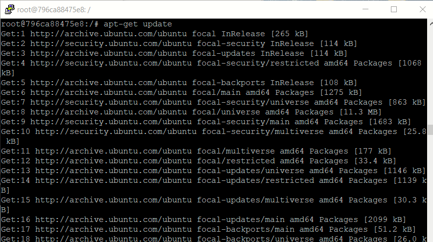

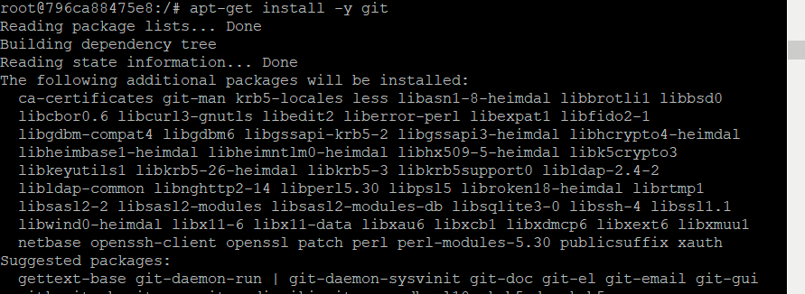

Sklonowałem repozytorium:

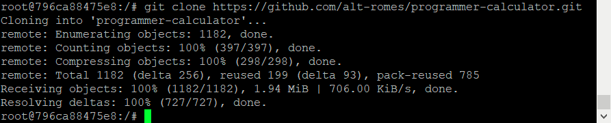

Oraz przeprowadziłem próbę uruchomienia buildu i testów. W tym celu musiałem:
- zainstalować ```make```:

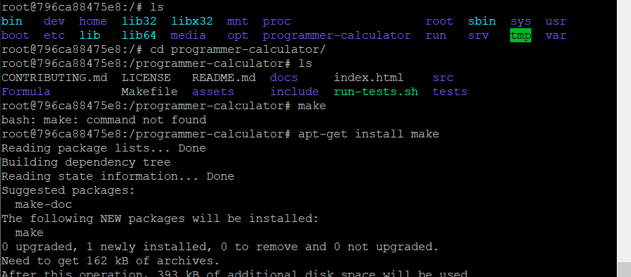

- ```gcc```:

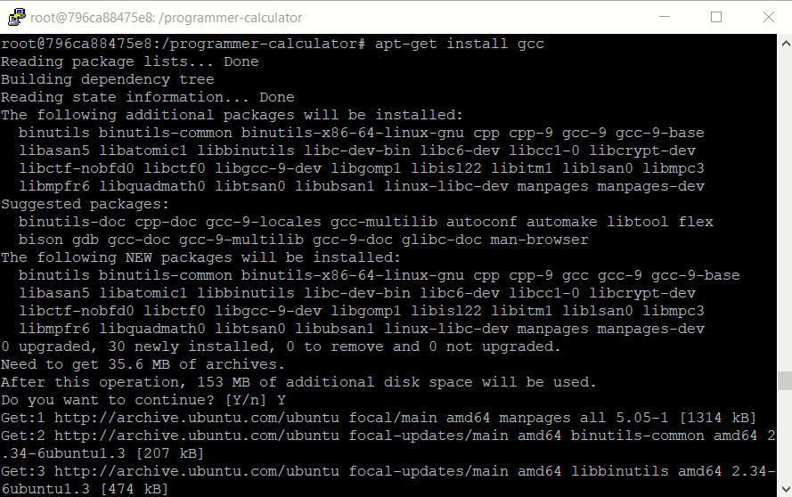

- oraz potrzebne biblioteki:

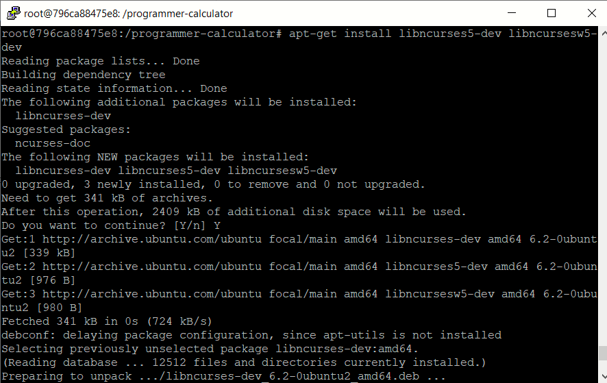

Po wszystkim uruchomiłem build programu poleceniem ```make```:


Oraz uruchomiłem testy:

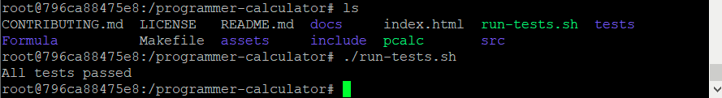

3. Następnym zadaniem było utworzenie dwóch plików ```Dockerfile``` automatyzujących kroki wykonane wcześniej. A zatem:

Utworzyłem plik o nazwie ```DockerFile1``` oraz umieściłem w nim odpowiednie polecenia:

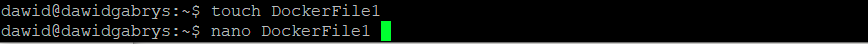

Zawartość pliku ```DockerFile1```:

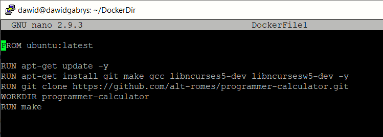

Następnie utworzyłem obraz z pliku ```DockerFile1```:

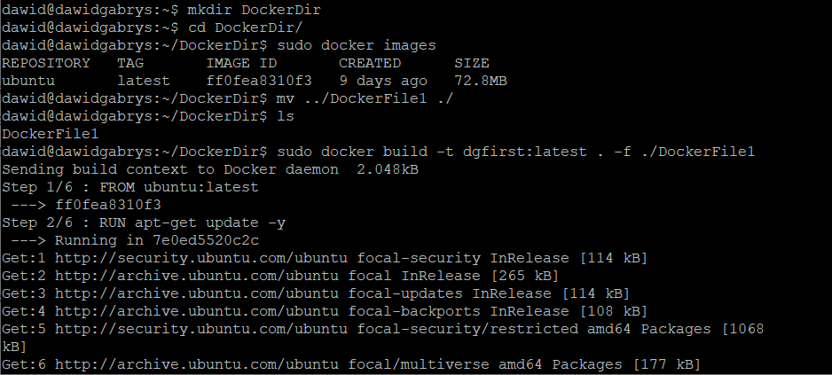

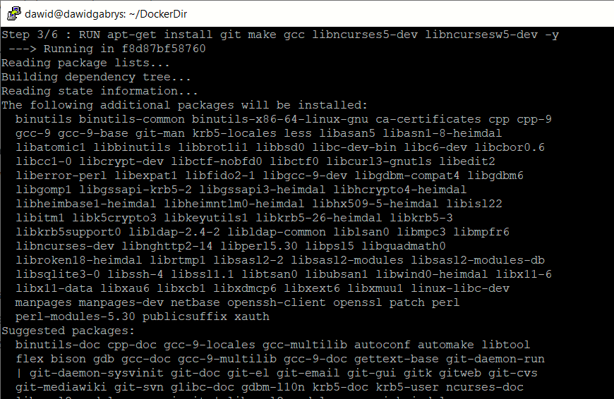

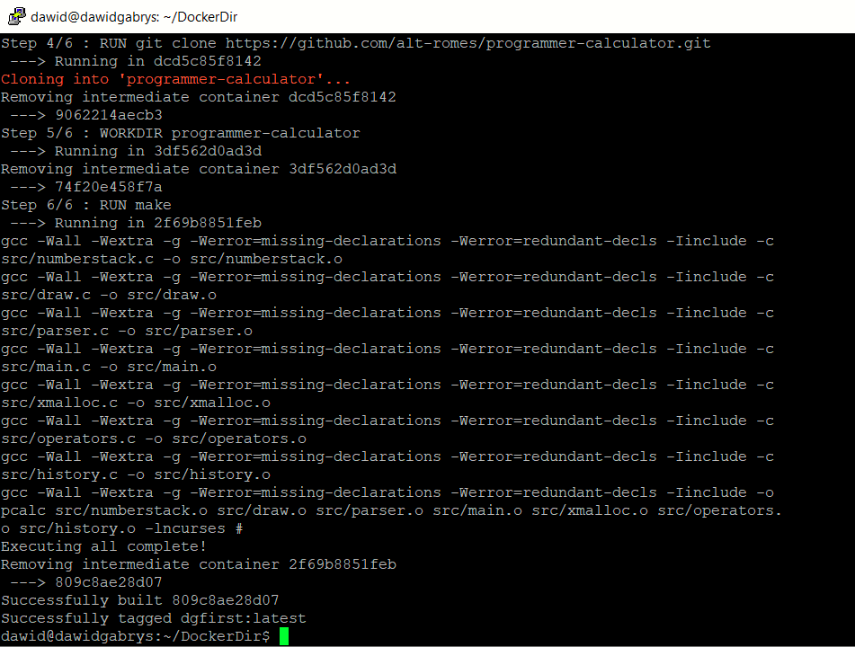

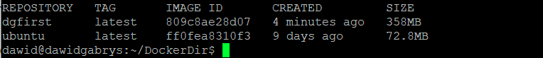

Potem utworzyłem drugi plik ```Dockerfile``` o nazwie ```DockeFile2```. Zawartość pliku ```DockerFile2```:

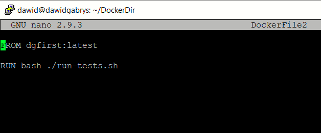

Ponownie utworzyłem obraz z pliku ```DockerFile2```:

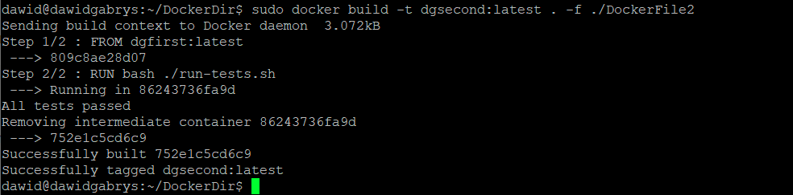

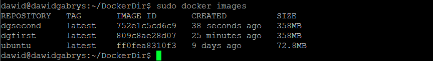
