## Sprawozdanie Lab04
##### Autor: Dawid Gabryś

1. Na początku przygotowałem 2 woluminy: wejściowy ```volume1``` i wyjściowy ```volume2```:

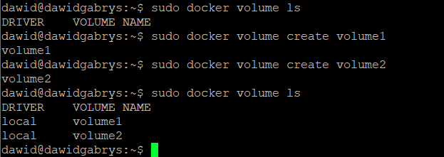

Następnie podłączyłem je do kontenera i sprawdziłem występowanie:

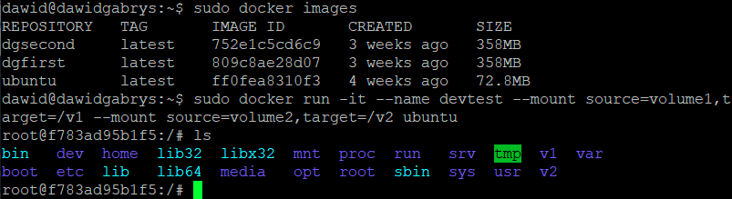

Za pomocą poniższego polecenia sprawdziłem ścieżkę (poza tym wyświetlono również inne dane dotyczące odpowiedniego woluminu):

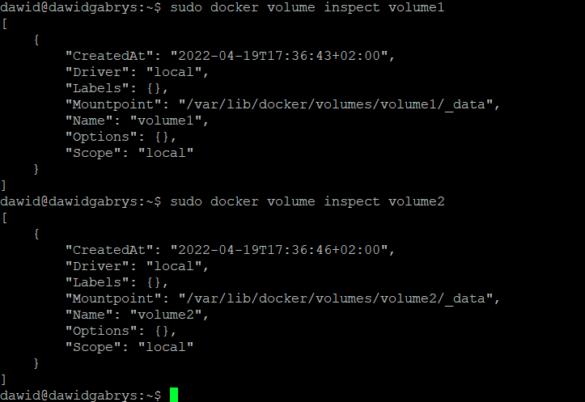

Potem chciałem sklonować repozytorium. Ze względu na brak dostępu:

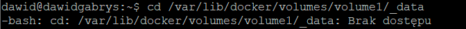

Wykonałem polecenie z uprawnieniami administratora:

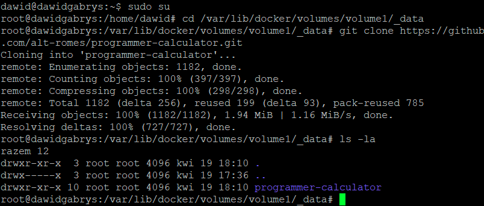

Ponownie uruchomiłem kontener, sprawdziłem zawartość ```v1``` i zainstalowałem odpowiednie programy i biblioteki, bez gita:

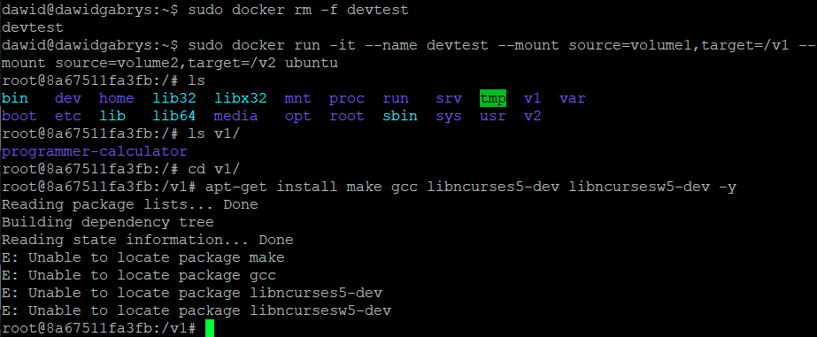

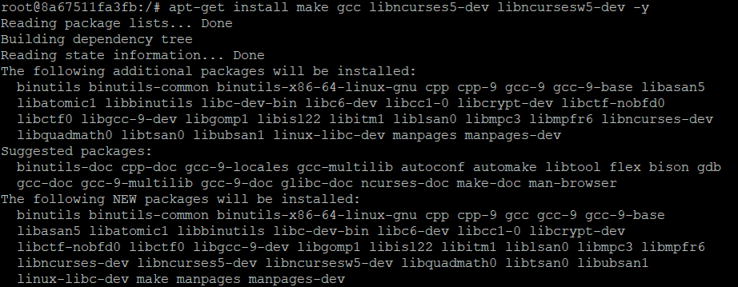

Uruchomiłem build w kontenerze:

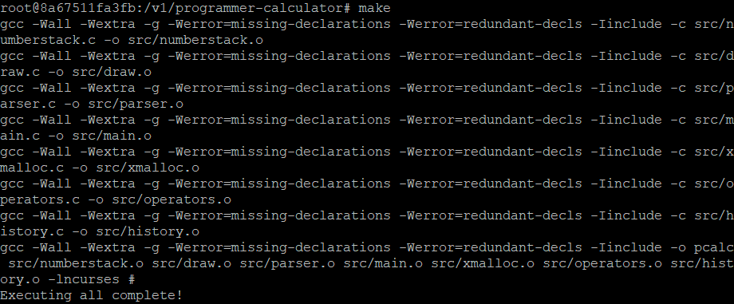

Przeniosłem plik wykonywalny do wolumina wyjściowego i uruchomiłem go:

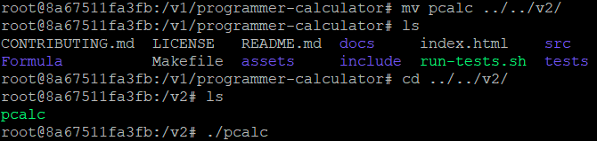

2. Następnie przeszedłem do etapu eksponowania portu. W tym celu:

Pobrałem obraz dockerowy i uruchomiłem go:

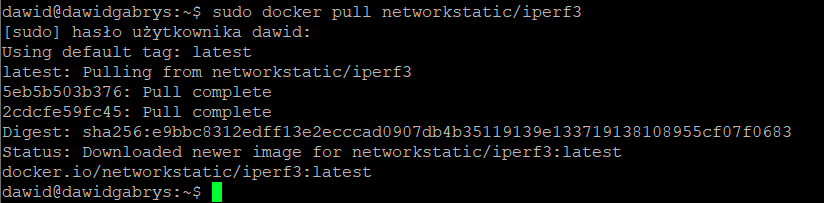

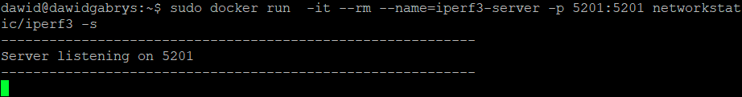

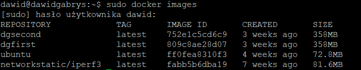

Zainstalowałem ```iperf3```:

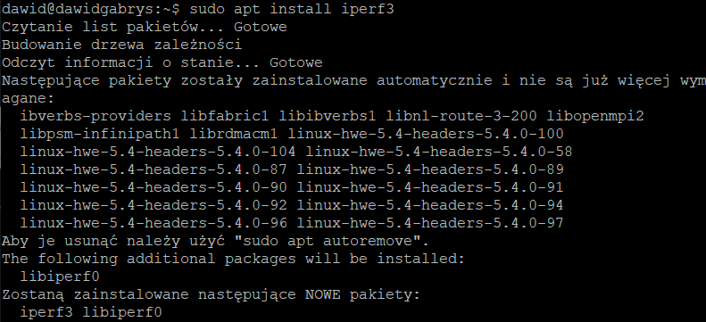

Następnie uzyskałem adres IP serwera:

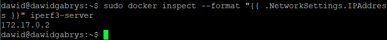

Oraz zainicjowałem połączenie klienta z innego kontenera:

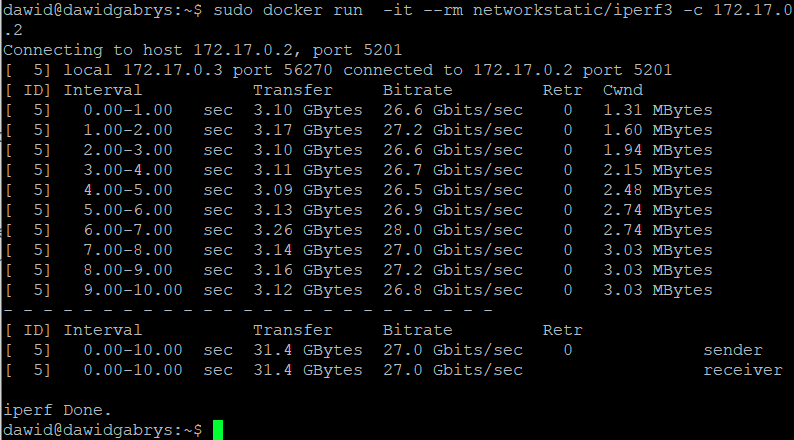

Potem połączyłem się spoza kontenera (z hosta i spoza hosta):

Z hosta:

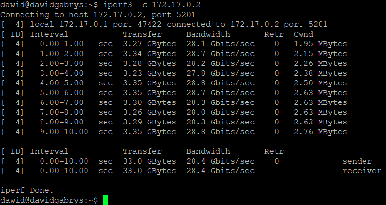

Spoza hosta:

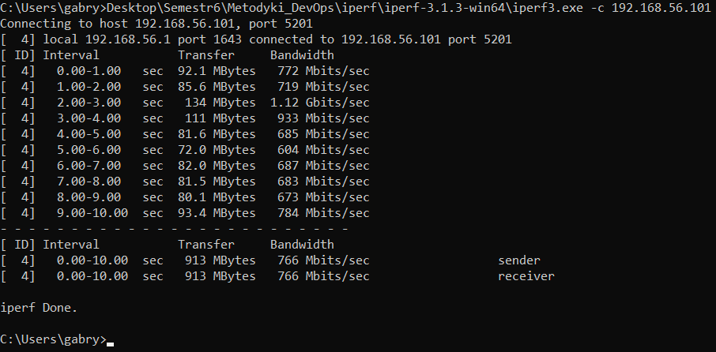

Wszystkie uzyskane wyniki (wzięte z pierwszego uruchomionego kontenera):

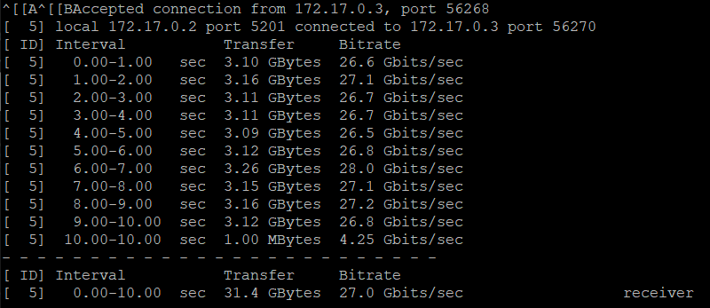

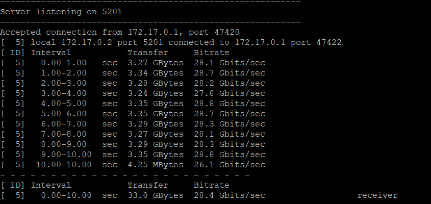

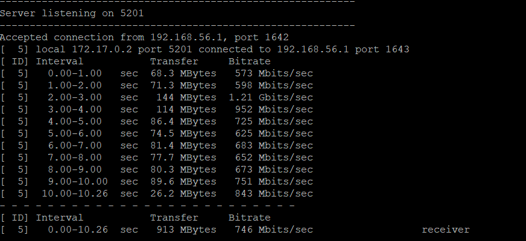

Wyniki transferu uzyskane dla połączenia z drugiego kontenera oraz spoza kontenera z hosta są dosyć podobne. Natomiast transfer danych dla połączenia spoza kontenera spoza hosta jest wyraźnie mniejszy.

 

3. Instalacja Jenkins. Na początku, po zapoznaniu się z dokumentacją, przeprowadzono instalację:

Utworzono most (network bridge):

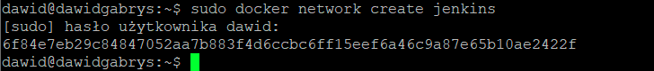

Pobrano i uruchomiono obraz docker:dind:

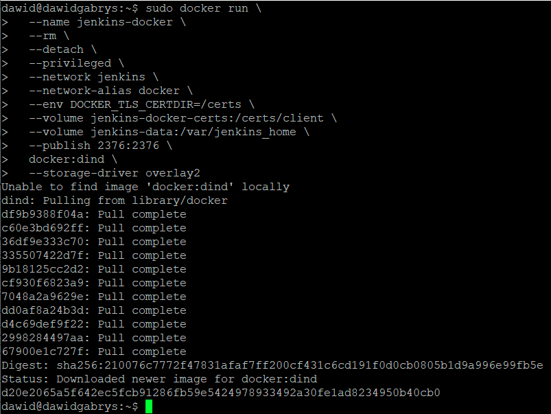

Utworzono plik Dockerfile i umieszczono w nim odpowiednie kroki do wykonania:

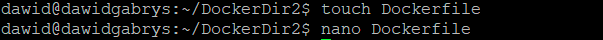

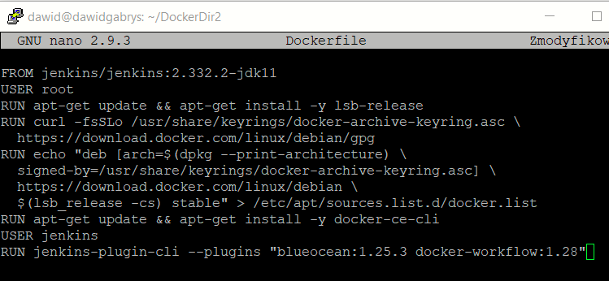

Potem zbudowano nowy obraz dockera z pliku Dockerfile oraz przypisano mu nazwę:

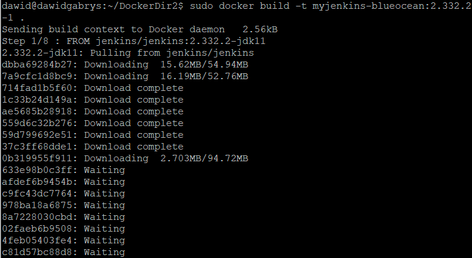

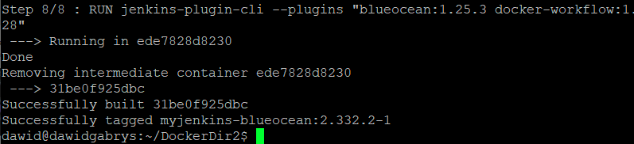

Uruchomiono obraz używając poniższego polecenia:

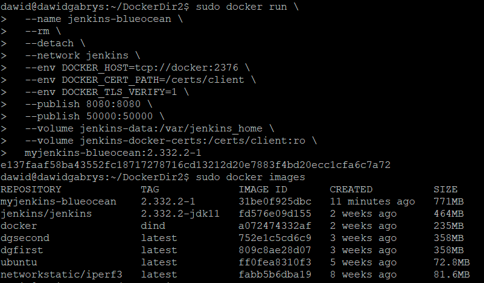

Następnie wchodząc na ```localhost:8080``` odblokowałem za pomocą hasła Jenkinsa:

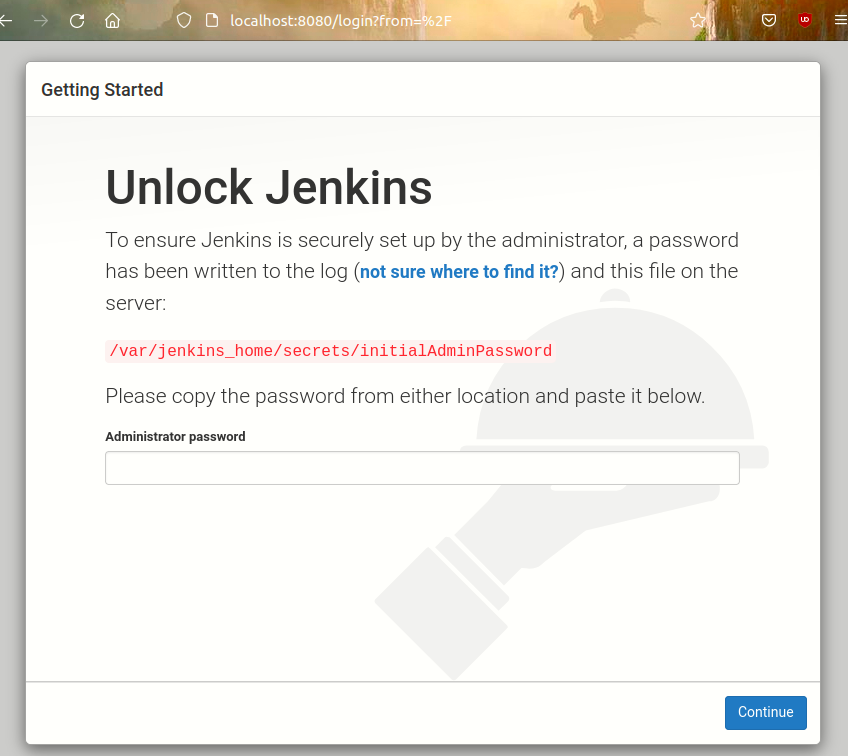

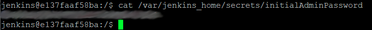

Zainstalowano domyślnie wtyczki:

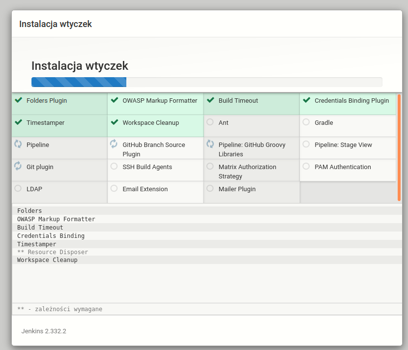

W celu wykazania działających kontenerów wykonałem poniższe polecenie:

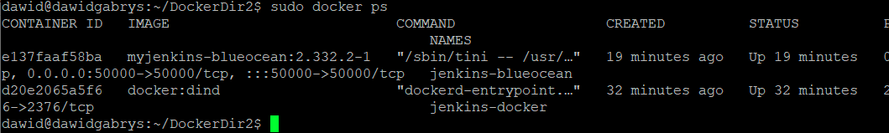

Oraz pokazałem stronę logowania:

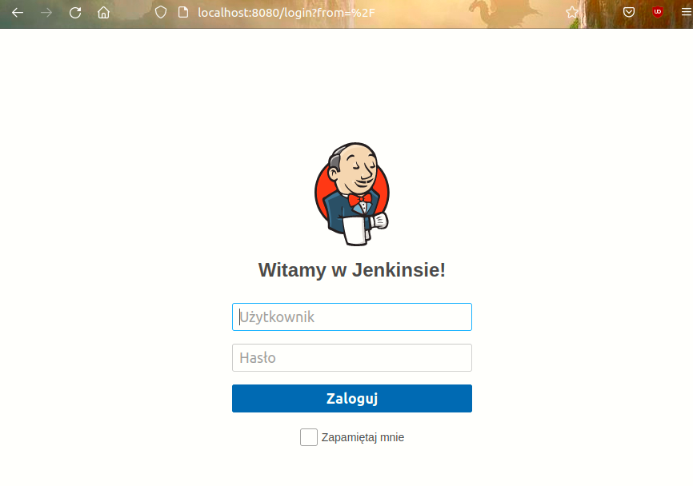
