## Sprawozdanie Lab09
##### Autor: Dawid Gabryś

1. Na początku przygotowałem maszynę wirtualną w ```VirtualBox```. Ustalono następujące parametry:

Nadałem nazwę oraz typ i wersję systemu:

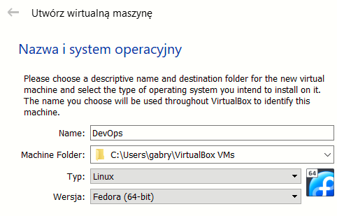

Ilość pamięci RAM:

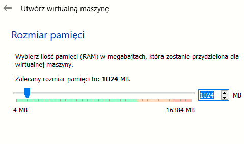

Utworzyłem wirtualny dysk twardy:

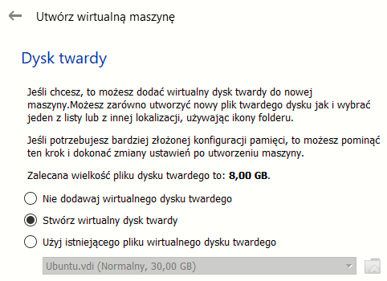

Wybrałem typ pliku z wirtualnym dyskiem na ```VHD```:

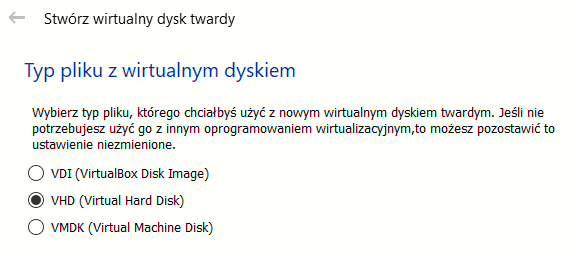

Oraz ustawiłem dynamicznie przydzielany plik twardego dysku. Następnie wybrałem lokalizację pliku dysku twardego oraz jego rozmiar na 16 GB:

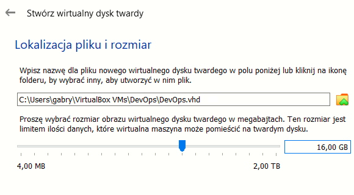

Podłączyłem obraz systemu Fedora:

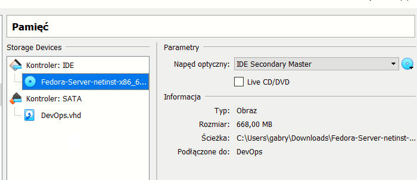

I uruchomiłem maszynę wirtualną. Po wybraniu opcji ```Install Fedora 36``` nastąpił etap konfiguracji i instalacji.

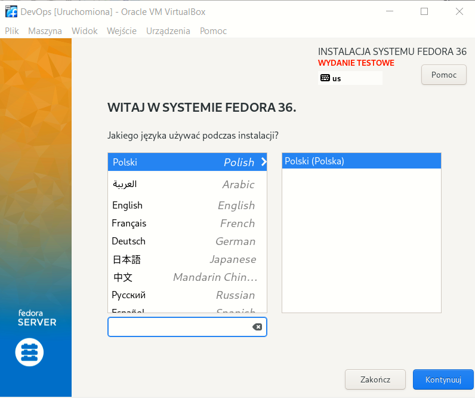

Ustawiłem język angielski i polską klawiaturę oraz przeszedłem do ustawień partycji:

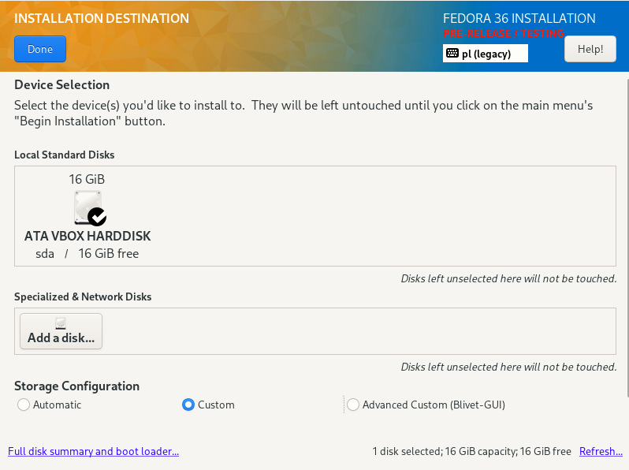

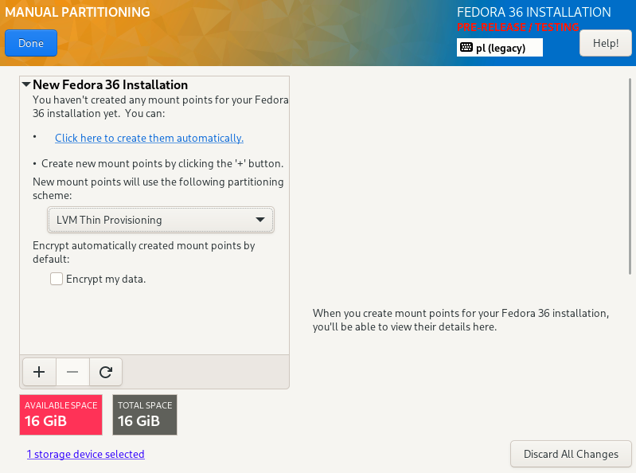

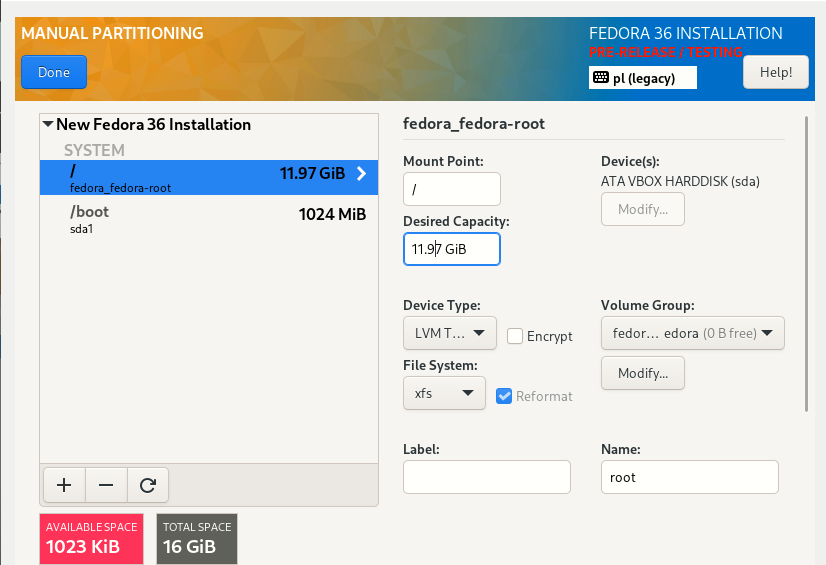

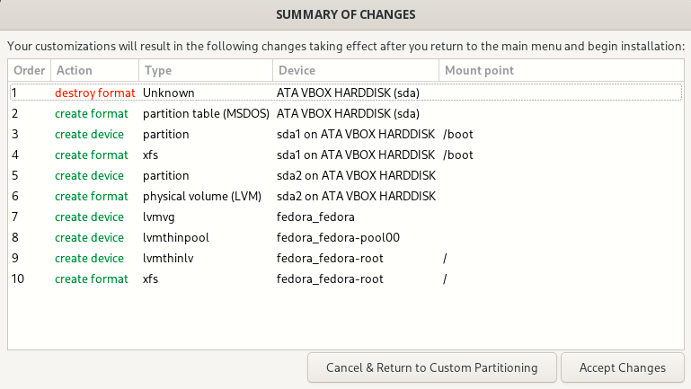

Utworzyłem konto dla roota:

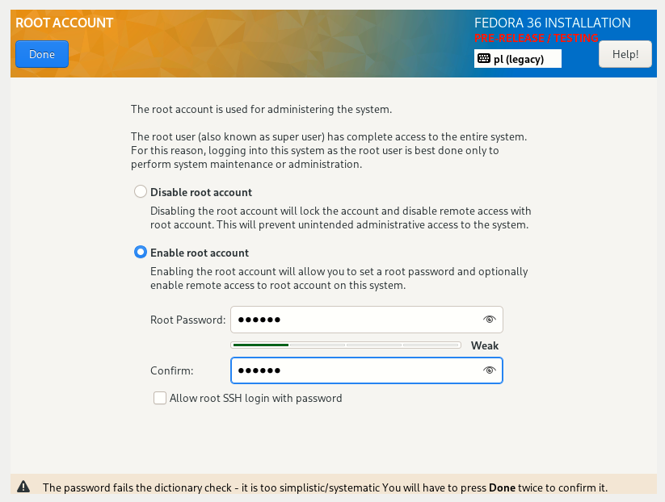

I użytkownika:

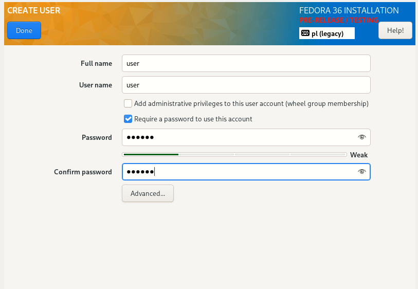

Wybrałem podstawowy zbiór oprogramowania:

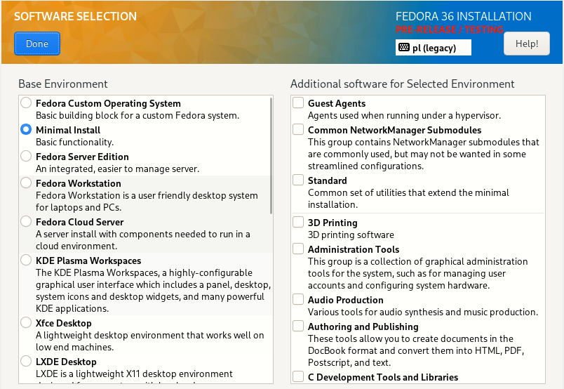

Skonfigurowałem sieć:

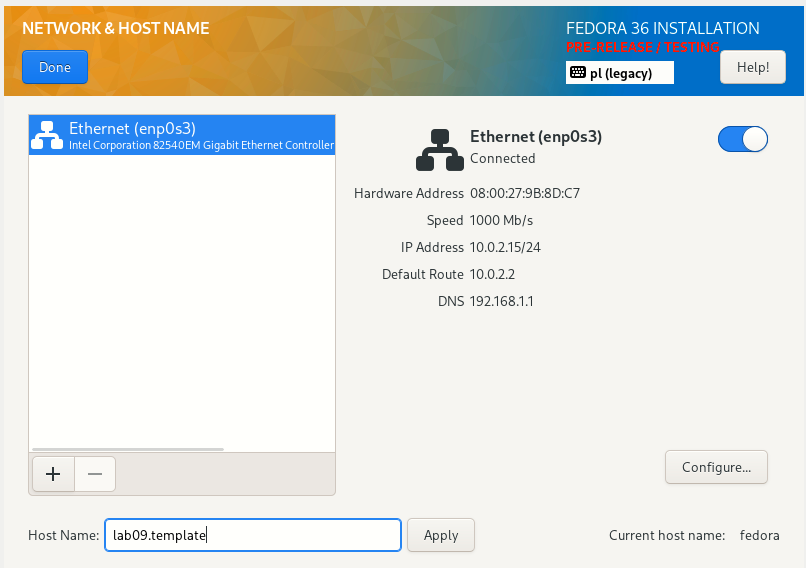

I uruchomiłem instalację. Uzyskany rezultat po instalacji:

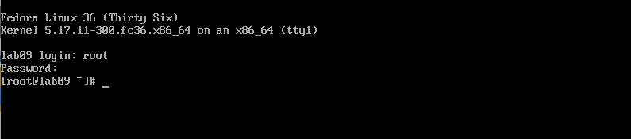

2. Zlokalizowałem i wypisałem plik odpowiedzi:

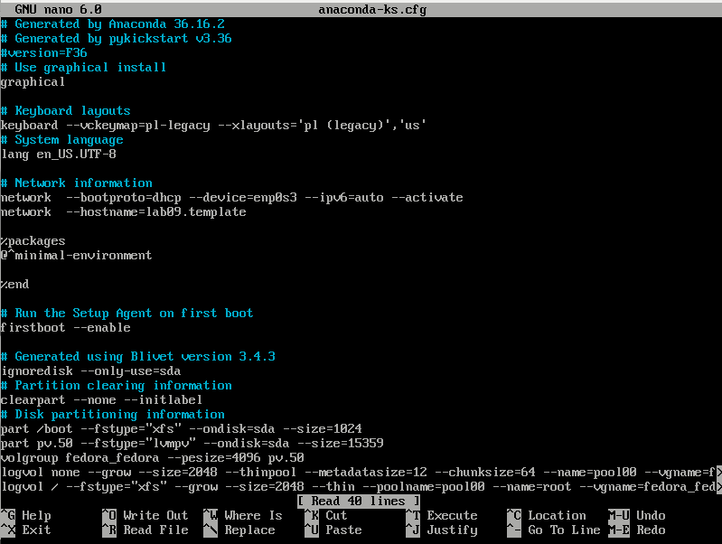

Zmodyfikowałem plik odpowiedzi dodając do niego:

- repozytoria:

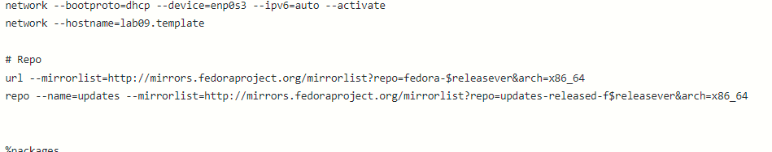

- sekcję ```%post```:

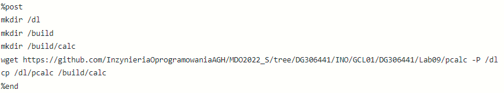

Plik ```anaconda.ks``` przesłałem na GitHub.

3. Przeprowadziłem drugą instalację systemu Fedora z użyciem pliku odpowiedzi.

Przy uruchamianiu pierwszy raz VM kliknąłem przycisk ```TAB``` i wpisałem:

inst.ks=https://raw.githubusercontent.com/InzynieriaOprogramowaniaAGH/MDO2022_S/DG306441/INO/GCL01/DG306441/Lab09/anaconda.ks

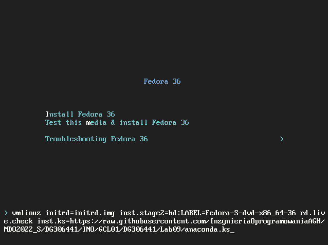

Po wciśnięciu przycisku ```ENTER``` uruchomiłem proces instalacji Fedory:

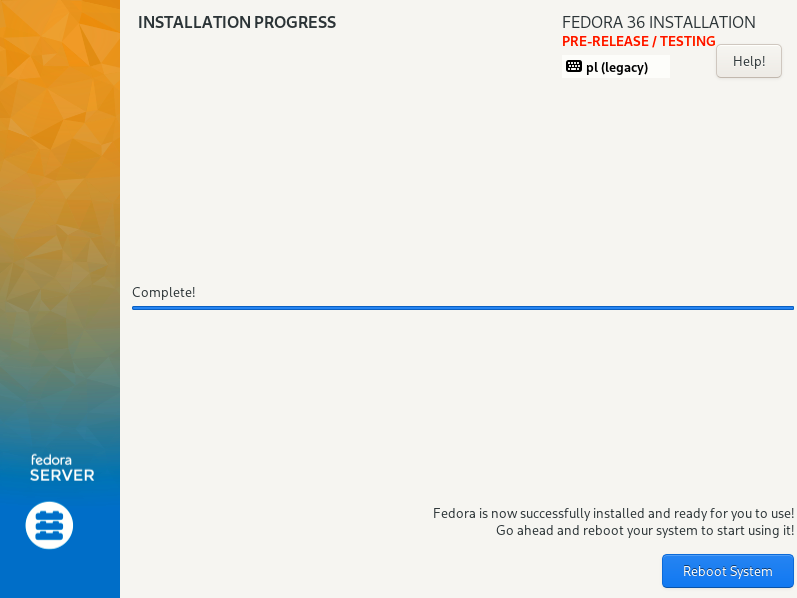

4. Na koniec połączyłem plik odpowiedzi z ISO. W tym celu wykonano poniższe kroki:

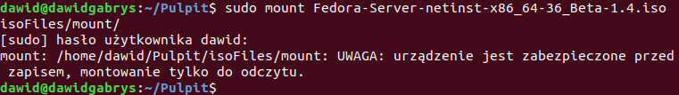


Dodałem ```ks=anaconda.ks``` na koniec linii w pliku ```isolinux.cfg```:


Oraz utworzyłem nowy obraz ISO:

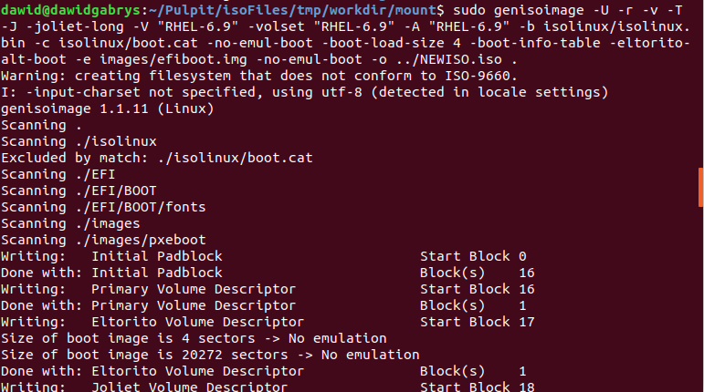

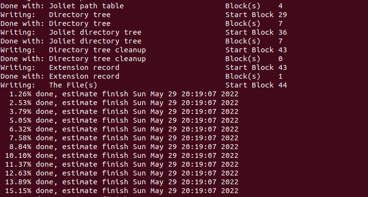

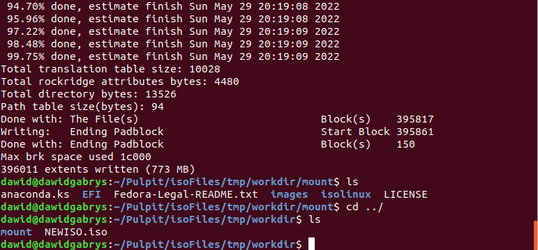
