# Sprawozdanie

### Imię i nazwisko: Dawid Gabryś
### Kierunek: Inżynieria Obliczeniowa

### Temat: Przygotowujemy pipeline.


Celem zadania było przygotowanie pipeline’a z użyciem narzędzia Jenkins, to znaczy:
- przygotowanie procesu budującego program (Build) i testującego go (Test);
- przygotowanie procesu wdrożenia (Deploy);
- zdefiniowanie artefaktu i przygotowanie procesu publikacji (Publish).

Ogólnie rzecz ujmując, wykorzystany przeze mnie program:

https://github.com/alt-romes/programmer-calculator

należało poddać etapowi budowania (czyli zainstalowania odpowiednich programów i bibliotek, kompilacja i uzyskanie efektu builda, czyli programu wykonywalnego ```pcalc```), testowania (uruchomienia skryptu odpowiedzialnego za testy), wdrożenia (przeniesienie programu wykonywalnego do osobnego kontenera i uruchomienie go w nim) i publikacji (spakowanie pliku do ```.tar``` i przeniesienie do woluminu). 

Na początku aby w ogóle rozpocząć pracę nad procesem należało uruchomić kontener Jenkinsa oraz kontener DIND. Sama ich instalacja wymagała zapoznania się z tym poradnikiem:

https://www.jenkins.io/doc/book/installing/docker/ 

Kontenery należało uruchomić Na początku wpisano polecenie ```sudo service docker start```. Zrobiono to następującymi poleceniami:

Uruchomienie DIND:

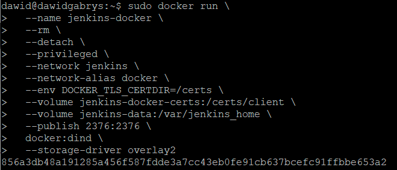

Uruchomienie Jenkins:

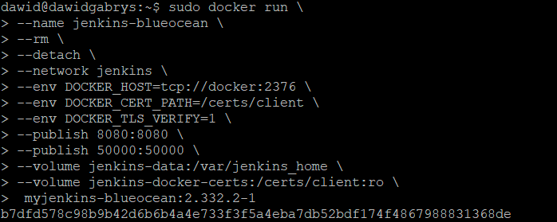

DIND umożliwia uruchomienie kontenera w kontenerze, natomiast Jenkins to narzędzie do automatyzacji procesu tworzenia oprogramowania. 

Po wpisaniu w przeglądarkę ```localhost:8080``` następuje połączenie się z Jenkinsem. 

W celu weryfikacji czy kontenery działają wpisano polecenie ```sudo docker ps```:

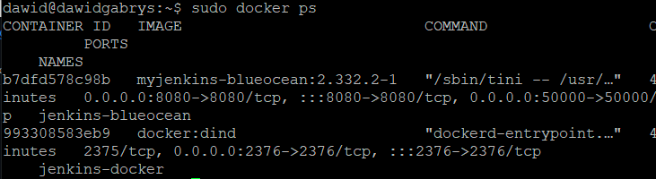

Tworzenie pipeline.

Po połączeniu się z Jenkins należało utworzyć nowy projekt jako ```Pipeline```.

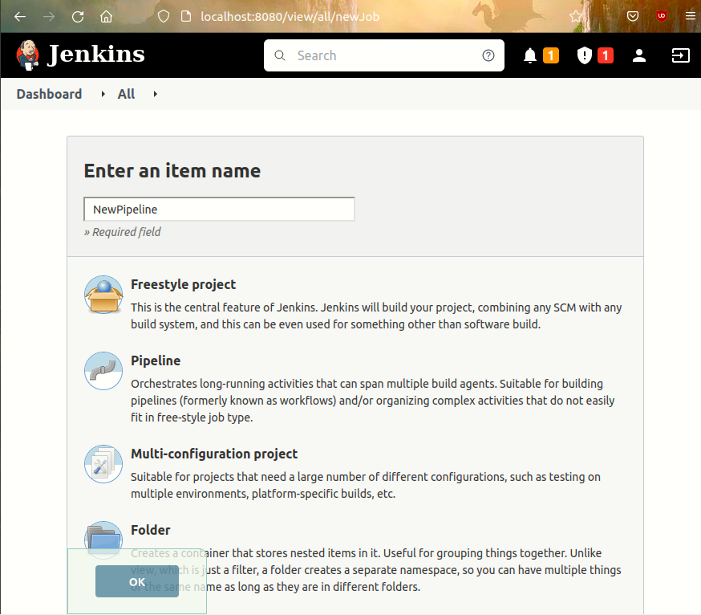

Następnie należało ustawić odpowiednie parametry pipeline’a. A zatem:
- dodano 2 parametry: ```Name``` i ```Version``` w celu nadania nazwy i wersji;


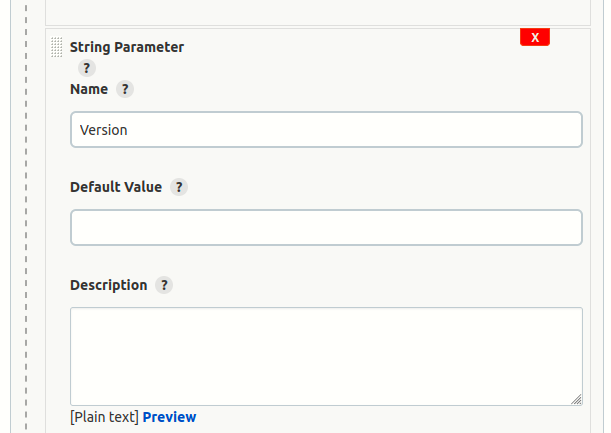

- ustawiono Definition na ```Pipeline script from SCM```, ```SCM``` ustawiono na ```Git```, podano adres repozytorium, wybrano gałąź oraz ustawiono lokalizację pliku ```JenkinsFile```.

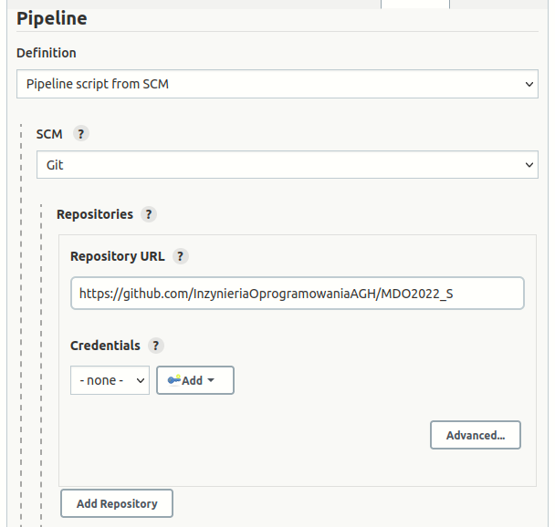

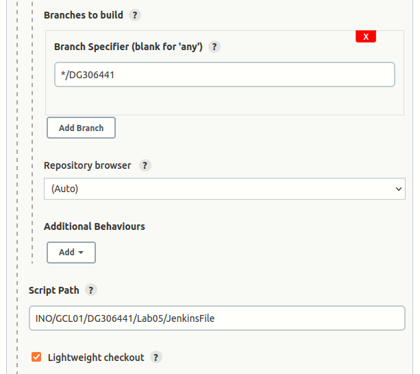

Po ustawieniu odpowiednich parametrów rozpoczęto proces przygotowywania procesów budowania, testowania, wdrożenia i publikacji. 

Etap Build:

Kod ```JenkinsFile```:

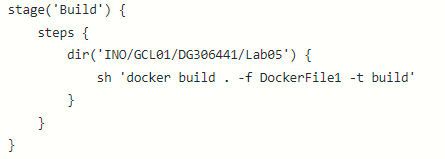

Kod ```DockerFile1```:

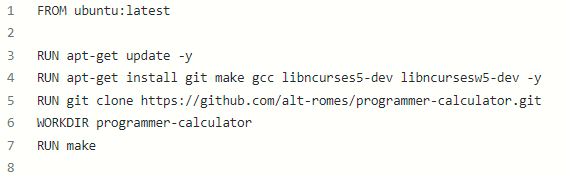

Etap składa się z utworzenia obrazu ```build```. Obraz ten opiera się na obrazie ```ubuntu```; Następnie aktualizowane jest ```ubuntu``` i instalowane są odpowiednie programy i biblioteki. Następnie następuje klonowanie repozytorium, przejście do odpowiedniego katalogu i uruchomienie programu ```make```  w celu kompilacji programu. Wynikiem builda był plik wykonywalny ```pcalc```. Wydruk konsoli prezentuje się następująco:

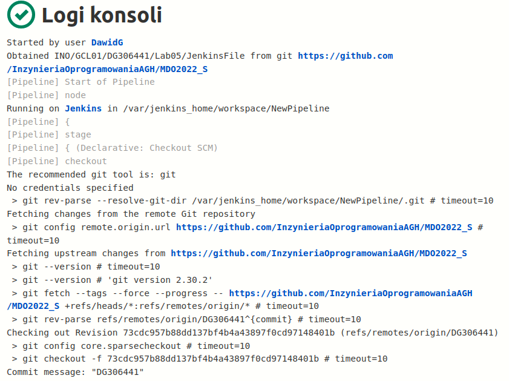

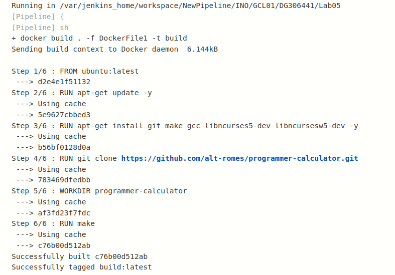

Etap Tests:

Kod ```JenkinsFile```:

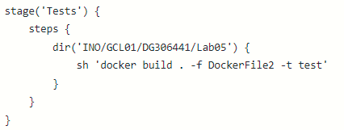

Kod ```DockerFile2```:

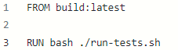

Etap ten składał się z przeprowadzenia testów. Utworzony obraz bazuje na obrazie ```build```. Następnie wykonywane są testy. Wydruk konsoli prezentuje się następująco:

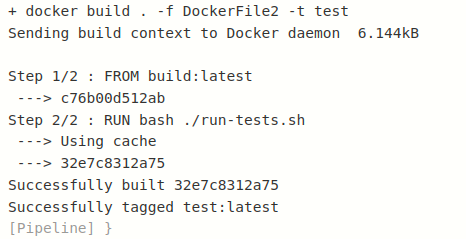

Etap Deploy:

Kod ```JenkinsFile```:

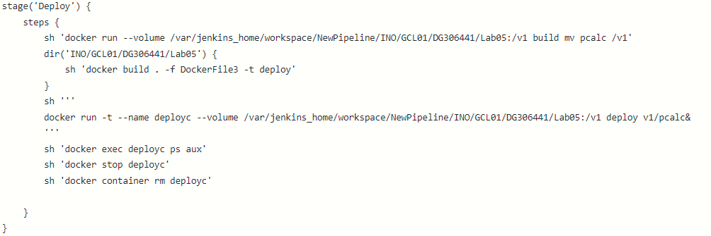

Kod ```DockerFile3```:


Etap ten składał się z przeprowadzenia wdrożenia. W tym celu uruchomiono obraz ```build``` z woluminem i przeniesiono do niego plik wykonywalny ```pcalc```, będący wynikiem builda. Następnie utworzono obraz ```deploy```, bazujący na obrazie ```ubuntu```. Potem uruchomiono ```deploy``` z woluminem w celu uruchomienia programu i sprawdzenia, czy działa. Na początku napotkano problem, że program nie chciał uruchomić się, gdyż wymagał on do działania terminal.

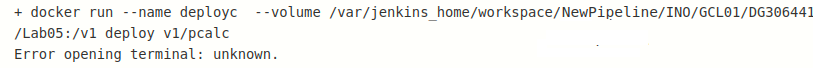

W tym celu należało podać parametr ```-t```. Jednak następnie znowu był problem, gdyż Pipeline nie chciał się zakończyć, gdyż program był uruchomiony. W tym celu uruchomiono program w tle, to znaczy dodano ```&``` na końcu nazwy programu ```pcalc```. Dzięki temu Pipeline mógł się zakończyć. Dodano również polecenie ```ps aux```, żeby udowodnić działanie programu. Wydruk konsoli prezentuje się następująco:

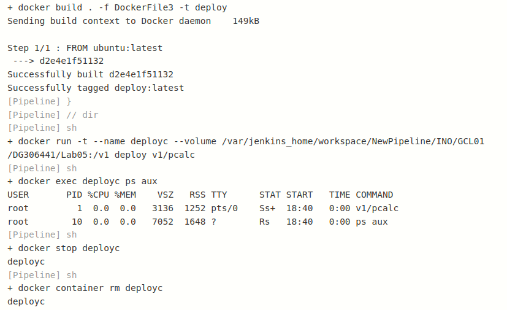

Etap Publish:

Kod ```JenkinsFile```:

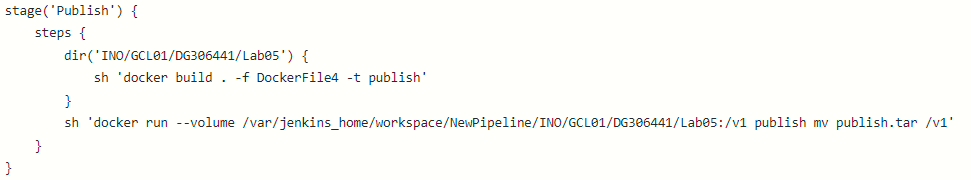

Kod ```DockerFile4```:

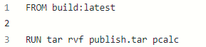

Etap ten składał się z przeprowadzenia etapu przygotowania pliku do publikacji. W tym celu utworzono obraz ```publish``` bazujący na ```build```, zapakowano plik ```pcalc``` jako archiwum ```.tar```. Na koniec przeniesiono plik do woluminu. Niestety ze względu na problemy związane ze zmiennymi ustalono na sztywno nazwę archiwum na ```publish.tar```. Wydruk konsoli prezentuje się następująco:

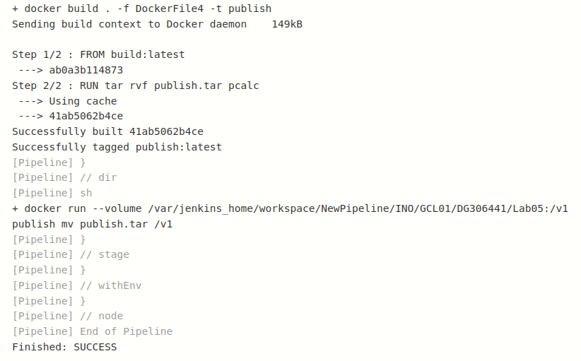

Odpowiednie pliki ```Dockerfile``` i ```JenkinsFile``` zostały umieszczone przeze mnie w katalogu ```Lab05``` w repozytorium.

Na koniec zrzut ekranu przedstawiający ostatni ```Stage View```:

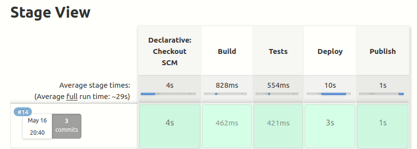