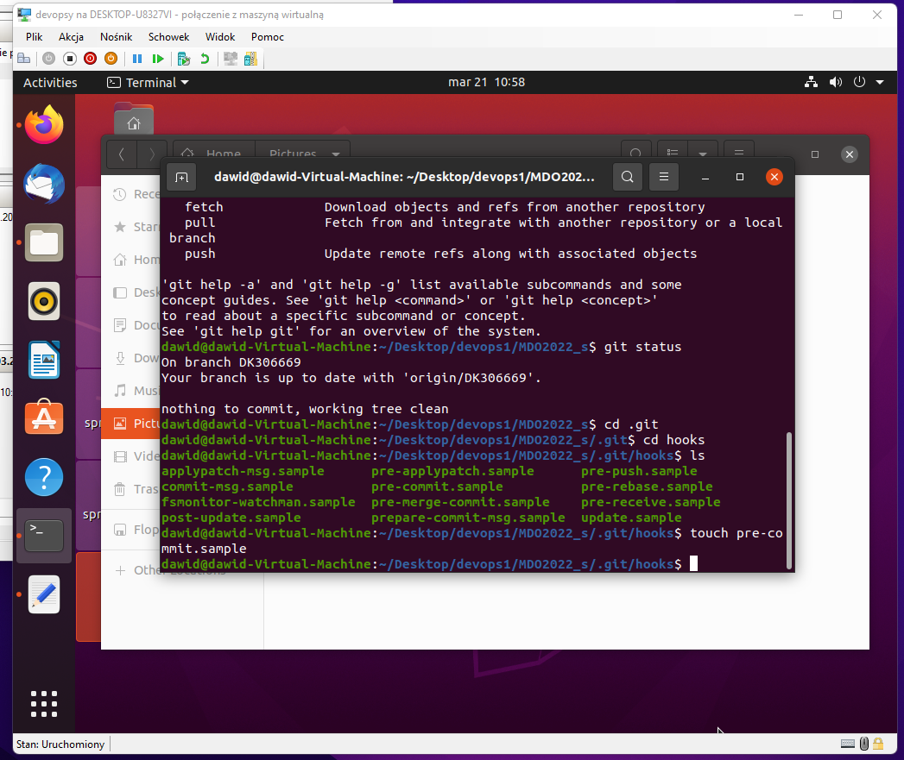
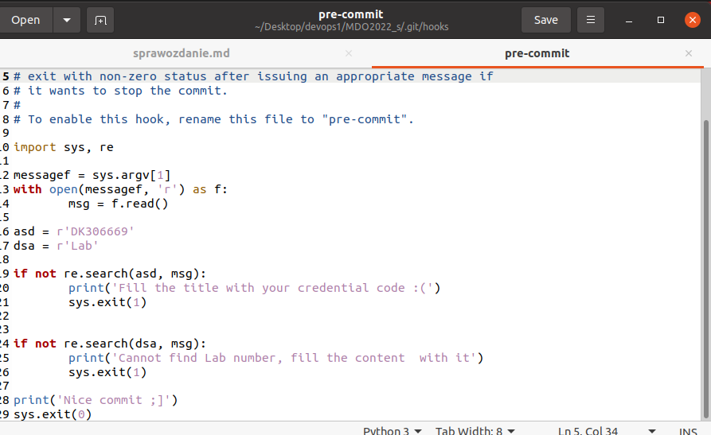
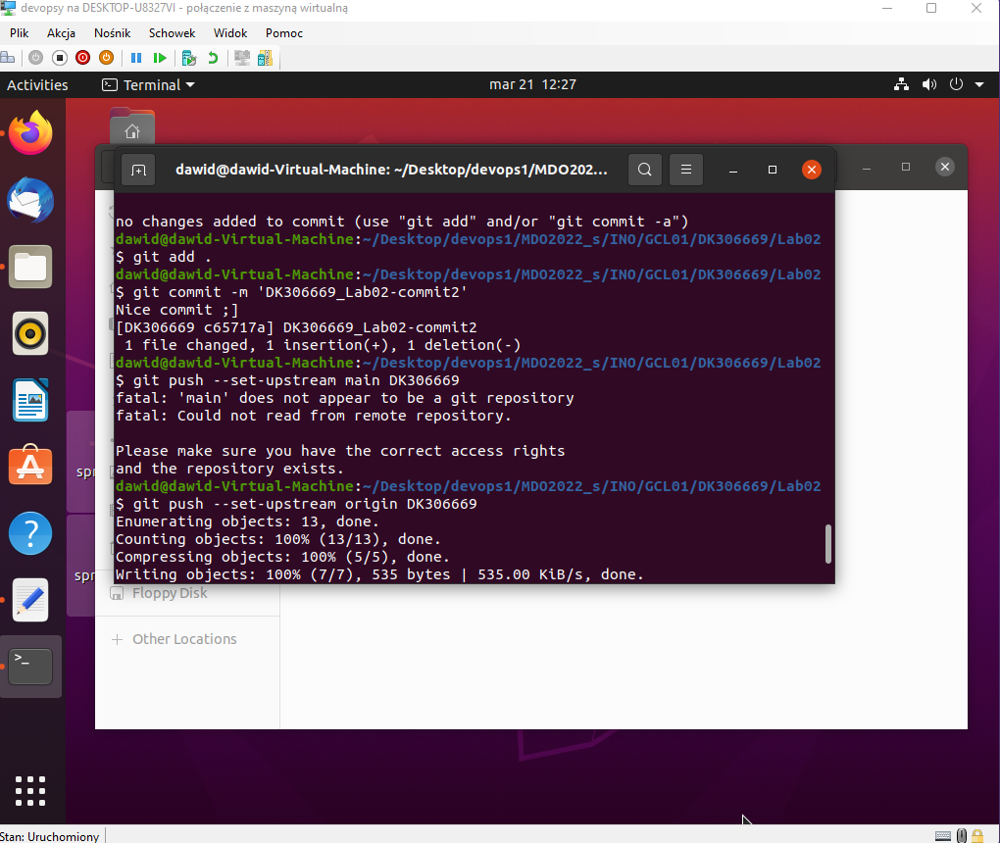
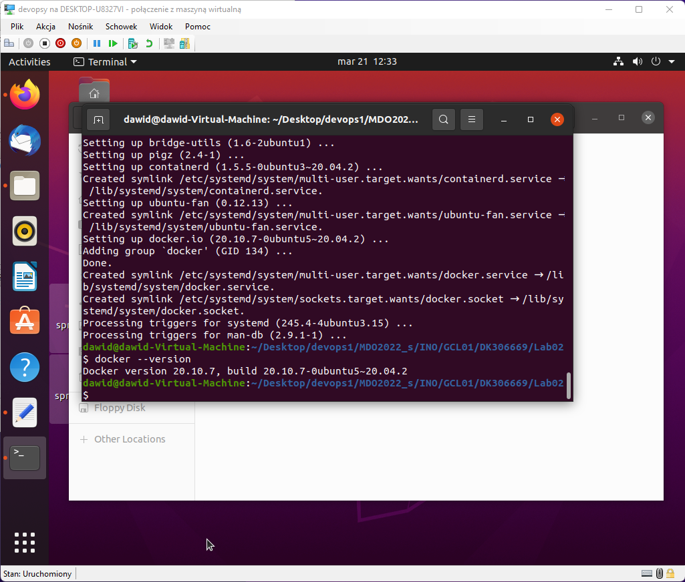
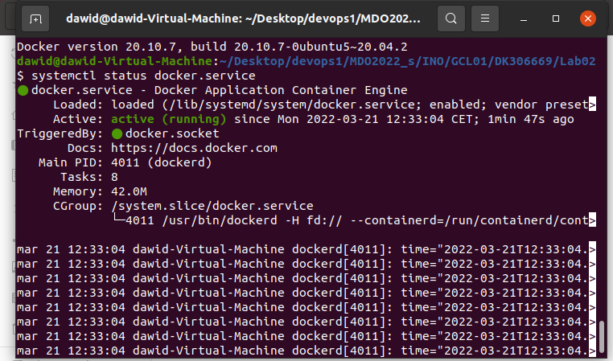
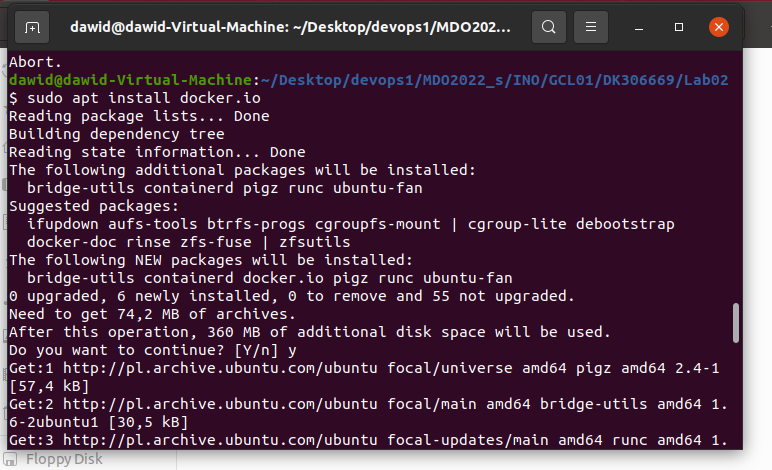
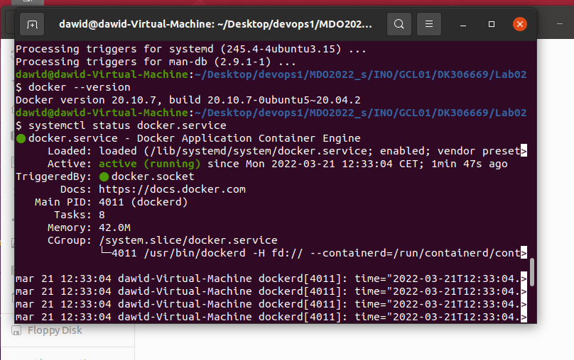
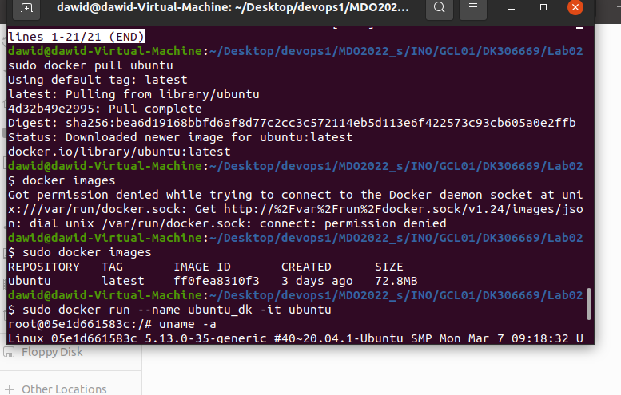
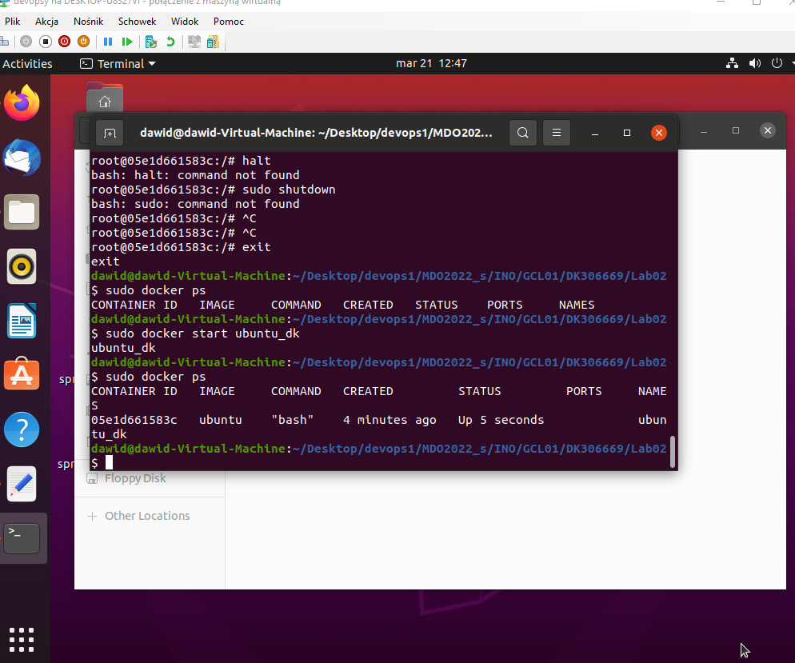
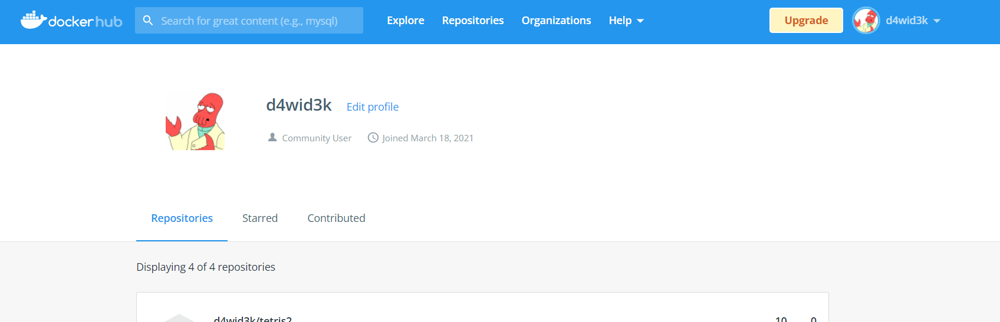

# Lab 2 - Dawid Kosior
---

1. Na podstawie sample'a mieszczacego sie w folderze hooks, ktory z kolei znajduje sie w ukrytym folderze .git, przygotowalem skrypt, aby sprawdzal zawartosc commita. Powinien sie w nim znajdowac ciag znakow zawierajacy inicjaly oraz numer indeksu. Nastepnie commit powinien zawierac oznaczenie Lab.

2. Kolejnym zadaniem byla instalacja platformy docker. Proces przebiegl pomyslnie, do przetestowania dockera pobralem obraz ubuntu, a nastepnie uruchomilem kontener. Wszystko dziala tak jak powinno. W screenach zawarta tez jest informacja o autentycznosci obrazu.

