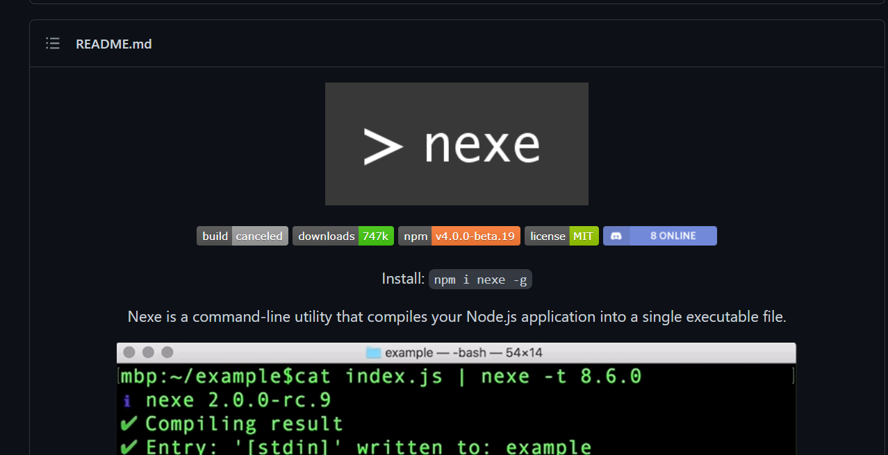
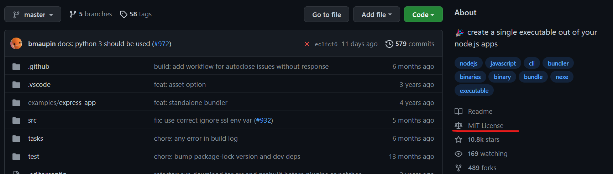
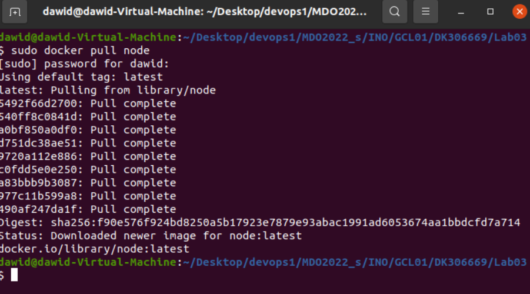
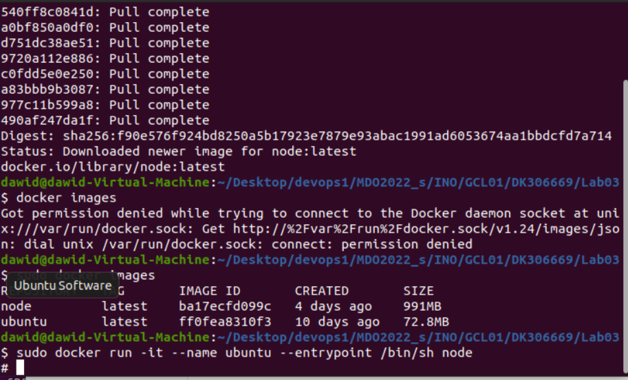
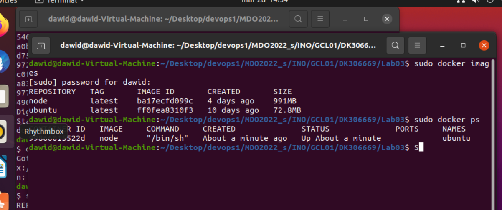
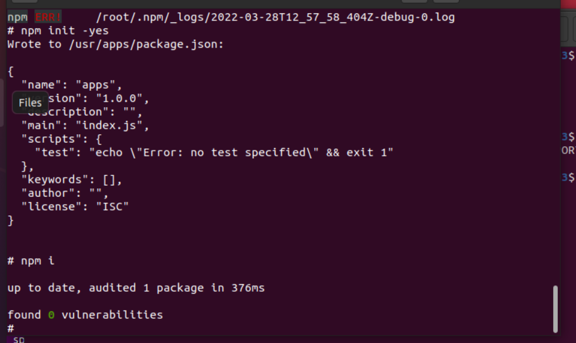
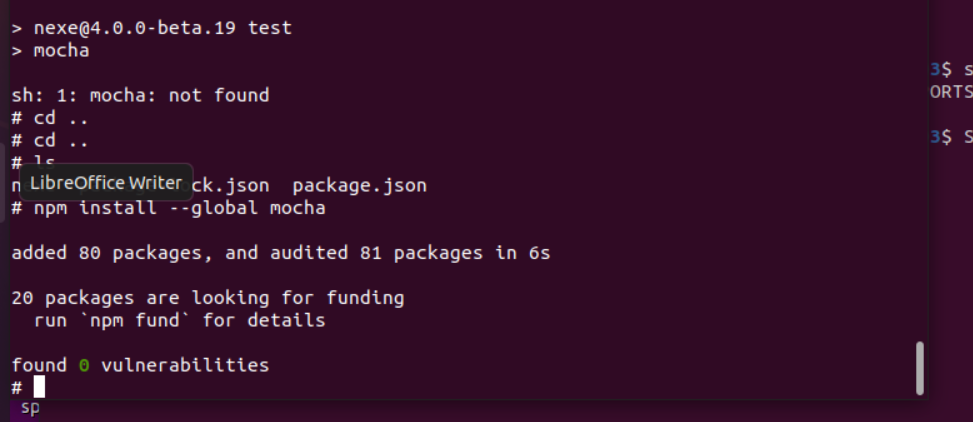
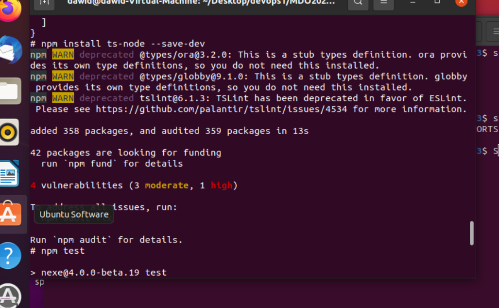
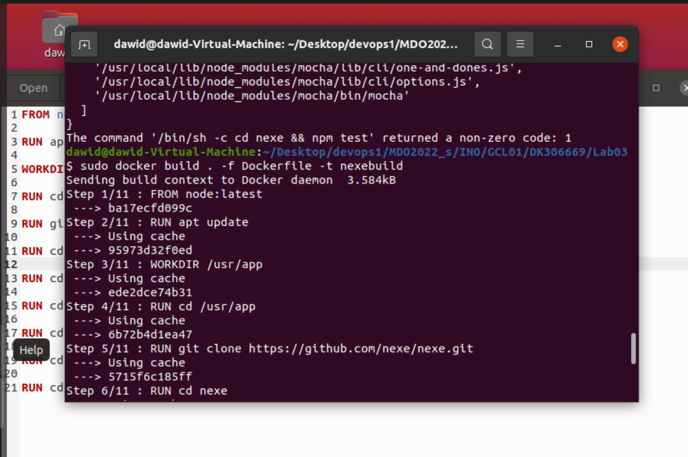
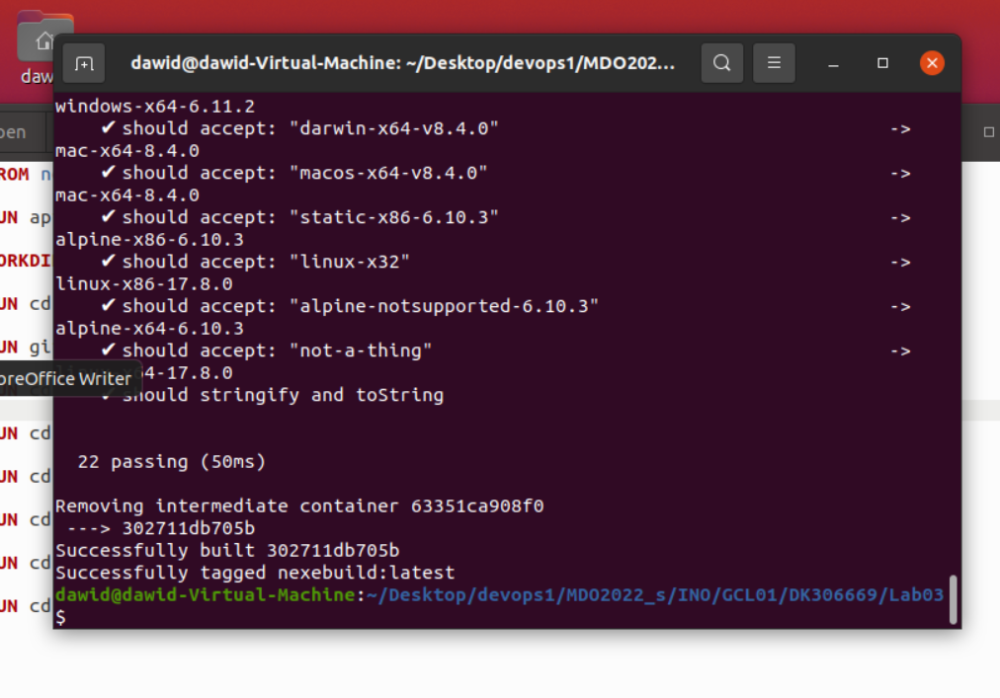

# Lab 3 - Dawid Kosior
---

1. Wybralem repozytorium ktore po zbudowaniu umozliwia utworzenie pliku wykonywalnego ze skryptow node.js. Licencja to MIT, wiec jest dev_friendly :). Tworze kontener z obrazu, konfiguruje srodowisko, a nastepnie wykonuje testy. Kolejnym krokiem jest skonfigurowanie pliku Dockerfile, ktory automatyzuje wszystko opisane powyzej kroki. Ponizej widoczny jest kod Dockerfile'a, a takze screeny z wykonanych polecen.

```Dockerfile
FROM node:latest

RUN apt update

WORKDIR /usr/app

RUN cd /usr/app

RUN git clone https://github.com/nexe/nexe.git

RUN cd nexe

RUN cd nexe && npm init -yes

RUN cd nexe && npm i

RUN cd nexe && npm install --global mocha

RUN cd nexe && npm install ts-node --save-dev

RUN cd nexe && npm test

```




















