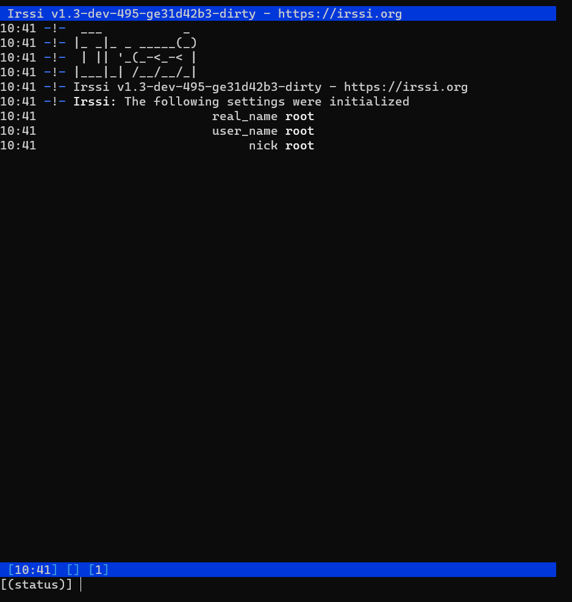

Na potrzeby zadania należało wybrać repozytorium na GitHub'ie zawierające 
jakiś projekt oraz jego testy. Mój wybór padł na repo prezentowane na lekcji, IRSSI,
miałem ochotę zklonować coś z C# ale miałem trochę problemów z instalacją odpowiednich
wersji .NET'a więc zostałem przy rozwiązaniu z lekcji.

Całe zadanie wykonałem poprzez połączenie z VM przez SSH z powershella w Windowsie. 
Zadanie zacząłem standardowo od utworzenia struktury folderów.


"dockeryzacja" odbywa się na obrazie fedora:latest


Po wejściu do konteneru, 


```docker run -it fedora```


instalacja potrzebnych narzędzie pakietów i dependencji.


Następnie klonowanie repozytorium


Po przejściu do katalogu z repo, uruchomienie komendy:


Po udanym buildzie, przejście do katalogu build i uruchomienie testów:


Następnie automatyzacja powyższego procesu za pomocoą docker file.


Tworzenie nowego obrazu na podstawie utworzonego docker file.


Aby wykazać poprawność działania buildowania, na kontenerze bldr, 
zainstalowałem za pomocą komendy ```ninja``` zbuildowane irssi.


Działające IRSSI (odpalane poprzez komende irssi):





Następnie utworzenie docker file, który na podstawie wcześniejszego utworzy kolejny
obraz tym razem w celu przeprowadzenia testów.


Uruchomienie builda:


Wynik testów po buildzie:


Obraz z testami utworzony na podstawie wcześniejszego:


