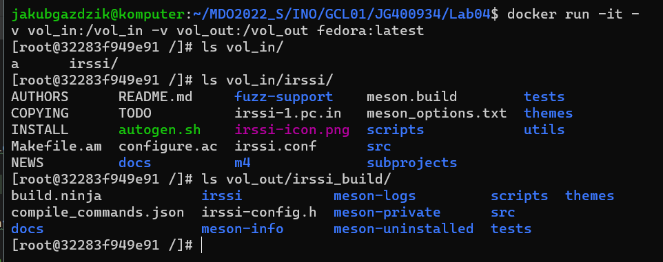
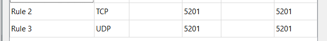
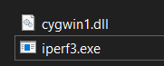
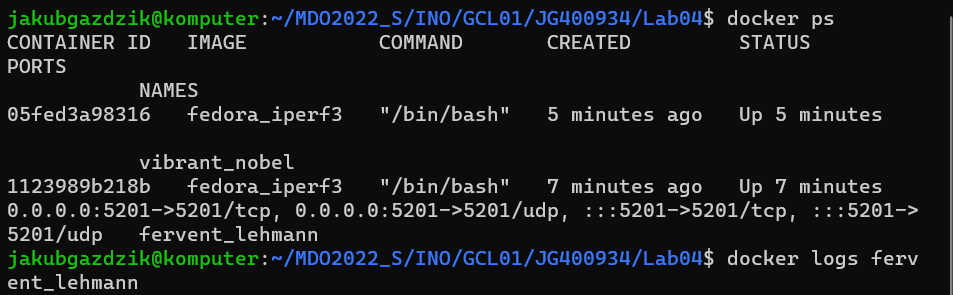
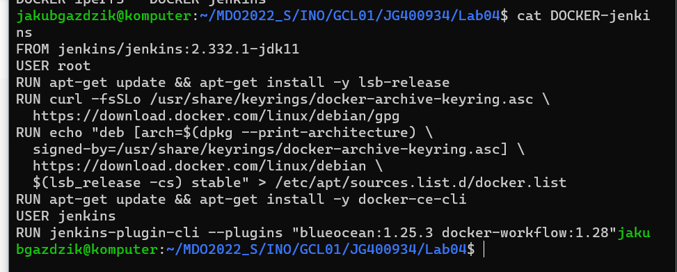

Utworzenie katalogów:


Zachowywanie stanu:


Utworzenie woluminów:


Sklonowanie repo do woluminu wejściowego:


Uruchomienie kontenera z zamontowanymi woluminami:

```
docker run -it -v vol_in:/vol_in -v vol_out:/vol_out fedora:latest
```

Instalacja dependencji:


Uruchomienie buildu do folderu w woluminie wyjściowym:


Zbuildowane irssi w woluminie wyjściowym:


Dowód na poprawnego wykonanie zadania, uruchomienie kontenera jeszcze raz, po wcześniejszym buildzie
i pokazanie że pliki utworzone w ten sposób nadal się tam znajdują:




Eksponowanie portu:


Utworzenie nowego obrazu z zainstalowanym iperf3:

```
FROM fedora:latest
RUN yum install -y iperf3
```


Start serwera:


Klient w innym kontenerze:


Klient na hoście:


Klient spoza hosta


Test spoza hosta wymagał pobrania iperf3.exe na windowsa, oraz otwarcie wymaganych portów w VM






Logi (nie dodaje pliku,ani screena całości ponieważ wyniki znajdują się już w screenach wyżej)

Logi otrzymywane za pomocą:

```
docker logs container_name
```





Instancja Jenkins:


Tworzenie sieci:


Pobranie obrazu docker in docker (dind):


Docker run wg instrukcji z strony:


Docker file:



Utworzenie obrazu z powyższego pliku:


Uruchomienie własnego obrazu:

```
docker run --name jenkins-jen --rm --detach \
  --network jenkins --env DOCKER_HOST=tcp://docker:2376 \
  --env DOCKER_CERT_PATH=/certs/client --env DOCKER_TLS_VERIFY=1 \
  --publish 8080:8080 --publish 50000:50000 \
  --volume jenkins-data:/var/jenkins_home \
  --volume jenkins-docker-certs:/certs/client:ro \
  jenkins_1:latest
```


Działający Jenkins:


