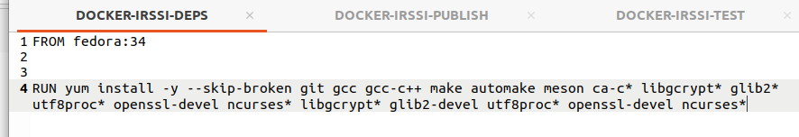
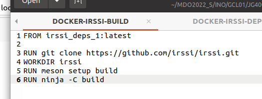
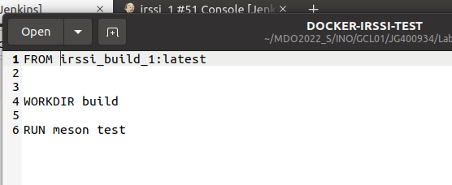
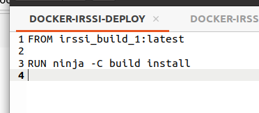
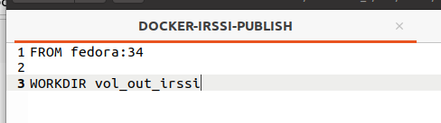
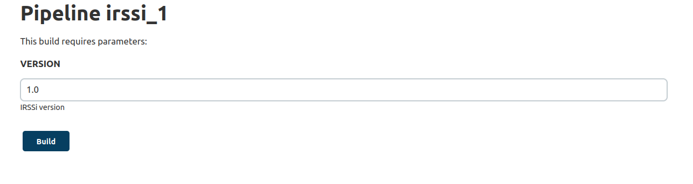

Uruchomienie dinda oraz jenkinsa:


```
docker run --name jenkins-docker --rm --detach \
  --privileged --network jenkins --network-alias docker \
  --env DOCKER_TLS_CERTDIR=/certs \
  --volume jenkins-docker-certs:/certs/client \
  --volume jenkins-data:/var/jenkins_home \
  --publish 2376:2376 \
  docker:dind --storage-driver overlay2
```


```
docker run --name jenkins-jen --rm --detach \
  --network jenkins --env DOCKER_HOST=tcp://docker:2376 \
  --env DOCKER_CERT_PATH=/certs/client --env DOCKER_TLS_VERIFY=1 \
  --publish 8080:8080 --publish 50000:50000 \
  --volume jenkins-data:/var/jenkins_home \
  --volume jenkins-docker-certs:/certs/client:ro \
  jenkins_1:latest
```

Utworzenie odpowiednich plików Dockerfile:


Deps:





Build:





Test:





Deploy:





Publish:





Skopiowanie ich na jenkinsa za pomocą komend:


```
docker cp DOCKER-IRSSI-DEPS jenkins-jen:/var/jenkins_home/DockerFiles/DOCKER-IRSSI-DEPS
docker cp DOCKER-IRSSI-BUILD jenkins-jen:/var/jenkins_home/DockerFiles/DOCKER-IRSSI-BUILD
docker cp DOCKER-IRSSI-TEST jenkins-jen:/var/jenkins_home/DockerFiles/DOCKER-IRSSI-TEST
docker cp DOCKER-IRSSI-DEPLOY jenkins-jen:/var/jenkins_home/DockerFiles/DOCKER-IRSSI-DEPLOY
docker cp DOCKER-IRSSI-PUBLISH jenkins-jen:/var/jenkins_home/DockerFiles/DOCKER-IRSSI-PUBLISH
```


Pipeline:


```
pipeline {
    agent any

	parameters {
        string(name: 'VERSION', defaultValue: '1.0', description: 'IRSSi version')
    }

    stages {
        stage('Init') {
            steps {
                echo 'Init'
                sh "docker build -t irssi_deps_1:latest . -f /var/jenkins_home/DockerFiles/DOCKER-IRSSI-DEPS"
            }
        }
        stage('Build') {
            steps {
                echo 'Build'
                sh "docker build -t irssi_build_1:latest . -f /var/jenkins_home/DockerFiles/DOCKER-IRSSI-BUILD"
				sh "docker run -t -d --name irssi_build_21 -v vol_out_irssi:/vol_out_irssi irssi_build_1:latest"
				sh "docker cp irssi_build_21:/irssi/build ./build-irssi-super"
				sh "docker cp ./build-irssi-super irssi_build_21:/vol_out_irssi/build"
				sh "docker stop irssi_build_21"
				sh "docker container rm irssi_build_21"
            }
        }
        stage('Test') {
            steps {
                echo 'Test'
                sh "docker build -t irssi_test_1:latest . -f /var/jenkins_home/DockerFiles/DOCKER-IRSSI-TEST"
            }
        }
		stage('Deploy') {
            steps {
                echo 'Deploy'
                sh "docker build -t irssi_deploy_1:latest . -f /var/jenkins_home/DockerFiles/DOCKER-IRSSI-DEPLOY"
				sh "docker run -t -d -e TERM=xterm --name irssi_deploy_21 -v vol_out_irssi:/vol_out_irssi irssi_deploy_1:latest"
				sh "docker exec irssi_deploy_21 irssi"
				sh "docker stop irssi_deploy_21"
				sh "docker container rm irssi_deploy_21"
            }
        }
		stage('Publish') {
            steps {
                echo 'Publish'
                sh "docker build -t irssi_publish_1:latest . -f /var/jenkins_home/DockerFiles/DOCKER-IRSSI-PUBLISH"
				sh "docker run -t -d --name irssi_publish_21 -v vol_out_irssi:/vol_out_irssi irssi_publish_1:latest"
				sh "docker exec irssi_publish_21 tar -czvf ${params.VERSION}.tgz ./build"
				sh "docker stop irssi_publish_21"
				sh "docker container rm irssi_publish_21"
            }
        }
    }
}

```


Za pomocą parameters w pipelinie, podanie wersji programu:





Wszystko na zielone, jest dobrze:


Na samym dole dodatkowo załączam wydruk z konsoli z działania tego pipeline'a.


Krótki opis co i dlaczego:

Stage Init:

Utworzenie obrazu z dependencjami

Stage Build:

Utworzenie (na podstawie obrazu deps) obrazu do którego zostaje sklonowane irssi z githuba oraz zbuildowane a następnie gotowy build "wyrzucony" na wolumin wyjściowy.

Stage Test:

Na podstawie obrazu build, przeprowadzenie testów builda

Stage Deploy:

Uruchomienie programu. Deploy w przypadku np. restowego api, mogłoby być postawione na dockerze wrzucone na kubernetesa i udostępnione na jakimś adresie, ale że to aplikacja IRSSI to wrzucenie jej na dockera i włączenie nie ma za dużo sensu, ale spełnić krok deploy jakoś trzeba było :)

Stage Publish:

Spakowanie zkompilowanego programu do archiwum i udostępnienie na działającynm dockerze.

Dla uproszczenia wszystkie kontenery po wykonaniu powyższych czynności zostają zamknięte i usunięte.


Output:


```
Started by user admin
[Pipeline] Start of Pipeline
[Pipeline] node
Running on Jenkins in /var/jenkins_home/workspace/irssi_1
[Pipeline] {
[Pipeline] stage
[Pipeline] { (Init)
[Pipeline] echo
Init
[Pipeline] sh
+ docker build -t irssi_deps_1:latest . -f /var/jenkins_home/DockerFiles/DOCKER-IRSSI-DEPS
Sending build context to Docker daemon  27.79MB

Step 1/2 : FROM fedora:34
 ---> af70648d87b6
Step 2/2 : RUN yum install -y --skip-broken git gcc gcc-c++ make automake meson ca-c* libgcrypt* glib2* utf8proc* openssl-devel ncurses* libgcrypt* glib2-devel utf8proc* openssl-devel ncurses*
 ---> Running in 74589ebcf633
Fedora 34 - x86_64                              2.1 MB/s |  74 MB     00:35    
Fedora 34 openh264 (From Cisco) - x86_64        1.7 kB/s | 2.5 kB     00:01    
Fedora Modular 34 - x86_64                      685 kB/s | 4.9 MB     00:07    
Fedora 34 - x86_64 - Updates                    1.5 MB/s |  34 MB     00:22    
Fedora Modular 34 - x86_64 - Updates            995 kB/s | 4.7 MB     00:04    
Last metadata expiration check: 0:00:01 ago on Sun May 15 10:07:30 2022.
Package ca-certificates-2021.2.52-1.0.fc34.noarch is already installed.
Package libgcrypt-1.9.3-3.fc34.x86_64 is already installed.
Package glib2-2.68.4-1.fc34.x86_64 is already installed.
Package ncurses-base-6.2-4.20200222.fc34.noarch is already installed.
Package ncurses-libs-6.2-4.20200222.fc34.x86_64 is already installed.
Dependencies resolved.
================================================================================
 Package                     Arch    Version                     Repo      Size
================================================================================
Installing:
 automake                    noarch  1.16.2-4.fc34               fedora   664 k
 gcc                         x86_64  11.3.1-2.fc34               updates   32 M
 gcc-c++                     x86_64  11.3.1-2.fc34               updates   12 M
 git                         x86_64  2.34.3-1.fc34               updates   65 k
 glib2-devel                 x86_64  2.68.4-1.fc34               updates  474 k
 glib2-doc                   noarch  2.68.4-1.fc34               updates  1.4 M
 glib2-static                x86_64  2.68.4-1.fc34               updates  1.6 M
 glib2-tests                 x86_64  2.68.4-1.fc34               updates  1.8 M
 libgcrypt-devel             x86_64  1.9.3-3.fc34                updates  140 k
 make                        x86_64  1:4.3-5.fc34                fedora   539 k
 meson                       noarch  0.59.4-1.fc34               updates  1.2 M
 ncurses                     x86_64  6.2-4.20200222.fc34         fedora   396 k
 ncurses-compat-libs         x86_64  6.2-4.20200222.fc34         fedora   323 k
 ncurses-devel               x86_64  6.2-4.20200222.fc34         fedora   510 k
 ncurses-static              x86_64  6.2-4.20200222.fc34         fedora   708 k
 ncurses-term                noarch  6.2-4.20200222.fc34         fedora   538 k
 openssl-devel               x86_64  1:1.1.1n-1.fc34             updates  2.2 M
 utf8proc                    x86_64  2.6.1-2.fc34                fedora    84 k
 utf8proc-devel              x86_64  2.6.1-2.fc34                fedora    17 k
Upgrading:
 libgcc                      x86_64  11.3.1-2.fc34               updates  118 k
 libgomp                     x86_64  11.3.1-2.fc34               updates  291 k
 libstdc++                   x86_64  11.3.1-2.fc34               updates  753 k
 openssl-libs                x86_64  1:1.1.1n-1.fc34             updates  1.4 M
Installing dependencies:
 autoconf                    noarch  2.69-36.fc34                fedora   667 k
 binutils                    x86_64  2.35.2-6.fc34               updates  5.5 M
 binutils-gold               x86_64  2.35.2-6.fc34               updates  716 k
 cpp                         x86_64  11.3.1-2.fc34               updates   10 M
 elfutils-debuginfod-client  x86_64  0.186-1.fc34                updates   40 k
 emacs-filesystem            noarch  1:27.2-5.fc34               updates  8.4 k
 gc                          x86_64  8.0.4-5.fc34                fedora   105 k
 git-core                    x86_64  2.34.3-1.fc34               updates  3.8 M
 git-core-doc                noarch  2.34.3-1.fc34               updates  2.4 M
 glibc-devel                 x86_64  2.33-21.fc34                updates   26 k
 glibc-headers-x86           noarch  2.33-21.fc34                updates  413 k
 groff-base                  x86_64  1.22.4-7.fc34               fedora   1.1 M
 guile22                     x86_64  2.2.7-2.fc34                fedora   6.5 M
 kernel-headers              x86_64  5.17.6-100.fc34             updates  1.3 M
 less                        x86_64  590-2.fc34                  updates  161 k
 libblkid-devel              x86_64  2.36.2-1.fc34               fedora    14 k
 libcbor                     x86_64  0.7.0-3.fc34                fedora    57 k
 libedit                     x86_64  3.1-38.20210714cvs.fc34     updates  104 k
 libffi-devel                x86_64  3.1-28.fc34                 fedora    24 k
 libfido2                    x86_64  1.6.0-2.fc34                fedora    71 k
 libgpg-error-devel          x86_64  1.42-1.fc34                 fedora    66 k
 libmount-devel              x86_64  2.36.2-1.fc34               fedora    15 k
 libmpc                      x86_64  1.2.1-2.fc34                fedora    63 k
 libpkgconf                  x86_64  1.7.3-6.fc34                fedora    36 k
 libselinux-devel            x86_64  3.2-1.fc34                  fedora   113 k
 libsepol-devel              x86_64  3.2-2.fc34                  updates   40 k
 libstdc++-devel             x86_64  11.3.1-2.fc34               updates  2.2 M
 libtool-ltdl                x86_64  2.4.6-40.fc34               fedora    36 k
 libxcrypt-devel             x86_64  4.4.28-1.fc34               updates   29 k
 m4                          x86_64  1.4.18-17.fc34              fedora   212 k
 ncurses-c++-libs            x86_64  6.2-4.20200222.fc34         fedora    37 k
 ninja-build                 x86_64  1.10.2-2.fc34               fedora   145 k
 openssh                     x86_64  8.6p1-5.fc34                updates  437 k
 openssh-clients             x86_64  8.6p1-5.fc34                updates  678 k
 pcre-cpp                    x86_64  8.44-3.fc34.1               fedora    26 k
 pcre-devel                  x86_64  8.44-3.fc34.1               fedora   471 k
 pcre-utf16                  x86_64  8.44-3.fc34.1               fedora   187 k
 pcre-utf32                  x86_64  8.44-3.fc34.1               fedora   177 k
 pcre2-devel                 x86_64  10.36-4.fc34                fedora   477 k
 pcre2-utf16                 x86_64  10.36-4.fc34                fedora   213 k
 pcre2-utf32                 x86_64  10.36-4.fc34                fedora   203 k
 perl-AutoLoader             noarch  5.74-477.fc34               updates   31 k
 perl-B                      x86_64  1.80-477.fc34               updates  189 k
 perl-Carp                   noarch  1.50-458.fc34               fedora    29 k
 perl-Class-Struct           noarch  0.66-477.fc34               updates   32 k
 perl-Data-Dumper            x86_64  2.174-460.fc34              fedora    56 k
 perl-Digest                 noarch  1.20-1.fc34                 updates   25 k
 perl-Digest-MD5             x86_64  2.58-2.fc34                 fedora    36 k
 perl-DynaLoader             x86_64  1.47-477.fc34               updates   36 k
 perl-Encode                 x86_64  4:3.15-462.fc34             updates  1.7 M
 perl-Errno                  x86_64  1.30-477.fc34               updates   25 k
 perl-Error                  noarch  1:0.17029-5.fc34            fedora    42 k
 perl-Exporter               noarch  5.74-459.fc34               fedora    32 k
 perl-Fcntl                  x86_64  1.13-477.fc34               updates   31 k
 perl-File-Basename          noarch  2.85-477.fc34               updates   27 k
 perl-File-Compare           noarch  1.100.600-477.fc34          updates   23 k
 perl-File-Copy              noarch  2.34-477.fc34               updates   30 k
 perl-File-Find              noarch  1.37-477.fc34               updates   36 k
 perl-File-Path              noarch  2.18-2.fc34                 fedora    36 k
 perl-File-Temp              noarch  1:0.231.100-2.fc34          fedora    60 k
 perl-File-stat              noarch  1.09-477.fc34               updates   27 k
 perl-FileHandle             noarch  2.03-477.fc34               updates   26 k
 perl-Getopt-Long            noarch  1:2.52-2.fc34               fedora    61 k
 perl-Getopt-Std             noarch  1.12-477.fc34               updates   26 k
 perl-Git                    noarch  2.34.3-1.fc34               updates   41 k
 perl-HTTP-Tiny              noarch  0.078-1.fc34                updates   55 k
 perl-IO                     x86_64  1.43-477.fc34               updates   97 k
 perl-IO-Socket-IP           noarch  0.41-3.fc34                 fedora    43 k
 perl-IPC-Open3              noarch  1.21-477.fc34               updates   33 k
 perl-MIME-Base64            x86_64  3.16-2.fc34                 fedora    30 k
 perl-Net-SSLeay             x86_64  1.90-2.fc34                 fedora   357 k
 perl-POSIX                  x86_64  1.94-477.fc34               updates  107 k
 perl-PathTools              x86_64  3.78-459.fc34               fedora    86 k
 perl-Pod-Escapes            noarch  1:1.07-458.fc34             fedora    20 k
 perl-Pod-Perldoc            noarch  3.28.01-459.fc34            fedora    85 k
 perl-Pod-Simple             noarch  1:3.42-2.fc34               fedora   216 k
 perl-Pod-Usage              noarch  4:2.01-2.fc34               fedora    41 k
 perl-Scalar-List-Utils      x86_64  4:1.56-459.fc34             fedora    72 k
 perl-SelectSaver            noarch  1.02-477.fc34               updates   22 k
 perl-Socket                 x86_64  4:2.032-1.fc34              updates   54 k
 perl-Storable               x86_64  1:3.21-458.fc34             fedora    97 k
 perl-Symbol                 noarch  1.08-477.fc34               updates   24 k
 perl-Term-ANSIColor         noarch  5.01-459.fc34               fedora    49 k
 perl-Term-Cap               noarch  1.17-458.fc34               fedora    22 k
 perl-TermReadKey            x86_64  2.38-9.fc34                 fedora    36 k
 perl-Text-ParseWords        noarch  3.30-458.fc34               fedora    16 k
 perl-Text-Tabs+Wrap         noarch  2021.0726-1.fc34            updates   22 k
 perl-Thread-Queue           noarch  3.14-458.fc34               fedora    22 k
 perl-Time-Local             noarch  2:1.300-5.fc34              fedora    34 k
 perl-URI                    noarch  5.09-1.fc34                 fedora   109 k
 perl-base                   noarch  2.27-477.fc34               updates   26 k
 perl-constant               noarch  1.33-459.fc34               fedora    23 k
 perl-if                     noarch  0.60.800-477.fc34           updates   24 k
 perl-interpreter            x86_64  4:5.32.1-477.fc34           updates   81 k
 perl-lib                    x86_64  0.65-477.fc34               updates   25 k
 perl-libnet                 noarch  3.13-2.fc34                 fedora   127 k
 perl-libs                   x86_64  4:5.32.1-477.fc34           updates  2.0 M
 perl-mro                    x86_64  1.23-477.fc34               updates   38 k
 perl-overload               noarch  1.31-477.fc34               updates   56 k
 perl-overloading            noarch  0.02-477.fc34               updates   23 k
 perl-parent                 noarch  1:0.238-458.fc34            fedora    14 k
 perl-podlators              noarch  1:4.14-458.fc34             fedora   113 k
 perl-subs                   noarch  1.03-477.fc34               updates   22 k
 perl-threads                x86_64  1:2.25-458.fc34             fedora    58 k
 perl-threads-shared         x86_64  1.61-458.fc34               fedora    44 k
 perl-vars                   noarch  1.05-477.fc34               updates   23 k
 pkgconf                     x86_64  1.7.3-6.fc34                fedora    41 k
 pkgconf-m4                  noarch  1.7.3-6.fc34                fedora    14 k
 pkgconf-pkg-config          x86_64  1.7.3-6.fc34                fedora    10 k
 python3-setuptools          noarch  53.0.0-3.fc34               updates  839 k
 sysprof-capture-devel       x86_64  3.40.1-2.fc34               updates   58 k
 vim-filesystem              noarch  2:8.2.4804-1.fc34           updates   22 k
 zlib-devel                  x86_64  1.2.11-26.fc34              fedora    44 k
Installing weak dependencies:
 openssl-pkcs11              x86_64  0.4.11-2.fc34               fedora    74 k
 perl-IO-Socket-SSL          noarch  2.070-2.fc34                fedora   214 k
 perl-Mozilla-CA             noarch  20211001-1.fc34             updates   12 k
 perl-NDBM_File              x86_64  1.15-477.fc34               updates   32 k

Transaction Summary
================================================================================
Install  136 Packages
Upgrade    4 Packages

Total download size: 106 M
Downloading Packages:
(1/140): gc-8.0.4-5.fc34.x86_64.rpm             518 kB/s | 105 kB     00:00    
(2/140): automake-1.16.2-4.fc34.noarch.rpm      910 kB/s | 664 kB     00:00    
(3/140): autoconf-2.69-36.fc34.noarch.rpm       479 kB/s | 667 kB     00:01    
(4/140): libblkid-devel-2.36.2-1.fc34.x86_64.rp 179 kB/s |  14 kB     00:00    
(5/140): groff-base-1.22.4-7.fc34.x86_64.rpm    827 kB/s | 1.1 MB     00:01    
(6/140): libffi-devel-3.1-28.fc34.x86_64.rpm    287 kB/s |  24 kB     00:00    
(7/140): libcbor-0.7.0-3.fc34.x86_64.rpm        329 kB/s |  57 kB     00:00    
(8/140): libfido2-1.6.0-2.fc34.x86_64.rpm       422 kB/s |  71 kB     00:00    
(9/140): libgpg-error-devel-1.42-1.fc34.x86_64. 483 kB/s |  66 kB     00:00    
(10/140): libmount-devel-2.36.2-1.fc34.x86_64.r 144 kB/s |  15 kB     00:00    
(11/140): libmpc-1.2.1-2.fc34.x86_64.rpm        393 kB/s |  63 kB     00:00    
(12/140): libpkgconf-1.7.3-6.fc34.x86_64.rpm    132 kB/s |  36 kB     00:00    
(13/140): libselinux-devel-3.2-1.fc34.x86_64.rp 417 kB/s | 113 kB     00:00    
(14/140): libtool-ltdl-2.4.6-40.fc34.x86_64.rpm 364 kB/s |  36 kB     00:00    
(15/140): m4-1.4.18-17.fc34.x86_64.rpm          357 kB/s | 212 kB     00:00    
(16/140): make-4.3-5.fc34.x86_64.rpm            594 kB/s | 539 kB     00:00    
(17/140): ncurses-c++-libs-6.2-4.20200222.fc34. 165 kB/s |  37 kB     00:00    
(18/140): ncurses-6.2-4.20200222.fc34.x86_64.rp 325 kB/s | 396 kB     00:01    
(19/140): ncurses-compat-libs-6.2-4.20200222.fc 496 kB/s | 323 kB     00:00    
(20/140): guile22-2.2.7-2.fc34.x86_64.rpm       1.6 MB/s | 6.5 MB     00:04    
(21/140): ncurses-static-6.2-4.20200222.fc34.x8 744 kB/s | 708 kB     00:00    
(22/140): ncurses-term-6.2-4.20200222.fc34.noar 1.6 MB/s | 538 kB     00:00    
(23/140): ncurses-devel-6.2-4.20200222.fc34.x86 430 kB/s | 510 kB     00:01    
(24/140): ninja-build-1.10.2-2.fc34.x86_64.rpm  601 kB/s | 145 kB     00:00    
(25/140): openssl-pkcs11-0.4.11-2.fc34.x86_64.r 545 kB/s |  74 kB     00:00    
(26/140): pcre-cpp-8.44-3.fc34.1.x86_64.rpm     201 kB/s |  26 kB     00:00    
(27/140): pcre-utf16-8.44-3.fc34.1.x86_64.rpm   714 kB/s | 187 kB     00:00    
(28/140): pcre-devel-8.44-3.fc34.1.x86_64.rpm   1.4 MB/s | 471 kB     00:00    
(29/140): pcre2-utf16-10.36-4.fc34.x86_64.rpm   981 kB/s | 213 kB     00:00    
(30/140): pcre-utf32-8.44-3.fc34.1.x86_64.rpm   404 kB/s | 177 kB     00:00    
(31/140): perl-Carp-1.50-458.fc34.noarch.rpm    448 kB/s |  29 kB     00:00    
(32/140): perl-Data-Dumper-2.174-460.fc34.x86_6  60 kB/s |  56 kB     00:00    
(33/140): perl-Digest-MD5-2.58-2.fc34.x86_64.rp 220 kB/s |  36 kB     00:00    
(34/140): pcre2-utf32-10.36-4.fc34.x86_64.rpm   167 kB/s | 203 kB     00:01    
(35/140): perl-Error-0.17029-5.fc34.noarch.rpm  278 kB/s |  42 kB     00:00    
(36/140): perl-Exporter-5.74-459.fc34.noarch.rp 282 kB/s |  32 kB     00:00    
(37/140): pcre2-devel-10.36-4.fc34.x86_64.rpm   278 kB/s | 477 kB     00:01    
(38/140): perl-File-Path-2.18-2.fc34.noarch.rpm 340 kB/s |  36 kB     00:00    
(39/140): perl-File-Temp-0.231.100-2.fc34.noarc 346 kB/s |  60 kB     00:00    
(40/140): perl-IO-Socket-IP-0.41-3.fc34.noarch. 441 kB/s |  43 kB     00:00    
(41/140): perl-Getopt-Long-2.52-2.fc34.noarch.r 602 kB/s |  61 kB     00:00    
(42/140): perl-MIME-Base64-3.16-2.fc34.x86_64.r 422 kB/s |  30 kB     00:00    
(43/140): perl-PathTools-3.78-459.fc34.x86_64.r 550 kB/s |  86 kB     00:00    
(44/140): perl-Pod-Escapes-1.07-458.fc34.noarch 190 kB/s |  20 kB     00:00    
(45/140): perl-IO-Socket-SSL-2.070-2.fc34.noarc 550 kB/s | 214 kB     00:00    
(46/140): perl-Net-SSLeay-1.90-2.fc34.x86_64.rp 904 kB/s | 357 kB     00:00    
(47/140): perl-Pod-Perldoc-3.28.01-459.fc34.noa 882 kB/s |  85 kB     00:00    
(48/140): perl-Scalar-List-Utils-1.56-459.fc34. 620 kB/s |  72 kB     00:00    
(49/140): perl-Pod-Usage-2.01-2.fc34.noarch.rpm 255 kB/s |  41 kB     00:00    
(50/140): perl-Term-ANSIColor-5.01-459.fc34.noa 350 kB/s |  49 kB     00:00    
(51/140): perl-Storable-3.21-458.fc34.x86_64.rp 471 kB/s |  97 kB     00:00    
(52/140): perl-Term-Cap-1.17-458.fc34.noarch.rp 373 kB/s |  22 kB     00:00    
(53/140): perl-Pod-Simple-3.42-2.fc34.noarch.rp 540 kB/s | 216 kB     00:00    
(54/140): perl-Text-ParseWords-3.30-458.fc34.no 240 kB/s |  16 kB     00:00    
(55/140): perl-Thread-Queue-3.14-458.fc34.noarc 293 kB/s |  22 kB     00:00    
(56/140): perl-TermReadKey-2.38-9.fc34.x86_64.r 308 kB/s |  36 kB     00:00    
(57/140): perl-Time-Local-1.300-5.fc34.noarch.r 452 kB/s |  34 kB     00:00    
(58/140): perl-constant-1.33-459.fc34.noarch.rp 222 kB/s |  23 kB     00:00    
(59/140): perl-URI-5.09-1.fc34.noarch.rpm       585 kB/s | 109 kB     00:00    
(60/140): perl-libnet-3.13-2.fc34.noarch.rpm    811 kB/s | 127 kB     00:00    
(61/140): perl-parent-0.238-458.fc34.noarch.rpm 164 kB/s |  14 kB     00:00    
(62/140): perl-threads-2.25-458.fc34.x86_64.rpm 488 kB/s |  58 kB     00:00    
(63/140): perl-threads-shared-1.61-458.fc34.x86 369 kB/s |  44 kB     00:00    
(64/140): perl-podlators-4.14-458.fc34.noarch.r 544 kB/s | 113 kB     00:00    
(65/140): pkgconf-m4-1.7.3-6.fc34.noarch.rpm    217 kB/s |  14 kB     00:00    
(66/140): pkgconf-pkg-config-1.7.3-6.fc34.x86_6 174 kB/s |  10 kB     00:00    
(67/140): pkgconf-1.7.3-6.fc34.x86_64.rpm       334 kB/s |  41 kB     00:00    
(68/140): utf8proc-devel-2.6.1-2.fc34.x86_64.rp 251 kB/s |  17 kB     00:00    
(69/140): utf8proc-2.6.1-2.fc34.x86_64.rpm      583 kB/s |  84 kB     00:00    
(70/140): zlib-devel-1.2.11-26.fc34.x86_64.rpm  449 kB/s |  44 kB     00:00    
(71/140): binutils-gold-2.35.2-6.fc34.x86_64.rp 491 kB/s | 716 kB     00:01    
(72/140): elfutils-debuginfod-client-0.186-1.fc 174 kB/s |  40 kB     00:00    
(73/140): emacs-filesystem-27.2-5.fc34.noarch.r  53 kB/s | 8.4 kB     00:00    
(74/140): binutils-2.35.2-6.fc34.x86_64.rpm     734 kB/s | 5.5 MB     00:07    
(75/140): cpp-11.3.1-2.fc34.x86_64.rpm          659 kB/s |  10 MB     00:15    
(76/140): git-2.34.3-1.fc34.x86_64.rpm          303 kB/s |  65 kB     00:00    
(77/140): git-core-2.34.3-1.fc34.x86_64.rpm     396 kB/s | 3.8 MB     00:09    
(78/140): git-core-doc-2.34.3-1.fc34.noarch.rpm 425 kB/s | 2.4 MB     00:05    
(79/140): gcc-c++-11.3.1-2.fc34.x86_64.rpm      499 kB/s |  12 MB     00:24    
(80/140): glib2-devel-2.68.4-1.fc34.x86_64.rpm  385 kB/s | 474 kB     00:01    
(81/140): glib2-doc-2.68.4-1.fc34.noarch.rpm    404 kB/s | 1.4 MB     00:03    
(82/140): glib2-static-2.68.4-1.fc34.x86_64.rpm 413 kB/s | 1.6 MB     00:04    
(83/140): glibc-devel-2.33-21.fc34.x86_64.rpm    83 kB/s |  26 kB     00:00    
(84/140): glibc-headers-x86-2.33-21.fc34.noarch 348 kB/s | 413 kB     00:01    
(85/140): glib2-tests-2.68.4-1.fc34.x86_64.rpm  462 kB/s | 1.8 MB     00:03    
(86/140): less-590-2.fc34.x86_64.rpm            184 kB/s | 161 kB     00:00    
(87/140): libedit-3.1-38.20210714cvs.fc34.x86_6 198 kB/s | 104 kB     00:00    
(88/140): kernel-headers-5.17.6-100.fc34.x86_64 406 kB/s | 1.3 MB     00:03    
(89/140): libgcrypt-devel-1.9.3-3.fc34.x86_64.r 260 kB/s | 140 kB     00:00    
(90/140): libsepol-devel-3.2-2.fc34.x86_64.rpm  107 kB/s |  40 kB     00:00    
(91/140): libxcrypt-devel-4.4.28-1.fc34.x86_64. 109 kB/s |  29 kB     00:00    
(92/140): meson-0.59.4-1.fc34.noarch.rpm        375 kB/s | 1.2 MB     00:03    
(93/140): libstdc++-devel-11.3.1-2.fc34.x86_64. 471 kB/s | 2.2 MB     00:04    
(94/140): openssh-8.6p1-5.fc34.x86_64.rpm       324 kB/s | 437 kB     00:01    
(95/140): openssh-clients-8.6p1-5.fc34.x86_64.r 437 kB/s | 678 kB     00:01    
(96/140): perl-AutoLoader-5.74-477.fc34.noarch. 106 kB/s |  31 kB     00:00    
(97/140): perl-B-1.80-477.fc34.x86_64.rpm       171 kB/s | 189 kB     00:01    
(98/140): perl-Class-Struct-0.66-477.fc34.noarc  87 kB/s |  32 kB     00:00    
(99/140): perl-Digest-1.20-1.fc34.noarch.rpm     66 kB/s |  25 kB     00:00    
(100/140): perl-DynaLoader-1.47-477.fc34.x86_64 136 kB/s |  36 kB     00:00    
(101/140): openssl-devel-1.1.1n-1.fc34.x86_64.r 591 kB/s | 2.2 MB     00:03    
(102/140): perl-Errno-1.30-477.fc34.x86_64.rpm  217 kB/s |  25 kB     00:00    
(103/140): perl-Fcntl-1.13-477.fc34.x86_64.rpm  121 kB/s |  31 kB     00:00    
(104/140): perl-File-Basename-2.85-477.fc34.noa 133 kB/s |  27 kB     00:00    
(105/140): perl-File-Compare-1.100.600-477.fc34  93 kB/s |  23 kB     00:00    
(106/140): perl-File-Copy-2.34-477.fc34.noarch. 148 kB/s |  30 kB     00:00    
(107/140): perl-File-Find-1.37-477.fc34.noarch. 121 kB/s |  36 kB     00:00    
(108/140): perl-Encode-3.15-462.fc34.x86_64.rpm 1.1 MB/s | 1.7 MB     00:01    
(109/140): perl-File-stat-1.09-477.fc34.noarch. 138 kB/s |  27 kB     00:00    
(110/140): perl-FileHandle-2.03-477.fc34.noarch 173 kB/s |  26 kB     00:00    
(111/140): perl-Getopt-Std-1.12-477.fc34.noarch 198 kB/s |  26 kB     00:00    
(112/140): perl-Git-2.34.3-1.fc34.noarch.rpm    326 kB/s |  41 kB     00:00    
(113/140): perl-HTTP-Tiny-0.078-1.fc34.noarch.r 353 kB/s |  55 kB     00:00    
(114/140): perl-IO-1.43-477.fc34.x86_64.rpm     634 kB/s |  97 kB     00:00    
(115/140): perl-IPC-Open3-1.21-477.fc34.noarch. 222 kB/s |  33 kB     00:00    
(116/140): perl-Mozilla-CA-20211001-1.fc34.noar  99 kB/s |  12 kB     00:00    
(117/140): perl-NDBM_File-1.15-477.fc34.x86_64. 364 kB/s |  32 kB     00:00    
(118/140): perl-SelectSaver-1.02-477.fc34.noarc 202 kB/s |  22 kB     00:00    
(119/140): perl-POSIX-1.94-477.fc34.x86_64.rpm  487 kB/s | 107 kB     00:00    
(120/140): perl-Socket-2.032-1.fc34.x86_64.rpm  366 kB/s |  54 kB     00:00    
(121/140): perl-Symbol-1.08-477.fc34.noarch.rpm 232 kB/s |  24 kB     00:00    
(122/140): perl-Text-Tabs+Wrap-2021.0726-1.fc34 260 kB/s |  22 kB     00:00    
(123/140): perl-base-2.27-477.fc34.noarch.rpm   286 kB/s |  26 kB     00:00    
(124/140): perl-if-0.60.800-477.fc34.noarch.rpm 256 kB/s |  24 kB     00:00    
(125/140): perl-lib-0.65-477.fc34.x86_64.rpm    215 kB/s |  25 kB     00:00    
(126/140): perl-interpreter-5.32.1-477.fc34.x86 499 kB/s |  81 kB     00:00    
(127/140): perl-mro-1.23-477.fc34.x86_64.rpm    212 kB/s |  38 kB     00:00    
(128/140): perl-overload-1.31-477.fc34.noarch.r 424 kB/s |  56 kB     00:00    
(129/140): perl-overloading-0.02-477.fc34.noarc 283 kB/s |  23 kB     00:00    
(130/140): perl-subs-1.03-477.fc34.noarch.rpm   211 kB/s |  22 kB     00:00    
(131/140): perl-vars-1.05-477.fc34.noarch.rpm   235 kB/s |  23 kB     00:00    
(132/140): python3-setuptools-53.0.0-3.fc34.noa 1.2 MB/s | 839 kB     00:00    
(133/140): sysprof-capture-devel-3.40.1-2.fc34. 346 kB/s |  58 kB     00:00    
(134/140): perl-libs-5.32.1-477.fc34.x86_64.rpm 1.4 MB/s | 2.0 MB     00:01    
(135/140): vim-filesystem-8.2.4804-1.fc34.noarc 298 kB/s |  22 kB     00:00    
(136/140): libgcc-11.3.1-2.fc34.x86_64.rpm      738 kB/s | 118 kB     00:00    
(137/140): libgomp-11.3.1-2.fc34.x86_64.rpm     1.0 MB/s | 291 kB     00:00    
(138/140): gcc-11.3.1-2.fc34.x86_64.rpm         608 kB/s |  32 MB     00:53    
(139/140): libstdc++-11.3.1-2.fc34.x86_64.rpm   1.0 MB/s | 753 kB     00:00    
(140/140): openssl-libs-1.1.1n-1.fc34.x86_64.rp 1.9 MB/s | 1.4 MB     00:00    
--------------------------------------------------------------------------------
Total                                           1.6 MB/s | 106 MB     01:05     
Running transaction check
Transaction check succeeded.
Running transaction test
Transaction test succeeded.
Running transaction
  Preparing        :                                                        1/1 
  Upgrading        : libgcc-11.3.1-2.fc34.x86_64                          1/144 
  Running scriptlet: libgcc-11.3.1-2.fc34.x86_64                          1/144 
  Upgrading        : libstdc++-11.3.1-2.fc34.x86_64                       2/144 
  Installing       : libmpc-1.2.1-2.fc34.x86_64                           3/144 
  Installing       : emacs-filesystem-1:27.2-5.fc34.noarch                4/144 
  Installing       : cpp-11.3.1-2.fc34.x86_64                             5/144 
  Installing       : gc-8.0.4-5.fc34.x86_64                               6/144 
  Running scriptlet: groff-base-1.22.4-7.fc34.x86_64                      7/144 
  Installing       : groff-base-1.22.4-7.fc34.x86_64                      7/144 
  Running scriptlet: groff-base-1.22.4-7.fc34.x86_64                      7/144 
  Installing       : ncurses-c++-libs-6.2-4.20200222.fc34.x86_64          8/144 
  Installing       : pcre-cpp-8.44-3.fc34.1.x86_64                        9/144 
  Installing       : libstdc++-devel-11.3.1-2.fc34.x86_64                10/144 
  Upgrading        : openssl-libs-1:1.1.1n-1.fc34.x86_64                 11/144 
  Installing       : openssl-pkcs11-0.4.11-2.fc34.x86_64                 12/144 
  Running scriptlet: openssh-8.6p1-5.fc34.x86_64                         13/144 
  Installing       : openssh-8.6p1-5.fc34.x86_64                         13/144 
  Upgrading        : libgomp-11.3.1-2.fc34.x86_64                        14/144 
  Installing       : vim-filesystem-2:8.2.4804-1.fc34.noarch             15/144 
  Installing       : ninja-build-1.10.2-2.fc34.x86_64                    16/144 
  Installing       : python3-setuptools-53.0.0-3.fc34.noarch             17/144 
  Installing       : libedit-3.1-38.20210714cvs.fc34.x86_64              18/144 
  Installing       : less-590-2.fc34.x86_64                              19/144 
  Installing       : kernel-headers-5.17.6-100.fc34.x86_64               20/144 
  Installing       : glibc-headers-x86-2.33-21.fc34.noarch               21/144 
  Installing       : elfutils-debuginfod-client-0.186-1.fc34.x86_64      22/144 
  Installing       : binutils-gold-2.35.2-6.fc34.x86_64                  23/144 
  Installing       : binutils-2.35.2-6.fc34.x86_64                       24/144 
  Running scriptlet: binutils-2.35.2-6.fc34.x86_64                       24/144 
  Installing       : utf8proc-2.6.1-2.fc34.x86_64                        25/144 
  Installing       : pkgconf-m4-1.7.3-6.fc34.noarch                      26/144 
  Installing       : pcre2-utf32-10.36-4.fc34.x86_64                     27/144 
  Installing       : pcre2-utf16-10.36-4.fc34.x86_64                     28/144 
  Installing       : pcre-utf32-8.44-3.fc34.1.x86_64                     29/144 
  Installing       : pcre-utf16-8.44-3.fc34.1.x86_64                     30/144 
  Installing       : ncurses-6.2-4.20200222.fc34.x86_64                  31/144 
  Installing       : perl-Digest-1.20-1.fc34.noarch                      32/144 
  Installing       : perl-Digest-MD5-2.58-2.fc34.x86_64                  33/144 
  Installing       : perl-B-1.80-477.fc34.x86_64                         34/144 
  Installing       : perl-FileHandle-2.03-477.fc34.noarch                35/144 
  Installing       : perl-AutoLoader-5.74-477.fc34.noarch                36/144 
  Installing       : perl-Data-Dumper-2.174-460.fc34.x86_64              37/144 
  Installing       : perl-libnet-3.13-2.fc34.noarch                      38/144 
  Installing       : perl-base-2.27-477.fc34.noarch                      39/144 
  Installing       : perl-URI-5.09-1.fc34.noarch                         40/144 
  Installing       : perl-Net-SSLeay-1.90-2.fc34.x86_64                  41/144 
  Installing       : perl-Time-Local-2:1.300-5.fc34.noarch               42/144 
  Installing       : perl-Mozilla-CA-20211001-1.fc34.noarch              43/144 
  Installing       : perl-Text-Tabs+Wrap-2021.0726-1.fc34.noarch         44/144 
  Installing       : perl-if-0.60.800-477.fc34.noarch                    45/144 
  Installing       : perl-IO-Socket-IP-0.41-3.fc34.noarch                46/144 
  Installing       : perl-File-Path-2.18-2.fc34.noarch                   47/144 
  Installing       : perl-IO-Socket-SSL-2.070-2.fc34.noarch              48/144 
  Installing       : perl-Pod-Escapes-1:1.07-458.fc34.noarch             49/144 
  Installing       : perl-Term-ANSIColor-5.01-459.fc34.noarch            50/144 
  Installing       : perl-Class-Struct-0.66-477.fc34.noarch              51/144 
  Installing       : perl-POSIX-1.94-477.fc34.x86_64                     52/144 
  Installing       : perl-IPC-Open3-1.21-477.fc34.noarch                 53/144 
  Installing       : perl-subs-1.03-477.fc34.noarch                      54/144 
  Installing       : perl-File-Temp-1:0.231.100-2.fc34.noarch            55/144 
  Installing       : perl-HTTP-Tiny-0.078-1.fc34.noarch                  56/144 
  Installing       : perl-Pod-Simple-1:3.42-2.fc34.noarch                57/144 
  Installing       : perl-Term-Cap-1.17-458.fc34.noarch                  58/144 
  Installing       : perl-Socket-4:2.032-1.fc34.x86_64                   59/144 
  Installing       : perl-SelectSaver-1.02-477.fc34.noarch               60/144 
  Installing       : perl-Symbol-1.08-477.fc34.noarch                    61/144 
  Installing       : perl-File-stat-1.09-477.fc34.noarch                 62/144 
  Installing       : perl-podlators-1:4.14-458.fc34.noarch               63/144 
  Installing       : perl-Pod-Perldoc-3.28.01-459.fc34.noarch            64/144 
  Installing       : perl-Text-ParseWords-3.30-458.fc34.noarch           65/144 
  Installing       : perl-Fcntl-1.13-477.fc34.x86_64                     66/144 
  Installing       : perl-mro-1.23-477.fc34.x86_64                       67/144 
  Installing       : perl-IO-1.43-477.fc34.x86_64                        68/144 
  Installing       : perl-overloading-0.02-477.fc34.noarch               69/144 
  Installing       : perl-Pod-Usage-4:2.01-2.fc34.noarch                 70/144 
  Installing       : perl-MIME-Base64-3.16-2.fc34.x86_64                 71/144 
  Installing       : perl-Scalar-List-Utils-4:1.56-459.fc34.x86_64       72/144 
  Installing       : perl-constant-1.33-459.fc34.noarch                  73/144 
  Installing       : perl-parent-1:0.238-458.fc34.noarch                 74/144 
  Installing       : perl-Errno-1.30-477.fc34.x86_64                     75/144 
  Installing       : perl-File-Basename-2.85-477.fc34.noarch             76/144 
  Installing       : perl-Getopt-Std-1.12-477.fc34.noarch                77/144 
  Installing       : perl-Storable-1:3.21-458.fc34.x86_64                78/144 
  Installing       : perl-overload-1.31-477.fc34.noarch                  79/144 
  Installing       : perl-vars-1.05-477.fc34.noarch                      80/144 
  Installing       : perl-Getopt-Long-1:2.52-2.fc34.noarch               81/144 
  Installing       : perl-Carp-1.50-458.fc34.noarch                      82/144 
  Installing       : perl-Exporter-5.74-459.fc34.noarch                  83/144 
  Installing       : perl-DynaLoader-1.47-477.fc34.x86_64                84/144 
  Installing       : perl-PathTools-3.78-459.fc34.x86_64                 85/144 
  Installing       : perl-NDBM_File-1.15-477.fc34.x86_64                 86/144 
  Installing       : perl-Encode-4:3.15-462.fc34.x86_64                  87/144 
  Installing       : perl-libs-4:5.32.1-477.fc34.x86_64                  88/144 
  Installing       : perl-interpreter-4:5.32.1-477.fc34.x86_64           89/144 
  Installing       : perl-threads-1:2.25-458.fc34.x86_64                 90/144 
  Installing       : perl-File-Compare-1.100.600-477.fc34.noarch         91/144 
  Installing       : perl-File-Copy-2.34-477.fc34.noarch                 92/144 
  Installing       : perl-File-Find-1.37-477.fc34.noarch                 93/144 
  Installing       : perl-threads-shared-1.61-458.fc34.x86_64            94/144 
  Installing       : perl-Thread-Queue-3.14-458.fc34.noarch              95/144 
  Installing       : perl-Error-1:0.17029-5.fc34.noarch                  96/144 
  Installing       : perl-TermReadKey-2.38-9.fc34.x86_64                 97/144 
  Installing       : perl-lib-0.65-477.fc34.x86_64                       98/144 
  Installing       : m4-1.4.18-17.fc34.x86_64                            99/144 
  Installing       : autoconf-2.69-36.fc34.noarch                       100/144 
  Installing       : libtool-ltdl-2.4.6-40.fc34.x86_64                  101/144 
  Installing       : guile22-2.2.7-2.fc34.x86_64                        102/144 
  Installing       : make-1:4.3-5.fc34.x86_64                           103/144 
  Installing       : libpkgconf-1.7.3-6.fc34.x86_64                     104/144 
  Installing       : pkgconf-1.7.3-6.fc34.x86_64                        105/144 
  Installing       : pkgconf-pkg-config-1.7.3-6.fc34.x86_64             106/144 
  Installing       : libblkid-devel-2.36.2-1.fc34.x86_64                107/144 
  Installing       : libffi-devel-3.1-28.fc34.x86_64                    108/144 
  Installing       : libgpg-error-devel-1.42-1.fc34.x86_64              109/144 
  Installing       : ncurses-devel-6.2-4.20200222.fc34.x86_64           110/144 
  Installing       : pcre-devel-8.44-3.fc34.1.x86_64                    111/144 
  Installing       : pcre2-devel-10.36-4.fc34.x86_64                    112/144 
  Installing       : zlib-devel-1.2.11-26.fc34.x86_64                   113/144 
  Installing       : libsepol-devel-3.2-2.fc34.x86_64                   114/144 
  Installing       : libselinux-devel-3.2-1.fc34.x86_64                 115/144 
  Installing       : libmount-devel-2.36.2-1.fc34.x86_64                116/144 
  Installing       : glibc-devel-2.33-21.fc34.x86_64                    117/144 
  Installing       : libxcrypt-devel-4.4.28-1.fc34.x86_64               118/144 
  Installing       : gcc-11.3.1-2.fc34.x86_64                           119/144 
  Installing       : sysprof-capture-devel-3.40.1-2.fc34.x86_64         120/144 
  Installing       : glib2-devel-2.68.4-1.fc34.x86_64                   121/144 
  Installing       : libcbor-0.7.0-3.fc34.x86_64                        122/144 
  Installing       : libfido2-1.6.0-2.fc34.x86_64                       123/144 
  Installing       : openssh-clients-8.6p1-5.fc34.x86_64                124/144 
  Running scriptlet: openssh-clients-8.6p1-5.fc34.x86_64                124/144 
  Installing       : git-core-2.34.3-1.fc34.x86_64                      125/144 
  Installing       : git-core-doc-2.34.3-1.fc34.noarch                  126/144 
  Installing       : perl-Git-2.34.3-1.fc34.noarch                      127/144 
  Installing       : git-2.34.3-1.fc34.x86_64                           128/144 
  Installing       : glib2-static-2.68.4-1.fc34.x86_64                  129/144 
  Installing       : gcc-c++-11.3.1-2.fc34.x86_64                       130/144 
  Installing       : ncurses-static-6.2-4.20200222.fc34.x86_64          131/144 
  Installing       : libgcrypt-devel-1.9.3-3.fc34.x86_64                132/144 
  Installing       : utf8proc-devel-2.6.1-2.fc34.x86_64                 133/144 
  Installing       : openssl-devel-1:1.1.1n-1.fc34.x86_64               134/144 
  Installing       : automake-1.16.2-4.fc34.noarch                      135/144 
  Installing       : meson-0.59.4-1.fc34.noarch                         136/144 
  Installing       : ncurses-compat-libs-6.2-4.20200222.fc34.x86_64     137/144 
  Installing       : glib2-tests-2.68.4-1.fc34.x86_64                   138/144 
  Installing       : glib2-doc-2.68.4-1.fc34.noarch                     139/144 
  Installing       : ncurses-term-6.2-4.20200222.fc34.noarch            140/144 
  Cleanup          : libstdc++-11.2.1-9.fc34.x86_64                     141/144 
  Cleanup          : libgcc-11.2.1-9.fc34.x86_64                        142/144 
  Running scriptlet: libgcc-11.2.1-9.fc34.x86_64                        142/144 
  Cleanup          : openssl-libs-1:1.1.1l-2.fc34.x86_64                143/144 
  Cleanup          : libgomp-11.2.1-9.fc34.x86_64                       144/144 
  Running scriptlet: libgomp-11.2.1-9.fc34.x86_64                       144/144 
  Verifying        : autoconf-2.69-36.fc34.noarch                         1/144 
  Verifying        : automake-1.16.2-4.fc34.noarch                        2/144 
  Verifying        : gc-8.0.4-5.fc34.x86_64                               3/144 
  Verifying        : groff-base-1.22.4-7.fc34.x86_64                      4/144 
  Verifying        : guile22-2.2.7-2.fc34.x86_64                          5/144 
  Verifying        : libblkid-devel-2.36.2-1.fc34.x86_64                  6/144 
  Verifying        : libcbor-0.7.0-3.fc34.x86_64                          7/144 
  Verifying        : libffi-devel-3.1-28.fc34.x86_64                      8/144 
  Verifying        : libfido2-1.6.0-2.fc34.x86_64                         9/144 
  Verifying        : libgpg-error-devel-1.42-1.fc34.x86_64               10/144 
  Verifying        : libmount-devel-2.36.2-1.fc34.x86_64                 11/144 
  Verifying        : libmpc-1.2.1-2.fc34.x86_64                          12/144 
  Verifying        : libpkgconf-1.7.3-6.fc34.x86_64                      13/144 
  Verifying        : libselinux-devel-3.2-1.fc34.x86_64                  14/144 
  Verifying        : libtool-ltdl-2.4.6-40.fc34.x86_64                   15/144 
  Verifying        : m4-1.4.18-17.fc34.x86_64                            16/144 
  Verifying        : make-1:4.3-5.fc34.x86_64                            17/144 
  Verifying        : ncurses-6.2-4.20200222.fc34.x86_64                  18/144 
  Verifying        : ncurses-c++-libs-6.2-4.20200222.fc34.x86_64         19/144 
  Verifying        : ncurses-compat-libs-6.2-4.20200222.fc34.x86_64      20/144 
  Verifying        : ncurses-devel-6.2-4.20200222.fc34.x86_64            21/144 
  Verifying        : ncurses-static-6.2-4.20200222.fc34.x86_64           22/144 
  Verifying        : ncurses-term-6.2-4.20200222.fc34.noarch             23/144 
  Verifying        : ninja-build-1.10.2-2.fc34.x86_64                    24/144 
  Verifying        : openssl-pkcs11-0.4.11-2.fc34.x86_64                 25/144 
  Verifying        : pcre-cpp-8.44-3.fc34.1.x86_64                       26/144 
  Verifying        : pcre-devel-8.44-3.fc34.1.x86_64                     27/144 
  Verifying        : pcre-utf16-8.44-3.fc34.1.x86_64                     28/144 
  Verifying        : pcre-utf32-8.44-3.fc34.1.x86_64                     29/144 
  Verifying        : pcre2-devel-10.36-4.fc34.x86_64                     30/144 
  Verifying        : pcre2-utf16-10.36-4.fc34.x86_64                     31/144 
  Verifying        : pcre2-utf32-10.36-4.fc34.x86_64                     32/144 
  Verifying        : perl-Carp-1.50-458.fc34.noarch                      33/144 
  Verifying        : perl-Data-Dumper-2.174-460.fc34.x86_64              34/144 
  Verifying        : perl-Digest-MD5-2.58-2.fc34.x86_64                  35/144 
  Verifying        : perl-Error-1:0.17029-5.fc34.noarch                  36/144 
  Verifying        : perl-Exporter-5.74-459.fc34.noarch                  37/144 
  Verifying        : perl-File-Path-2.18-2.fc34.noarch                   38/144 
  Verifying        : perl-File-Temp-1:0.231.100-2.fc34.noarch            39/144 
  Verifying        : perl-Getopt-Long-1:2.52-2.fc34.noarch               40/144 
  Verifying        : perl-IO-Socket-IP-0.41-3.fc34.noarch                41/144 
  Verifying        : perl-IO-Socket-SSL-2.070-2.fc34.noarch              42/144 
  Verifying        : perl-MIME-Base64-3.16-2.fc34.x86_64                 43/144 
  Verifying        : perl-Net-SSLeay-1.90-2.fc34.x86_64                  44/144 
  Verifying        : perl-PathTools-3.78-459.fc34.x86_64                 45/144 
  Verifying        : perl-Pod-Escapes-1:1.07-458.fc34.noarch             46/144 
  Verifying        : perl-Pod-Perldoc-3.28.01-459.fc34.noarch            47/144 
  Verifying        : perl-Pod-Simple-1:3.42-2.fc34.noarch                48/144 
  Verifying        : perl-Pod-Usage-4:2.01-2.fc34.noarch                 49/144 
  Verifying        : perl-Scalar-List-Utils-4:1.56-459.fc34.x86_64       50/144 
  Verifying        : perl-Storable-1:3.21-458.fc34.x86_64                51/144 
  Verifying        : perl-Term-ANSIColor-5.01-459.fc34.noarch            52/144 
  Verifying        : perl-Term-Cap-1.17-458.fc34.noarch                  53/144 
  Verifying        : perl-TermReadKey-2.38-9.fc34.x86_64                 54/144 
  Verifying        : perl-Text-ParseWords-3.30-458.fc34.noarch           55/144 
  Verifying        : perl-Thread-Queue-3.14-458.fc34.noarch              56/144 
  Verifying        : perl-Time-Local-2:1.300-5.fc34.noarch               57/144 
  Verifying        : perl-URI-5.09-1.fc34.noarch                         58/144 
  Verifying        : perl-constant-1.33-459.fc34.noarch                  59/144 
  Verifying        : perl-libnet-3.13-2.fc34.noarch                      60/144 
  Verifying        : perl-parent-1:0.238-458.fc34.noarch                 61/144 
  Verifying        : perl-podlators-1:4.14-458.fc34.noarch               62/144 
  Verifying        : perl-threads-1:2.25-458.fc34.x86_64                 63/144 
  Verifying        : perl-threads-shared-1.61-458.fc34.x86_64            64/144 
  Verifying        : pkgconf-1.7.3-6.fc34.x86_64                         65/144 
  Verifying        : pkgconf-m4-1.7.3-6.fc34.noarch                      66/144 
  Verifying        : pkgconf-pkg-config-1.7.3-6.fc34.x86_64              67/144 
  Verifying        : utf8proc-2.6.1-2.fc34.x86_64                        68/144 
  Verifying        : utf8proc-devel-2.6.1-2.fc34.x86_64                  69/144 
  Verifying        : zlib-devel-1.2.11-26.fc34.x86_64                    70/144 
  Verifying        : binutils-2.35.2-6.fc34.x86_64                       71/144 
  Verifying        : binutils-gold-2.35.2-6.fc34.x86_64                  72/144 
  Verifying        : cpp-11.3.1-2.fc34.x86_64                            73/144 
  Verifying        : elfutils-debuginfod-client-0.186-1.fc34.x86_64      74/144 
  Verifying        : emacs-filesystem-1:27.2-5.fc34.noarch               75/144 
  Verifying        : gcc-11.3.1-2.fc34.x86_64                            76/144 
  Verifying        : gcc-c++-11.3.1-2.fc34.x86_64                        77/144 
  Verifying        : git-2.34.3-1.fc34.x86_64                            78/144 
  Verifying        : git-core-2.34.3-1.fc34.x86_64                       79/144 
  Verifying        : git-core-doc-2.34.3-1.fc34.noarch                   80/144 
  Verifying        : glib2-devel-2.68.4-1.fc34.x86_64                    81/144 
  Verifying        : glib2-doc-2.68.4-1.fc34.noarch                      82/144 
  Verifying        : glib2-static-2.68.4-1.fc34.x86_64                   83/144 
  Verifying        : glib2-tests-2.68.4-1.fc34.x86_64                    84/144 
  Verifying        : glibc-devel-2.33-21.fc34.x86_64                     85/144 
  Verifying        : glibc-headers-x86-2.33-21.fc34.noarch               86/144 
  Verifying        : kernel-headers-5.17.6-100.fc34.x86_64               87/144 
  Verifying        : less-590-2.fc34.x86_64                              88/144 
  Verifying        : libedit-3.1-38.20210714cvs.fc34.x86_64              89/144 
  Verifying        : libgcrypt-devel-1.9.3-3.fc34.x86_64                 90/144 
  Verifying        : libsepol-devel-3.2-2.fc34.x86_64                    91/144 
  Verifying        : libstdc++-devel-11.3.1-2.fc34.x86_64                92/144 
  Verifying        : libxcrypt-devel-4.4.28-1.fc34.x86_64                93/144 
  Verifying        : meson-0.59.4-1.fc34.noarch                          94/144 
  Verifying        : openssh-8.6p1-5.fc34.x86_64                         95/144 
  Verifying        : openssh-clients-8.6p1-5.fc34.x86_64                 96/144 
  Verifying        : openssl-devel-1:1.1.1n-1.fc34.x86_64                97/144 
  Verifying        : perl-AutoLoader-5.74-477.fc34.noarch                98/144 
  Verifying        : perl-B-1.80-477.fc34.x86_64                         99/144 
  Verifying        : perl-Class-Struct-0.66-477.fc34.noarch             100/144 
  Verifying        : perl-Digest-1.20-1.fc34.noarch                     101/144 
  Verifying        : perl-DynaLoader-1.47-477.fc34.x86_64               102/144 
  Verifying        : perl-Encode-4:3.15-462.fc34.x86_64                 103/144 
  Verifying        : perl-Errno-1.30-477.fc34.x86_64                    104/144 
  Verifying        : perl-Fcntl-1.13-477.fc34.x86_64                    105/144 
  Verifying        : perl-File-Basename-2.85-477.fc34.noarch            106/144 
  Verifying        : perl-File-Compare-1.100.600-477.fc34.noarch        107/144 
  Verifying        : perl-File-Copy-2.34-477.fc34.noarch                108/144 
  Verifying        : perl-File-Find-1.37-477.fc34.noarch                109/144 
  Verifying        : perl-File-stat-1.09-477.fc34.noarch                110/144 
  Verifying        : perl-FileHandle-2.03-477.fc34.noarch               111/144 
  Verifying        : perl-Getopt-Std-1.12-477.fc34.noarch               112/144 
  Verifying        : perl-Git-2.34.3-1.fc34.noarch                      113/144 
  Verifying        : perl-HTTP-Tiny-0.078-1.fc34.noarch                 114/144 
  Verifying        : perl-IO-1.43-477.fc34.x86_64                       115/144 
  Verifying        : perl-IPC-Open3-1.21-477.fc34.noarch                116/144 
  Verifying        : perl-Mozilla-CA-20211001-1.fc34.noarch             117/144 
  Verifying        : perl-NDBM_File-1.15-477.fc34.x86_64                118/144 
  Verifying        : perl-POSIX-1.94-477.fc34.x86_64                    119/144 
  Verifying        : perl-SelectSaver-1.02-477.fc34.noarch              120/144 
  Verifying        : perl-Socket-4:2.032-1.fc34.x86_64                  121/144 
  Verifying        : perl-Symbol-1.08-477.fc34.noarch                   122/144 
  Verifying        : perl-Text-Tabs+Wrap-2021.0726-1.fc34.noarch        123/144 
  Verifying        : perl-base-2.27-477.fc34.noarch                     124/144 
  Verifying        : perl-if-0.60.800-477.fc34.noarch                   125/144 
  Verifying        : perl-interpreter-4:5.32.1-477.fc34.x86_64          126/144 
  Verifying        : perl-lib-0.65-477.fc34.x86_64                      127/144 
  Verifying        : perl-libs-4:5.32.1-477.fc34.x86_64                 128/144 
  Verifying        : perl-mro-1.23-477.fc34.x86_64                      129/144 
  Verifying        : perl-overload-1.31-477.fc34.noarch                 130/144 
  Verifying        : perl-overloading-0.02-477.fc34.noarch              131/144 
  Verifying        : perl-subs-1.03-477.fc34.noarch                     132/144 
  Verifying        : perl-vars-1.05-477.fc34.noarch                     133/144 
  Verifying        : python3-setuptools-53.0.0-3.fc34.noarch            134/144 
  Verifying        : sysprof-capture-devel-3.40.1-2.fc34.x86_64         135/144 
  Verifying        : vim-filesystem-2:8.2.4804-1.fc34.noarch            136/144 
  Verifying        : libgcc-11.3.1-2.fc34.x86_64                        137/144 
  Verifying        : libgcc-11.2.1-9.fc34.x86_64                        138/144 
  Verifying        : libgomp-11.3.1-2.fc34.x86_64                       139/144 
  Verifying        : libgomp-11.2.1-9.fc34.x86_64                       140/144 
  Verifying        : libstdc++-11.3.1-2.fc34.x86_64                     141/144 
  Verifying        : libstdc++-11.2.1-9.fc34.x86_64                     142/144 
  Verifying        : openssl-libs-1:1.1.1n-1.fc34.x86_64                143/144 
  Verifying        : openssl-libs-1:1.1.1l-2.fc34.x86_64                144/144 

Upgraded:
  libgcc-11.3.1-2.fc34.x86_64          libgomp-11.3.1-2.fc34.x86_64             
  libstdc++-11.3.1-2.fc34.x86_64       openssl-libs-1:1.1.1n-1.fc34.x86_64      
Installed:
  autoconf-2.69-36.fc34.noarch                                                  
  automake-1.16.2-4.fc34.noarch                                                 
  binutils-2.35.2-6.fc34.x86_64                                                 
  binutils-gold-2.35.2-6.fc34.x86_64                                            
  cpp-11.3.1-2.fc34.x86_64                                                      
  elfutils-debuginfod-client-0.186-1.fc34.x86_64                                
  emacs-filesystem-1:27.2-5.fc34.noarch                                         
  gc-8.0.4-5.fc34.x86_64                                                        
  gcc-11.3.1-2.fc34.x86_64                                                      
  gcc-c++-11.3.1-2.fc34.x86_64                                                  
  git-2.34.3-1.fc34.x86_64                                                      
  git-core-2.34.3-1.fc34.x86_64                                                 
  git-core-doc-2.34.3-1.fc34.noarch                                             
  glib2-devel-2.68.4-1.fc34.x86_64                                              
  glib2-doc-2.68.4-1.fc34.noarch                                                
  glib2-static-2.68.4-1.fc34.x86_64                                             
  glib2-tests-2.68.4-1.fc34.x86_64                                              
  glibc-devel-2.33-21.fc34.x86_64                                               
  glibc-headers-x86-2.33-21.fc34.noarch                                         
  groff-base-1.22.4-7.fc34.x86_64                                               
  guile22-2.2.7-2.fc34.x86_64                                                   
  kernel-headers-5.17.6-100.fc34.x86_64                                         
  less-590-2.fc34.x86_64                                                        
  libblkid-devel-2.36.2-1.fc34.x86_64                                           
  libcbor-0.7.0-3.fc34.x86_64                                                   
  libedit-3.1-38.20210714cvs.fc34.x86_64                                        
  libffi-devel-3.1-28.fc34.x86_64                                               
  libfido2-1.6.0-2.fc34.x86_64                                                  
  libgcrypt-devel-1.9.3-3.fc34.x86_64                                           
  libgpg-error-devel-1.42-1.fc34.x86_64                                         
  libmount-devel-2.36.2-1.fc34.x86_64                                           
  libmpc-1.2.1-2.fc34.x86_64                                                    
  libpkgconf-1.7.3-6.fc34.x86_64                                                
  libselinux-devel-3.2-1.fc34.x86_64                                            
  libsepol-devel-3.2-2.fc34.x86_64                                              
  libstdc++-devel-11.3.1-2.fc34.x86_64                                          
  libtool-ltdl-2.4.6-40.fc34.x86_64                                             
  libxcrypt-devel-4.4.28-1.fc34.x86_64                                          
  m4-1.4.18-17.fc34.x86_64                                                      
  make-1:4.3-5.fc34.x86_64                                                      
  meson-0.59.4-1.fc34.noarch                                                    
  ncurses-6.2-4.20200222.fc34.x86_64                                            
  ncurses-c++-libs-6.2-4.20200222.fc34.x86_64                                   
  ncurses-compat-libs-6.2-4.20200222.fc34.x86_64                                
  ncurses-devel-6.2-4.20200222.fc34.x86_64                                      
  ncurses-static-6.2-4.20200222.fc34.x86_64                                     
  ncurses-term-6.2-4.20200222.fc34.noarch                                       
  ninja-build-1.10.2-2.fc34.x86_64                                              
  openssh-8.6p1-5.fc34.x86_64                                                   
  openssh-clients-8.6p1-5.fc34.x86_64                                           
  openssl-devel-1:1.1.1n-1.fc34.x86_64                                          
  openssl-pkcs11-0.4.11-2.fc34.x86_64                                           
  pcre-cpp-8.44-3.fc34.1.x86_64                                                 
  pcre-devel-8.44-3.fc34.1.x86_64                                               
  pcre-utf16-8.44-3.fc34.1.x86_64                                               
  pcre-utf32-8.44-3.fc34.1.x86_64                                               
  pcre2-devel-10.36-4.fc34.x86_64                                               
  pcre2-utf16-10.36-4.fc34.x86_64                                               
  pcre2-utf32-10.36-4.fc34.x86_64                                               
  perl-AutoLoader-5.74-477.fc34.noarch                                          
  perl-B-1.80-477.fc34.x86_64                                                   
  perl-Carp-1.50-458.fc34.noarch                                                
  perl-Class-Struct-0.66-477.fc34.noarch                                        
  perl-Data-Dumper-2.174-460.fc34.x86_64                                        
  perl-Digest-1.20-1.fc34.noarch                                                
  perl-Digest-MD5-2.58-2.fc34.x86_64                                            
  perl-DynaLoader-1.47-477.fc34.x86_64                                          
  perl-Encode-4:3.15-462.fc34.x86_64                                            
  perl-Errno-1.30-477.fc34.x86_64                                               
  perl-Error-1:0.17029-5.fc34.noarch                                            
  perl-Exporter-5.74-459.fc34.noarch                                            
  perl-Fcntl-1.13-477.fc34.x86_64                                               
  perl-File-Basename-2.85-477.fc34.noarch                                       
  perl-File-Compare-1.100.600-477.fc34.noarch                                   
  perl-File-Copy-2.34-477.fc34.noarch                                           
  perl-File-Find-1.37-477.fc34.noarch                                           
  perl-File-Path-2.18-2.fc34.noarch                                             
  perl-File-Temp-1:0.231.100-2.fc34.noarch                                      
  perl-File-stat-1.09-477.fc34.noarch                                           
  perl-FileHandle-2.03-477.fc34.noarch                                          
  perl-Getopt-Long-1:2.52-2.fc34.noarch                                         
  perl-Getopt-Std-1.12-477.fc34.noarch                                          
  perl-Git-2.34.3-1.fc34.noarch                                                 
  perl-HTTP-Tiny-0.078-1.fc34.noarch                                            
  perl-IO-1.43-477.fc34.x86_64                                                  
  perl-IO-Socket-IP-0.41-3.fc34.noarch                                          
  perl-IO-Socket-SSL-2.070-2.fc34.noarch                                        
  perl-IPC-Open3-1.21-477.fc34.noarch                                           
  perl-MIME-Base64-3.16-2.fc34.x86_64                                           
  perl-Mozilla-CA-20211001-1.fc34.noarch                                        
  perl-NDBM_File-1.15-477.fc34.x86_64                                           
  perl-Net-SSLeay-1.90-2.fc34.x86_64                                            
  perl-POSIX-1.94-477.fc34.x86_64                                               
  perl-PathTools-3.78-459.fc34.x86_64                                           
  perl-Pod-Escapes-1:1.07-458.fc34.noarch                                       
  perl-Pod-Perldoc-3.28.01-459.fc34.noarch                                      
  perl-Pod-Simple-1:3.42-2.fc34.noarch                                          
  perl-Pod-Usage-4:2.01-2.fc34.noarch                                           
  perl-Scalar-List-Utils-4:1.56-459.fc34.x86_64                                 
  perl-SelectSaver-1.02-477.fc34.noarch                                         
  perl-Socket-4:2.032-1.fc34.x86_64                                             
  perl-Storable-1:3.21-458.fc34.x86_64                                          
  perl-Symbol-1.08-477.fc34.noarch                                              
  perl-Term-ANSIColor-5.01-459.fc34.noarch                                      
  perl-Term-Cap-1.17-458.fc34.noarch                                            
  perl-TermReadKey-2.38-9.fc34.x86_64                                           
  perl-Text-ParseWords-3.30-458.fc34.noarch                                     
  perl-Text-Tabs+Wrap-2021.0726-1.fc34.noarch                                   
  perl-Thread-Queue-3.14-458.fc34.noarch                                        
  perl-Time-Local-2:1.300-5.fc34.noarch                                         
  perl-URI-5.09-1.fc34.noarch                                                   
  perl-base-2.27-477.fc34.noarch                                                
  perl-constant-1.33-459.fc34.noarch                                            
  perl-if-0.60.800-477.fc34.noarch                                              
  perl-interpreter-4:5.32.1-477.fc34.x86_64                                     
  perl-lib-0.65-477.fc34.x86_64                                                 
  perl-libnet-3.13-2.fc34.noarch                                                
  perl-libs-4:5.32.1-477.fc34.x86_64                                            
  perl-mro-1.23-477.fc34.x86_64                                                 
  perl-overload-1.31-477.fc34.noarch                                            
  perl-overloading-0.02-477.fc34.noarch                                         
  perl-parent-1:0.238-458.fc34.noarch                                           
  perl-podlators-1:4.14-458.fc34.noarch                                         
  perl-subs-1.03-477.fc34.noarch                                                
  perl-threads-1:2.25-458.fc34.x86_64                                           
  perl-threads-shared-1.61-458.fc34.x86_64                                      
  perl-vars-1.05-477.fc34.noarch                                                
  pkgconf-1.7.3-6.fc34.x86_64                                                   
  pkgconf-m4-1.7.3-6.fc34.noarch                                                
  pkgconf-pkg-config-1.7.3-6.fc34.x86_64                                        
  python3-setuptools-53.0.0-3.fc34.noarch                                       
  sysprof-capture-devel-3.40.1-2.fc34.x86_64                                    
  utf8proc-2.6.1-2.fc34.x86_64                                                  
  utf8proc-devel-2.6.1-2.fc34.x86_64                                            
  vim-filesystem-2:8.2.4804-1.fc34.noarch                                       
  zlib-devel-1.2.11-26.fc34.x86_64                                              

Complete!
Removing intermediate container 74589ebcf633
 ---> 27f47547e069
Successfully built 27f47547e069
Successfully tagged irssi_deps_1:latest
[Pipeline] }
[Pipeline] // stage
[Pipeline] stage
[Pipeline] { (Build)
[Pipeline] echo
Build
[Pipeline] sh
+ docker build -t irssi_build_1:latest . -f /var/jenkins_home/DockerFiles/DOCKER-IRSSI-BUILD
Sending build context to Docker daemon  27.79MB

Step 1/5 : FROM irssi_deps_1:latest
 ---> 27f47547e069
Step 2/5 : RUN git clone https://github.com/irssi/irssi.git
 ---> Running in 6f492f070aa7
Cloning into 'irssi'...
Removing intermediate container 6f492f070aa7
 ---> acdd463c5981
Step 3/5 : WORKDIR irssi
 ---> Running in a9de454e6977
Removing intermediate container a9de454e6977
 ---> a2403528b573
Step 4/5 : RUN meson setup build
 ---> Running in d39c4d266aab
The Meson build system
Version: 0.59.4
Source dir: /irssi
Build dir: /irssi/build
Build type: native build
Project name: irssi
Project version: 1.3.2
C compiler for the host machine: cc (gcc 11.3.1 "cc (GCC) 11.3.1 20220421 (Red Hat 11.3.1-2)")
C linker for the host machine: cc ld.bfd 2.35.2-6
Host machine cpu family: x86_64
Host machine cpu: x86_64
Program perl found: YES (/usr/bin/perl)
Program env found: YES (/usr/bin/env)
Program utils/irssi-version.sh found: YES (/irssi/utils/irssi-version.sh)
Program utils/file2header.sh found: YES (/irssi/utils/file2header.sh)
Checking for function "inet_addr" : YES 
Checking for function "socket" : YES 
Message: *** If you don't have GLib, you can run meson ... -Dinstall-glib=yes
Message: *** to download and build it automatically
Message: *** Or alternatively install your distribution's package
Message: *** On Debian: sudo apt-get install libglib2.0-dev
Message: *** On Redhat: dnf install glib2-devel
Found pkg-config: /usr/bin/pkg-config (1.7.3)
Run-time dependency glib-2.0 found: YES 2.68.4
Run-time dependency gmodule-2.0 found: YES 2.68.4
Run-time dependency openssl found: YES 1.1.1n
Library utf8proc found: YES
Checking for function "utf8proc_version" with dependency -lutf8proc: YES 
Library tinfo found: YES
Checking for function "setupterm" with dependency -ltinfo: YES 
Compiler for C supports arguments -fPIC: YES 
Checking if "working Perl support" links: NO 
meson.build:386: WARNING: error linking with perl libraries
Run-time dependency libgcrypt found: YES 1.9.3-unknown
Did not find CMake 'cmake'
Found CMake: NO
Run-time dependency libotr found: NO (tried pkgconfig and cmake)
Library c found: YES
Checking for function "cap_enter" with dependency -lc: NO 
Has header "sys/ioctl.h" : YES 
Has header "sys/resource.h" : YES 
Has header "sys/time.h" : YES 
Has header "sys/utsname.h" : YES 
Has header "dirent.h" : YES 
Has header "term.h" : YES 
Has header "unistd.h" : YES 
Configuring irssi-config.h using configuration
Compiler for C supports arguments -Werror=declaration-after-statement: YES 
Compiler for C supports arguments -fno-strict-aliasing: YES 
Compiler for C supports arguments -fno-omit-frame-pointer: YES 
Message: *** Irssi configured ***
Message: 
Message: Building text frontend ........... : yes
Message: Building irssi bot ............... : no
Message: Building irssi proxy ............. : no
Message: Building with Perl support ....... : NO!
Message:  - Try: sudo apt-get install libperl-dev
Message:  -  Or: dnf install perl-devel
Message: Install prefix ................... : /usr/local
Message: 
Message: Building with true color support.. : no
Message: Building with GRegex ............. : yes
Message: Building with Capsicum ........... : no
Message: Building with utf8proc ........... : yes
Message: Building with OTR support ........ : no
Message: 
Message: If there are any problems, read the INSTALL file.
Message: Now type ninja -C /irssi/build to build Irssi
Message: 
Build targets in project: 20

Found ninja-1.10.2 at /usr/bin/ninja
Removing intermediate container d39c4d266aab
 ---> 41d6742f925b
Step 5/5 : RUN ninja -C build
 ---> Running in 455a531823a9
ninja: Entering directory `build'
[1/206] Compiling C object src/lib-config/libirssi_config.a.p/get.c.o
[2/206] Compiling C object src/lib-config/libirssi_config.a.p/parse.c.o
[3/206] Generating default-theme.h with a custom command (wrapped by meson to capture output)
[4/206] Compiling C object src/lib-config/libirssi_config.a.p/set.c.o
[5/206] Compiling C object src/lib-config/libirssi_config.a.p/write.c.o
[6/206] Linking static target src/lib-config/libirssi_config.a
[7/206] Compiling C object src/irc/core/libirc_core.a.p/irc-masks.c.o
[8/206] Generating irssi-version.h with a custom command (wrapped by meson to capture output)
[9/206] Generating default-config.h with a custom command (wrapped by meson to capture output)
[10/206] Compiling C object src/irc/core/libirc_core.a.p/bans.c.o
[11/206] Compiling C object src/core/libcore.a.p/args.c.o
[12/206] Compiling C object src/irc/core/libirc_core.a.p/channel-events.c.o
[13/206] Compiling C object src/irc/core/libirc_core.a.p/channel-rejoin.c.o
[14/206] Compiling C object src/core/libcore.a.p/channels-setup.c.o
[15/206] Compiling C object src/irc/core/libirc_core.a.p/channels-query.c.o
[16/206] Compiling C object src/core/libcore.a.p/chat-commands.c.o
[17/206] Compiling C object src/core/libcore.a.p/chat-protocols.c.o
[18/206] Compiling C object src/core/libcore.a.p/channels.c.o
[19/206] Compiling C object src/core/libcore.a.p/chatnets.c.o
[20/206] Compiling C object src/core/libcore.a.p/core.c.o
[21/206] Compiling C object src/core/libcore.a.p/commands.c.o
[22/206] Compiling C object src/core/libcore.a.p/expandos.c.o
[23/206] Compiling C object src/core/libcore.a.p/ignore.c.o
[24/206] Compiling C object src/core/libcore.a.p/levels.c.o
[25/206] Compiling C object src/core/libcore.a.p/line-split.c.o
[26/206] Compiling C object src/core/libcore.a.p/log-away.c.o
[27/206] Compiling C object src/core/libcore.a.p/masks.c.o
[28/206] Compiling C object src/core/libcore.a.p/log.c.o
[29/206] Compiling C object src/core/libcore.a.p/misc.c.o
[30/206] Compiling C object src/core/libcore.a.p/modules.c.o
[31/206] Compiling C object src/core/libcore.a.p/modules-load.c.o
[32/206] Compiling C object src/core/libcore.a.p/net-disconnect.c.o
[33/206] Compiling C object src/core/libcore.a.p/net-sendbuffer.c.o
[34/206] Compiling C object src/core/libcore.a.p/net-nonblock.c.o
[35/206] Compiling C object src/core/libcore.a.p/nickmatch-cache.c.o
[36/206] Compiling C object src/core/libcore.a.p/nicklist.c.o
[37/206] Compiling C object src/core/libcore.a.p/pidwait.c.o
[38/206] Compiling C object src/core/libcore.a.p/network.c.o
[39/206] Compiling C object src/core/libcore.a.p/refstrings.c.o
[40/206] Compiling C object src/core/libcore.a.p/recode.c.o
[41/206] Compiling C object src/core/libcore.a.p/queries.c.o
[42/206] Compiling C object src/core/libcore.a.p/rawlog.c.o
[43/206] Compiling C object src/core/libcore.a.p/network-openssl.c.o
[44/206] Compiling C object src/core/libcore.a.p/servers-reconnect.c.o
[45/206] Compiling C object src/core/libcore.a.p/session.c.o
[46/206] Compiling C object src/core/libcore.a.p/settings.c.o
[47/206] Compiling C object src/core/libcore.a.p/servers.c.o
[48/206] Compiling C object src/core/libcore.a.p/servers-setup.c.o
[49/206] Compiling C object src/core/libcore.a.p/signals.c.o
[50/206] Compiling C object src/core/libcore.a.p/special-vars.c.o
[51/206] Compiling C object src/core/libcore.a.p/wcwidth.c.o
[52/206] Compiling C object src/core/libcore.a.p/utf8.c.o
[53/206] Compiling C object src/core/libcore.a.p/wcwidth-wrapper.c.o
[54/206] Compiling C object src/core/libcore.a.p/tls.c.o
[55/206] Compiling C object src/core/libcore.a.p/iregex-gregex.c.o
[56/206] Compiling C object src/core/libcore.a.p/write-buffer.c.o
[57/206] Linking static target src/core/libcore.a
[58/206] Compiling C object src/irc/core/libirc_core.a.p/ctcp.c.o
[59/206] Compiling C object src/irc/core/libirc_core.a.p/irc-cap.c.o
[60/206] Compiling C object src/irc/core/libirc_core.a.p/irc-channels-setup.c.o
[61/206] Compiling C object src/irc/core/libirc_core.a.p/irc-core.c.o
[62/206] Compiling C object src/irc/core/libirc_core.a.p/irc-channels.c.o
[63/206] Compiling C object src/irc/core/libirc_core.a.p/irc-chatnets.c.o
[64/206] Compiling C object src/irc/core/libirc_core.a.p/irc-expandos.c.o
[65/206] Compiling C object src/irc/core/libirc_core.a.p/irc-nicklist.c.o
[66/206] Compiling C object src/irc/core/libirc_core.a.p/irc-commands.c.o
[67/206] Compiling C object src/irc/core/libirc_core.a.p/irc-queries.c.o
[68/206] Compiling C object src/irc/core/libirc_core.a.p/irc-servers-reconnect.c.o
[69/206] Compiling C object src/irc/core/libirc_core.a.p/irc.c.o
[70/206] Compiling C object src/irc/core/libirc_core.a.p/irc-servers-setup.c.o
[71/206] Compiling C object src/irc/core/libirc_core.a.p/irc-session.c.o
[72/206] Compiling C object src/irc/core/libirc_core.a.p/lag.c.o
[73/206] Compiling C object src/irc/core/libirc_core.a.p/massjoin.c.o
[74/206] Compiling C object src/irc/core/libirc_core.a.p/irc-servers.c.o
[75/206] Compiling C object src/irc/core/libirc_core.a.p/mode-lists.c.o
[76/206] Compiling C object src/irc/core/libirc_core.a.p/sasl.c.o
[77/206] Compiling C object src/irc/core/libirc_core.a.p/netsplit.c.o
[78/206] Compiling C object src/irc/core/libirc_core.a.p/servers-idle.c.o
[79/206] Compiling C object src/irc/core/libirc_core.a.p/modes.c.o
[80/206] Compiling C object src/irc/dcc/libirc_dcc.a.p/dcc-autoget.c.o
[81/206] Compiling C object src/irc/core/libirc_core.a.p/servers-redirect.c.o
[82/206] Linking static target src/irc/core/libirc_core.a
[83/206] Compiling C object src/irc/dcc/libirc_dcc.a.p/dcc-queue.c.o
[84/206] Compiling C object src/irc/dcc/libirc_dcc.a.p/dcc-chat.c.o
[85/206] Compiling C object src/irc/dcc/libirc_dcc.a.p/dcc-resume.c.o
[86/206] Compiling C object src/irc/dcc/libirc_dcc.a.p/dcc-get.c.o
[87/206] Compiling C object src/irc/flood/libirc_flood.a.p/autoignore.c.o
[88/206] Compiling C object src/irc/dcc/libirc_dcc.a.p/dcc-send.c.o
[89/206] Compiling C object src/irc/dcc/libirc_dcc.a.p/dcc.c.o
[90/206] Compiling C object src/irc/dcc/libirc_dcc.a.p/dcc-server.c.o
[91/206] Linking static target src/irc/dcc/libirc_dcc.a
[92/206] Compiling C object src/irc/flood/libirc_flood.a.p/flood.c.o
[93/206] Linking static target src/irc/flood/libirc_flood.a
[94/206] Compiling C object src/irc/notifylist/libirc_notifylist.a.p/notify-setup.c.o
[95/206] Compiling C object src/irc/notifylist/libirc_notifylist.a.p/notify-commands.c.o
[96/206] Compiling C object src/irc/libirc.a.p/irc.c.o
[97/206] Compiling C object src/irc/notifylist/libirc_notifylist.a.p/notify-whois.c.o
[98/206] Linking static target src/irc/libirc.a
[99/206] Compiling C object src/irc/notifylist/libirc_notifylist.a.p/notify-ison.c.o
[100/206] Compiling C object src/irc/notifylist/libirc_notifylist.a.p/notifylist.c.o
[101/206] Linking static target src/irc/notifylist/libirc_notifylist.a
[102/206] Compiling C object src/fe-common/core/libfe_common_core.a.p/fe-common-core.c.o
[103/206] Compiling C object src/fe-common/core/libfe_common_core.a.p/command-history.c.o
[104/206] Compiling C object src/fe-common/core/libfe_common_core.a.p/completion.c.o
[105/206] Compiling C object src/fe-common/core/libfe_common_core.a.p/fe-channels.c.o
[106/206] Compiling C object src/fe-common/core/libfe_common_core.a.p/chat-completion.c.o
[107/206] Compiling C object src/fe-common/core/libfe_common_core.a.p/fe-core-commands.c.o
[108/206] Compiling C object src/fe-common/core/libfe_common_core.a.p/fe-expandos.c.o
[109/206] Compiling C object src/fe-common/core/libfe_common_core.a.p/fe-help.c.o
[110/206] Compiling C object src/fe-common/core/libfe_common_core.a.p/fe-exec.c.o
[111/206] Compiling C object src/fe-common/core/libfe_common_core.a.p/fe-ignore-messages.c.o
[112/206] Compiling C object src/fe-common/core/libfe_common_core.a.p/fe-ignore.c.o
[113/206] Compiling C object src/fe-common/core/libfe_common_core.a.p/fe-modules.c.o
[114/206] Compiling C object src/fe-common/core/libfe_common_core.a.p/fe-queries.c.o
[115/206] Compiling C object src/fe-common/core/libfe_common_core.a.p/fe-recode.c.o
[116/206] Compiling C object src/fe-common/core/libfe_common_core.a.p/fe-server.c.o
[117/206] Compiling C object src/fe-common/core/libfe_common_core.a.p/fe-log.c.o
[118/206] Compiling C object src/fe-common/core/libfe_common_core.a.p/fe-messages.c.o
[119/206] Compiling C object src/fe-common/core/libfe_common_core.a.p/fe-tls.c.o
[120/206] Compiling C object src/fe-common/core/libfe_common_core.a.p/fe-settings.c.o
[121/206] Compiling C object src/fe-common/core/libfe_common_core.a.p/fe-windows.c.o
[122/206] Compiling C object src/fe-common/core/libfe_common_core.a.p/module-formats.c.o
[123/206] Compiling C object src/fe-common/core/libfe_common_core.a.p/formats.c.o
[124/206] Compiling C object src/fe-common/core/libfe_common_core.a.p/hilight-text.c.o
[125/206] Compiling C object src/fe-common/core/libfe_common_core.a.p/keyboard.c.o
[126/206] Compiling C object src/fe-common/core/libfe_common_core.a.p/printtext.c.o
[127/206] Compiling C object src/fe-common/core/libfe_common_core.a.p/window-activity.c.o
[128/206] Compiling C object src/fe-common/core/libfe_common_core.a.p/window-commands.c.o
[129/206] Compiling C object src/fe-common/core/libfe_common_core.a.p/window-items.c.o
[130/206] Compiling C object src/fe-common/irc/libfe_common_irc.a.p/fe-common-irc.c.o
[131/206] Compiling C object src/fe-common/irc/libfe_common_irc.a.p/fe-cap.c.o
[132/206] Compiling C object src/fe-common/core/libfe_common_core.a.p/windows-layout.c.o
[133/206] Compiling C object src/fe-common/core/libfe_common_core.a.p/themes.c.o
[134/206] Linking static target src/fe-common/core/libfe_common_core.a
[135/206] Compiling C object src/fe-common/irc/libfe_common_irc.a.p/fe-events.c.o
[136/206] Compiling C object src/fe-common/irc/libfe_common_irc.a.p/fe-ctcp.c.o
[137/206] Compiling C object src/fe-common/irc/libfe_common_irc.a.p/fe-events-numeric.c.o
[138/206] Compiling C object src/fe-common/irc/libfe_common_irc.a.p/fe-irc-channels.c.o
[139/206] Compiling C object src/fe-common/irc/libfe_common_irc.a.p/fe-irc-commands.c.o
[140/206] Compiling C object src/fe-common/irc/libfe_common_irc.a.p/fe-irc-queries.c.o
[141/206] Compiling C object src/fe-common/irc/libfe_common_irc.a.p/fe-irc-messages.c.o
[142/206] Compiling C object src/fe-common/irc/libfe_common_irc.a.p/fe-ircnet.c.o
[143/206] Compiling C object src/fe-common/irc/libfe_common_irc.a.p/fe-netsplit.c.o
[144/206] Compiling C object src/fe-common/irc/libfe_common_irc.a.p/fe-irc-server.c.o
[145/206] Compiling C object src/fe-common/irc/libfe_common_irc.a.p/fe-modes.c.o
[146/206] Compiling C object src/fe-common/irc/libfe_common_irc.a.p/fe-netjoin.c.o
[147/206] Compiling C object src/fe-common/irc/libfe_common_irc.a.p/irc-modules.c.o
[148/206] Compiling C object src/fe-common/irc/libfe_common_irc.a.p/module-formats.c.o
[149/206] Compiling C object src/fe-common/irc/libfe_common_irc.a.p/fe-sasl.c.o
[150/206] Compiling C object src/fe-common/irc/libfe_common_irc.a.p/irc-completion.c.o
[151/206] Compiling C object src/fe-common/irc/libfe_common_irc.a.p/fe-whois.c.o
[152/206] Compiling C object src/fe-common/irc/dcc/libfe_irc_dcc.a.p/fe-dcc-chat-messages.c.o
[153/206] Compiling C object src/fe-common/irc/dcc/libfe_irc_dcc.a.p/fe-dcc-chat.c.o
[154/206] Linking static target src/fe-common/irc/libfe_common_irc.a
[155/206] Compiling C object src/fe-common/irc/dcc/libfe_irc_dcc.a.p/fe-dcc-get.c.o
[156/206] Compiling C object src/fe-common/irc/dcc/libfe_irc_dcc.a.p/module-formats.c.o
[157/206] Compiling C object src/fe-common/irc/dcc/libfe_irc_dcc.a.p/fe-dcc-send.c.o
[158/206] Compiling C object src/fe-common/irc/dcc/libfe_irc_dcc.a.p/fe-dcc-server.c.o
[159/206] Compiling C object src/fe-common/irc/dcc/libfe_irc_dcc.a.p/fe-dcc.c.o
[160/206] Compiling C object src/fe-common/irc/notifylist/libfe_irc_notifylist.a.p/module-formats.c.o
[161/206] Compiling C object src/fe-common/irc/notifylist/libfe_irc_notifylist.a.p/fe-notifylist.c.o
[162/206] Linking static target src/fe-common/irc/dcc/libfe_irc_dcc.a
[163/206] Linking static target src/fe-common/irc/notifylist/libfe_irc_notifylist.a
[164/206] Compiling C object src/fe-text/irssi.p/term-terminfo.c.o
[165/206] Compiling C object src/fe-text/irssi.p/gui-printtext.c.o
[166/206] Compiling C object src/fe-text/irssi.p/terminfo-core.c.o
[167/206] Compiling C object src/fe-text/irssi.p/gui-expandos.c.o
[168/206] Compiling C object src/fe-text/irssi.p/gui-windows.c.o
[169/206] Compiling C object src/fe-text/irssi.p/irssi.c.o
[170/206] Compiling C object src/fe-text/irssi.p/gui-readline.c.o
[171/206] Compiling C object src/fe-text/irssi.p/gui-entry.c.o
[172/206] Compiling C object src/fe-text/irssi.p/lastlog.c.o
[173/206] Compiling C object src/fe-text/irssi.p/mainwindows-layout.c.o
[174/206] Compiling C object src/fe-text/irssi.p/mainwindow-activity.c.o
[175/206] Compiling C object src/fe-text/irssi.p/module-formats.c.o
[176/206] Compiling C object src/fe-text/irssi.p/statusbar-config.c.o
[177/206] Compiling C object src/fe-text/irssi.p/term.c.o
[178/206] Compiling C object src/fe-text/irssi.p/statusbar-items.c.o
[179/206] Compiling C object src/fe-text/irssi.p/mainwindows.c.o
[180/206] Compiling C object src/fe-text/irssi.p/statusbar.c.o
[181/206] Compiling C object src/fe-text/irssi.p/textbuffer-commands.c.o
[182/206] Compiling C object src/fe-text/irssi.p/textbuffer.c.o
[183/206] Compiling C object tests/fe-common/core/test-formats.p/test-formats.c.o
[184/206] Compiling C object src/fe-text/irssi.p/textbuffer-formats.c.o
[185/206] Compiling C object tests/irc/core/test-irc.p/test-irc.c.o
[186/206] Compiling C object src/fe-text/irssi.p/textbuffer-view.c.o
[187/206] Compiling C object tests/irc/core/test-channel-events.p/test-channel-events.c.o
[188/206] Compiling C object tests/irc/flood/test-796.p/test-796.c.o
[189/206] Linking target tests/fe-common/core/test-formats
[190/206] Linking target tests/irc/core/test-irc
[191/206] Linking target tests/irc/core/test-channel-events
[192/206] Compiling C object tests/fe-text/test-paste-join-multiline.p/.._.._src_fe-text_gui-windows.c.o
[193/206] Compiling C object tests/fe-text/test-paste-join-multiline.p/.._.._src_fe-text_gui-printtext.c.o
[194/206] Linking target tests/irc/flood/test-796
[195/206] Linking target src/fe-text/irssi
[196/206] Compiling C object tests/fe-text/test-paste-join-multiline.p/.._.._src_fe-text_term-terminfo.c.o
[197/206] Compiling C object tests/fe-text/test-paste-join-multiline.p/.._.._src_fe-text_term.c.o
[198/206] Compiling C object tests/fe-text/test-paste-join-multiline.p/.._.._src_fe-text_gui-entry.c.o
[199/206] Compiling C object tests/fe-text/test-paste-join-multiline.p/.._.._src_fe-text_mainwindows.c.o
[200/206] Compiling C object tests/fe-text/test-paste-join-multiline.p/.._.._src_fe-text_textbuffer-formats.c.o
[201/206] Compiling C object tests/fe-text/test-paste-join-multiline.p/mock-irssi.c.o
[202/206] Compiling C object tests/fe-text/test-paste-join-multiline.p/.._.._src_fe-text_terminfo-core.c.o
[203/206] Compiling C object tests/fe-text/test-paste-join-multiline.p/.._.._src_fe-text_textbuffer-view.c.o
[204/206] Compiling C object tests/fe-text/test-paste-join-multiline.p/.._.._src_fe-text_textbuffer.c.o
[205/206] Compiling C object tests/fe-text/test-paste-join-multiline.p/test-paste-join-multiline.c.o
[206/206] Linking target tests/fe-text/test-paste-join-multiline
Removing intermediate container 455a531823a9
 ---> b08619a2b77a
Successfully built b08619a2b77a
Successfully tagged irssi_build_1:latest
[Pipeline] sh
+ docker run -t -d --name irssi_build_21 -v vol_out_irssi:/vol_out_irssi irssi_build_1:latest
557d9d4daf6aa31d8b06fa7c5a61381448d9cd7366d10ccdb1c8db327b193743
[Pipeline] sh
+ docker cp irssi_build_21:/irssi/build ./build-irssi-super
[Pipeline] sh
+ docker cp ./build-irssi-super irssi_build_21:/vol_out_irssi/build
[Pipeline] sh
+ docker stop irssi_build_21
irssi_build_21
[Pipeline] sh
+ docker container rm irssi_build_21
irssi_build_21
[Pipeline] }
[Pipeline] // stage
[Pipeline] stage
[Pipeline] { (Test)
[Pipeline] echo
Test
[Pipeline] sh
+ docker build -t irssi_test_1:latest . -f /var/jenkins_home/DockerFiles/DOCKER-IRSSI-TEST
Sending build context to Docker daemon  27.79MB

Step 1/3 : FROM irssi_build_1:latest
 ---> b08619a2b77a
Step 2/3 : WORKDIR build
 ---> Running in 710d23544955
Removing intermediate container 710d23544955
 ---> 6c78e44e2a39
Step 3/3 : RUN meson test
 ---> Running in 13c35a886bda
ninja: Entering directory `/irssi/build'
[1/1] Generating irssi-version.h with a custom command (wrapped by meson to capture output)
1/5 test-formats test              OK              0.03s   1 subtests passed
2/5 test-irc test                  OK              0.02s   22 subtests passed
3/5 test-channel-events test       OK              0.03s   3 subtests passed
4/5 test-paste-join-multiline test OK              0.01s   3 subtests passed
5/5 test-796 test                  OK              0.02s   1 subtests passed


Ok:                 5   
Expected Fail:      0   
Fail:               0   
Unexpected Pass:    0   
Skipped:            0   
Timeout:            0   

Full log written to /irssi/build/meson-logs/testlog.txt
Removing intermediate container 13c35a886bda
 ---> a7df0b0fc4a6
Successfully built a7df0b0fc4a6
Successfully tagged irssi_test_1:latest
[Pipeline] }
[Pipeline] // stage
[Pipeline] stage
[Pipeline] { (Deploy)
[Pipeline] echo
Deploy
[Pipeline] sh
+ docker build -t irssi_deploy_1:latest . -f /var/jenkins_home/DockerFiles/DOCKER-IRSSI-DEPLOY
Sending build context to Docker daemon  27.79MB

Step 1/2 : FROM irssi_build_1:latest
 ---> b08619a2b77a
Step 2/2 : RUN ninja -C build install
 ---> Running in 829846ea1526
ninja: Entering directory `build'
[1/2] Generating irssi-version.h with a custom command (wrapped by meson to capture output)
[1/2] Installing files.
Installing irssi-version.h to /usr/local/include/irssi
Installing src/fe-text/irssi to /usr/local/bin
Installing /irssi/src/lib-config/iconfig.h to /usr/local/include/irssi/src/lib-config
Installing /irssi/src/lib-config/module.h to /usr/local/include/irssi/src/lib-config
Installing /irssi/src/core/channel-rec.h to /usr/local/include/irssi/src/core
Installing /irssi/src/core/channel-setup-rec.h to /usr/local/include/irssi/src/core
Installing /irssi/src/core/chatnet-rec.h to /usr/local/include/irssi/src/core
Installing /irssi/src/core/query-rec.h to /usr/local/include/irssi/src/core
Installing /irssi/src/core/server-connect-rec.h to /usr/local/include/irssi/src/core
Installing /irssi/src/core/server-rec.h to /usr/local/include/irssi/src/core
Installing /irssi/src/core/server-setup-rec.h to /usr/local/include/irssi/src/core
Installing /irssi/src/core/window-item-rec.h to /usr/local/include/irssi/src/core
Installing /irssi/src/core/args.h to /usr/local/include/irssi/src/core
Installing /irssi/src/core/capsicum.h to /usr/local/include/irssi/src/core
Installing /irssi/src/core/channels-setup.h to /usr/local/include/irssi/src/core
Installing /irssi/src/core/channels.h to /usr/local/include/irssi/src/core
Installing /irssi/src/core/chat-protocols.h to /usr/local/include/irssi/src/core
Installing /irssi/src/core/chatnets.h to /usr/local/include/irssi/src/core
Installing /irssi/src/core/commands.h to /usr/local/include/irssi/src/core
Installing /irssi/src/core/core.h to /usr/local/include/irssi/src/core
Installing /irssi/src/core/expandos.h to /usr/local/include/irssi/src/core
Installing /irssi/src/core/ignore.h to /usr/local/include/irssi/src/core
Installing /irssi/src/core/iregex.h to /usr/local/include/irssi/src/core
Installing /irssi/src/core/levels.h to /usr/local/include/irssi/src/core
Installing /irssi/src/core/line-split.h to /usr/local/include/irssi/src/core
Installing /irssi/src/core/log.h to /usr/local/include/irssi/src/core
Installing /irssi/src/core/masks.h to /usr/local/include/irssi/src/core
Installing /irssi/src/core/misc.h to /usr/local/include/irssi/src/core
Installing /irssi/src/core/module.h to /usr/local/include/irssi/src/core
Installing /irssi/src/core/modules-load.h to /usr/local/include/irssi/src/core
Installing /irssi/src/core/modules.h to /usr/local/include/irssi/src/core
Installing /irssi/src/core/net-disconnect.h to /usr/local/include/irssi/src/core
Installing /irssi/src/core/net-nonblock.h to /usr/local/include/irssi/src/core
Installing /irssi/src/core/net-sendbuffer.h to /usr/local/include/irssi/src/core
Installing /irssi/src/core/network-openssl.h to /usr/local/include/irssi/src/core
Installing /irssi/src/core/network.h to /usr/local/include/irssi/src/core
Installing /irssi/src/core/nick-rec.h to /usr/local/include/irssi/src/core
Installing /irssi/src/core/nicklist.h to /usr/local/include/irssi/src/core
Installing /irssi/src/core/nickmatch-cache.h to /usr/local/include/irssi/src/core
Installing /irssi/src/core/pidwait.h to /usr/local/include/irssi/src/core
Installing /irssi/src/core/queries.h to /usr/local/include/irssi/src/core
Installing /irssi/src/core/rawlog.h to /usr/local/include/irssi/src/core
Installing /irssi/src/core/recode.h to /usr/local/include/irssi/src/core
Installing /irssi/src/core/refstrings.h to /usr/local/include/irssi/src/core
Installing /irssi/src/core/servers-reconnect.h to /usr/local/include/irssi/src/core
Installing /irssi/src/core/servers-setup.h to /usr/local/include/irssi/src/core
Installing /irssi/src/core/servers.h to /usr/local/include/irssi/src/core
Installing /irssi/src/core/session.h to /usr/local/include/irssi/src/core
Installing /irssi/src/core/settings.h to /usr/local/include/irssi/src/core
Installing /irssi/src/core/signals.h to /usr/local/include/irssi/src/core
Installing /irssi/src/core/special-vars.h to /usr/local/include/irssi/src/core
Installing /irssi/src/core/tls.h to /usr/local/include/irssi/src/core
Installing /irssi/src/core/utf8.h to /usr/local/include/irssi/src/core
Installing /irssi/src/core/window-item-def.h to /usr/local/include/irssi/src/core
Installing /irssi/src/core/write-buffer.h to /usr/local/include/irssi/src/core
Installing /irssi/src/irc/core/bans.h to /usr/local/include/irssi/src/irc/core
Installing /irssi/src/irc/core/channel-events.h to /usr/local/include/irssi/src/irc/core
Installing /irssi/src/irc/core/channel-rejoin.h to /usr/local/include/irssi/src/irc/core
Installing /irssi/src/irc/core/ctcp.h to /usr/local/include/irssi/src/irc/core
Installing /irssi/src/irc/core/irc-cap.h to /usr/local/include/irssi/src/irc/core
Installing /irssi/src/irc/core/irc-channels.h to /usr/local/include/irssi/src/irc/core
Installing /irssi/src/irc/core/irc-chatnets.h to /usr/local/include/irssi/src/irc/core
Installing /irssi/src/irc/core/irc-commands.h to /usr/local/include/irssi/src/irc/core
Installing /irssi/src/irc/core/irc-masks.h to /usr/local/include/irssi/src/irc/core
Installing /irssi/src/irc/core/irc-nicklist.h to /usr/local/include/irssi/src/irc/core
Installing /irssi/src/irc/core/irc-queries.h to /usr/local/include/irssi/src/irc/core
Installing /irssi/src/irc/core/irc-servers-setup.h to /usr/local/include/irssi/src/irc/core
Installing /irssi/src/irc/core/irc-servers.h to /usr/local/include/irssi/src/irc/core
Installing /irssi/src/irc/core/irc.h to /usr/local/include/irssi/src/irc/core
Installing /irssi/src/irc/core/mode-lists.h to /usr/local/include/irssi/src/irc/core
Installing /irssi/src/irc/core/modes.h to /usr/local/include/irssi/src/irc/core
Installing /irssi/src/irc/core/module.h to /usr/local/include/irssi/src/irc/core
Installing /irssi/src/irc/core/netsplit.h to /usr/local/include/irssi/src/irc/core
Installing /irssi/src/irc/core/sasl.h to /usr/local/include/irssi/src/irc/core
Installing /irssi/src/irc/core/servers-idle.h to /usr/local/include/irssi/src/irc/core
Installing /irssi/src/irc/core/servers-redirect.h to /usr/local/include/irssi/src/irc/core
Installing /irssi/src/irc/dcc/dcc-chat.h to /usr/local/include/irssi/src/irc/dcc
Installing /irssi/src/irc/dcc/dcc-file-rec.h to /usr/local/include/irssi/src/irc/dcc
Installing /irssi/src/irc/dcc/dcc-file.h to /usr/local/include/irssi/src/irc/dcc
Installing /irssi/src/irc/dcc/dcc-get.h to /usr/local/include/irssi/src/irc/dcc
Installing /irssi/src/irc/dcc/dcc-queue.h to /usr/local/include/irssi/src/irc/dcc
Installing /irssi/src/irc/dcc/dcc-rec.h to /usr/local/include/irssi/src/irc/dcc
Installing /irssi/src/irc/dcc/dcc-send.h to /usr/local/include/irssi/src/irc/dcc
Installing /irssi/src/irc/dcc/dcc-server.h to /usr/local/include/irssi/src/irc/dcc
Installing /irssi/src/irc/dcc/dcc.h to /usr/local/include/irssi/src/irc/dcc
Installing /irssi/src/irc/dcc/module.h to /usr/local/include/irssi/src/irc/dcc
Installing /irssi/src/irc/flood/module.h to /usr/local/include/irssi/src/irc/flood
Installing /irssi/src/irc/notifylist/module.h to /usr/local/include/irssi/src/irc/notifylist
Installing /irssi/src/irc/notifylist/notify-setup.h to /usr/local/include/irssi/src/irc/notifylist
Installing /irssi/src/irc/notifylist/notifylist.h to /usr/local/include/irssi/src/irc/notifylist
Installing /irssi/src/fe-common/core/chat-completion.h to /usr/local/include/irssi/src/fe-common/core
Installing /irssi/src/fe-common/core/command-history.h to /usr/local/include/irssi/src/fe-common/core
Installing /irssi/src/fe-common/core/completion.h to /usr/local/include/irssi/src/fe-common/core
Installing /irssi/src/fe-common/core/fe-capsicum.h to /usr/local/include/irssi/src/fe-common/core
Installing /irssi/src/fe-common/core/fe-channels.h to /usr/local/include/irssi/src/fe-common/core
Installing /irssi/src/fe-common/core/fe-common-core.h to /usr/local/include/irssi/src/fe-common/core
Installing /irssi/src/fe-common/core/fe-core-commands.h to /usr/local/include/irssi/src/fe-common/core
Installing /irssi/src/fe-common/core/fe-exec.h to /usr/local/include/irssi/src/fe-common/core
Installing /irssi/src/fe-common/core/fe-messages.h to /usr/local/include/irssi/src/fe-common/core
Installing /irssi/src/fe-common/core/fe-queries.h to /usr/local/include/irssi/src/fe-common/core
Installing /irssi/src/fe-common/core/fe-recode.h to /usr/local/include/irssi/src/fe-common/core
Installing /irssi/src/fe-common/core/fe-settings.h to /usr/local/include/irssi/src/fe-common/core
Installing /irssi/src/fe-common/core/fe-tls.h to /usr/local/include/irssi/src/fe-common/core
Installing /irssi/src/fe-common/core/fe-windows.h to /usr/local/include/irssi/src/fe-common/core
Installing /irssi/src/fe-common/core/formats.h to /usr/local/include/irssi/src/fe-common/core
Installing /irssi/src/fe-common/core/hilight-text.h to /usr/local/include/irssi/src/fe-common/core
Installing /irssi/src/fe-common/core/keyboard.h to /usr/local/include/irssi/src/fe-common/core
Installing /irssi/src/fe-common/core/module-formats.h to /usr/local/include/irssi/src/fe-common/core
Installing /irssi/src/fe-common/core/module.h to /usr/local/include/irssi/src/fe-common/core
Installing /irssi/src/fe-common/core/printtext.h to /usr/local/include/irssi/src/fe-common/core
Installing /irssi/src/fe-common/core/themes.h to /usr/local/include/irssi/src/fe-common/core
Installing /irssi/src/fe-common/core/window-activity.h to /usr/local/include/irssi/src/fe-common/core
Installing /irssi/src/fe-common/core/window-items.h to /usr/local/include/irssi/src/fe-common/core
Installing /irssi/src/fe-common/core/windows-layout.h to /usr/local/include/irssi/src/fe-common/core
Installing /irssi/src/fe-common/irc/fe-irc-channels.h to /usr/local/include/irssi/src/fe-common/irc
Installing /irssi/src/fe-common/irc/fe-irc-server.h to /usr/local/include/irssi/src/fe-common/irc
Installing /irssi/src/fe-common/irc/module-formats.h to /usr/local/include/irssi/src/fe-common/irc
Installing /irssi/src/fe-common/irc/module.h to /usr/local/include/irssi/src/fe-common/irc
Installing /irssi/src/fe-common/irc/dcc/fe-dcc.h to /usr/local/include/irssi/src/fe-common/irc/dcc
Installing /irssi/src/fe-common/irc/dcc/module-formats.h to /usr/local/include/irssi/src/fe-common/irc/dcc
Installing /irssi/src/fe-common/irc/dcc/module.h to /usr/local/include/irssi/src/fe-common/irc/dcc
Installing /irssi/src/fe-common/irc/notifylist/module-formats.h to /usr/local/include/irssi/src/fe-common/irc/notifylist
Installing /irssi/src/fe-common/irc/notifylist/module.h to /usr/local/include/irssi/src/fe-common/irc/notifylist
Installing /irssi/src/fe-text/gui-printtext.h to /usr/local/include/irssi/src/fe-text
Installing /irssi/src/fe-text/gui-windows.h to /usr/local/include/irssi/src/fe-text
Installing /irssi/src/fe-text/mainwindows.h to /usr/local/include/irssi/src/fe-text
Installing /irssi/src/fe-text/statusbar-item.h to /usr/local/include/irssi/src/fe-text
Installing /irssi/src/fe-text/statusbar.h to /usr/local/include/irssi/src/fe-text
Installing /irssi/src/fe-text/term.h to /usr/local/include/irssi/src/fe-text
Installing /irssi/src/fe-text/textbuffer-formats.h to /usr/local/include/irssi/src/fe-text
Installing /irssi/src/fe-text/textbuffer-view.h to /usr/local/include/irssi/src/fe-text
Installing /irssi/src/fe-text/textbuffer.h to /usr/local/include/irssi/src/fe-text
Installing /irssi/src/common.h to /usr/local/include/irssi/src
Installing /irssi/docs/irssi.1 to /usr/local/share/man/man1
Installing /irssi/build/irssi-config.h to /usr/local/include/irssi
Installing /irssi/build/meson-private/irssi-1.pc to /usr/local/lib64/pkgconfig
Installing /irssi/docs/capsicum.txt to /usr/local/share/doc/irssi
Installing /irssi/docs/design.html to /usr/local/share/doc/irssi
Installing /irssi/docs/design.txt to /usr/local/share/doc/irssi
Installing /irssi/docs/faq.html to /usr/local/share/doc/irssi
Installing /irssi/docs/faq.txt to /usr/local/share/doc/irssi
Installing /irssi/docs/formats.txt to /usr/local/share/doc/irssi
Installing /irssi/docs/manual.txt to /usr/local/share/doc/irssi
Installing /irssi/docs/perl.txt to /usr/local/share/doc/irssi
Installing /irssi/docs/signals.txt to /usr/local/share/doc/irssi
Installing /irssi/docs/special_vars.txt to /usr/local/share/doc/irssi
Installing /irssi/docs/startup-HOWTO.html to /usr/local/share/doc/irssi
Installing /irssi/docs/startup-HOWTO.txt to /usr/local/share/doc/irssi
Installing /irssi/docs/help/accept to /usr/local/share/irssi/help
Installing /irssi/docs/help/action to /usr/local/share/irssi/help
Installing /irssi/docs/help/admin to /usr/local/share/irssi/help
Installing /irssi/docs/help/alias to /usr/local/share/irssi/help
Installing /irssi/docs/help/away to /usr/local/share/irssi/help
Installing /irssi/docs/help/ban to /usr/local/share/irssi/help
Installing /irssi/docs/help/beep to /usr/local/share/irssi/help
Installing /irssi/docs/help/bind to /usr/local/share/irssi/help
Installing /irssi/docs/help/cat to /usr/local/share/irssi/help
Installing /irssi/docs/help/cd to /usr/local/share/irssi/help
Installing /irssi/docs/help/channel to /usr/local/share/irssi/help
Installing /irssi/docs/help/clear to /usr/local/share/irssi/help
Installing /irssi/docs/help/completion to /usr/local/share/irssi/help
Installing /irssi/docs/help/connect to /usr/local/share/irssi/help
Installing /irssi/docs/help/ctcp to /usr/local/share/irssi/help
Installing /irssi/docs/help/cycle to /usr/local/share/irssi/help
Installing /irssi/docs/help/dcc to /usr/local/share/irssi/help
Installing /irssi/docs/help/dehilight to /usr/local/share/irssi/help
Installing /irssi/docs/help/deop to /usr/local/share/irssi/help
Installing /irssi/docs/help/devoice to /usr/local/share/irssi/help
Installing /irssi/docs/help/die to /usr/local/share/irssi/help
Installing /irssi/docs/help/disconnect to /usr/local/share/irssi/help
Installing /irssi/docs/help/echo to /usr/local/share/irssi/help
Installing /irssi/docs/help/eval to /usr/local/share/irssi/help
Installing /irssi/docs/help/exec to /usr/local/share/irssi/help
Installing /irssi/docs/help/flushbuffer to /usr/local/share/irssi/help
Installing /irssi/docs/help/format to /usr/local/share/irssi/help
Installing /irssi/docs/help/hash to /usr/local/share/irssi/help
Installing /irssi/docs/help/help to /usr/local/share/irssi/help
Installing /irssi/docs/help/hilight to /usr/local/share/irssi/help
Installing /irssi/docs/help/ignore to /usr/local/share/irssi/help
Installing /irssi/docs/help/info to /usr/local/share/irssi/help
Installing /irssi/docs/help/invite to /usr/local/share/irssi/help
Installing /irssi/docs/help/irssiproxy to /usr/local/share/irssi/help
Installing /irssi/docs/help/ison to /usr/local/share/irssi/help
Installing /irssi/docs/help/join to /usr/local/share/irssi/help
Installing /irssi/docs/help/kick to /usr/local/share/irssi/help
Installing /irssi/docs/help/kickban to /usr/local/share/irssi/help
Installing /irssi/docs/help/kill to /usr/local/share/irssi/help
Installing /irssi/docs/help/knock to /usr/local/share/irssi/help
Installing /irssi/docs/help/knockout to /usr/local/share/irssi/help
Installing /irssi/docs/help/lastlog to /usr/local/share/irssi/help
Installing /irssi/docs/help/layout to /usr/local/share/irssi/help
Installing /irssi/docs/help/levels to /usr/local/share/irssi/help
Installing /irssi/docs/help/links to /usr/local/share/irssi/help
Installing /irssi/docs/help/list to /usr/local/share/irssi/help
Installing /irssi/docs/help/load to /usr/local/share/irssi/help
Installing /irssi/docs/help/log to /usr/local/share/irssi/help
Installing /irssi/docs/help/lusers to /usr/local/share/irssi/help
Installing /irssi/docs/help/map to /usr/local/share/irssi/help
Installing /irssi/docs/help/me to /usr/local/share/irssi/help
Installing /irssi/docs/help/mircdcc to /usr/local/share/irssi/help
Installing /irssi/docs/help/mode to /usr/local/share/irssi/help
Installing /irssi/docs/help/motd to /usr/local/share/irssi/help
Installing /irssi/docs/help/msg to /usr/local/share/irssi/help
Installing /irssi/docs/help/names to /usr/local/share/irssi/help
Installing /irssi/docs/help/nctcp to /usr/local/share/irssi/help
Installing /irssi/docs/help/netsplit to /usr/local/share/irssi/help
Installing /irssi/docs/help/network to /usr/local/share/irssi/help
Installing /irssi/docs/help/nick to /usr/local/share/irssi/help
Installing /irssi/docs/help/notice to /usr/local/share/irssi/help
Installing /irssi/docs/help/notify to /usr/local/share/irssi/help
Installing /irssi/docs/help/op to /usr/local/share/irssi/help
Installing /irssi/docs/help/oper to /usr/local/share/irssi/help
Installing /irssi/docs/help/otr to /usr/local/share/irssi/help
Installing /irssi/docs/help/part to /usr/local/share/irssi/help
Installing /irssi/docs/help/ping to /usr/local/share/irssi/help
Installing /irssi/docs/help/query to /usr/local/share/irssi/help
Installing /irssi/docs/help/quit to /usr/local/share/irssi/help
Installing /irssi/docs/help/quote to /usr/local/share/irssi/help
Installing /irssi/docs/help/rawlog to /usr/local/share/irssi/help
Installing /irssi/docs/help/recode to /usr/local/share/irssi/help
Installing /irssi/docs/help/reconnect to /usr/local/share/irssi/help
Installing /irssi/docs/help/rehash to /usr/local/share/irssi/help
Installing /irssi/docs/help/reload to /usr/local/share/irssi/help
Installing /irssi/docs/help/restart to /usr/local/share/irssi/help
Installing /irssi/docs/help/rmreconns to /usr/local/share/irssi/help
Installing /irssi/docs/help/rmrejoins to /usr/local/share/irssi/help
Installing /irssi/docs/help/save to /usr/local/share/irssi/help
Installing /irssi/docs/help/sconnect to /usr/local/share/irssi/help
Installing /irssi/docs/help/script to /usr/local/share/irssi/help
Installing /irssi/docs/help/scrollback to /usr/local/share/irssi/help
Installing /irssi/docs/help/server to /usr/local/share/irssi/help
Installing /irssi/docs/help/servlist to /usr/local/share/irssi/help
Installing /irssi/docs/help/set to /usr/local/share/irssi/help
Installing /irssi/docs/help/silence to /usr/local/share/irssi/help
Installing /irssi/docs/help/squery to /usr/local/share/irssi/help
Installing /irssi/docs/help/squit to /usr/local/share/irssi/help
Installing /irssi/docs/help/stats to /usr/local/share/irssi/help
Installing /irssi/docs/help/statusbar to /usr/local/share/irssi/help
Installing /irssi/docs/help/time to /usr/local/share/irssi/help
Installing /irssi/docs/help/toggle to /usr/local/share/irssi/help
Installing /irssi/docs/help/topic to /usr/local/share/irssi/help
Installing /irssi/docs/help/trace to /usr/local/share/irssi/help
Installing /irssi/docs/help/ts to /usr/local/share/irssi/help
Installing /irssi/docs/help/unalias to /usr/local/share/irssi/help
Installing /irssi/docs/help/unban to /usr/local/share/irssi/help
Installing /irssi/docs/help/unignore to /usr/local/share/irssi/help
Installing /irssi/docs/help/unload to /usr/local/share/irssi/help
Installing /irssi/docs/help/unnotify to /usr/local/share/irssi/help
Installing /irssi/docs/help/unquery to /usr/local/share/irssi/help
Installing /irssi/docs/help/unsilence to /usr/local/share/irssi/help
Installing /irssi/docs/help/upgrade to /usr/local/share/irssi/help
Installing /irssi/docs/help/uptime to /usr/local/share/irssi/help
Installing /irssi/docs/help/userhost to /usr/local/share/irssi/help
Installing /irssi/docs/help/ver to /usr/local/share/irssi/help
Installing /irssi/docs/help/version to /usr/local/share/irssi/help
Installing /irssi/docs/help/voice to /usr/local/share/irssi/help
Installing /irssi/docs/help/wait to /usr/local/share/irssi/help
Installing /irssi/docs/help/wall to /usr/local/share/irssi/help
Installing /irssi/docs/help/wallops to /usr/local/share/irssi/help
Installing /irssi/docs/help/who to /usr/local/share/irssi/help
Installing /irssi/docs/help/whois to /usr/local/share/irssi/help
Installing /irssi/docs/help/whowas to /usr/local/share/irssi/help
Installing /irssi/docs/help/window to /usr/local/share/irssi/help
Installing /irssi/scripts/autoop.pl to /usr/local/share/irssi/scripts
Installing /irssi/scripts/autorejoin.pl to /usr/local/share/irssi/scripts
Installing /irssi/scripts/buf.pl to /usr/local/share/irssi/scripts
Installing /irssi/scripts/dns.pl to /usr/local/share/irssi/scripts
Installing /irssi/scripts/kills.pl to /usr/local/share/irssi/scripts
Installing /irssi/scripts/mail.pl to /usr/local/share/irssi/scripts
Installing /irssi/scripts/mlock.pl to /usr/local/share/irssi/scripts
Installing /irssi/scripts/quitmsg.pl to /usr/local/share/irssi/scripts
Installing /irssi/scripts/scriptassist.pl to /usr/local/share/irssi/scripts
Installing /irssi/scripts/usercount.pl to /usr/local/share/irssi/scripts
Installing /irssi/themes/default.theme to /usr/local/share/irssi/themes
Installing /irssi/themes/colorless.theme to /usr/local/share/irssi/themes
Removing intermediate container 829846ea1526
 ---> 2b6f14eed316
Successfully built 2b6f14eed316
Successfully tagged irssi_deploy_1:latest
[Pipeline] sh
+ docker run -t -d -e TERM=xterm --name irssi_deploy_21 -v vol_out_irssi:/vol_out_irssi irssi_deploy_1:latest
0990ee58d07664132d0be990bbf7f4f7918fa365eb6ddcd0f3d6bb05daf990e3
[Pipeline] sh
+ docker exec irssi_deploy_21 irssi
[?1049h[?1h=[?25l [?12l[?25h(B[?25l10:10 -(B!-(B  ___           _10:10 -(B!-(B |_ _|_ _ _____(_)10:10 -(B!-(B  | || '_(_-<_-< |10:10 -(B!-(B |___|_| /__/__/_|10:10 -(B!-(B Irssi v1.3.2 - https://irssi.org10:10 -(B!-(B - - - - - - - - - - - - - - - - - - - - - - - - - - - -10:10 -(B!-(B Hi there! If this is your first time using Irssi, you10:10 -(B!-(B might want to go to our website and read the startup10:10 -(B!-(B documentation to get you going.10:10 -(B!-(B 10:10 -(B!-(B Our community and staff are available to assist you or10:10 -(B!-(B to answer any questions you may have.10:10 -(B!-(B 10:10 -(B!-(B Use the /HELP command to get detailed information about10:10 -(B!-(B the available commands.10:10 -(B!-(B - - - - - - - - - - - - - - - - - - - - - - - - - - - -10:10 -(B!-(B Irssi:(B The following settings were initialized10:10                        real_name root(B10:10                        user_name root(B10:10                             nick root(B[?12l[?25h[(status)] [?25l  Irssi v1.3.2 - https://irssi.org  [10:10] [] [1] [?12l[?25h(B(B(B[?1049l[?1l>
[Pipeline] sh
+ docker stop irssi_deploy_21
irssi_deploy_21
[Pipeline] sh
+ docker container rm irssi_deploy_21
irssi_deploy_21
[Pipeline] }
[Pipeline] // stage
[Pipeline] stage
[Pipeline] { (Publish)
[Pipeline] echo
Publish
[Pipeline] sh
+ docker build -t irssi_publish_1:latest . -f /var/jenkins_home/DockerFiles/DOCKER-IRSSI-PUBLISH
Sending build context to Docker daemon  27.79MB

Step 1/2 : FROM fedora:34
 ---> af70648d87b6
Step 2/2 : WORKDIR vol_out_irssi
 ---> Running in 65169f04f47f
Removing intermediate container 65169f04f47f
 ---> b881e898eb96
Successfully built b881e898eb96
Successfully tagged irssi_publish_1:latest
[Pipeline] sh
+ docker run -t -d --name irssi_publish_21 -v vol_out_irssi:/vol_out_irssi irssi_publish_1:latest
3bbb128cf425e593620b481b6e3d98be59c14b540d666039f9c45ecdbf2434fe
[Pipeline] sh
+ docker exec irssi_publish_21 tar -czvf 1.0.tgz ./build
./build/
./build/docs/
./build/docs/help/
./build/meson-uninstalled/
./build/meson-uninstalled/irssi-1-uninstalled.pc
./build/.hgignore
./build/irssi/
./build/irssi/src
./build/irssi/irssi-config.h
./build/irssi/irssi-version.h
./build/meson-info/
./build/meson-info/meson-info.json
./build/meson-info/intro-installed.json
./build/meson-info/intro-buildsystem_files.json
./build/meson-info/intro-benchmarks.json
./build/meson-info/intro-projectinfo.json
./build/meson-info/intro-tests.json
./build/meson-info/intro-dependencies.json
./build/meson-info/intro-buildoptions.json
./build/meson-info/intro-targets.json
./build/.gitignore
./build/src/
./build/src/fe-common/
./build/src/fe-common/core/
./build/src/fe-common/core/libfe_common_core.a.p/
./build/src/fe-common/irc/
./build/src/fe-common/irc/dcc/
./build/src/fe-common/irc/dcc/libfe_irc_dcc.a.p/
./build/src/fe-common/irc/libfe_common_irc.a.p/
./build/src/fe-common/irc/notifylist/
./build/src/fe-common/irc/notifylist/libfe_irc_notifylist.a.p/
./build/src/core/
./build/src/core/libcore.a.p/
./build/src/irc/
./build/src/irc/core/
./build/src/irc/core/libirc_core.a.p/
./build/src/irc/dcc/
./build/src/irc/dcc/libirc_dcc.a.p/
./build/src/irc/flood/
./build/src/irc/flood/libirc_flood.a.p/
./build/src/irc/libirc.a.p/
./build/src/irc/notifylist/
./build/src/irc/notifylist/libirc_notifylist.a.p/
./build/src/lib-config/
./build/src/lib-config/libirssi_config.a.p/
./build/src/fe-text/
./build/src/fe-text/irssi.p/
./build/build.ninja
./build/compile_commands.json
./build/irssi-config.h
./build/themes/
./build/tests/
./build/tests/fe-common/
./build/tests/fe-common/core/
./build/tests/fe-common/core/test-formats.p/
./build/tests/irc/
./build/tests/irc/core/
./build/tests/irc/core/test-irc.p/
./build/tests/irc/core/test-channel-events.p/
./build/tests/irc/flood/
./build/tests/irc/flood/test-796.p/
./build/tests/fe-text/
./build/tests/fe-text/test-paste-join-multiline.p/
./build/build/
./build/build/docs/
./build/build/docs/help/
./build/build/meson-uninstalled/
./build/build/meson-uninstalled/irssi-1-uninstalled.pc
./build/build/.hgignore
./build/build/irssi/
./build/build/irssi/src
./build/build/irssi/irssi-config.h
./build/build/irssi/irssi-version.h
./build/build/meson-info/
./build/build/meson-info/meson-info.json
./build/build/meson-info/intro-installed.json
./build/build/meson-info/intro-buildsystem_files.json
./build/build/meson-info/intro-benchmarks.json
./build/build/meson-info/intro-projectinfo.json
./build/build/meson-info/intro-tests.json
./build/build/meson-info/intro-dependencies.json
./build/build/meson-info/intro-buildoptions.json
./build/build/meson-info/intro-targets.json
./build/build/.gitignore
./build/build/src/
./build/build/src/fe-common/
./build/build/src/fe-common/core/
./build/build/src/fe-common/core/libfe_common_core.a.p/
./build/build/src/fe-common/core/libfe_common_core.a.p/module-formats.c.o
./build/build/src/fe-common/core/libfe_common_core.a.p/windows-layout.c.o
./build/build/src/fe-common/core/libfe_common_core.a.p/fe-messages.c.o
./build/build/src/fe-common/core/libfe_common_core.a.p/fe-common-core.c.o
./build/build/src/fe-common/core/libfe_common_core.a.p/themes.c.o
./build/build/src/fe-common/core/libfe_common_core.a.p/printtext.c.o
./build/build/src/fe-common/core/libfe_common_core.a.p/chat-completion.c.o
./build/build/src/fe-common/core/libfe_common_core.a.p/fe-core-commands.c.o
./build/build/src/fe-common/core/libfe_common_core.a.p/window-activity.c.o
./build/build/src/fe-common/core/libfe_common_core.a.p/fe-ignore.c.o
./build/build/src/fe-common/core/libfe_common_core.a.p/fe-queries.c.o
./build/build/src/fe-common/core/libfe_common_core.a.p/fe-tls.c.o
./build/build/src/fe-common/core/libfe_common_core.a.p/fe-modules.c.o
./build/build/src/fe-common/core/libfe_common_core.a.p/window-items.c.o
./build/build/src/fe-common/core/libfe_common_core.a.p/fe-ignore-messages.c.o
./build/build/src/fe-common/core/libfe_common_core.a.p/fe-settings.c.o
./build/build/src/fe-common/core/libfe_common_core.a.p/command-history.c.o
./build/build/src/fe-common/core/libfe_common_core.a.p/fe-recode.c.o
./build/build/src/fe-common/core/libfe_common_core.a.p/fe-windows.c.o
./build/build/src/fe-common/core/libfe_common_core.a.p/formats.c.o
./build/build/src/fe-common/core/libfe_common_core.a.p/keyboard.c.o
./build/build/src/fe-common/core/libfe_common_core.a.p/completion.c.o
./build/build/src/fe-common/core/libfe_common_core.a.p/window-commands.c.o
./build/build/src/fe-common/core/libfe_common_core.a.p/hilight-text.c.o
./build/build/src/fe-common/core/libfe_common_core.a.p/fe-expandos.c.o
./build/build/src/fe-common/core/libfe_common_core.a.p/fe-help.c.o
./build/build/src/fe-common/core/libfe_common_core.a.p/fe-exec.c.o
./build/build/src/fe-common/core/libfe_common_core.a.p/fe-server.c.o
./build/build/src/fe-common/core/libfe_common_core.a.p/fe-log.c.o
./build/build/src/fe-common/core/libfe_common_core.a.p/fe-channels.c.o
./build/build/src/fe-common/core/libfe_common_core.a
./build/build/src/fe-common/irc/
./build/build/src/fe-common/irc/libfe_common_irc.a
./build/build/src/fe-common/irc/dcc/
./build/build/src/fe-common/irc/dcc/libfe_irc_dcc.a.p/
./build/build/src/fe-common/irc/dcc/libfe_irc_dcc.a.p/module-formats.c.o
./build/build/src/fe-common/irc/dcc/libfe_irc_dcc.a.p/fe-dcc.c.o
./build/build/src/fe-common/irc/dcc/libfe_irc_dcc.a.p/fe-dcc-server.c.o
./build/build/src/fe-common/irc/dcc/libfe_irc_dcc.a.p/fe-dcc-chat-messages.c.o
./build/build/src/fe-common/irc/dcc/libfe_irc_dcc.a.p/fe-dcc-chat.c.o
./build/build/src/fe-common/irc/dcc/libfe_irc_dcc.a.p/fe-dcc-get.c.o
./build/build/src/fe-common/irc/dcc/libfe_irc_dcc.a.p/fe-dcc-send.c.o
./build/build/src/fe-common/irc/dcc/libfe_irc_dcc.a
./build/build/src/fe-common/irc/libfe_common_irc.a.p/
./build/build/src/fe-common/irc/libfe_common_irc.a.p/module-formats.c.o
./build/build/src/fe-common/irc/libfe_common_irc.a.p/fe-irc-channels.c.o
./build/build/src/fe-common/irc/libfe_common_irc.a.p/fe-events-numeric.c.o
./build/build/src/fe-common/irc/libfe_common_irc.a.p/fe-cap.c.o
./build/build/src/fe-common/irc/libfe_common_irc.a.p/fe-events.c.o
./build/build/src/fe-common/irc/libfe_common_irc.a.p/irc-completion.c.o
./build/build/src/fe-common/irc/libfe_common_irc.a.p/fe-irc-messages.c.o
./build/build/src/fe-common/irc/libfe_common_irc.a.p/fe-irc-commands.c.o
./build/build/src/fe-common/irc/libfe_common_irc.a.p/fe-ircnet.c.o
./build/build/src/fe-common/irc/libfe_common_irc.a.p/fe-irc-queries.c.o
./build/build/src/fe-common/irc/libfe_common_irc.a.p/fe-netsplit.c.o
./build/build/src/fe-common/irc/libfe_common_irc.a.p/fe-common-irc.c.o
./build/build/src/fe-common/irc/libfe_common_irc.a.p/irc-modules.c.o
./build/build/src/fe-common/irc/libfe_common_irc.a.p/fe-whois.c.o
./build/build/src/fe-common/irc/libfe_common_irc.a.p/fe-netjoin.c.o
./build/build/src/fe-common/irc/libfe_common_irc.a.p/fe-irc-server.c.o
./build/build/src/fe-common/irc/libfe_common_irc.a.p/fe-ctcp.c.o
./build/build/src/fe-common/irc/libfe_common_irc.a.p/fe-sasl.c.o
./build/build/src/fe-common/irc/libfe_common_irc.a.p/fe-modes.c.o
./build/build/src/fe-common/irc/notifylist/
./build/build/src/fe-common/irc/notifylist/libfe_irc_notifylist.a
./build/build/src/fe-common/irc/notifylist/libfe_irc_notifylist.a.p/
./build/build/src/fe-common/irc/notifylist/libfe_irc_notifylist.a.p/module-formats.c.o
./build/build/src/fe-common/irc/notifylist/libfe_irc_notifylist.a.p/fe-notifylist.c.o
./build/build/src/core/
./build/build/src/core/libcore.a.p/
./build/build/src/core/libcore.a.p/channels-setup.c.o
./build/build/src/core/libcore.a.p/signals.c.o
./build/build/src/core/libcore.a.p/tls.c.o
./build/build/src/core/libcore.a.p/refstrings.c.o
./build/build/src/core/libcore.a.p/servers-setup.c.o
./build/build/src/core/libcore.a.p/log-away.c.o
./build/build/src/core/libcore.a.p/special-vars.c.o
./build/build/src/core/libcore.a.p/channels.c.o
./build/build/src/core/libcore.a.p/ignore.c.o
./build/build/src/core/libcore.a.p/line-split.c.o
./build/build/src/core/libcore.a.p/settings.c.o
./build/build/src/core/libcore.a.p/modules-load.c.o
./build/build/src/core/libcore.a.p/network.c.o
./build/build/src/core/libcore.a.p/commands.c.o
./build/build/src/core/libcore.a.p/args.c.o
./build/build/src/core/libcore.a.p/expandos.c.o
./build/build/src/core/libcore.a.p/net-sendbuffer.c.o
./build/build/src/core/libcore.a.p/write-buffer.c.o
./build/build/src/core/libcore.a.p/misc.c.o
./build/build/src/core/libcore.a.p/net-disconnect.c.o
./build/build/src/core/libcore.a.p/rawlog.c.o
./build/build/src/core/libcore.a.p/session.c.o
./build/build/src/core/libcore.a.p/utf8.c.o
./build/build/src/core/libcore.a.p/log.c.o
./build/build/src/core/libcore.a.p/modules.c.o
./build/build/src/core/libcore.a.p/masks.c.o
./build/build/src/core/libcore.a.p/wcwidth-wrapper.c.o
./build/build/src/core/libcore.a.p/core.c.o
./build/build/src/core/libcore.a.p/recode.c.o
./build/build/src/core/libcore.a.p/network-openssl.c.o
./build/build/src/core/libcore.a.p/wcwidth.c.o
./build/build/src/core/libcore.a.p/nickmatch-cache.c.o
./build/build/src/core/libcore.a.p/levels.c.o
./build/build/src/core/libcore.a.p/chatnets.c.o
./build/build/src/core/libcore.a.p/net-nonblock.c.o
./build/build/src/core/libcore.a.p/nicklist.c.o
./build/build/src/core/libcore.a.p/iregex-gregex.c.o
./build/build/src/core/libcore.a.p/servers-reconnect.c.o
./build/build/src/core/libcore.a.p/chat-protocols.c.o
./build/build/src/core/libcore.a.p/servers.c.o
./build/build/src/core/libcore.a.p/pidwait.c.o
./build/build/src/core/libcore.a.p/chat-commands.c.o
./build/build/src/core/libcore.a.p/queries.c.o
./build/build/src/core/libcore.a
./build/build/src/irc/
./build/build/src/irc/libirc.a
./build/build/src/irc/core/
./build/build/src/irc/core/libirc_core.a
./build/build/src/irc/core/libirc_core.a.p/
./build/build/src/irc/core/libirc_core.a.p/irc-queries.c.o
./build/build/src/irc/core/libirc_core.a.p/servers-idle.c.o
./build/build/src/irc/core/libirc_core.a.p/irc-servers-reconnect.c.o
./build/build/src/irc/core/libirc_core.a.p/irc-session.c.o
./build/build/src/irc/core/libirc_core.a.p/irc-servers.c.o
./build/build/src/irc/core/libirc_core.a.p/lag.c.o
./build/build/src/irc/core/libirc_core.a.p/channel-rejoin.c.o
./build/build/src/irc/core/libirc_core.a.p/irc-chatnets.c.o
./build/build/src/irc/core/libirc_core.a.p/channel-events.c.o
./build/build/src/irc/core/libirc_core.a.p/servers-redirect.c.o
./build/build/src/irc/core/libirc_core.a.p/irc.c.o
./build/build/src/irc/core/libirc_core.a.p/irc-cap.c.o
./build/build/src/irc/core/libirc_core.a.p/sasl.c.o
./build/build/src/irc/core/libirc_core.a.p/irc-channels.c.o
./build/build/src/irc/core/libirc_core.a.p/massjoin.c.o
./build/build/src/irc/core/libirc_core.a.p/irc-masks.c.o
./build/build/src/irc/core/libirc_core.a.p/modes.c.o
./build/build/src/irc/core/libirc_core.a.p/mode-lists.c.o
./build/build/src/irc/core/libirc_core.a.p/irc-commands.c.o
./build/build/src/irc/core/libirc_core.a.p/irc-nicklist.c.o
./build/build/src/irc/core/libirc_core.a.p/irc-servers-setup.c.o
./build/build/src/irc/core/libirc_core.a.p/bans.c.o
./build/build/src/irc/core/libirc_core.a.p/irc-core.c.o
./build/build/src/irc/core/libirc_core.a.p/channels-query.c.o
./build/build/src/irc/core/libirc_core.a.p/netsplit.c.o
./build/build/src/irc/core/libirc_core.a.p/ctcp.c.o
./build/build/src/irc/core/libirc_core.a.p/irc-channels-setup.c.o
./build/build/src/irc/core/libirc_core.a.p/irc-expandos.c.o
./build/build/src/irc/dcc/
./build/build/src/irc/dcc/libirc_dcc.a
./build/build/src/irc/dcc/libirc_dcc.a.p/
./build/build/src/irc/dcc/libirc_dcc.a.p/dcc-get.c.o
./build/build/src/irc/dcc/libirc_dcc.a.p/dcc-server.c.o
./build/build/src/irc/dcc/libirc_dcc.a.p/dcc-queue.c.o
./build/build/src/irc/dcc/libirc_dcc.a.p/dcc.c.o
./build/build/src/irc/dcc/libirc_dcc.a.p/dcc-autoget.c.o
./build/build/src/irc/dcc/libirc_dcc.a.p/dcc-chat.c.o
./build/build/src/irc/dcc/libirc_dcc.a.p/dcc-resume.c.o
./build/build/src/irc/dcc/libirc_dcc.a.p/dcc-send.c.o
./build/build/src/irc/flood/
./build/build/src/irc/flood/libirc_flood.a
./build/build/src/irc/flood/libirc_flood.a.p/
./build/build/src/irc/flood/libirc_flood.a.p/flood.c.o
./build/build/src/irc/flood/libirc_flood.a.p/autoignore.c.o
./build/build/src/irc/libirc.a.p/
./build/build/src/irc/libirc.a.p/irc.c.o
./build/build/src/irc/notifylist/
./build/build/src/irc/notifylist/libirc_notifylist.a
./build/build/src/irc/notifylist/libirc_notifylist.a.p/
./build/build/src/irc/notifylist/libirc_notifylist.a.p/notify-commands.c.o
./build/build/src/irc/notifylist/libirc_notifylist.a.p/notify-ison.c.o
./build/build/src/irc/notifylist/libirc_notifylist.a.p/notify-setup.c.o
./build/build/src/irc/notifylist/libirc_notifylist.a.p/notify-whois.c.o
./build/build/src/irc/notifylist/libirc_notifylist.a.p/notifylist.c.o
./build/build/src/lib-config/
./build/build/src/lib-config/libirssi_config.a.p/
./build/build/src/lib-config/libirssi_config.a.p/set.c.o
./build/build/src/lib-config/libirssi_config.a.p/parse.c.o
./build/build/src/lib-config/libirssi_config.a.p/write.c.o
./build/build/src/lib-config/libirssi_config.a.p/get.c.o
./build/build/src/lib-config/libirssi_config.a
./build/build/src/fe-text/
./build/build/src/fe-text/irssi
./build/build/src/fe-text/irssi.p/
./build/build/src/fe-text/irssi.p/module-formats.c.o
./build/build/src/fe-text/irssi.p/statusbar-config.c.o
./build/build/src/fe-text/irssi.p/textbuffer.c.o
./build/build/src/fe-text/irssi.p/textbuffer-view.c.o
./build/build/src/fe-text/irssi.p/textbuffer-commands.c.o
./build/build/src/fe-text/irssi.p/irssi.c.o
./build/build/src/fe-text/irssi.p/mainwindow-activity.c.o
./build/build/src/fe-text/irssi.p/mainwindows.c.o
./build/build/src/fe-text/irssi.p/term-terminfo.c.o
./build/build/src/fe-text/irssi.p/gui-windows.c.o
./build/build/src/fe-text/irssi.p/statusbar.c.o
./build/build/src/fe-text/irssi.p/term.c.o
./build/build/src/fe-text/irssi.p/gui-entry.c.o
./build/build/src/fe-text/irssi.p/gui-expandos.c.o
./build/build/src/fe-text/irssi.p/terminfo-core.c.o
./build/build/src/fe-text/irssi.p/lastlog.c.o
./build/build/src/fe-text/irssi.p/gui-readline.c.o
./build/build/src/fe-text/irssi.p/gui-printtext.c.o
./build/build/src/fe-text/irssi.p/mainwindows-layout.c.o
./build/build/src/fe-text/irssi.p/statusbar-items.c.o
./build/build/src/fe-text/irssi.p/textbuffer-formats.c.o
./build/build/default-config.h
./build/build/build.ninja
./build/build/compile_commands.json
./build/build/.ninja_deps
./build/build/irssi-config.h
./build/build/themes/
./build/build/tests/
./build/build/tests/fe-common/
./build/build/tests/fe-common/core/
./build/build/tests/fe-common/core/test-formats.p/
./build/build/tests/fe-common/core/test-formats.p/test-formats.c.o
./build/build/tests/fe-common/core/test-formats
./build/build/tests/irc/
./build/build/tests/irc/core/
./build/build/tests/irc/core/test-channel-events
./build/build/tests/irc/core/test-irc
./build/build/tests/irc/core/test-irc.p/
./build/build/tests/irc/core/test-irc.p/test-irc.c.o
./build/build/tests/irc/core/test-channel-events.p/
./build/build/tests/irc/core/test-channel-events.p/test-channel-events.c.o
./build/build/tests/irc/flood/
./build/build/tests/irc/flood/test-796.p/
./build/build/tests/irc/flood/test-796.p/test-796.c.o
./build/build/tests/irc/flood/test-796
./build/build/tests/fe-text/
./build/build/tests/fe-text/test-paste-join-multiline
./build/build/tests/fe-text/test-paste-join-multiline.p/
./build/build/tests/fe-text/test-paste-join-multiline.p/.._.._src_fe-text_gui-entry.c.o
./build/build/tests/fe-text/test-paste-join-multiline.p/.._.._src_fe-text_terminfo-core.c.o
./build/build/tests/fe-text/test-paste-join-multiline.p/.._.._src_fe-text_mainwindows.c.o
./build/build/tests/fe-text/test-paste-join-multiline.p/test-paste-join-multiline.c.o
./build/build/tests/fe-text/test-paste-join-multiline.p/.._.._src_fe-text_textbuffer.c.o
./build/build/tests/fe-text/test-paste-join-multiline.p/.._.._src_fe-text_gui-printtext.c.o
./build/build/tests/fe-text/test-paste-join-multiline.p/.._.._src_fe-text_gui-windows.c.o
./build/build/tests/fe-text/test-paste-join-multiline.p/.._.._src_fe-text_textbuffer-view.c.o
./build/build/tests/fe-text/test-paste-join-multiline.p/.._.._src_fe-text_textbuffer-formats.c.o
./build/build/tests/fe-text/test-paste-join-multiline.p/.._.._src_fe-text_term.c.o
./build/build/tests/fe-text/test-paste-join-multiline.p/.._.._src_fe-text_term-terminfo.c.o
./build/build/tests/fe-text/test-paste-join-multiline.p/mock-irssi.c.o
./build/build/scripts/
./build/build/irssi-version.h
./build/build/meson-private/
./build/build/meson-private/build.dat
./build/build/meson-private/sanitycheckc.c
./build/build/meson-private/sanitycheckc.exe
./build/build/meson-private/coredata.dat
./build/build/meson-private/cleantrees.dat
./build/build/meson-private/meson.lock
./build/build/meson-private/irssi-1.pc
./build/build/meson-private/meson_test_setup.dat
./build/build/meson-private/meson_benchmark_setup.dat
./build/build/meson-private/cmd_line.txt
./build/build/meson-private/install.dat
./build/build/default-theme.h
./build/build/.ninja_log
./build/build/meson-logs/
./build/build/meson-logs/meson-log.txt
./build/scripts/
./build/meson-private/
./build/meson-private/build.dat
./build/meson-private/sanitycheckc.c
./build/meson-private/sanitycheckc.exe
./build/meson-private/coredata.dat
./build/meson-private/cleantrees.dat
./build/meson-private/meson.lock
./build/meson-private/irssi-1.pc
./build/meson-private/meson_test_setup.dat
./build/meson-private/meson_benchmark_setup.dat
./build/meson-private/cmd_line.txt
./build/meson-private/install.dat
./build/meson-logs/
./build/meson-logs/meson-log.txt
[Pipeline] sh
+ docker stop irssi_publish_21
irssi_publish_21
[Pipeline] sh
+ docker container rm irssi_publish_21
irssi_publish_21
[Pipeline] }
[Pipeline] // stage
[Pipeline] }
[Pipeline] // node
[Pipeline] End of Pipeline
Finished: SUCCESS
```