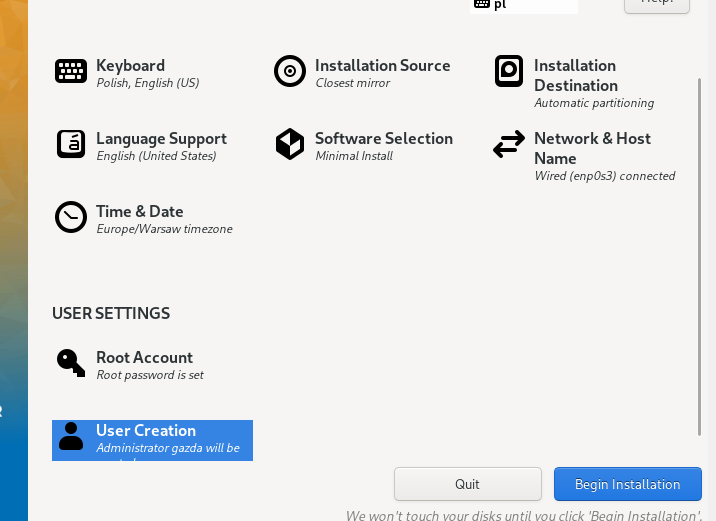

Instalacja systemu Fedora:





Wybrane opcje:

Język systemu: angielski US,

Układ klawiatury: polski, angielski US,

Czas i data: Eruopejski/Warszawa,

Software: minimal,

Podział dysku: automatyczny,

Root + user gazda.


Po instalacji systemu należało wyciągnąć plik anaconda-ks.cfg poza wirtualna maszyne w celu prostej edycji i późniejszego umieszczenia jej na jakimś hostingu.


Skopiowanie paczki z programem z woluminu dockera do hosta:


Idea zadania polega na zmianach w pliku anaconda, oraz umieszczeniu pliku anaconda oraz archiwum z programem na hostingu.

Irssi umieszczone zostałona jakimś randomowym hostingu:

```
https://files.catbox.moe/6ovqpk.tgz
```


a plik anaconda w repozytorium na githubie. Dodatkowo użyłem link shortenera, ponieważ link do pliku na githubie jest dosyć długi.

W pliku anaconda dodałem potrzebne paczki, linki do repo, oraz zestaw instrukcji pobierających irssi oraz je instalujących. W tym pobranie paczki z inrssi za pomocą wget, wypakowanie jej za pomocą tar i instalacja przy pomocy ninja.
Dodatkowo ważne było aby zmienić typ interfejsu z graphical na text.


Po wykonaniu tych czynności należało przeprowadzić instalacje ponownie, tym razem już zautomatyzowaną.


Na początku instalatora należało podać instrukcje inst.ks=link_do_anaconda.cfg


Pare screenów z procesu instalacji:


Po zainstalowaniu się systemu możemy cieszyć się działającym irssi:


Gotowy plik anaconda-ks.cfg:

```
# Generated by Anaconda 36.16.2
# Generated by pykickstart v3.36
#version=F36
# Use graphical install
text

# Keyboard layouts
keyboard --vckeymap=pl2 --xlayouts='pl','us'
# System language
lang en_US.UTF-8

#repos
url --mirrorlist=http://mirrors.fedoraproject.org/mirrorlist?repo=fedora-$releasever&arch=x86_64
repo --name=updates --mirrorlist=http://mirrors.fedoraproject.org/mirrorlist?repo=updates-released-f$releasever&arch=x86_64

%packages
@^minimal-environment

tar
wget
gcc
gcc-c++
make
automake
meson
ca-c*
libgcrypt*
glib2*
utf8proc*
openssl-devel
ncurses*
glib2-devel

%end

# Run the Setup Agent on first boot
firstboot --enable

# Generated using Blivet version 3.4.3
ignoredisk --only-use=sda
autopart
# Partition clearing information
clearpart --none --initlabel

# System timezone
timezone Europe/Warsaw --utc

# Root password
rootpw --iscrypted $y$j9T$h95D8srHFiUK5fYpSjcYb8Gp$8qeR872Cx0NSPlTAfyg6vnv9POXb8GJYfqj96.eczQ/
user --groups=wheel --name=gazda --password=$y$j9T$FDgZXK/92EvjdDIRWJqrpYAs$mJzu3T1iDDZt7YNu0kHgMZu31RukXqKoo35J79EGDoD --iscrypted --gecos="gazda"

%post

mkdir -p /home/gazda/irssi
cd /home/gazda/irssi
wget "https://files.catbox.moe/6ovqpk.tgz"
tar -xf 6ovqpk.tgz
cd irssi
ninja -C build install

%end

reboot

```
