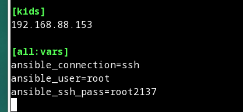
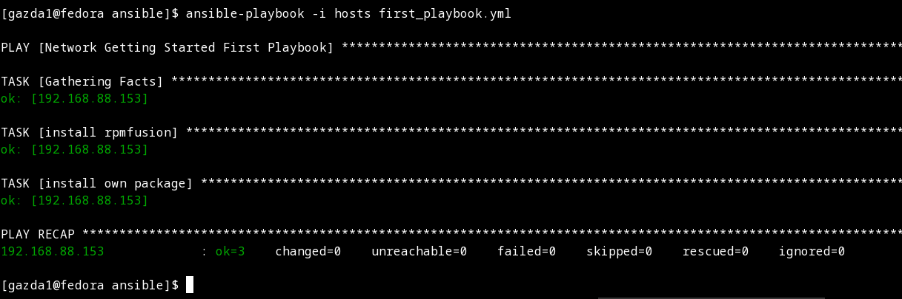

Instalujemy 2 systemy Fedora:

Upewniamy się czy oba systemy się widzą (żeby to osiągnąć ustawiłem w VBOX typ network adapter na briged na obu maszynach):

Na jednym z systemów instalujemy ansible:

Dokonujemy zmiany w ansible.cfg w lokalizacji (/etc/ansible/):

Edycja pliku hosts(hosts ansible nie hosts linuxowy!)

Ping do drugiej maszyny:

Pobranie playbooka:

Edycja playbooka:

Proba uruchomienia go, zakonczona niepowodzeniem. Należy inaczej skonfigurować instalacje rmfusion.

Poprawiona instalacja rpmfusion (warto dodac ze nalezalo zmienic gather_facts na true, aby dzialalo odczytywanie zmienniej ansible_distribution_major_version:

Ponowna proba uruchomienia:

Kolejny blad, naprawienie go wymaga dodania disable_gpg_check: true. Dodatkowo dodana została instrukcja instalująca wybrany przeze mnie pakiet (wget):

Poprawne dzialanie:

