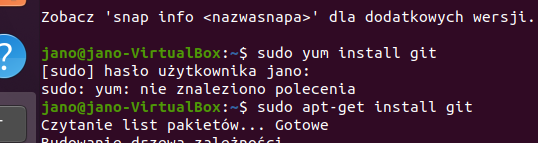
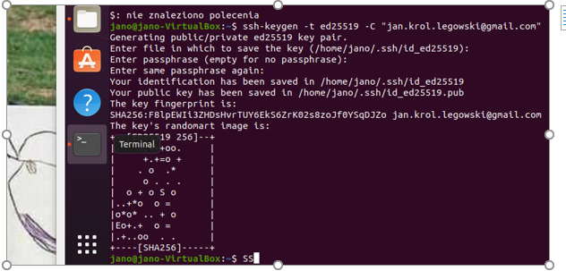
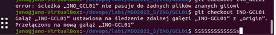
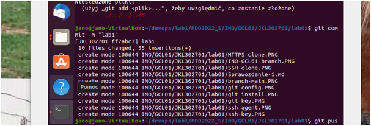
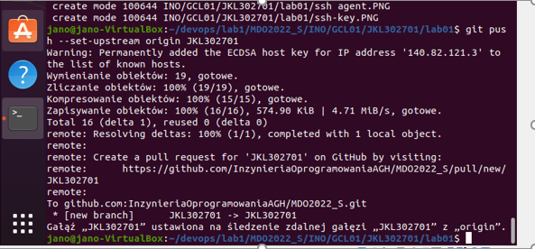

# Sprawozdanie 1 

 `sudo apt-get install git`
 instalacja gita 
 
 
 

`git clone https://github.com/InzynieriaOprogramowaniaAGH/MDO2022_S.git `
Klonuje repozytorium

`ssh-keygen -t ed25519 -C "jan.krol.legowski@gmail.com" ` 
Generuje nowy klucz SSH

`eval "$(ssh-agent -s)"`
`ssh-add ~/.ssh/id_ed25519`
Dodaje klucz prywatny do ssh agent

`git config --global user.email "jan.krol.legowski@gmail.com" `
`git config --global user.name "PanJanke"` 
Ustawienie nazwy oraz adresu email

`git checkout main` 
Przełączam się na gałąź main

Za pomocą  komendy `cd` przechodzę do swojej  grupy

`git checkout INO-GCL01` 
 Przełączam się na gałąź swojej grupy
 
 
 
 

`git checkout -b JKL302701` 
Tworzę nową gałąź

`mkdir JKL302701` oraz `mkdir lab01` 
Tworzę odpowiednie katalogi

Do katalogu dodaje pliki następnie zatwierdzam zmiany przy użyciu `git add .`

`git commit -m "lab1"` 
Tworzę commit z komentarzem

`git push --set-upstream origin JKL302701`
Wysyłam zmiany 

