

# Sprawozdanie 02

## **Podpunkt 1  2**
Przejście do katalogu `.git` oraz `hooks`

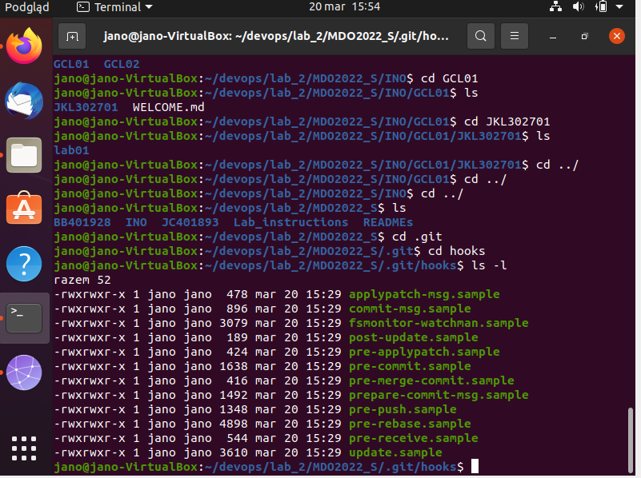

Tworzę skrypt który sprawdza tytuł commita poprzez edycję pliku  `commit-msg.sample`

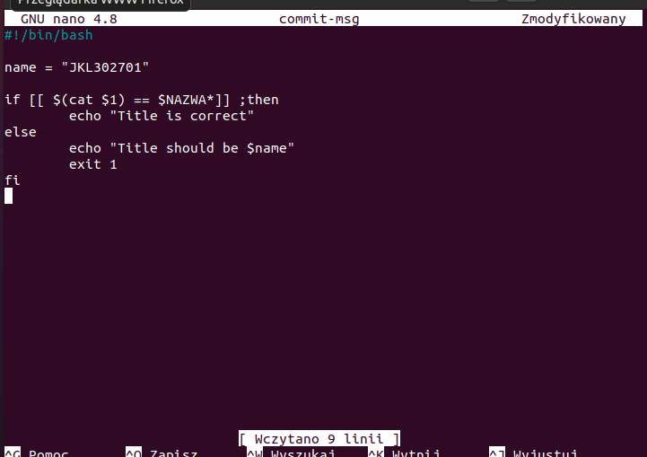

Zmieniam nazwę pliku z `commit-msg.sample` na `commit-msg`

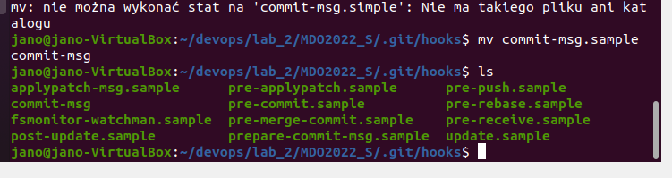

Przedstawienie działania skryptu dla poprawnego i niepoprawnego tytułu


Tworzę drugi skrypt, którego zadaniem jest sprawdzenie czy w treści commita jest numer labolatorium. Edytuję plik  `pre-commit.sample`

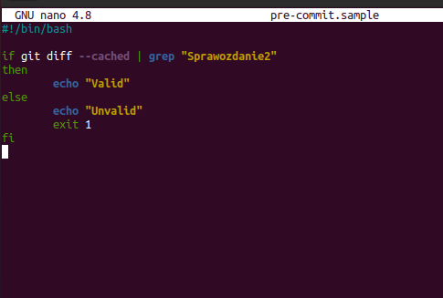

Przedstawienie działania skryptu dla poprawnych i niepoprawnych danych 


## **Podpunkt 3**

Instaluje OpenSSH 
	`sudo apt update`
	`sudo apt install openssh-server`


 Sprawdzam status OpenSSH servera poprzez

```shell
$ sudo systemctl status ssh
```

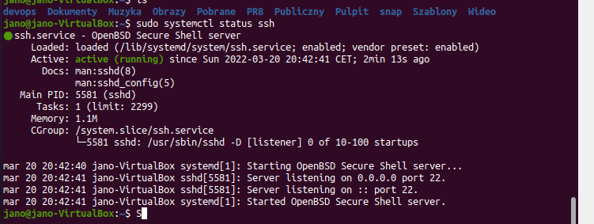

Sprawdzam ip maszyny wirtualnej  `ifconfig`

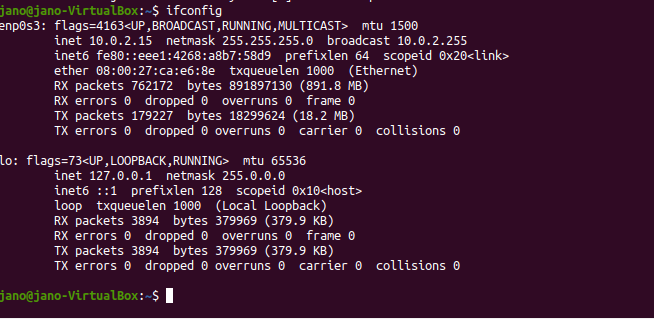

Za pomocą programu PuTTy łączę się z maszyną wirtualną

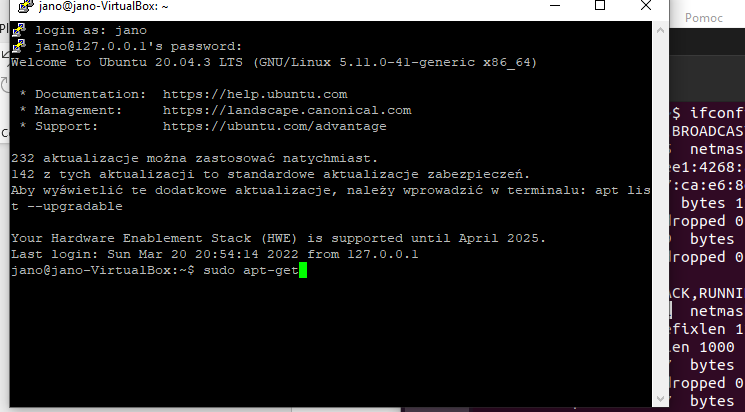

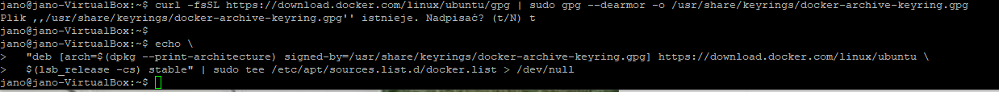

 Aktualizuje listy paczek z repozytoriów

```shell
$ sudo apt-get update
```

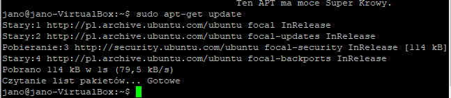

Instaluje wymagane depenencję

```shell
$ sudo apt-get install \
>     ca-certificates \
>     curl \
>     gnupg \
>     lsb-release
>     
```

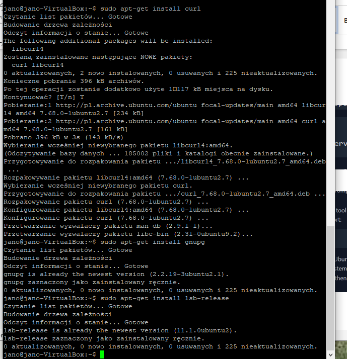

Dodaje  klucze GPG dockera oraz ustawiam repozytorium na `stable`

```shell
curl -fsSL https://download.docker.com/linux/ubuntu/gpg | sudo gpg --dearmor -o /usr/share/keyrings/docker-archive-keyring.gpg
```


```shell
echo \
  "deb [arch=$(dpkg --print-architecture) signed-by=/usr/share/keyrings/docker-archive-keyring.gpg] https://download.docker.com/linux/ubuntu \
  $(lsb_release -cs) stable" | sudo tee /etc/apt/sources.list.d/docker.list > /dev/null
```


Na koniec instaluje  **Docker Engine**

```shell
 $ sudo apt-get update
 $ sudo apt-get install docker-ce docker-ce-cli containerd.io
```


---

## **Podpunkt 4**

Uruchamiam  dockera i sprawdzam jego status

```shell
$ sudo service docker start
$ sudo service docker status
```


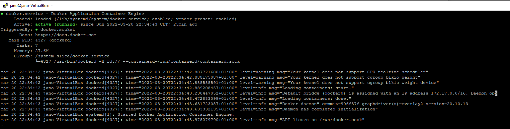

Uruchamiam obraz `hello world` 


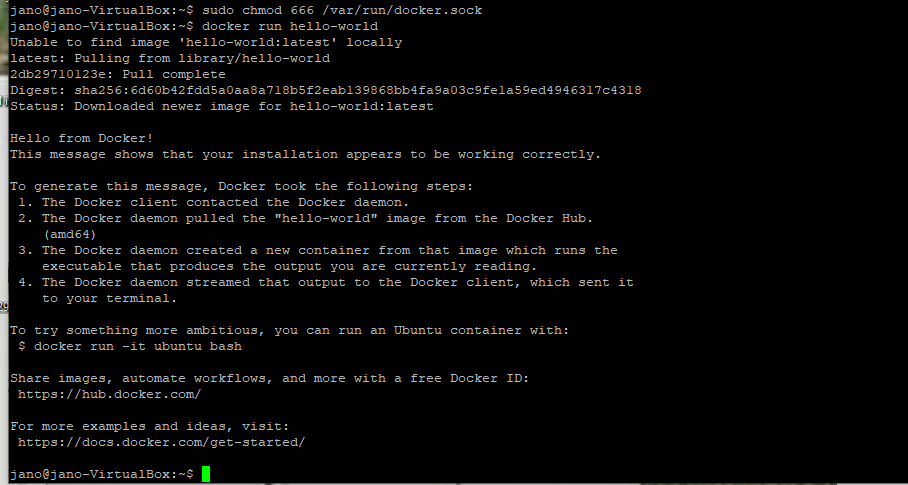

Pobieram obraz fedory i uruchamiam go 
```shell
$ sudo docker run fedora 
```

Sprawdzam wersję obrazu 
```shell
$ sudo docker images
```

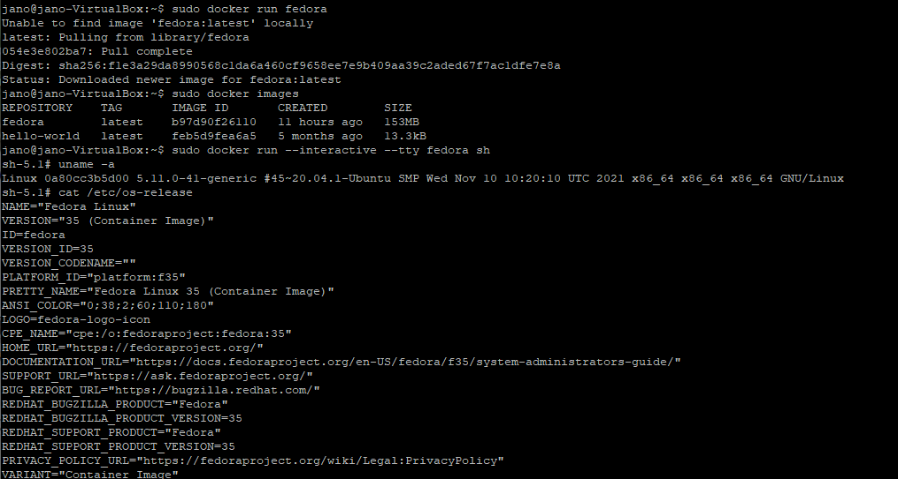


---

## **Podpunkt 5**

Założyłem konto  w serwisie **Docker Hub**

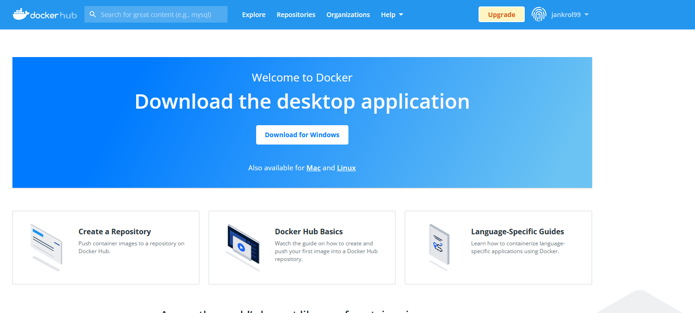

