


# Sprawozdanie 3
### 29.03.2022
---
Jako projekt wybrałem nodejs.org, ma otwartą licencję oraz zawiera testy. Link do repozytorium: https://github.com/nodejs/nodejs.org.git .

Przy użyciu `git clone` klonuje repozytorium.

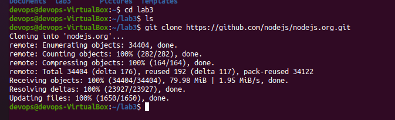

`sudo apt install npm` - instalacja menedżera pakietów

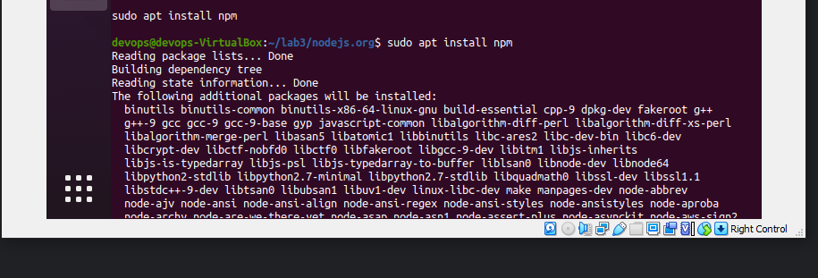

Za pomocą poniższych komend zbudowałem program oraz uruchomiłem testy.

```bash
$ npm run build
```
```bash
$ npm run test
```

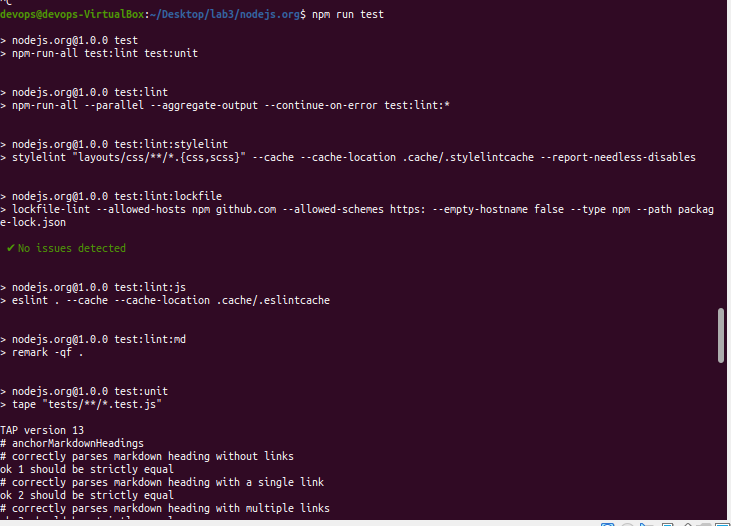
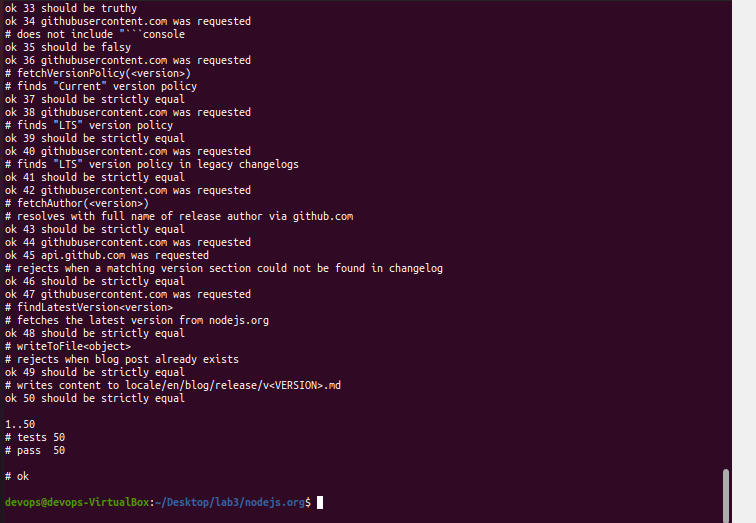


Protokołem SSH łączę się ze swoją wirtualną maszyną a następnie pobieram obraz node

```bash
$ sudo docker pull node
```
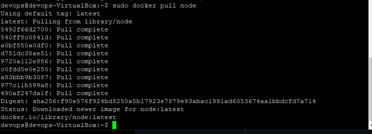


Uruchamiam kontener i podłączam się do niego
```bash
$ sudo docker run --interactive --tty node sh
```


Będąc w kontenerze, powtarzam czynności, klonuje repo, buduje program i włączam testy

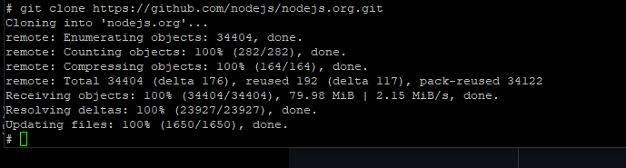
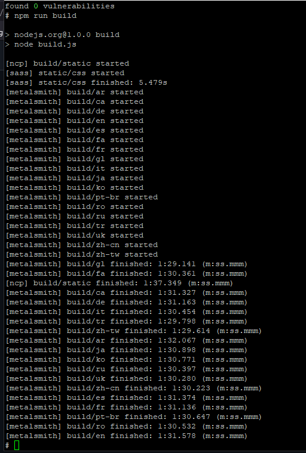


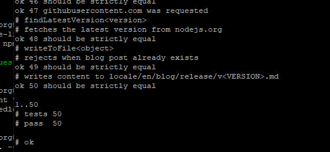


Następnym zadaniem było stworzenie dwóch plików Dockerfile, automatyzujących powyższe kroki.

Pierwszy z nich miał zbudować program.

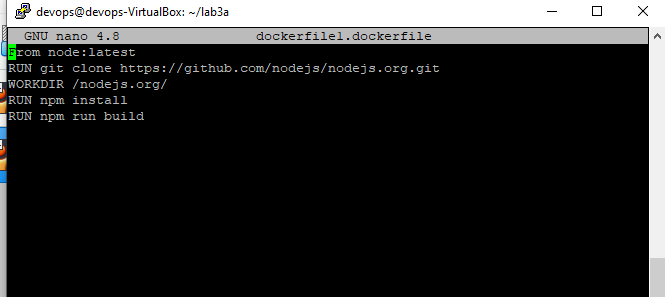


`FROM` wybór konkretnego obrazu, 
`RUN` uruchamia komendę klonowania odpowiedniego repozytorium, `WORKDIR` ustawia bezwzględną ścieżkę roboczą,
 `RUN` uruchamia komendę zainstalowania npm oraz rozpoczyna bulid.

Buduję docker o nazwie tag1 przy użyciu stworzonego pliku:

```bash
$ sudo docker build . -f dockerfile1.dockerfile -t tag1
```

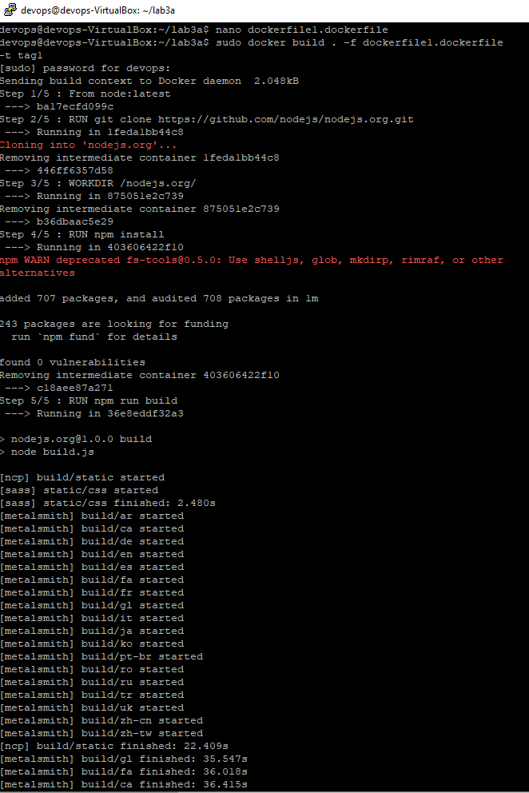

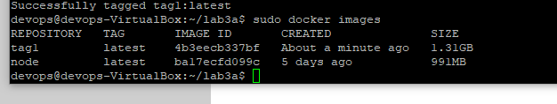


Drugi z plików Dockerfile miał bazować na pierwszym oraz wykonywać testy.


Buduję drugi docker o nazwie img2 :

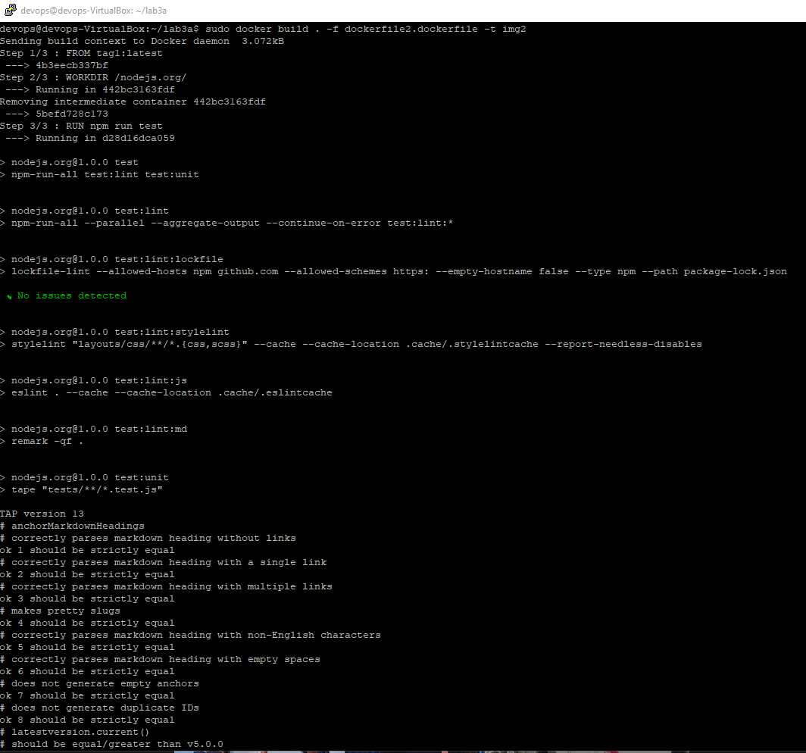


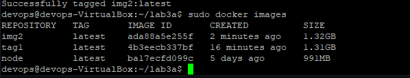


Ostatnim krokiem było wykazanie, że dany kontener hostuję stronę na porcie 8080. 

```bash
$ sudo docker run --interactive --tty node sh

```

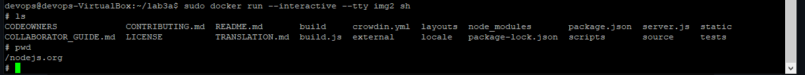

Powyższą komendą wchodzę do kontenera.

```bash
$ npm start
```

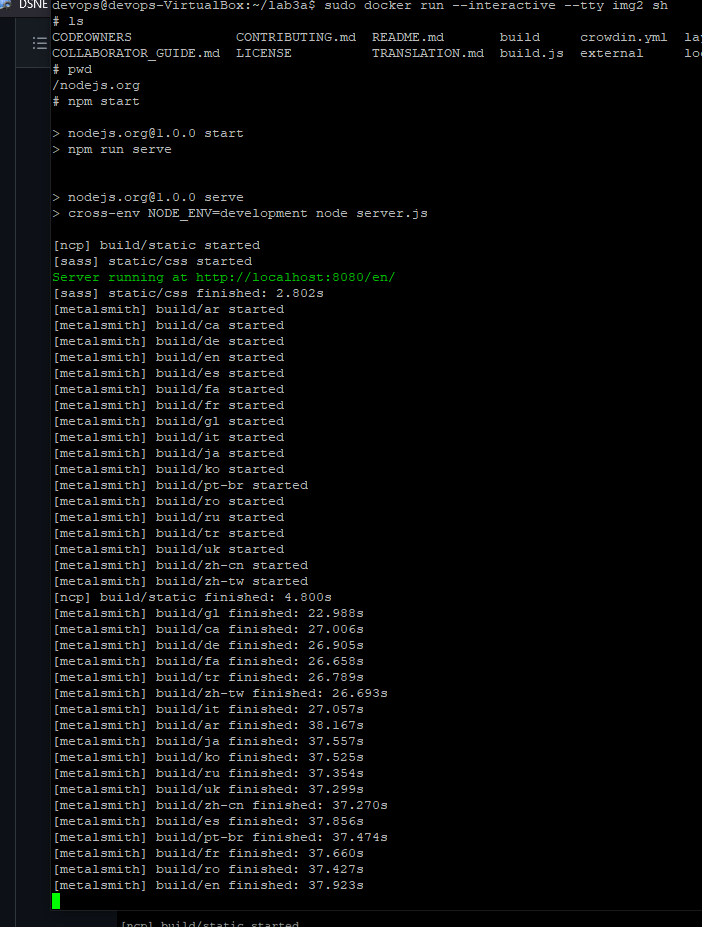


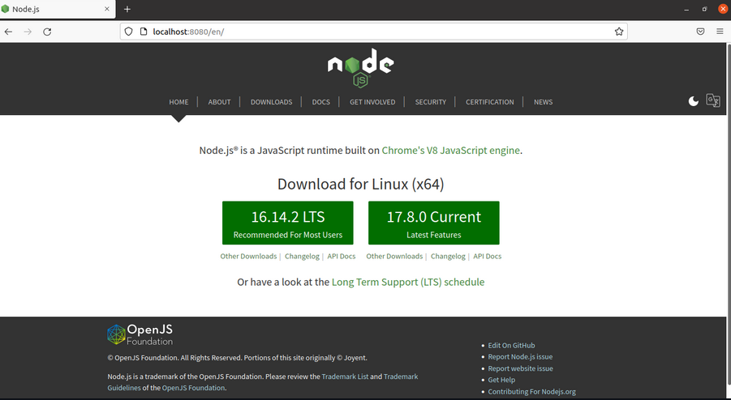

