# Sprawozdanie 4
### 03.04.2022
---
## Zachowywanie stanu

Rozpoczynam od stworzenia dwóch woluminów wejściowego oraz wyjściowego 

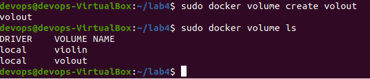

Wyświetlam szczegóły o woluminach znajdując potrzebna informacją do dalszej części sprawozdania
`docker volume inspect`
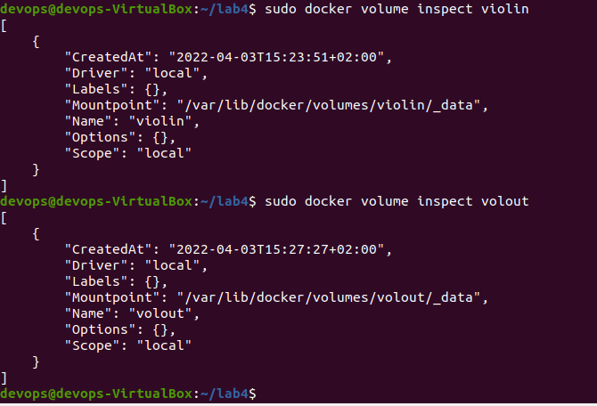

Uruchamiam kontener. Jednocześnie montuję oba volume. Do uruchomienia uzywam polecenia `docker run`. 
Używam flagi `-it` by użyć interaktywnego terminalu.

Po wpisaniu `ls` widzimy utworzone katalogi `vin` i `vout`

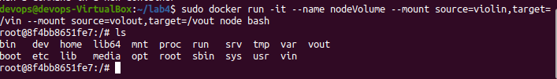

Przechodzę na roota 

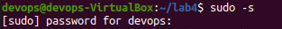

Klonuję repozytorium na wolumin wejściowy `volin`

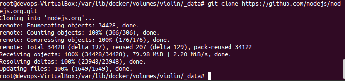

Pobieram potrzebne zależności

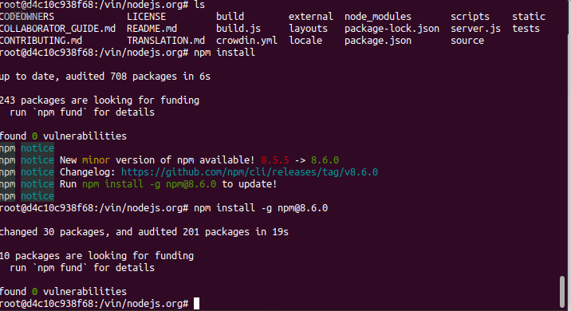

Buduję projekt

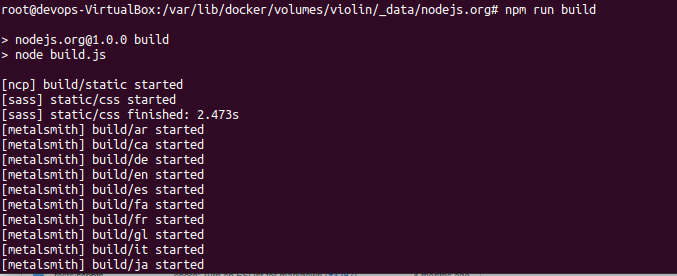

Skopiowałem powstały folder `build` do katalogu `vout`

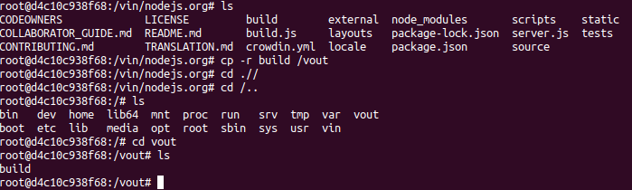

Po wyłączeniu kontenera pliki z woluminu wyjściowego się zachowały

## Eksponowanie portu

Pobieram odpowiedni obraz dockerowy `docker pull networkstatic/iperf3` 

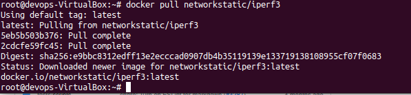

Uruchamiam 
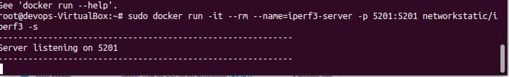

Sprawdzam nasłuchujące porty 

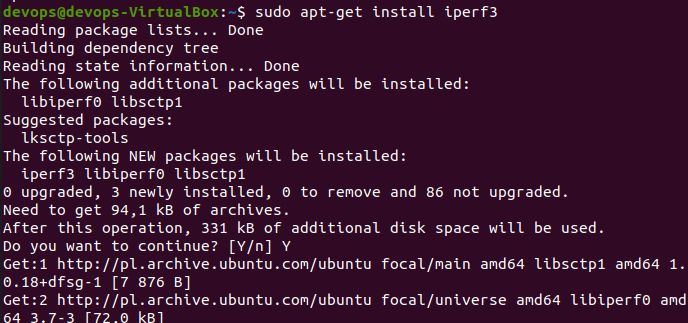

Sprawdzam IP serwera 

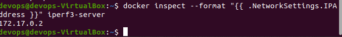

Łączę się z serwerem z drugiego kontenera 

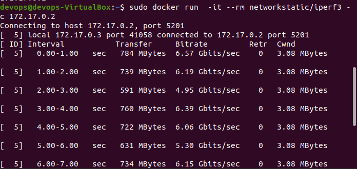

Instaluje ipref3 na hoscie

Łącze się z hosta

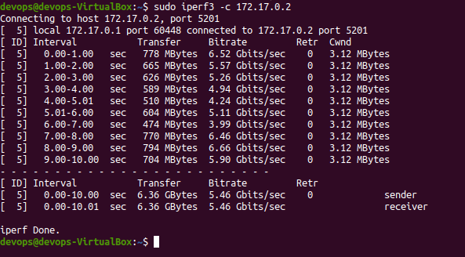

Logi z serwera

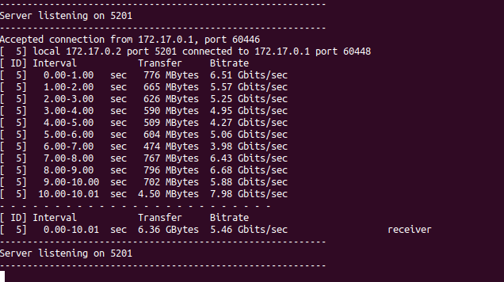

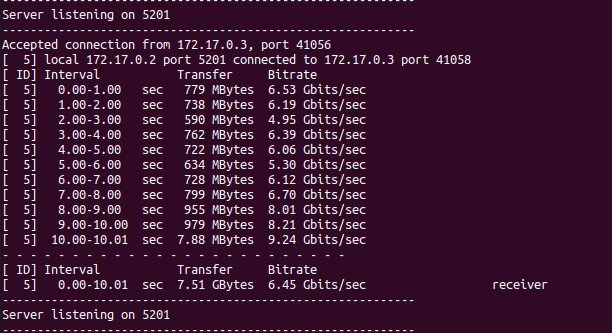

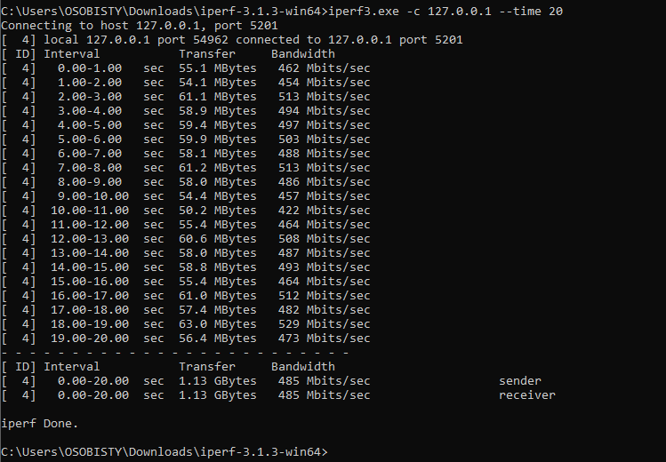

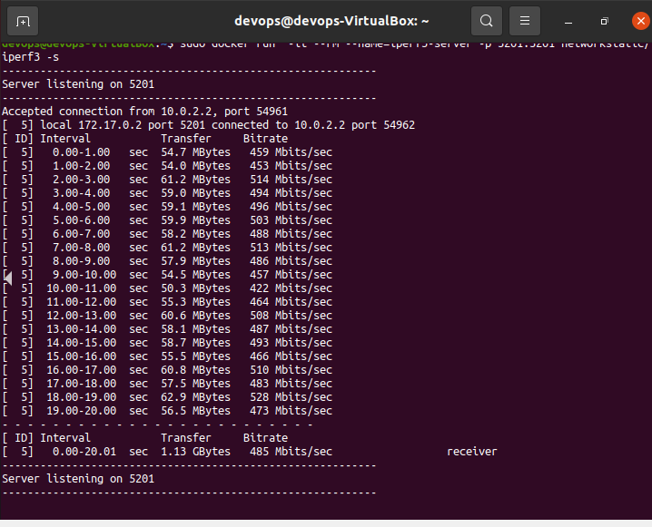

Jak widać najmniejszą przepustowość uzyskano z zewnętrznego komputera.

## Instancja Jenkins

Tworzę nową sieć dockerową

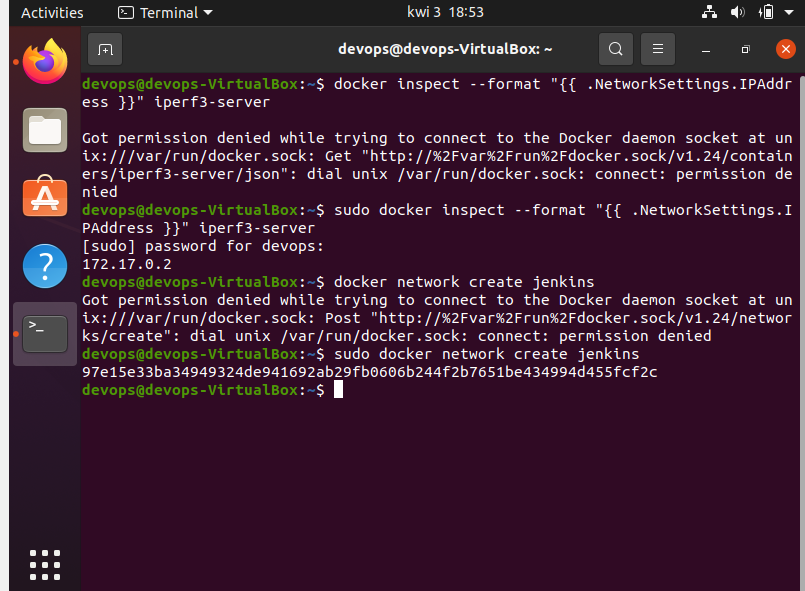  

Następnie przeprowadzam instalacje postępując zgodnie z dokumentacją

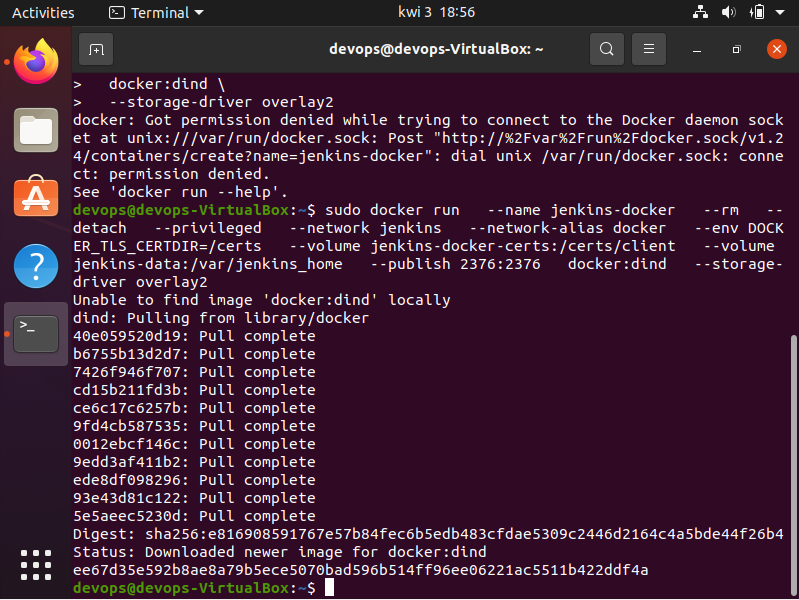

Tworzę Dockerfile

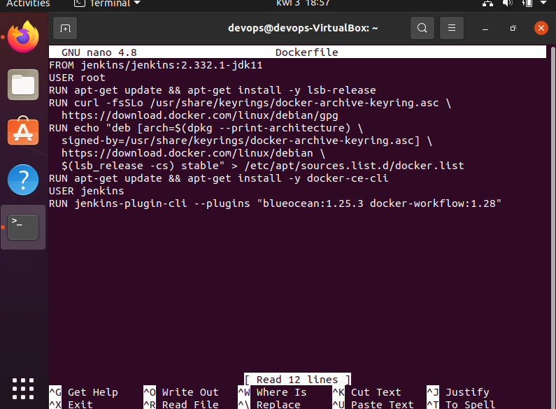

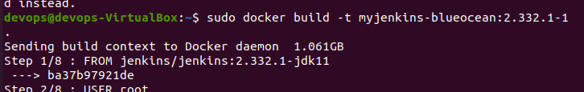

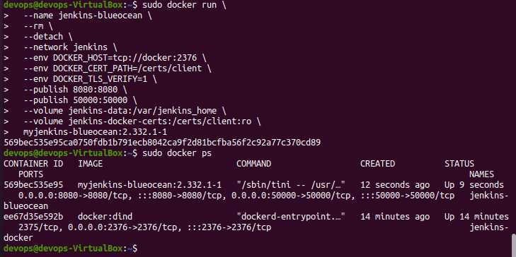

Jak widać instancja jest uruchomiona

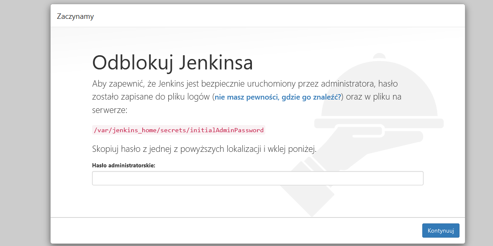

Poleceniem `docker exec` uruchamiam na aktywnym kontenerze interaktywny terminal z bashem. Poleceniem `cat` odczytuje hasło.

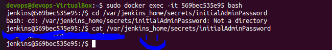

Instaluje zalecane wtyczki

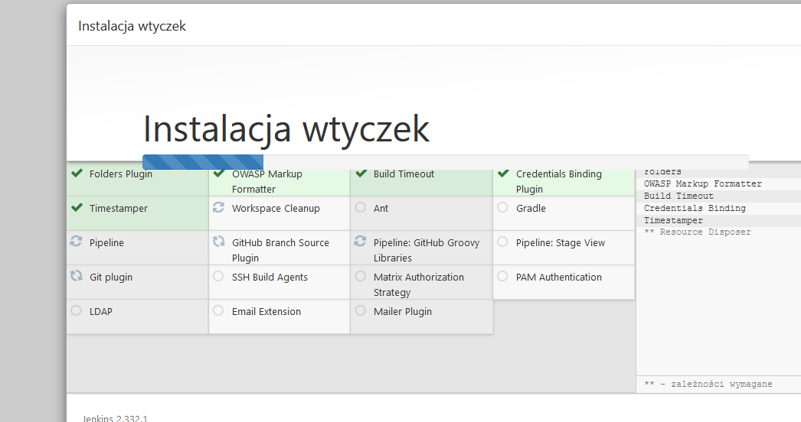

Ekran logowania

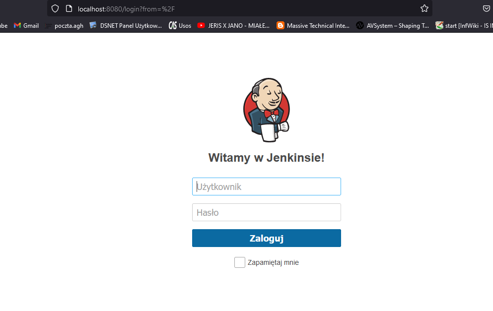