# Sprawozdanie 9
# Jan Król - Łęgowski Inżynieria Obliczeniowa

## Przygotowanie systemu pod uruchomienie

1. Instalacja Systemu Fedora 36

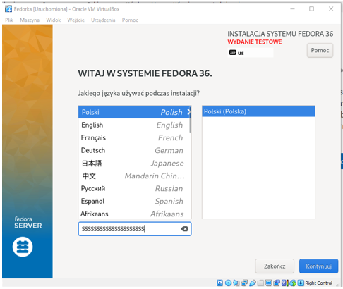
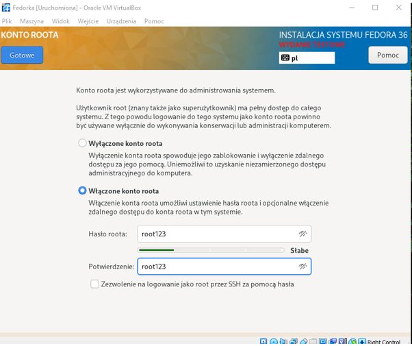
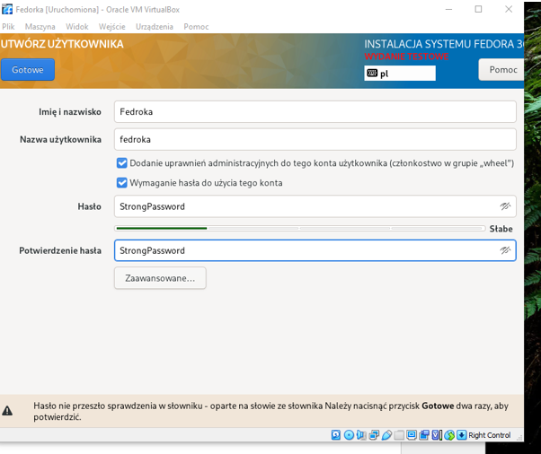

Po instalacji i uruchomieniu przechodzę na roota i dostaję się do pliku anaconda.

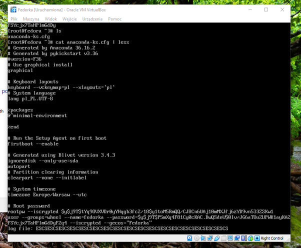

Staram się przerzucić plik na windowsa jak najmniejszym kosztem. Robię screena i próbuję zrobić to darmowym OCRem z internetu. Niestety po bliższym przyjżeniu się, dostrzegam dużo literówek których niechce mi sie poprawiać.

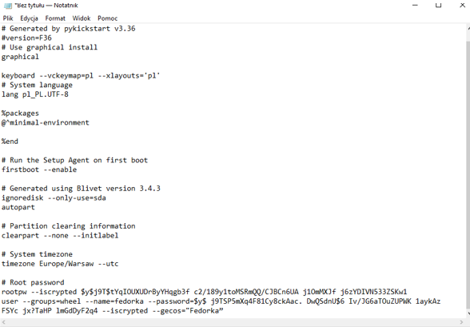

Z ogromnym bólem zostaję zmuszony do skonfigurowania virtualki tak bym mógł się połączyć przez ssh i pobrać plik.

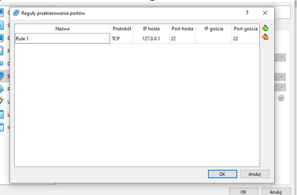


2. Następnie instaluję kolejną fedorę, która będzie pełniła rolę hosta. Użyte komendy do konfiguracji:

```sudo dnf install httpd```\
```sudo dnf group install "Web Server"```\
```sudo systemctl start httpd```\
```sudo systemctl enable httpd```\
```sudo firewall-cmd --add-service=http --add-service=https --permanent```\
```sudo firewall-cmd --reload```\

4. Wrzucam artefakt z Pipeline do serwera

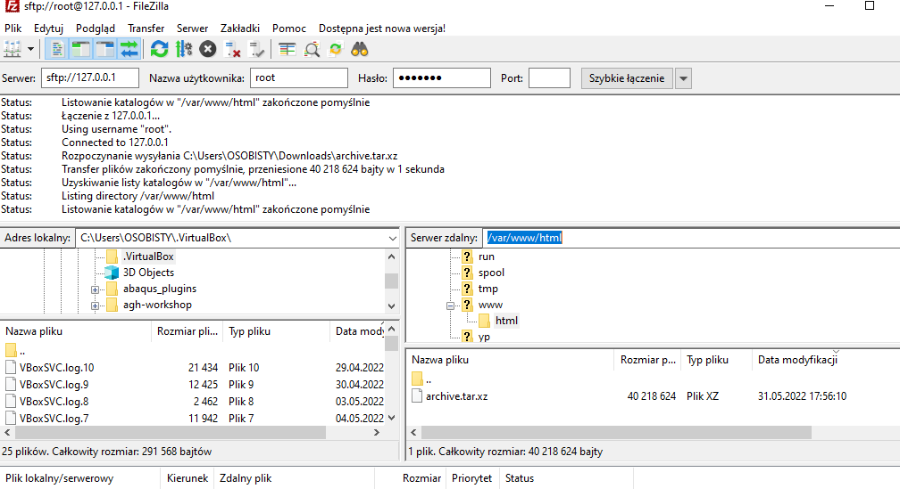

5. Sprawdzam czy działa 

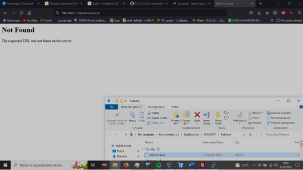
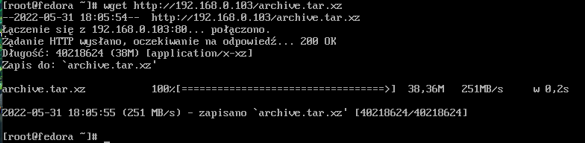


## Instalacja nienadzorowana

1. Edytuję plik ```anaconda-ks.cfg```. Dodaję ścieżkę do repo, dodałem odpowiednie narzędzia i pobranie artefaktu:

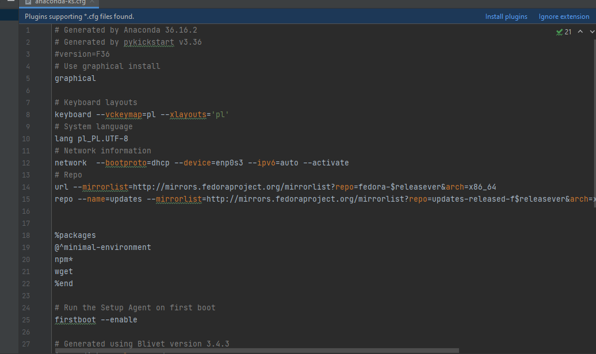

2. Umieściłem plik na repozytorium:
```https://raw.githubusercontent.com/InzynieriaOprogramowaniaAGH/MDO2022_S/JKL302701/INO/GCL01/JKL302701/lab09/anaconda-ks.cfg```

3. Następnie przeszedłem do instalacji Fedory, gdzie użyłem powyższej ścieżki.

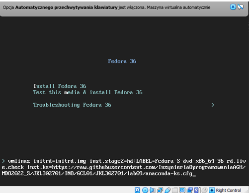

4. Instalacja zakończona:


5. Wyświetlam artefakt:

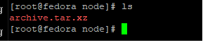
