### Sprawozdanie Lab.11 
## Jan Król - Łęgowski Inżynieria Obliczeniowa

# Instalacja klastra Kubernetes

- Zaopatrz się w implementację stosu k8s minikube, przeprowadź instalację, wykaż poziom bezpieczeństwa instalacji.

Kubernetesa instaluje na Ubuntu postawionej na Virtual Boxie. Z którym dla wygody użytkowania łączę się przez SSH za pomocą programu `PuTTy` 
Sprawdzam architekture systemu za pomocą komendy
```uname -a```.

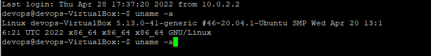

Pobieram odpowiedni obraz 
```curl -LO https://storage.googleapis.com/minikube/releases/latest/minikube-linux-amd64```

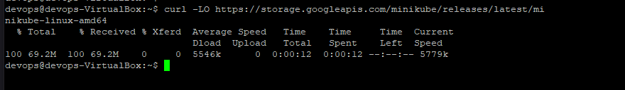

Instaluje minikube
```sudo install minikube-linux-amd64 /usr/local/bin/minikube```

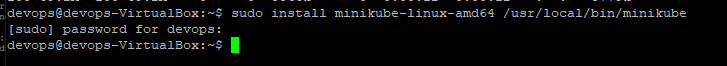


Startujemy klaster
```minikube start```.

Tu pojawił się pierwszy problem
Tak jak podpowiada mi kubernetes dodaje uzytkownika do grupy docker.
```sudo usermod -aG docker devops && new grp docker```


- Zaopatrz się w polecenie kubectl
```minikube kubectl --get pods -A```

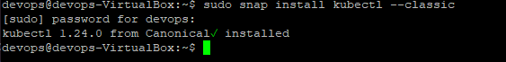


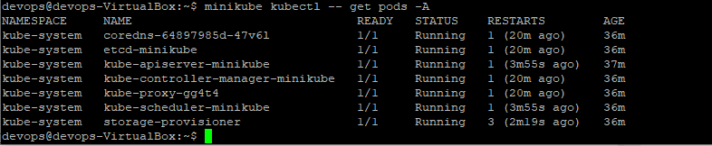

- Uruchom Kubernetes, pokaż działający kontener/worker
```docker ps```

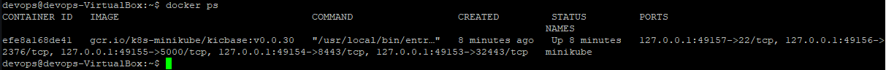


- Zmityguj problemy wynikające z wymagań sprzętowych lub odnieś się do nich (względem dokumentacji)

  Przydzielilem tylko 2 rdzenie, bo wiecej nie mam :<
  

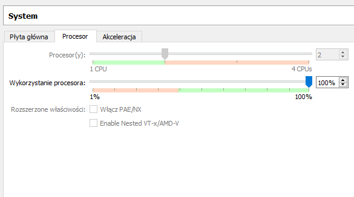
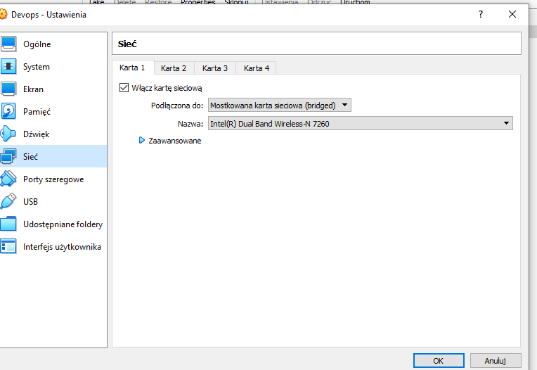


- Uruchom Dashboard, otwórz w przeglądarce, przedstaw łączność

by wyświetlić klaster z interfejsem graficznym. Używam komendy
```minikube dashboard```.

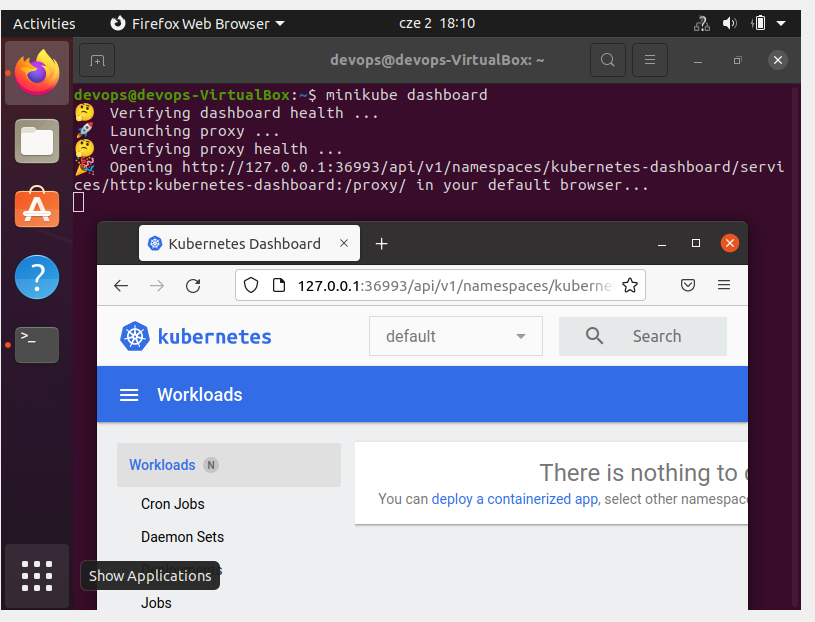


- Deploy aplikacji do minikube'a

jako deployowanego obrazu użyłem domyślnego obrazu *echoserver:1.4*.

Tworze deployment, za pomocą komendy 
```kubectl create deployment <nazwa> --image=<nazwa_obrazu:tag>```

Kolejny krok to expose na port 8080 
```kubectl expose deployment hello-minikub1 -type=LoadBalancer --port=8080```.


Włączamy obsługe deploymentu 
```kubectl get services elooo```
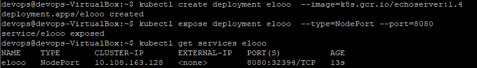

Korzystając z kubectl'a przekierowujemy się na port 7080 
```kubectl port-forward service/elooo 7080:8080```

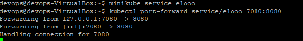

W tym momencie po wysłaniu requesta do adresu *localhost:7080* powinniśmy otrzymać naszą "aplikacje".


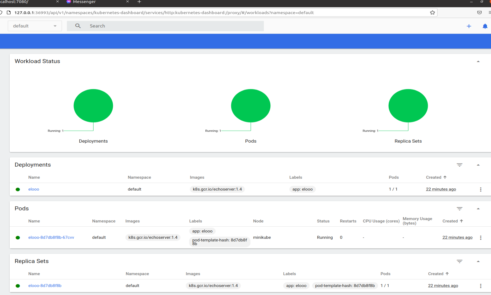

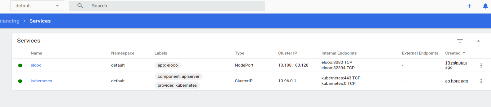


