# Sprawozdanie

- **Kontener Jenkins i DIND**

Docker-in-Docker znany jako DIND to kontener uruchomiony w innym kontenerze. Dzięki temu wewnętrzny kontener jest w stanie budować kontenery oraz je uruchamiać.

Uruchamiam dwa kontenery:
1) DIND
```shell
$ sudo docker run   
--name jenkins-docker   
--rm   
--detach   
--privileged   
--network jenkins   
--network-alias docker   
--env DOCKER_TLS_CERTDIR=/certs   
--volume jenkins-docker-certs:/certs/client   
--volume jenkins-data:/var/jenkins_home   
--publish 2376:2376   docker:dind   
--storage-driver overlay2
```

2) Jenkins
```shell
$ sudo docker run   
--name jenkins-blueocean   
--rm   
--detach   
--network jenkins   
--env DOCKER_HOST=tcp://docker:2376   
--env DOCKER_CERT_PATH=/certs/client   
--env DOCKER_TLS_VERIFY=1   
--publish 8080:8080   
--publish 50000:50000   
--volume jenkins-data:/var/jenkins_home   
--volume jenkins-docker-certs:/certs/client:ro   myjenkins-blueocean:2.332.1-1
```

Komenda `sudo docker ps` wyświetla nam czynne kontenery:
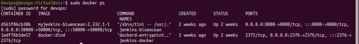
- **Przygotowania**

Wszystkie pliki `Dockerfile` oraz plik `Jenkinsfile` zawierający instrukcje pipeline'u zostały umieszczone w repozytorium na gałęzi `JKL302701`. 

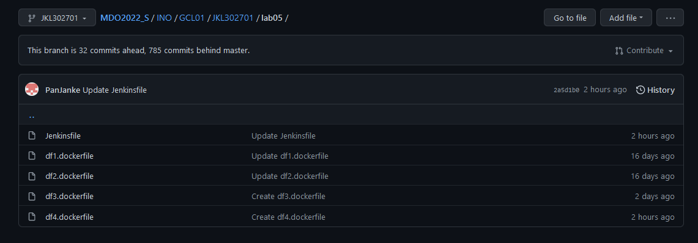

Następnie konfiguruję SCM ustawiając URL repozytorium, odpowiedni branch w tym repozytorium oraz ścieżkę do naszego Jenkinsfile'a

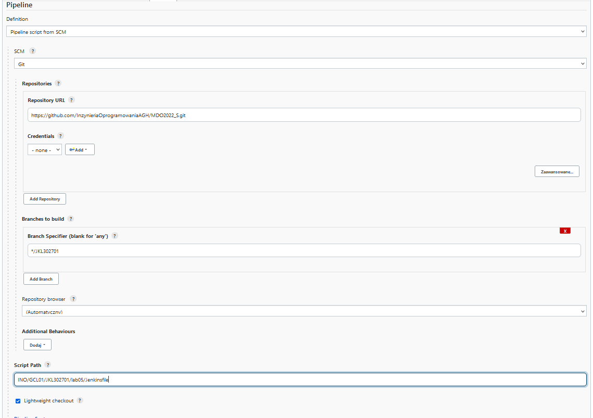


- **BUILD**

W celu stworzenia obrazu `builder` klonuję repozytorium z moim projektem .
W sklonowanym repo pod ścieżką `INO/GCL01/JKL302701/lab05` znajduje się plik `df1.dockerfile`, który tworzy nam wspomniany wcześniej obraz `builder`. 
```
From node:latest
RUN git clone https://github.com/nodejs/nodejs.org.git
WORKDIR /nodejs.org/
RUN npm install -f
RUN npm run build
```

Obraz tworzony jest na podstawie obrazu `node`. Celem tego obrazu jest pobranie wymaganych dependencji poprzez polecenie `npm install` oraz stworzenie zbuildowanych plików poprzez polecenie `npm run build`.

Tu pojawiły się pierwsze problemy przy instalacji dependencji:

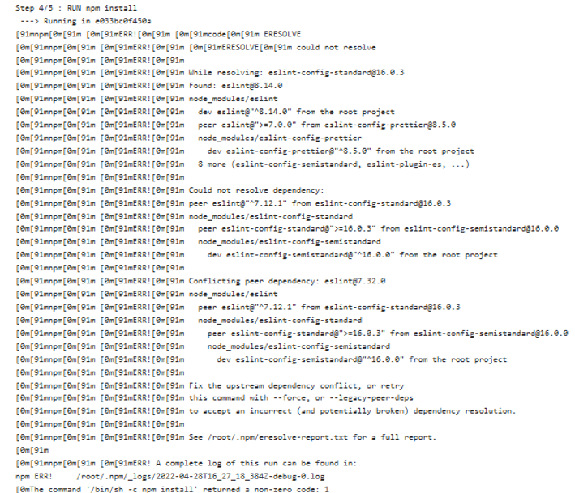

Rozwiązaniem okazało się sforoswanie instalacji poprzez dodanie flagi `-f` lecz jest to rozwiązanie nie zalecane przez profesjonalistów.

**W krokach deploy i publish przerzucam pliki z tego kontenera, dlatego nie podłączam woluminu**

```
stage('Build') {
            steps {
    
                echo 'BUILD'
                git branch: 'JKL302701', url: 'https://github.com/InzynieriaOprogramowaniaAGH/MDO2022_S.git'
                dir('INO/GCL01/JKL302701/lab05') {
                    sh 'docker build . -f df1.dockerfile -t builder'
                }
            }
        }
```

- **TESTS**

Na tym etapie tworzymy obraz `tester`, którego zadaniem jest przeprowadzenie testów na naszej aplikacji.
Dockerfile:
```
FROM builder:latest
WORKDIR /nodejs.org/
RUN npm run test
```
Obraz ten budowany jest na podstawie obrazu `builder`

Jenkinsfile:
```
stage('Tests') {
            steps {
                echo 'TESTS'
                dir('INO/GCL01/JKL302701/lab05') {
                    sh 'docker build . -f df2.dockerfile -t tester'
                }
            }
        }
```

- **DEPLOY**

**Deploy rozumiem poprzez przeniesienie zbuildowanej aplikacji do odzielnego kontenera i jej uruchomienie.**
Uruchamiam obraz `builder` z podłączonym woluminem, na który kopiuję folder `build`. Następnie tworzę obraz `deploy`, który będzie hostował aplikację. Obraz opeiram o `nginx:stable-alpine`, ze względu na moje lenistwo, ponieważ by program działał poprawnie wystarczy przenieść folder `build` do `usr/share/nginx/html`.

Dockerfile:
```
FROM nginx:stable-alpine

COPY /build/ /usr/share/nginx/html
```
Przekierowuje port na 3000 by móc otworzyć stronę przez localhost.
```
stage('Deploy') {
            steps {
                echo 'DEPLOY'
                sh 'docker run --volume /var/jenkins_home/workspace/rurka1/INO/GCL01/JKL302701/lab05:/finalBuild builder mv -n build /finalBuild'
                dir('INO/GCL01/JKL302701/lab05') {
                    sh 'docker build . -f dock3.dockerfile -t deploy'
                }
                sh 'docker run --volume /var/jenkins_home/workspace/rurka1/INO/GCL01/JKL302701/lab05/build:/build -d -p 3000:80 deploy'
                sh 'docker stop $(docker ps -a -q)'
            }
        }
```


- **Publish**


**Publish rozumiem przez dostarczenie do klienta zbudowanej i przetestowanej aplikacji w formie archiwum, najlepiej z informacją o wersji programu.**

Niestety nie wiedziałem jak dodać wersję programu. Próbowałem parametrami ale się nie udało.

Dockerfile:
```
FROM builder:latest

RUN tar cfJ archive.tar.xz build
```

```
stage('Publish') {
            steps {
                echo 'PUBLISH'
                dir('INO/GCL01/JKL302701/lab05') {
                    sh 'docker build . -f df4.dockerfile -t publisher'
                }
                sh "docker run --volume /var/jenkins_home/workspace/PipeLine/INO/GCL01/JKL302701/lab05:/finalArchive publisher mv archive.tar.xz /finalArchive"
            }
        }
```

Jak widać powstał nasz publish w formie archiwum:
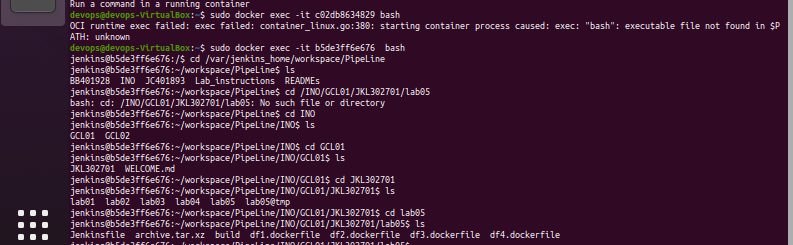

- **Logi**
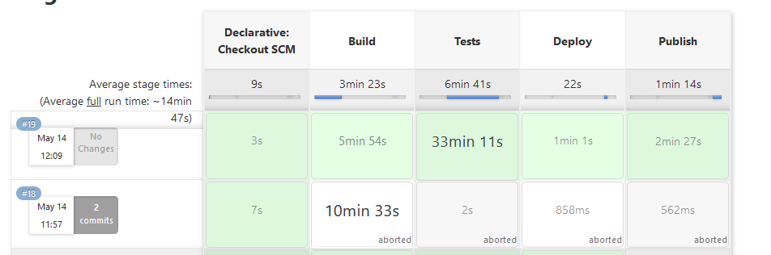

Sklonowanie przedmiotowego repo do Jenkinsa:
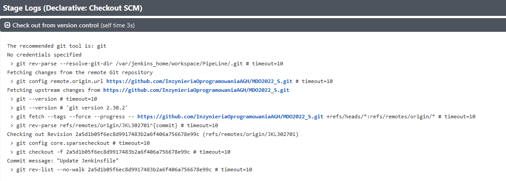

**Build**

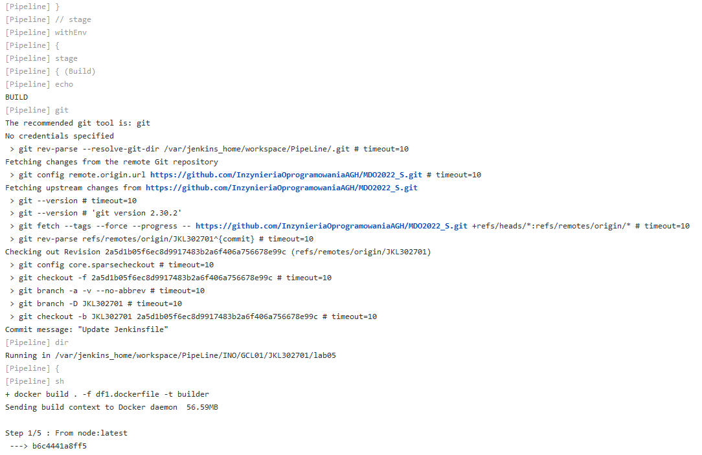
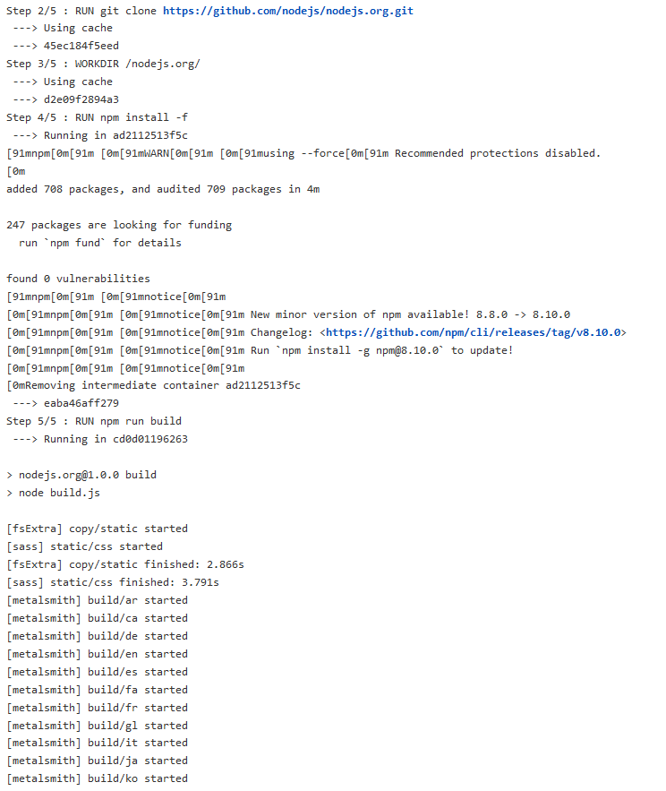
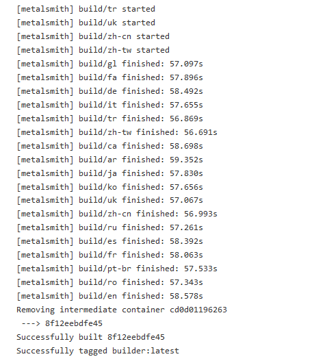

**Test**

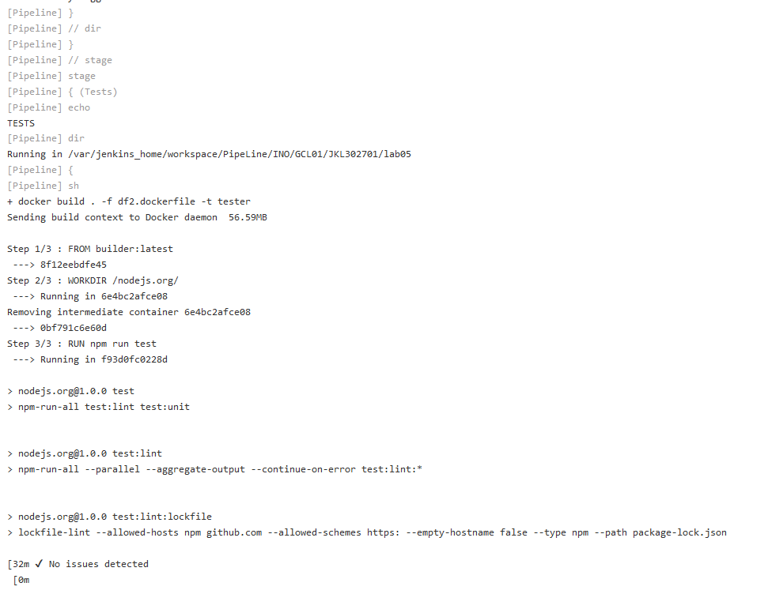
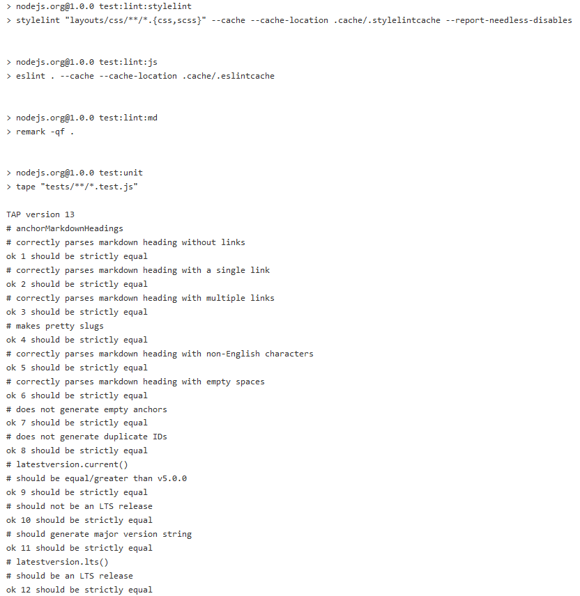
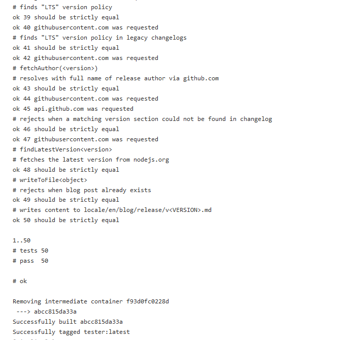

**Deploy**


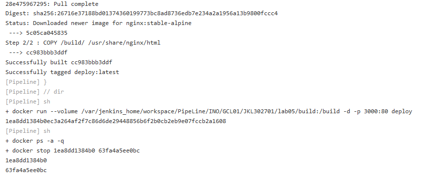

**Publish**

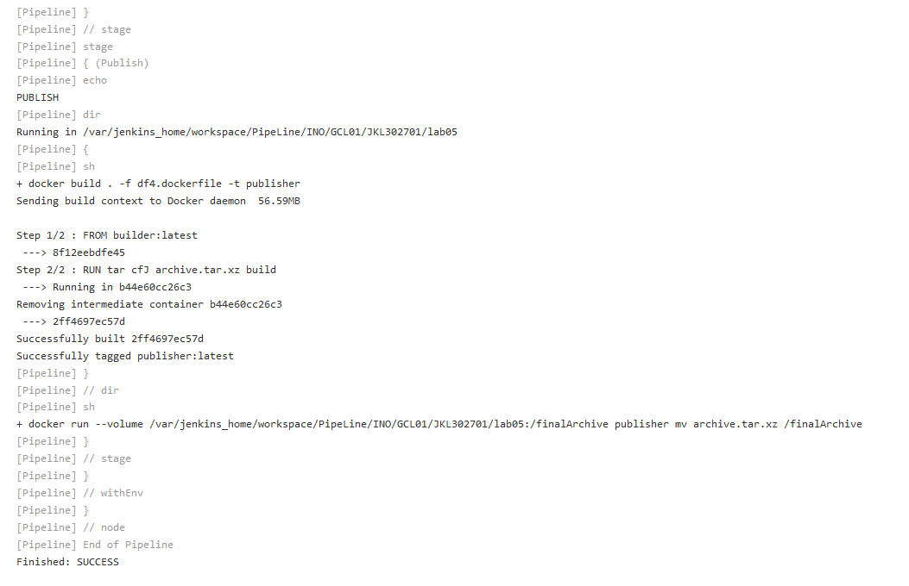
