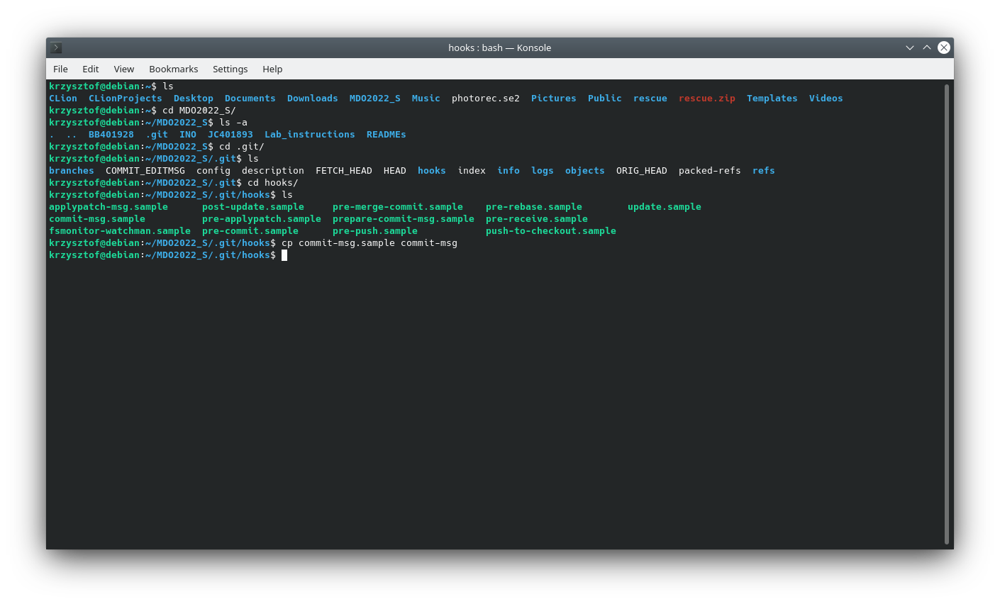
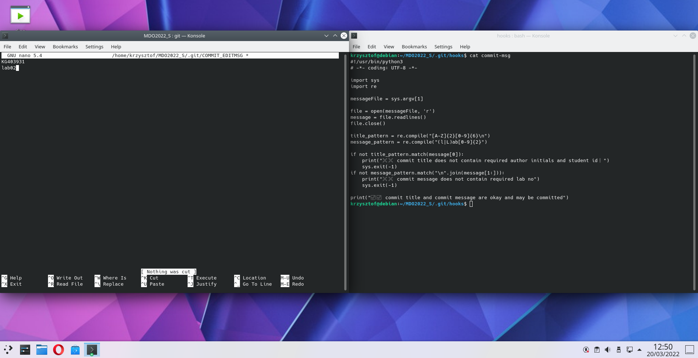
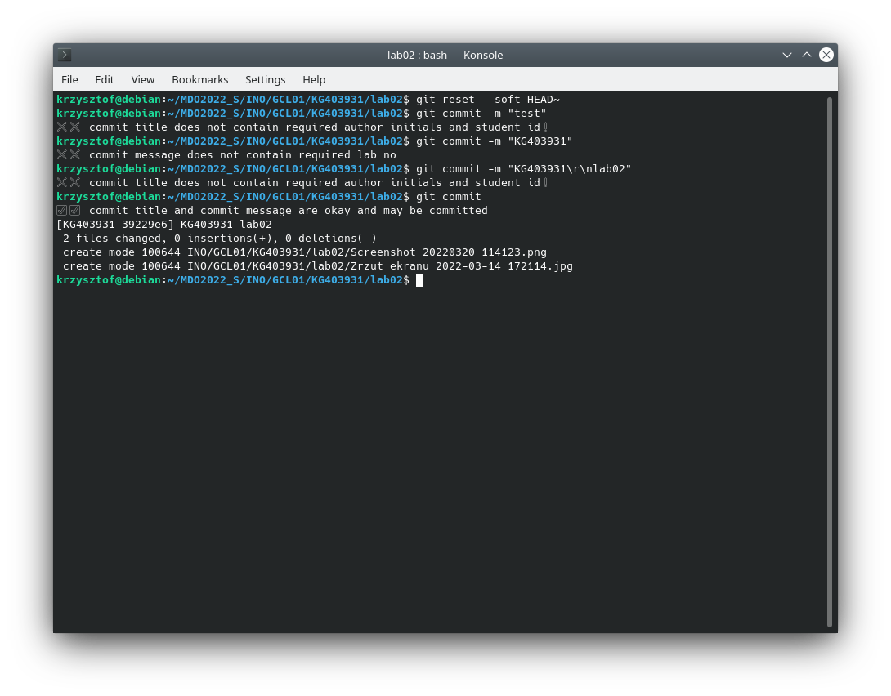
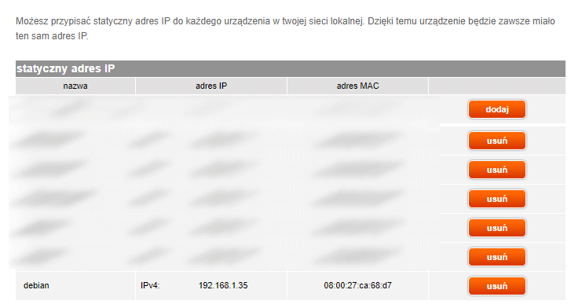

1. 
  * Żeby utworzyć hooka przechodzimy do `<repo>/.git/hooks`, wybieramy sobie jeden z przykładowych plików (w naszym przypadku `commit-msg.sample` i usuwamy my "rozszerzenie" `.sample` (zostawiamy jako plik executable, warto sprawdzić czy ma uprawnienia do uruchamiania `ls -l commit-msg` powinno dać trzy `x` po lewej stronie).
  
  * Piszemy skrypt w ulubionym języku skryptowym (bash, Go, Python, Python3 etc.), który będzie sprawdzał poprawność wiadomości commita. 
  
  
2. 
  * W celu "zuplowadowania" się lokalnego hooka do systemu kontroli git utworzyłem jego kopię w swoim folderze `lab02/HOOK_commit-msg`, w którym można podejrzeć jego zawartość, albo sobie go stamtąd przekopiować go odpowiedniej lokacji.
3. 
  * W celu "otwarcia się na świat" wirtualnej maszyny trzeba umożliwić jej pobranie własnego adresu z DHCP. W virtualboxie wystarczy zmienić tryb z `NAT` na `bridged`.
  
  * Dla swojej wygody w przyszłości przydzieliłem też stały adres IP w serwerze DHCP.
  
  * Ponadto większość dystrybucji instaluje się bez serwera SSH, więc trzeba go doinstalować `sudo apt install openssh-server`
  
  * Instalujemy dockera, najpierw usuwając stare jego wersje `sudo apt-get remove docker docker-engine docker.io containerd runc`,
  `sudo apt-get update`,
  `sudo apt-get install ca-certificates curl gnupg lsb-release`,
  `curl -fsSL https://download.docker.com/linux/debian/gpg | sudo gpg --dearmor -o /usr/share/keyrings/docker-archive-keyring.gpg`,
  `echo "deb [arch=$(dpkg --print-architecture) signed-by=/usr/share/keyrings/docker-archive-keyring.gpg] https://download.docker.com/linux/debian $(lsb_release -cs) stable" | sudo tee /etc/apt/sources.list.d/docker.list > /dev/null`
  `sudo apt-get update`
  `sudo apt-get install docker-ce docker-ce-cli containerd.io`
  `sudo docker run hello-world`
  potem dla pewności prawidłowej instalacji uruchamiamy obraz "hello-world", który automatycznie dociąga się z repo.
  
  
  
4. 
  * Dociągamy sobie obraz fedory (bo host to debian). `docker pull fedora:latest`. Wchodzimy do kontenera (interaktywnie) `docker run fedora -it`
  
  * Poza laboratorium: ustawiłem dockera, żeby działał bez sudo i żeby startował wraz z systemem.
  
  * Jak sobie wejdziemy do kontenera to widać, że kernel to dalej debian, ale sam os to fedora.
  
5.
  * Już mam tam konto, ale nie pamiętam hasła, a docker nie raczy wysłać maila do resetu hasła, więc nie będzie skrina.
  
