# Krzysztof Maurek #
## Inżynieria Obliczeniowa, gr. 1 ##
### Sprawozdanie 1 ###
Na początku zainstalowałem klienta GIT. Przy dzisiejszym zadaniu używam wersji na system Windows
lecz od kolejnych zajęć planuje działać na systemie Linux. Sprawdzam wersję zainstalowanego GITa
za pomocą komendy git --version  
  
Następnie sklonowałem repozytorium za pomocą HTTPS  
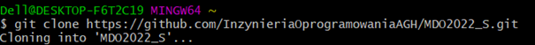  
W kolejnym kroku wygenerowałem dwa klucze SSH z czego jeden jest zabezpieczony hasłem  
  
Aby można było z nich korzystać na GitHubie, dodałem je w ustawieniach  
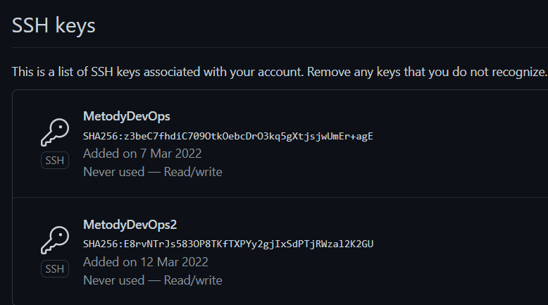  
Następnie uruchomiłem ssh-agent i dodałem do niego moje utworzone klucze. Pozwoli mi to na połącznie się przez
SSH z GitHubem i skopiowanie poprzez SSH repozytorium.  
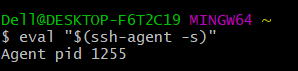  
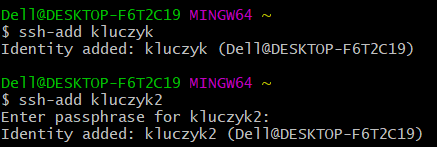  
W kolejnym kroku skopiowałem repozytorium za pomocą SSH  
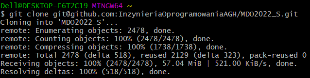  
Po skopiowaniu repozytorium przełączyłem się najpierw na gałąź main  
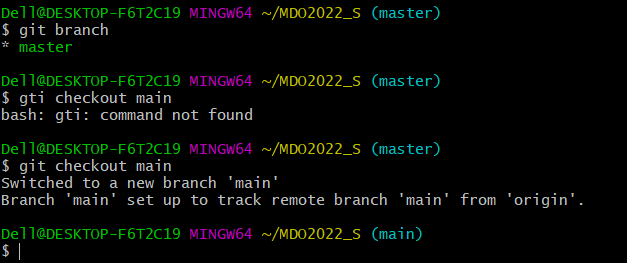  
a następnie na gałąź mojej grupy, po czym utworzyłem swoją gałąź o nazwie KM400531  
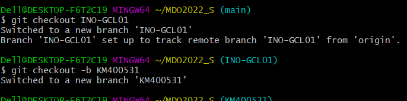  
W swojej gałęźi, za pomocą komendy mkdir utworzyłem najpierw katalog o swoich inicjałach, a w nim katalog Lab01  
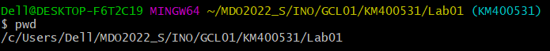  
Potem za pomocą komendy git add . (kropka umożliwia wykonanie komendy na wszystkich plikach) dodaje zmiany  
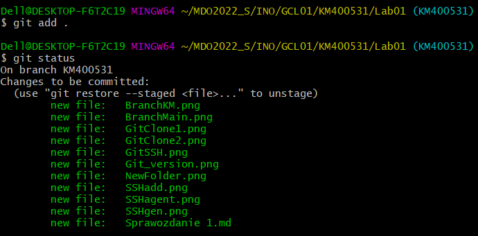  
Następnie przy użyciu komendy git commit -m (-m umożliwia dodanie komentarza) utworzyłem commita  
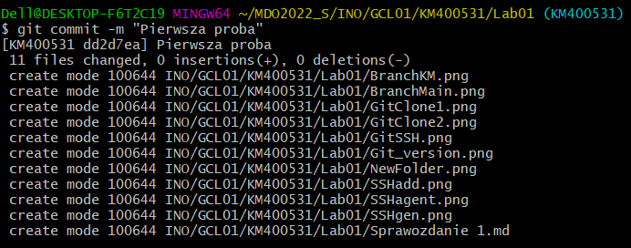  
i za pomocą polecenia git push wysłałem pliki do zdalnego repozytorium   
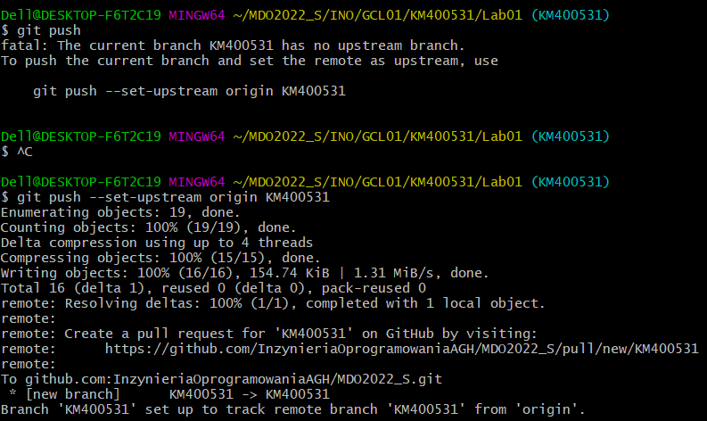  
Następnie przełączyłem się na gałąź swojej grupy i za pomocą komendy git merge spróbowałem wciągnąć swoją gałąź
do gałęźi grupowej  
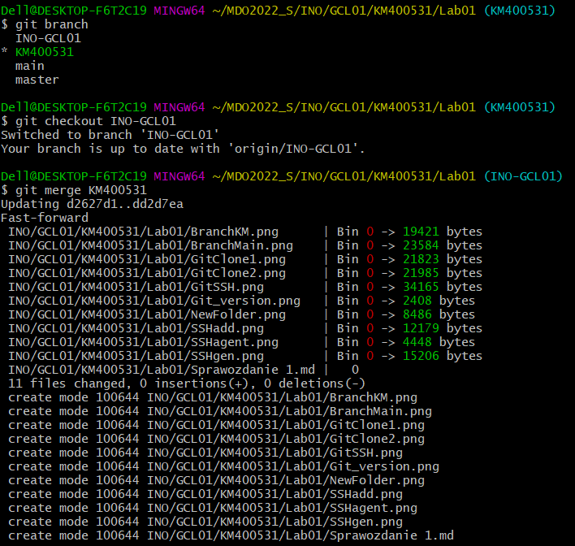  
Niestety jak widać nie udało się to  
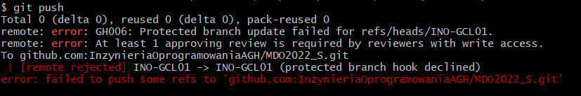  
Na koniec wykonałem Pull Request  
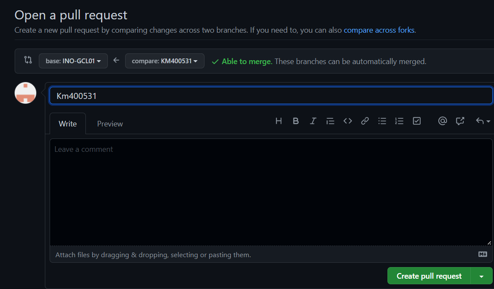
