# Krzysztof Maurek #
## Inżynieria Obliczeniowa, gr. 1 ##
### Sprawozdanie 2 ###
Na początku przechodzę do katalogu *git* (który jest ukryty dlatego aby do niego przejść muszę dać . na początku). Następnie przechodzę do katalogu *hooks*  
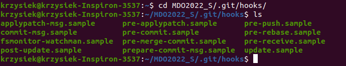  
Edytowałem plik *commit-msg.sample* tak aby sprawdzał czy tytuł commita nazywa się tak jak moje inicjały oraz numer indeksu. Na koniec zmieniam jego nazwę na *commit-msg*   
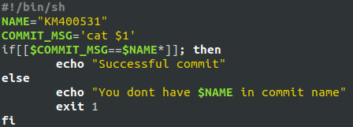  
Poniżej wynik wprowadzenia złej nazwy commita  
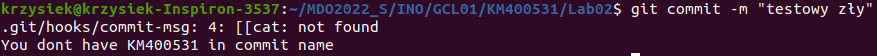  
A tak wygląda po wprowadzeniu dobrej nazwy commita  
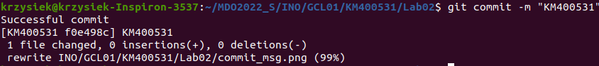  
W kolejnym kroku stworzyłem plik, który sprawdza czy zmiany są robione w folderze dotyczącym aktualnych zajęć. Jego kod wygląda następująco  
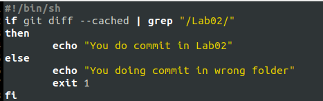  
Tak wygląda próba commita w złym folderze  

A tak w dobrym  
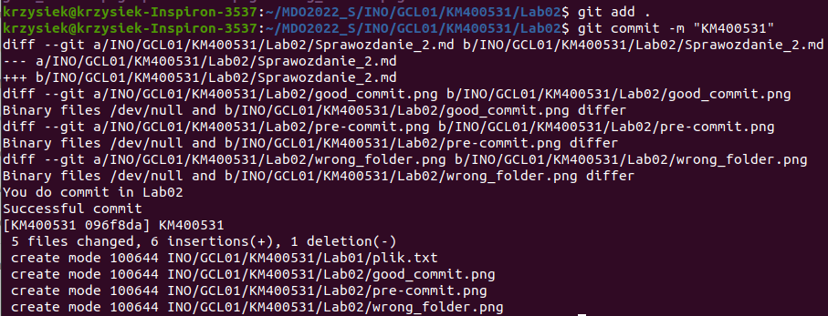
Aby wykazać zainstalowy natywnie system Linux używam komendy pokazującej plik zawierający dane identyfikujące system operacyjny  
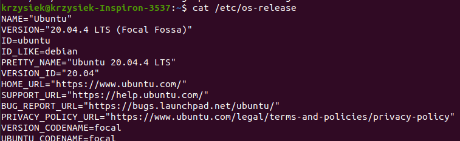  
Dodatkowo sprawdzam jeszcze jedną informację, która pokazuje że jest to Linux postawiony natywnie. Po wpisaniu tej komendy na virtualnej maszynie pokazuje się informacja, iż jest to VirtualBox. W moim przypadku jak widać jest inaczej. Dzieje się tak ponieważ komenda dmidecode sprawdza jakie informacje są zawarte w BIOSie   
1  
W kolejnym kroku zajmuje się instalacją dockera. Na początek aktualizuje paczki w systemie za pomocą komendy *sudo apt-get update*, a następnie instaluje dockera  
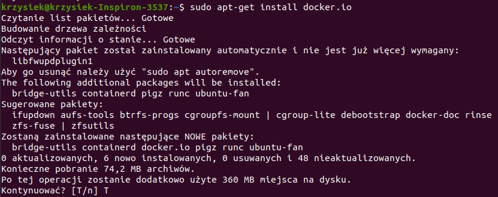  
Następnie za pomocą komendy *sudo service docker start* uruchamiam dockera  
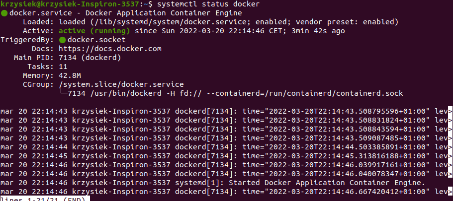  
Aby wykazać działanie dockera uruchomiłem hello-world  
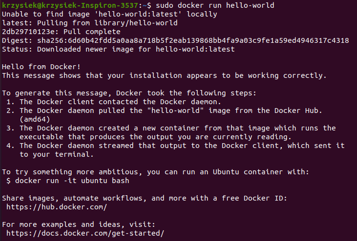  
Drugą opcją wykazania działania dockera jest pokazanie jego działającego procesu. Wyświetlam to za pomocą komendy *ps -ax |grep "docker"*. grep docker powoduje że wyświetlają się tylko procesy zawierajce w sobie frazę "docker"  
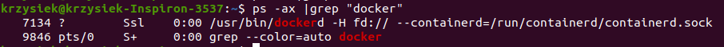  
Instaluje obraz linuxa w dockerze  
  
Aby sprawdzić jaką dokładnie werjsę linuxa zainstalowałem muszę uruchomić konktener. Robię to dodając -it do komendy (i uruchamia kontener interaktywnie, t alokuje terminal w kontenerze)  
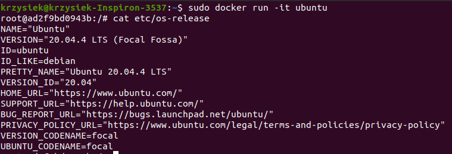  
Na koniec założyłem konto w serwisie DockerHUB  
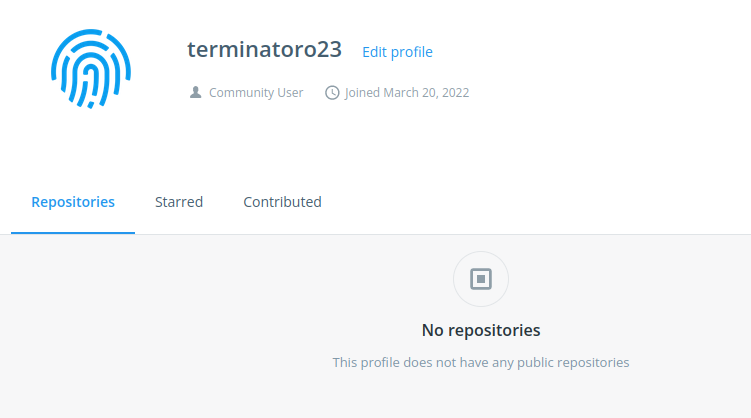  

