# Krzysztof Maurek #
## Inżynieria Obliczeniowa, gr. 1 ##
### Sprawozdanie 3 ###
Na początku zajęć skopiowałem repozytorium. Działać będę na repozytorium używanym na zajęciach czyli na irssi  
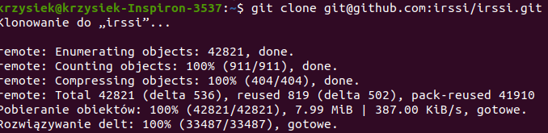  
W kolejnym kroku za pomocą środowiska meson buduje lokalnie program  
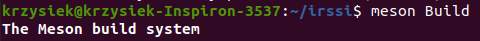  
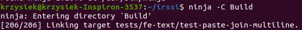  
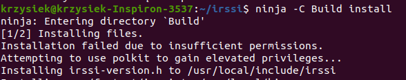  
Dalej przechodzę do folderu Build i odpalam testy. Przechodzą one pomyślnie  
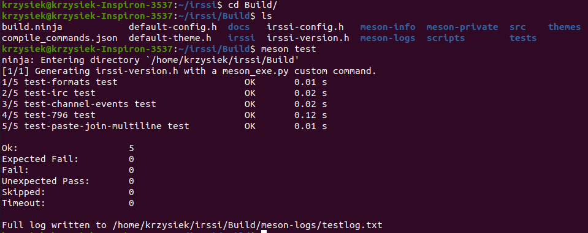  
Następnie odpalam konterem z systemem Fedora (wybrałem ten system zamiast ubuntu z powodu małych problemów z ubuntu)  
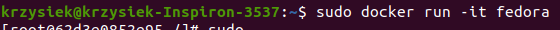  
W kolejnym kroku zainstalowałem git'a na dockerze  
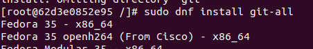  
Skopiowałem repozytorium do kontenera  
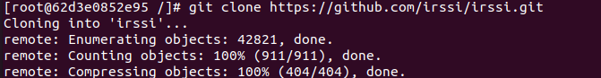  
Niestety pojawił się problem z brakującymi pakietami umożliwiającymi zbudowanie programu dlatego musiałem doinstalować je następującymi komendami  
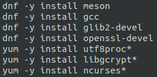  
Udało mi się zbudować program na kontenerze  
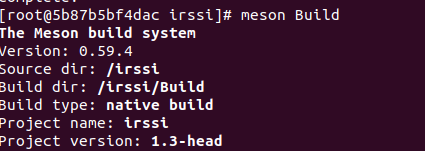  
Przeprowadziłem testy  
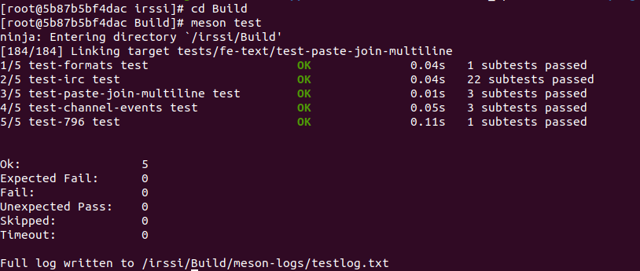  
Następnie tworzę pliki dockerfile które będą służyć do zbudowania programu oraz do odpalenia testów. Za pomocą komendy *FROM* wybieram obraz który zostanie uruchomiony. Za pomocą komendy *RUN* uruchamiam kolejne polecenia (instalacji konkretnych pakietow, pobrania repozytorium czy budowania programu). Za pomocą komendy *WORKDIR* ustawiana jest ścieżka robocza.  
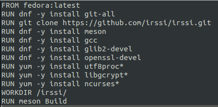  
Drugi plik wygląda następująco. Wskazuje on na obraz stworzony wcześniej, ustala ścieżkę roboczą i uruchamia testy  
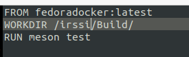  
Uruchamiam pierwszy plik następującą komendą -f wskazuje który plik należy uruchomić, natomiast -t pozwala nazwać obraz  
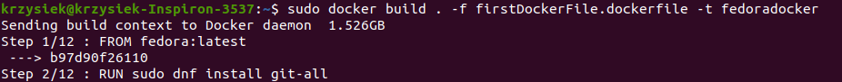  
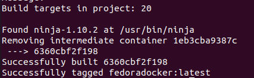  
Następnie uruchamiam drugi plik z testami  
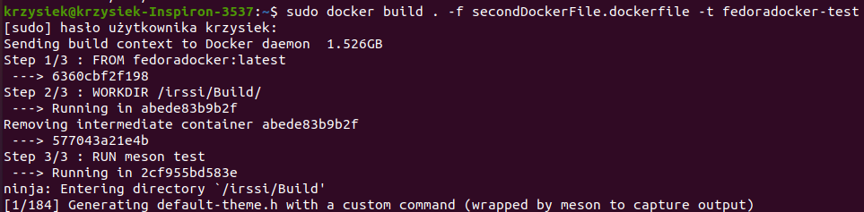  
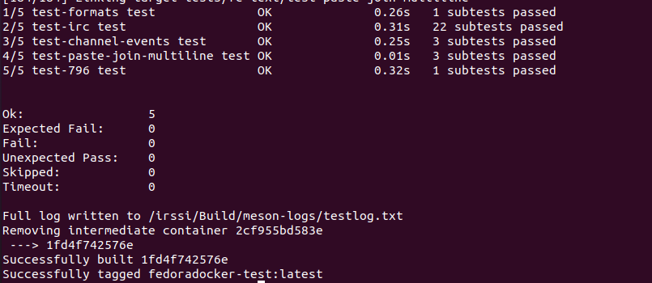  
Jak widać testy przeszły bez problemu. Mogę zobaczyć ze są powstałe obrazy.  
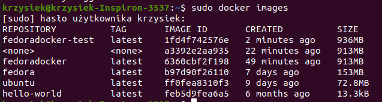  
Na koniec odpalam kontener z utworzonego obrazu. Jak widać uruchomił się zbudowany program  
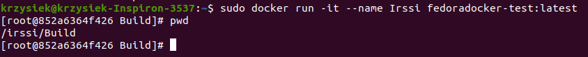  

