# Krzysztof Maurek #
## Inżynieria Obliczeniowa, gr. 1 ##
### Sprawozdanie 4 ###
Na początku utworzyłem dwa woluminy - wejściowy i wyjściowy. Przełącznik --name pozwalił na nadanie nazw tym woluminom  
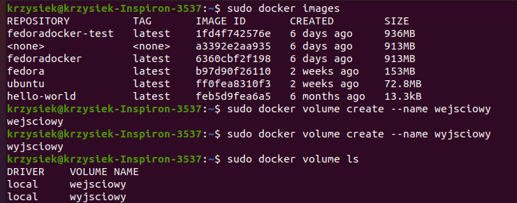  
Aby sprawdzić informację o woluminie używam polecenia docker volume inspect. Mogę w ten sposób sprawdzić m.in punkty montowania  
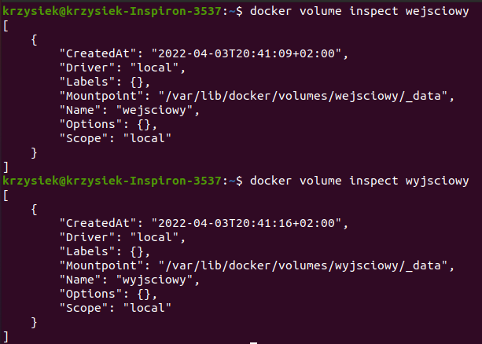  
Następnie uruchamiam kontener oraz montuje oba woluminy. Dzięki przełącznikowi -it uruchamiam w nim terminal,a zięki przełącznikowi -v motuje woluminy(w formacie nazwa_woluminu:/miejsce_do_zamontowania)  
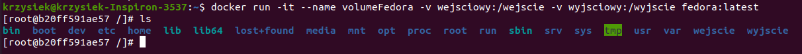  
Aby skopiować bezpośrednio repozytorium przechodzę do miejsca montowania woluminu, który pokazałe w jednym z poprzenich kroków. Następnie kopiuje repozytorium  
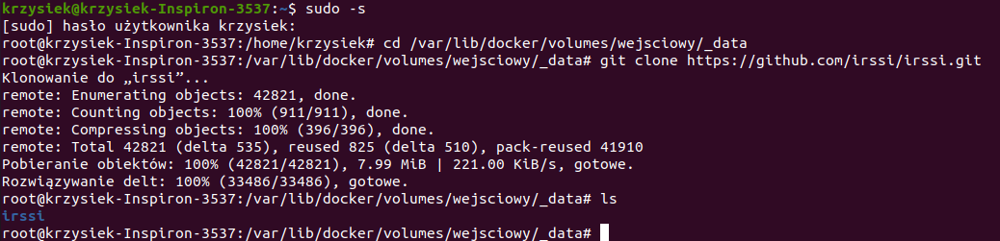  
W celu sprawdzenia poprawnego sklonowania wchodzę w kontener i sprawdzam czy znajduje się tam skopiowane repozytorium  
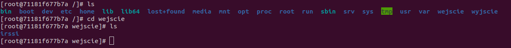  
W celu zbudowania programu wchodzę na kontener i instaluje wszystkie potrzebne pakiety do zbudowania  
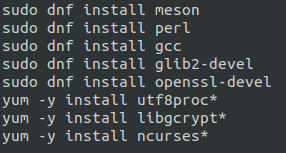  
Następne buduje program  
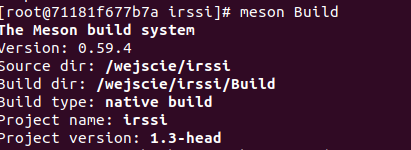  
W kolejnym kroku zapisuje powstałe pliki na woluminie wyjściowym  
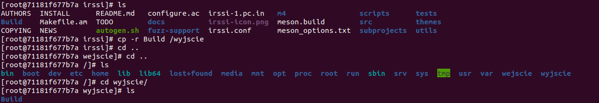  
Sprawdzam w woluminie wyjściowym z poziomu hosta czy katalog Build został przeniesiony  
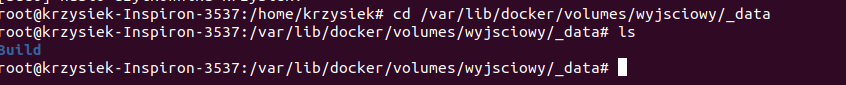  
Znajduje na internecie odpowiedni obraz dockerowy z iperf3. Za pomocą przełącznika --rm obraz zostanie usunięty po zamknięciu, -p do publikowania wybranego portu (tutaj 5201), przełącznik -s odpala kontener w trybie serwera  
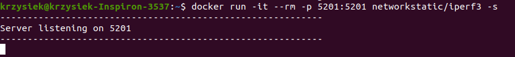  
W kolejnym kroku odpalam drugi terminal w nowym oknie i sprawdzam nasłuchujące porty. Jak widać port jest przedostatni na tej liście  
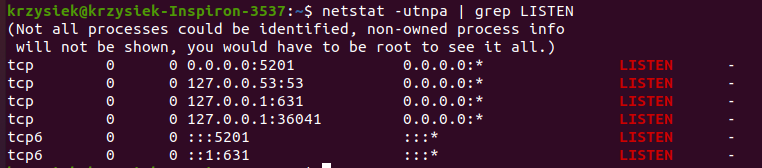  
Sprawdzam adres IP serwera  
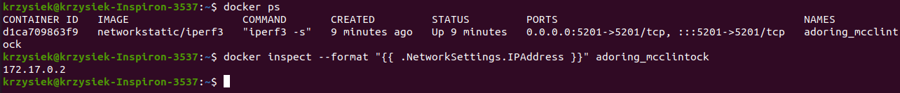  
Uruchamiam drugi kontener w trybie klienta (przełącznik -c) i łącze się z serwerem  
  
Instaluje pakiet iperf3 na hoście oraz łącze się z serwerem z hosta  
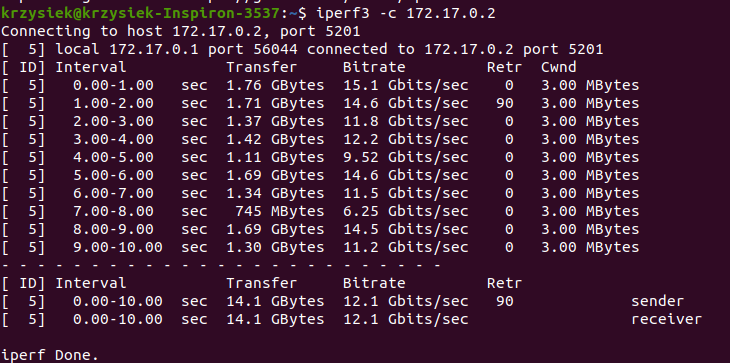  
Uruchamiam drugi kontener w trybie klienta (przełącznik -c) i łącze się z serwerem  
  
Instaluje pakiet iperf3 na hoście oraz łącze się z serwerem z hosta  
  
Z racji że stosuje natywnego linuxa do połączenia się spoza hosta używam innego komputera z windowsem. Na początku za pomocą komendy ifconfig sprawdzam IP komputera z linuxem. Następnie pobieram program iperf3 na windowsa i uruchamiam go podając mój adres IP  
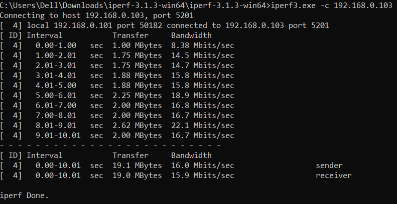  
Sprawdzam logi z serwera  
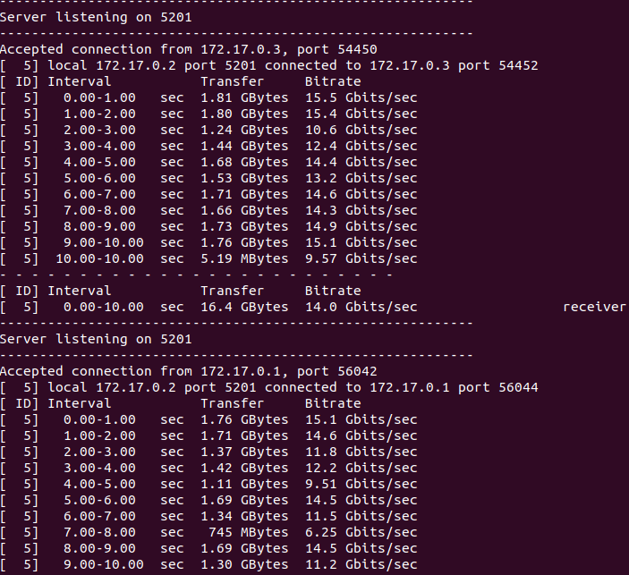  
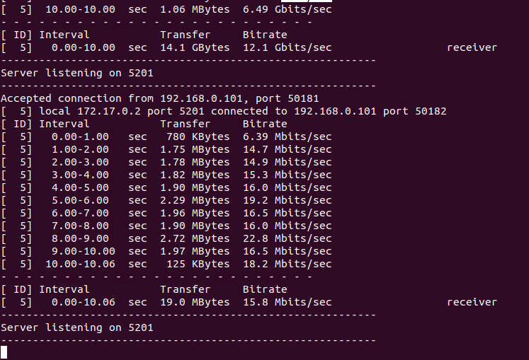  
Zapoznaje się z dokumentacją Jenkinsa. Następnie tworzę nową sieć dockerową za pomocą polecenia docker network create. Argument jenkins określa nazwę sieci używanej w kontenerach  
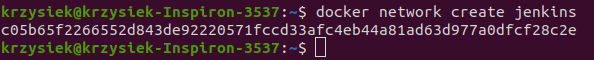  
Następnie uruchamiam obraz DIND kontenera zgodnie z dokumentacją  
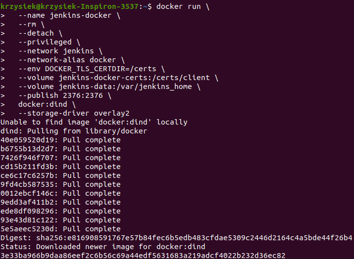  
Tworzę Dockerfile zgondnie z dokumentacją  
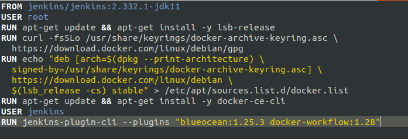  
W kolejnym kroku uruchamiam build  
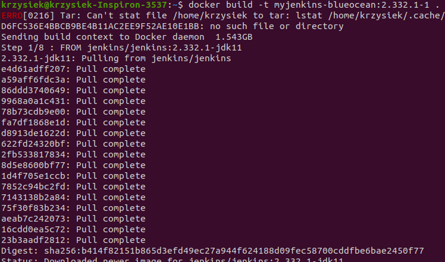  
Uruchamiam jenkinsa  
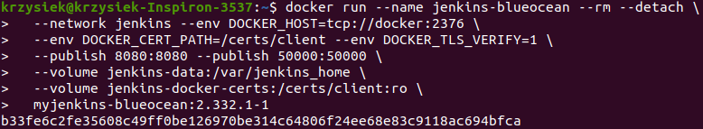  
Jak widać Jenkins działa  
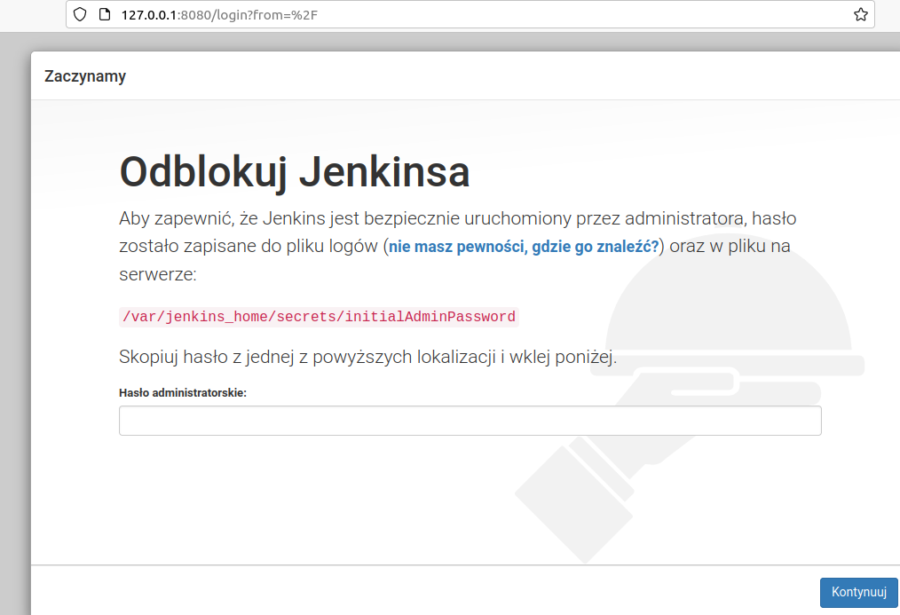  
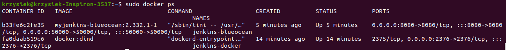  
Sprawdzam haslo administratorskie aby móc się zalogować  
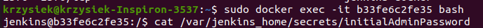  
Następnie instaluje wszystkie pakiety i konfiguruje konto w Jenkinsie  
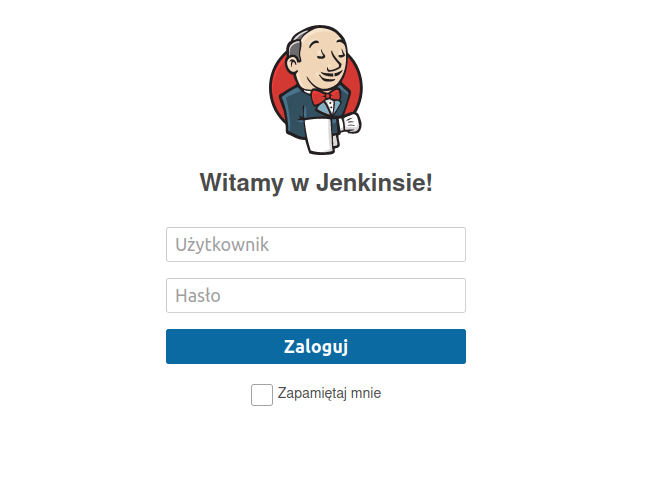  
