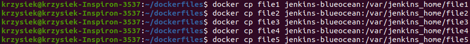
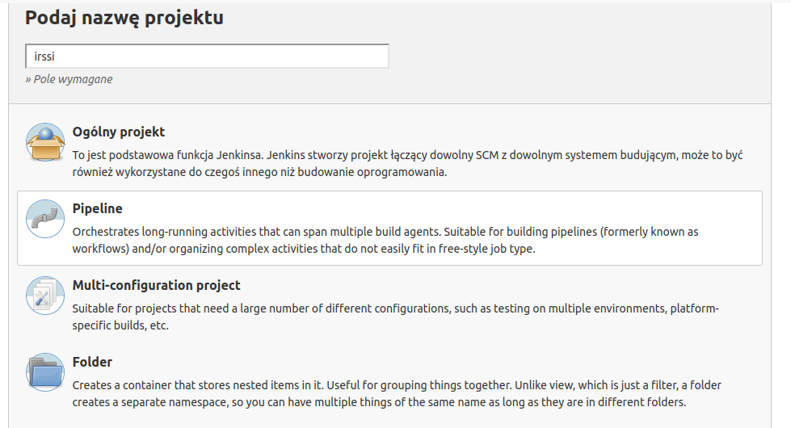
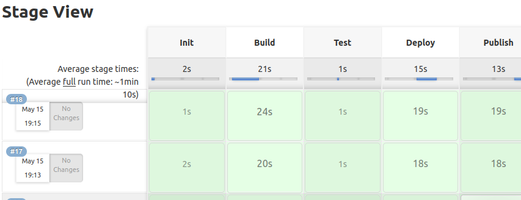

# Krzysztof Maurek #
## Inżynieria Obliczeniowa, gr. 1 ##
### Sprawozdanie 5 ###
Na początku uruchamiam dinda oraz jenkinsa  
```sh
docker run --name jenkins-docker --rm --detach \
  --privileged --network jenkins --network-alias docker \
  --env DOCKER_TLS_CERTDIR=/certs \
  --volume jenkins-docker-certs:/certs/client \
  --volume jenkins-data:/var/jenkins_home \
  --publish 2376:2376 \
  docker:dind --storage-driver overlay2
``` 

```sh
docker run --name jenkins-blueocean --restart=on-failure --detach \
  --network jenkins --env DOCKER_HOST=tcp://docker:2376 \
  --env DOCKER_CERT_PATH=/certs/client --env DOCKER_TLS_VERIFY=1 \
  --publish 8080:8080 --publish 50000:50000 \
  --volume jenkins-data:/var/jenkins_home \
  --volume jenkins-docker-certs:/certs/client:ro \
  myjenkins-blueocean:2.332.3-1
```  
W kolejnym kroku przygotowuje pliki dockerfile  
Pierwszy plik pobiera wszystkie dependecje. Zastosowałem inną wersje fedory niż latest ponieważ pojawiał się problem z nią.
```sh
FROM fedora:34
RUN yum -y install git gcc gcc-c++ make automake wget meson ca-c* libgcrypt* glib2* utf8proc* openssl-devel ncurses* libgcrypt* glib2-devel utf8proc* openssl-devel ncurses*
```
Drugi plik tworzy za pomocą mesona builda
```sh
FROM file1:latest
RUN git clone https://github.com/irssi/irssi.git
WORKDIR irssi
RUN meson setup build
```
Trzeci plik odpala za pomocą mesona testy  
```sh
FROM file2:latest
WORKDIR build
RUN meson test
```
Czwarty plik odpala program w kontenerze  
```sh
FROM file2:latest
RUN ninja -C build install
```
Piąty plik tworzy archiwum na woluminie wyjściowym 
```sh
FROM fedora:34	
WORKDIR volume_out
```
Następnie kopiuje pliki na jenkinsa  
  
W kolejnym kroku tworzę nowy projekt pipeline  
  
Kod mojego pipeline  
```sh
pipeline {
    agent any
	parameters {
        string(name: 'VERSION', defaultValue: '1.0', description: 'IRSSi version')
    }
    stages {
        stage('Init') {
            steps {
                echo 'Init'
                sh "docker build -t file1:latest . -f /var/jenkins_home/file1"
            }
        }
        stage('Build') {
            steps {
                echo 'Build'
                sh "docker build -t file2:latest . -f /var/jenkins_home/file2"
                sh "docker run -t -d --name irssi_build -v volume_out:/volume_out file2:latest"
                sh "docker cp irssi_build:/irssi/build ./irssi_build2"
                sh "docker cp ./irssi_build2 irssi_build:/volume_out/build"
                sh "docker stop irssi_build"
                sh "docker container rm irssi_build"
            }
        }
        stage('Test') {
            steps {
                echo 'Test'
                sh "docker build -t file3:latest . -f /var/jenkins_home/file3"
            }
        }
        stage('Deploy') {
            steps {
                echo 'Deploy'
                sh "docker build -t file4:latest . -f /var/jenkins_home/file4"
                sh "docker run -t -d -e TERM=xterm --name irssi_deploy -v volume_out:/volume_out file4:latest"
                sh "docker exec irssi_deploy irssi"
                sh "docker stop irssi_deploy"
                sh "docker container rm irssi_deploy"
            }
        }
        stage("Publish"){
            steps{
                echo "Publish"
                sh "docker build -t file5:latest . -f /var/jenkins_home/file5"
                sh "docker run -t -d --name irssi_publish -v volume_out:/volume_out file5:latest"
                sh "docker exec irssi_publish tar -czvf irssi.tgz ./build"
                sh "docker stop irssi_publish"
                sh "docker container rm irssi_publish"
            }
        }
    }
}

```

Aby inne uruchomienia działały bez problemu, zatrzymuje je i usuwam na koniec, gdy spełnią swą powinność.  
Jak widać wszystko dobrze działa, co pokazuje nam, piękny zielony kolor  
  
