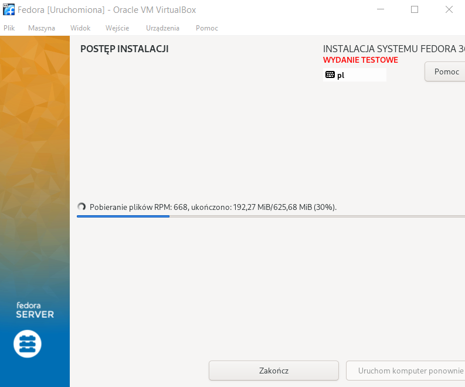
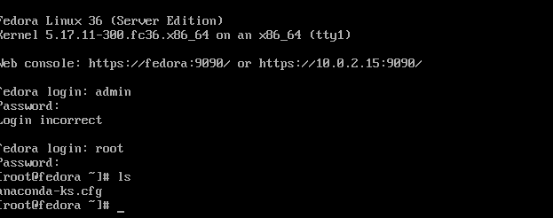
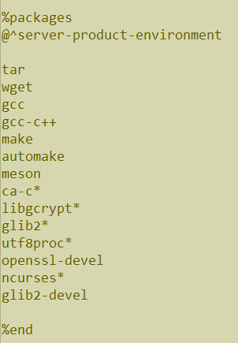
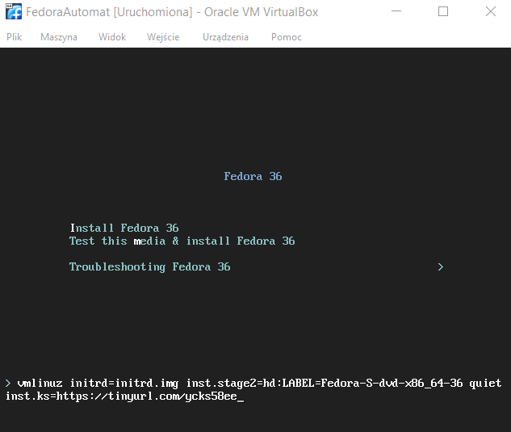
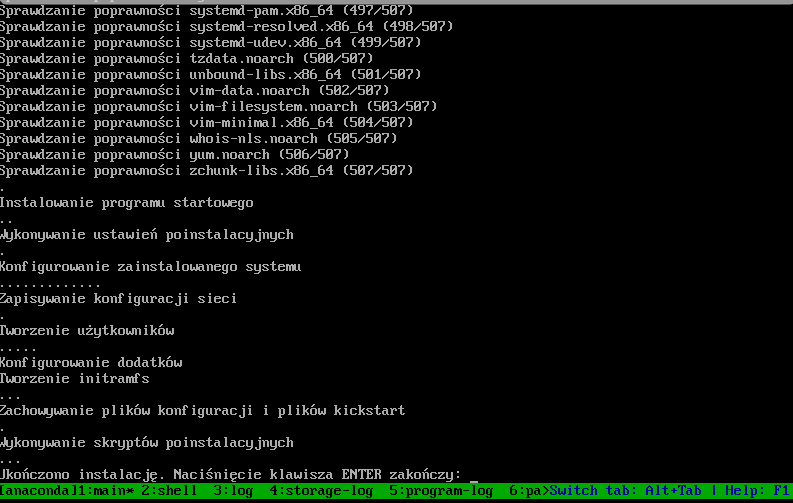
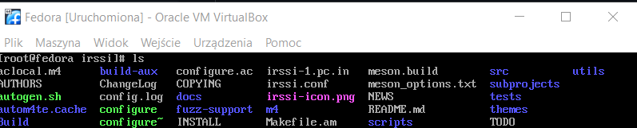

# Krzysztof Maurek #
## Inżynieria Obliczeniowa, gr. 1 ##
### Sprawozdanie 6 ###
Na początku zainstalowałem fedore. Stworzyłem przy tym uprawnienia administratorskie, zaznaczyłem możliwość połączenia poprzez SSH i stworzyłem jedno konto użytkownika.  
  
W kolejnym kroku połączyłem się z VirtualBoxem i pobrałem plik anaconda-ks.cfg na główny system.  
  
Następnie dodałem plik z repozytorium na hosting, a zmodyfikowany plik anaconda-ks.cfg na githuba.  
  
Dalej uruchamiam nową maszyne wirtualną i przy instalacji podaje link do pliku anaconda znajdującego się na moim githubie
''inst.ks=https://tinyurl.com/ycks58ee''  
  
Poniżej zrzut ekranu pokazujący że system został zainstalowany  
  
Zrzut ekranu z systemu pokazujący, że pliki programu znajdują się na systemie  
  
Po drodze napotkałem mały problem, mianowicie po instalacji system uruchamiał się ponownie i znowu chciał się instalować. Udało się to naprawić usuwająć napęd optyczny z wirtualną fedorą.
