# Sprawozdanie 

## Maciej Cholewa

1. Upewniłem się że posiadam klienta git za pomocą poleceniem 

        git status

    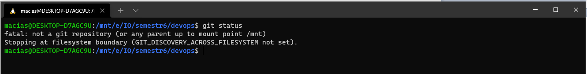
2. Sklonowałem repozytorium przy pomocy HTTPS 

        git clone https://github.com/InzynieriaOprogramowaniaAGH/MDO2022_S.git

     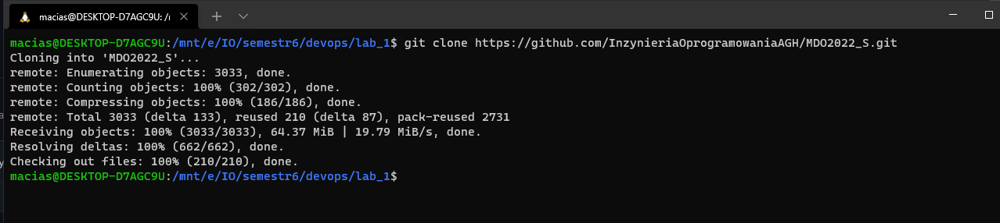

3. Utworzyłem parę kluczy do połączenia przez SSH za pomocą

        ssh-keygen -t ed25519 -C "maciek.cholewa.vip@gmail.com"

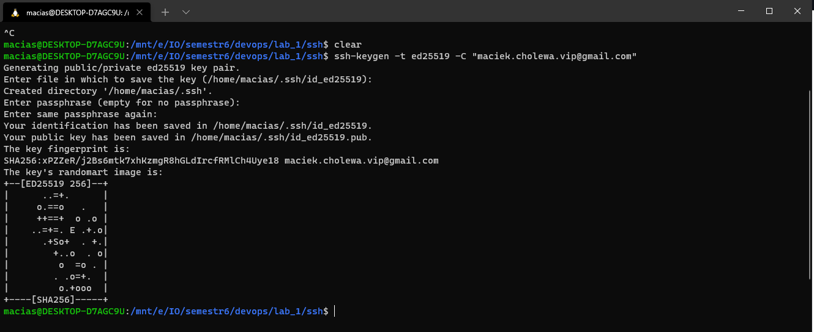

4. Utworzyłem kolejny klucz. Tym razem jest on zabezpieczony hasłem.

        ssh-keygen -t ed25519 -C "maciek.cholewa.vip@gmail.com"

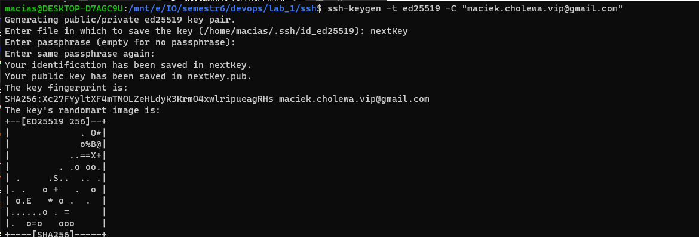

5. Skopiowałem część publiczną klucza, aby dodać go do konta.

        cat /home/macias/.ssh/id_ed25519.pub

6. Dodałem klucz do konta oraz sprawdziłem połączenie za pomocą

        ssh -T git@github.com

7. Sklonowałem repozytorium przy użyciu SSH

        git clone git@github.com:InzynieriaOprogramowaniaAGH/MDO2022_S.git

    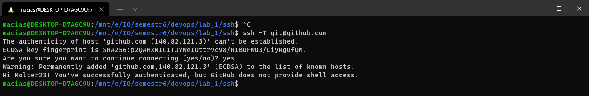

    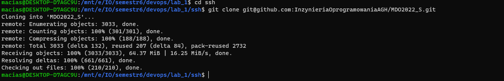

8. Przełączyłem się na gałąź main, a później na gałąź swojej grupy

            git checkout main

            git checkout INO-GCL01

    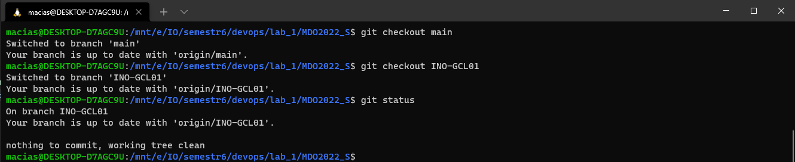

9. Utworzyłem swoją gałąź

        git checkout -b MC402449

    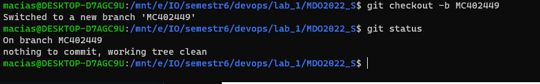

10. Utworzyłem katalog MC402449 w katalogu grupowym, a w nim katalog Lab01, w którym umieściłem sprawozdanie
        mkdir MC402449
        cd MC402449 && mkdir Lab01
        touch Sprawozdanie.md

    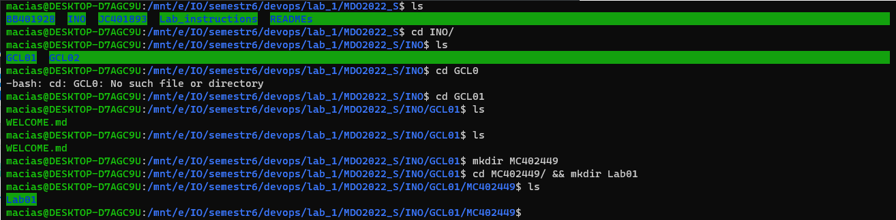

11. Wysłałem zmiany do zdalnego repozytorium

        git commit -m 'Lab01'

        git push --set-upstream  origin MC402449

    

12. Spróbowałem wciągnąć swoją gałąź do gałęzi grupowej oraz wypchnąć zmianny 

        git merge MC402449

        git push

    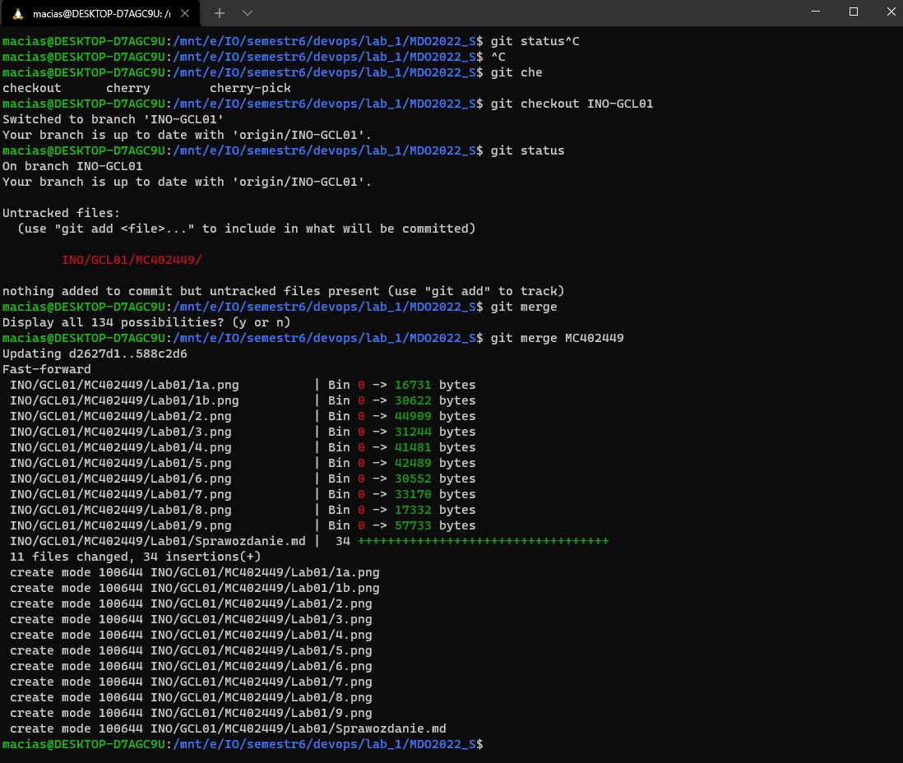

    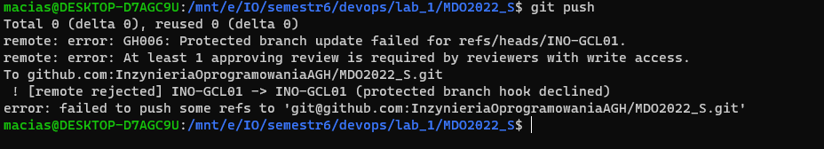

