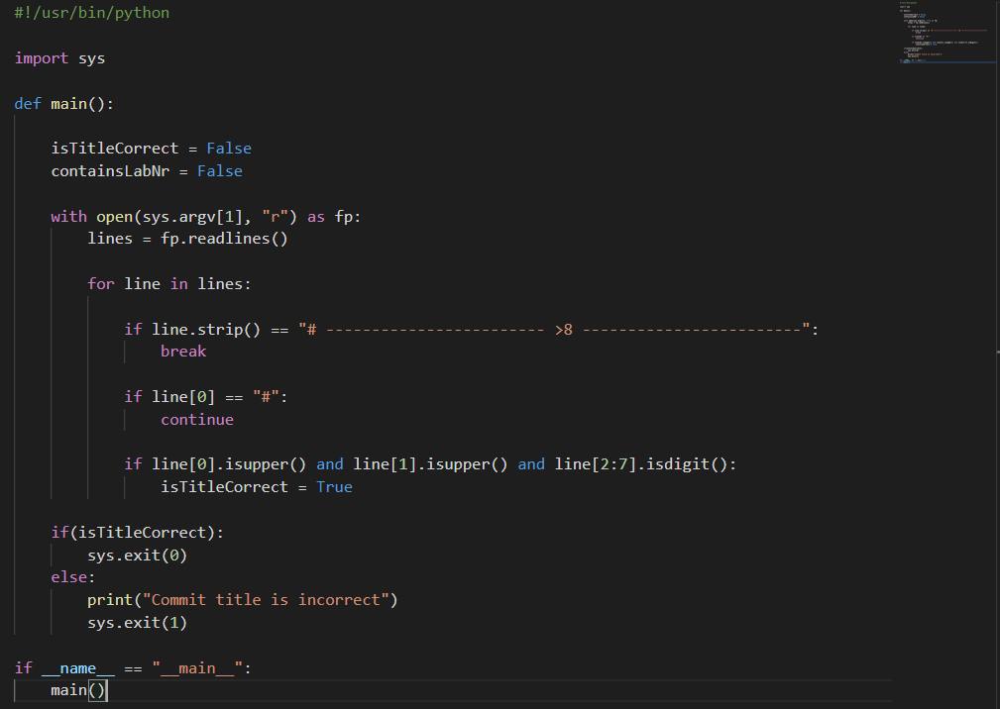
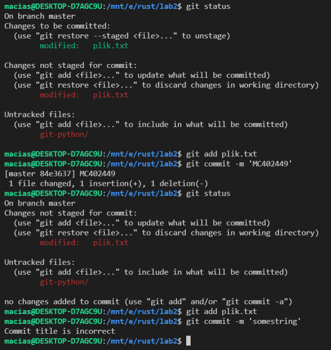
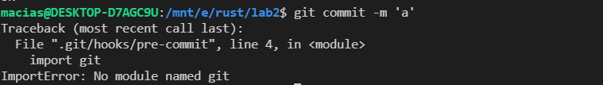
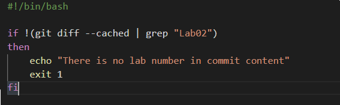
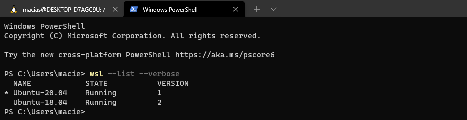
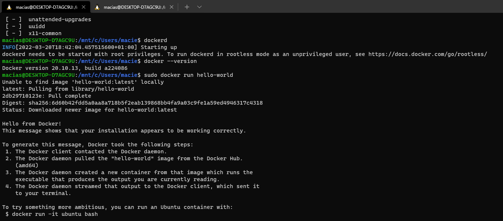
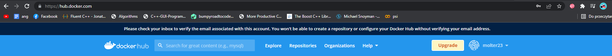
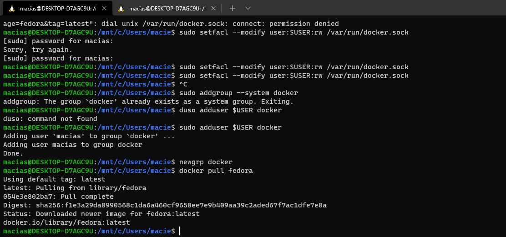
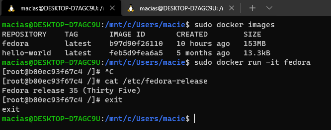

# Sprawozdanie
### Maciej Cholewa

1. Napisałem hooka, który sprawdza czy tytuł commita składa się z:

    **inicjałów (2 duże litery) oraz numeru indeksu (6 cyfr)**

Sprawdziłem poprawność działania skryptu:

Drugi skrypt z powodu problemów z GitPython napisalem w bashu. Sprawdziłem czy w commicie znajduje się "Lab02"

Test działania

2. Do użycia dokera użyję WSL w versji 2, na której mam zainstalowane Ubuntu-18.04

3. Zainstalowałem dockera zgodnie z instrukcją (Install using the repository)

    https://docs.docker.com/engine/install/ubuntu/

4. Założyłem konto na hub.docker.com

5. Pokazałem, że środowisko dockerowe jest uruchomione i działa. **Uruchomiłem demona, który zarządza kontenerami za pomocą**

        dockerd

6. Pobrałem obraz fedory z hub.docker

         docker pull fedora

7. Uruchomiłem oraz sprawdziłem wersję Fedory, którą pobrałem

        sudo docker run -it fedora
        cat /etc/fedora-release

